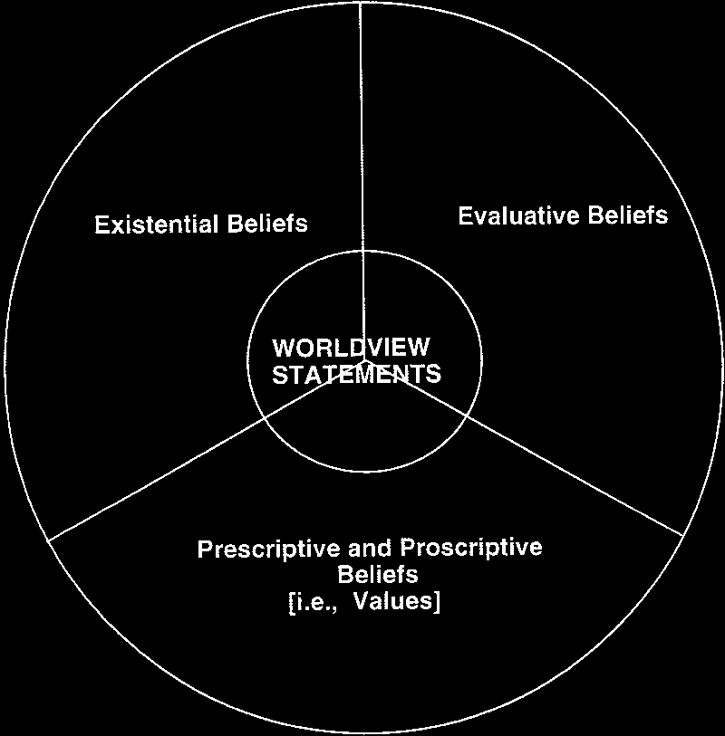
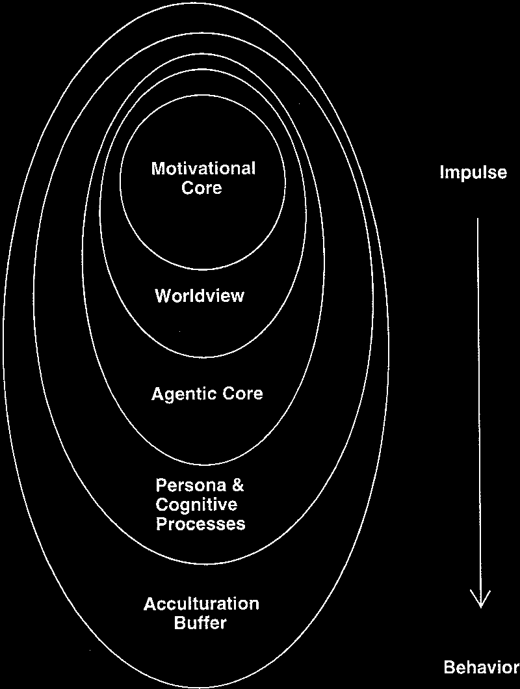
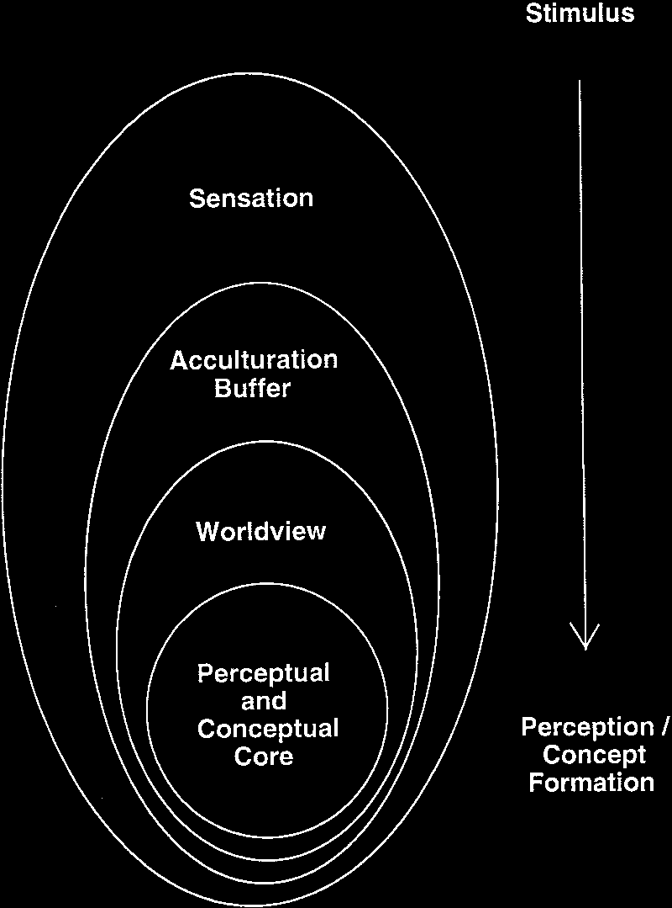
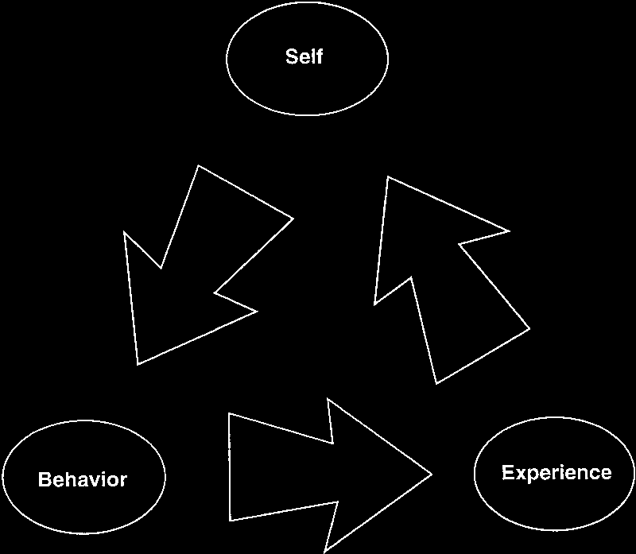
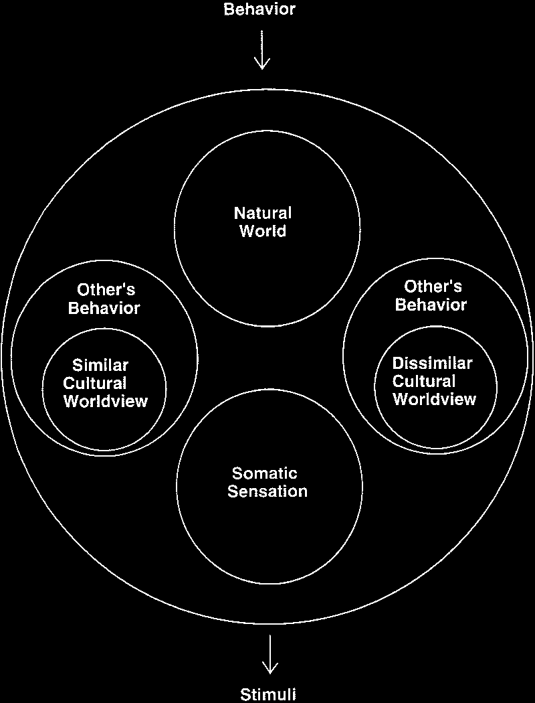

## Page 1

The Psychology of Worldviews

Mark E. Koltko-Rivera
New York University and Professional Services Group, Inc.

A worldview (or “world view”) is a set of assumptions about physical and social reality
that may have powerful effects on cognition and behavior. Lacking a comprehensive
model or formal theory up to now, the construct has been underused. This article
advances theory by addressing these gaps. Worldview is defined. Major approaches to
worldview are critically reviewed. Lines of evidence are described regarding world-
view as a justifiable construct in psychology. Worldviews are distinguished from
schemas. A collated model of a worldview’s component dimensions is described. An
integrated theory of worldview function is outlined, relating worldview to personality
traits, motivation, affect, cognition, behavior, and culture. A worldview research
agenda is outlined for personality and social psychology (including positive and peace
psychology).

It is a commonplace observation that “every-
body sees the world in his or her own way.”
However trite, this truism conceals an ancient
and profound insight, the implications of which
have been but poorly grasped in contemporary
psychology. Approximately 2,500 years ago, it
is said, the person we know as Buddha noted:

We are what we think.
All that we are arises with our thoughts.
With our thoughts we make the world.
(Byrom, 1976/1993, p. 1)

In modern times, we have seen this insight
phrased in notable ways by poets and artists.

Anaı¨s Nin is said to have observed, “We don’t
see things as they are, we see them as we are.”
As the artist Marvin Hill expressed it in one of
his wood block prints: “The eye forms the world
/ the world forms the eye.”
Put more prosaically, the nature of this in-
sight is that human cognition and behavior are
powerfully influenced by sets of beliefs and
assumptions about life and reality. Applied to
the individual level, this insight has implica-
tions for theories of personality, cognition, ed-
ucation, and intervention. Applied to the collec-
tive level, this insight can provide a basis for
psychological theories of culture and conflict,
faith and coping, war and peace. Particularly as
psychologists search for ways to reintegrate the
discipline after a century of tumultuous and
fractious growth, it would be worthwhile for
psychology and its subdisciplines to focus on a
construct that is central to this aforementioned
insight, a construct with a long history and
broad applicability but a dearth of serious the-
oretical formulation. This is the construct of
worldview (or “world view”).
Worldviews are sets of beliefs and assump-
tions that describe reality. A given worldview
encompasses assumptions about a heteroge-
neous variety of topics, including human nature,
the meaning and nature of life, and the compo-
sition of the universe itself, to name but a few
issues. The term worldview comes from the
German Weltanschauung, meaning a view or
perspective on the world or the universe “used
to describe one’s total outlook on life, society

Mark E. Koltko-Rivera, Department of Applied Psychol-
ogy, New York University, and Research Department, Pro-
fessional Services Group, Inc., Winter Park, Florida.
Portions of this article are based on Mark E. Koltko’s
doctoral dissertation at New York University. Portions of
the article were presented at the 101st and 108th Annual
Conventions of the American Psychological Association,
Toronto, Ontario, Canada, August 1993, and Washington,
DC, August 2000, respectively, and at the meeting of the
Mid-Winter Roundtable on Cross-Cultural Psychology and
Education (Teachers College, Columbia University), New
York City, February 2000.
I thank the following individuals for their helpful com-
ments on earlier presentations of ideas developed in this
article: the late M. Brewster Smith, Mary Sue Richardson,
Ronald Esposito, Sharon Weinberg, Miriam Eisenstein
Ebsworth, Teresa L. Panniers, Richard Ellis, Valerie Sims,
Matthew Chin, Peter Salovey, Ernest Keen, and Kathleen
Schmid Koltko-Rivera.
Correspondence concerning this article should be ad-
dressed to Mark E. Koltko-Rivera, Professional Services
Group, Inc., P.O. Box 4914, Winter Park, FL 32793-4914.
E-mail: koltkorivera@yahoo.com

Review of General Psychology
Copyright 2004 by the Educational Publishing Foundation
2004, Vol. 8, No. 1, 3–58
1089-2680/04/$12.00
DOI: 10.1037/1089-2680.8.1.3

3

## Page 2

and its institutions” (Wolman, 1973, p. 406). “A
set of interrelated assumptions about the nature
of the world is called a worldview” (Overton,
1991, p. 269). In the largest sense, a worldview
is the interpretive lens one uses to understand
reality and one’s existence within it (M. E.
Miller & West, 1993).
Specialists in various subdisciplines of psychol-
ogy have indicated that worldview has a central
role in such fields as developmental psychology
(Overton, 1991), environmental psychology (Alt-
man & Rogoff, 1987), sport psychology (Kontos
& Breland-Noble, 2002), general counseling and
psychotherapy (Ibrahim, 1991; A. P. Jackson &
Meadows, 1991), and especially multicultural
counseling and psychotherapy (Fischer, Jome,
& Atkinson, 1998; Ibrahim, 1999; Ibrahim,
Roysircar-Sodowsky, & Ohnishi, 2001; Tre-
vin˜o, 1996). Indeed, if we are willing to con-
sider ways in which aspects of worldview may
appear under other names (e.g., “values” or
“schemas”), we may find the worldview con-
struct hidden in the central literature of a num-
ber of psychological subdisciplines, including
cognitive, social, personality, and cultural psy-
chology. All of this is so despite the construct’s
neglect in the mainstream theoretical literature.
If one reads how some authors describe the
value of the worldview construct to their sub-
discipline (e.g., “One of the most popular con-
structs in the multicultural counseling literature
is that of ‘worldview’”; Grieger & Ponterotto,
1995, p. 358) and then contrasts such comments
with the absence of the construct from standard
texts, handbooks, encyclopedias, and so forth
(e.g., Kazdin, 2000), one comes away with the
impression that worldview is the most impor-
tant construct that the typical psychologist has
never heard of.
If the worldview construct is to contribute
appropriately across disciplines in the social
sciences, and across subdisciplines within psy-
chology, it will be necessary to come to a com-
mon understanding about what sorts of things
the worldview construct addresses and how it
functions within individual psychology. The
present article is meant to advance this effort in
several ways. First, I briefly define worldview in
formal terms and specify its relationship to
other important constructs, such as beliefs and
values. Second, I review the major conceptual-
izations of worldview that emerged during the
20th century, focusing on authors in psychol-

ogy, anthropology, and philosophy. Third, I jus-
tify the status of worldview as a psychological
construct. Fourth, on the basis of the earlier
review, I propose a model of the different di-
mensions of worldview. Fifth, I outline a theory
of how worldview functions within individual
personality. Finally, I suggest items for a world-
view-oriented research agenda within personal-
ity and social psychology.

Defining “Worldview”

Worldview has gone by many names in the
literature: “philosophy of life” (Jung, 1942/
1954),
“world
hypotheses”
(Pepper,
1942/
1970), “world outlook” (Maslow, 1970a, p. 39),
“assumptive worlds” (Frank, 1973), “visions of
reality” (Messer, 1992, 2000), “self-and-world
construct system” (Kottler & Hazler, 2001, p.
361), and many others. In anthropology alone,
worldviews have been denoted as “cultural ori-
entations” (Kluckhohn, 1950), “value orienta-
tions,” “unconscious systems of meaning,” “un-
conscious canons of choice,” “configurations,”
“culture themes,” and “core culture” (Kluck-
hohn & Strodtbeck, 1961/1973, pp. 1–2). Be-
yond the confusion created by using many
names for the same construct, the worldview
concept, as shall be seen, has been defined in
perhaps as many ways as it has been named. For
present purposes, worldview may be defined
conceptually as follows:

A worldview is a way of describing the universe and
life within it, both in terms of what is and what ought
to be. A given worldview is a set of beliefs that
includes limiting statements and assumptions regard-
ing what exists and what does not (either in actuality,
or in principle), what objects or experiences are good
or bad, and what objectives, behaviors, and relation-
ships are desirable or undesirable. A worldview defines
what can be known or done in the world, and how it
can be known or done. In addition to defining what
goals can be sought in life, a worldview defines what
goals should be pursued. Worldviews include assump-
tions that may be unproven, and even unprovable, but
these assumptions are superordinate, in that they pro-
vide the epistemic and ontological foundations for
other beliefs within a belief system. (adapted from
Koltko-Rivera, 2000, p. 2)

The theorists reviewed in this article were cho-
sen because they explicitly spoke to such be-
liefs, whether or not they used the term
worldview.
It is important to distinguish among world-
views, beliefs, and values, whose relationship is

4
KOLTKO-RIVERA

## Page 3

illustrated in Figure 1. Following Rokeach,
worldviews and values are both beliefs, but
values represent only one of several types of
belief.

Three types of beliefs have . . . been distinguished:
descriptive or existential beliefs, those capable of be-
ing true or false; evaluative beliefs, wherein the object
of belief is judged to be good or bad; and prescriptive
or proscriptive beliefs, wherein some means or end of
action is judged to be desirable or undesirable. A value
is a belief of the third kind—a prescriptive or proscrip-
tive belief. (Rokeach, 1973, pp. 6–7)

Although values particularly reflect prescrip-
tive or proscriptive beliefs, worldview state-
ments may refer to beliefs of any of the three
kinds mentioned by Rokeach. Worldview state-
ments that describe entities thought to exist in
the world (e.g., “There exists a God or Goddess
who cares for me personally”) are existential
beliefs. Worldview statements concerning the
nature of what can be known or done in the
world (e.g., “There really is such a thing as free
will” or “Scientific research is a reliable way to
establish the truth”) are also existential state-
ments. In each case, the implication is that these
statements are objectively either true or false.
Worldview statements that describe human
beings or actions in evaluative terms (e.g.,
“Those who fight against my nation are evil” or
“Human nature is basically good”) are of the

second type of belief mentioned by Rokeach:
the evaluative. Yet other worldview statements,
which describe preferred means or ends (e.g.,
“The thing to do in life is to live in the mo-
ment”), are prescriptive or proscriptive beliefs.
Only the latter are properly called values, fol-
lowing Rokeach.
Not all beliefs are worldview beliefs. Beliefs
regarding the underlying nature of reality,
“proper” social relations or guidelines for liv-
ing, or the existence or nonexistence of impor-
tant entities are worldview beliefs. Other beliefs
are not.
In summary, beliefs may be existential, eval-
uative, or prescriptive/proscriptive, of which
values refer only to the last kind; a given world-
view may include all of these kinds of beliefs,
but not all beliefs are worldview beliefs. World-
views thus encompass certain values but go
beyond to include other kinds of beliefs as well.

Major Approaches to Worldview During
the 20th Century

After a brief look at some pre-20th-century
approaches, I consider here a number of 20th-
century conceptualizations of worldview. These
include approaches informed by philosophy
(Pepper and Stace), anthropology (Kluckhohn),
and several subdisciplines of psychology, in-
cluding psychoanalysis (Freud and Jung), per-
sonality theory (Kelly, Wrightsman, Maslow,
and Coan), philosophy of psychology (Royce),
social psychology (Lerner; the terror manage-
ment researchers), and multicultural counseling
(Sue). I ignore here the matter of psychometric
instrumentation that has been developed within
many of these approaches. I refer to the research
literature selectively, emphasizing recent empir-
ical work that demonstrates a connection be-
tween a given conceptual framework for world-
view and a research program conceived outside
of that framework (concerning instrumentation
and a fuller discussion of research, see Koltko-
Rivera, 2000).
This review emphasizes dimensional rather
than categorical approaches to worldview. As
L. A. Clark and Watson (1995) put it (regarding
psychometrics), categorical approaches “cate-
gorize individuals into qualitatively different
groups,” whereas dimensional models “differ-
entiate individuals with respect to degree or
level of the target construct” (p. 313). (For

Figure 1.
Conceptual relationships among beliefs, values,
and worldview statements.

5
PSYCHOLOGY OF WORLDVIEWS

## Page 4

example, diagnoses such as those included in
the Diagnostic and Statistical Manual of Mental
Disorders involve a categorical approach to
psychopathology,
whereas
Minnesota
Mul-
tiphasic Personality Inventory profiles reflect a
dimensional approach.)
Although a number of interesting categorical
approaches to worldview have appeared, it is
my belief that dimensional models have more to
offer psychology at this point. Different dimen-
sional approaches can be combined fairly eas-
ily; such a merger between categorical ap-
proaches is extremely difficult to accomplish, at
best. Dimensional approaches lend themselves
to instrumentation using at least an ordinal level
of measurement, thus permitting more sophisti-
cated statistical analyses than categorical ap-
proaches, which, by definition, use a nominal
level of measurement. Finally, it can be argued
that any categorical approach to worldview can
be described in terms of one or more underlying
dimensions.1 The opposite does not hold true;
dimensional approaches may not be reduced,
even in principle, to categorical approaches. For
these reasons, the theories selected for review
here are those that have the most light to shed
on dimensions of worldviews. Near the conclu-
sion of this review, I briefly consider a few
promising categorical approaches.

Prelude: Pre-20th-Century Approaches

It may be said that any philosophical or reli-
gious system is itself a way of viewing the
universe and hence is a worldview. The ac-
counts that exist in virtually all known ancient
cultures of theogony (how the gods came to be)
and cosmogony (how the earth was created and
populated) provided a sense of how the world
works and what beings exist in it (including the
human, infrahuman, and suprahuman).
To focus on the 19th century, Friedrich
Nietzsche’s (1872/1956) descriptions of the
Apollonian and Dionysian approaches to life
marked two developments in the study of
worldviews. First, Nietzsche recognized that
worldviews encompass more than theogony and
cosmogony and include a sense of the ends to
which human life and activity should be di-
rected. Second, Nietzsche’s description of two
competing systems highlighted the fact that
there are alternative worldviews, mutually ex-
clusive approaches to life and descriptions of

reality. Previous to this point, philosophical dis-
cussion concerning worldviews had proceeded
along the lines of simply asserting and buttress-
ing exclusionary claims to truth. Nietzsche’s
insight was that different worldviews have an
independent validity and appeal for those who
hold them, and that it is worthwhile to compare
worldviews in other ways than merely to claim
that a given one is exclusively true.
For the German philosopher Wilhelm Dilthey
(1833–1911), “world views undertake to re-
solve the enigma of life” (Dilthey, 1957/1970,
p. 107). That is, worldviews represent a per-
son’s or a culture’s answers to fundamental
existential questions (Hodges, 1944), particu-
larly the meaning of life in the face of death
(Dilthey, 1957/1970). On the basis of a world-
view, “questions of the importance and signifi-
cance of the universe are decided, and from it
are derived life’s ideals, its highest good, and
supreme principles of conduct” (Dilthey, 1957/
1970, pp. 107–108). As we shall see, this is a
fair approximation of some later conceptions of
worldview.

Freud and Weltanschauungen (1933)

As in many areas, Sigmund Freud prefigured
several important issues in the study of world-
views. In contrast to Dilthey, however, Freud
scorned the notion that worldviews have worth
or utility. For Freud, “a Weltanschauung is an
intellectual construction which solves all the
problems of our existence uniformly on the
basis of one overriding hypothesis, which, ac-
cordingly, leaves no question unanswered and
in which everything that interests us finds its
fixed place” (Freud, 1933/1964, p. 158). Freud,
then, saw worldviews as concepts that individ-
uals hold consciously, philosophical construc-
tions, “Handbooks to Life” (Freud, 1926/1959,

1 For example, in terms of the collated model of world-
view dimensions described later in this article (see Table 2
and accompanying text), one may take the categorical
worldview of humanism, as described in the recently pub-
lished “Humanist Manifesto III” (“Humanism and Its As-
pirations,” 2003), and render it into dimensional terms as
follows: optimistic worth of life; materialist ontology;
senses, rationality, and science cognition; random cosmos;
human moral sources; pleasure and self-transcendence pur-
pose of life; interdependent connection; cooperative inter-
action; harmony humanity–nature; and agnostic or atheistic
stance toward deity.

6
KOLTKO-RIVERA

## Page 5

p. 96) designed to tie the world up into neat and
explainable packages, of which even the best
are “nothing but attempts to find a substitute for
the ancient . . . all-sufficient Church Catechism”
(Freud, 1926/1959, p. 96).
Although Freud derided worldviews, he also
outlined several important dimensions of world-
view, particularly in the last of his New Intro-
ductory Lectures on Psychoanalysis (Freud,
1933/1964). Freud there defined four basic
worldviews: science, religion, philosophy, and
art. Although this is an unnecessarily con-
strained selection, in delineating these world-
views Freud highlighted an important issue. For
Freud, epistemology, specifically the method of
establishing knowledge, is the crucial dimen-
sion that distinguishes among various world-
views. For example, Freud claimed that “[sci-
ence] asserts that there are no sources of knowl-
edge other than the intellectual working-over of
carefully scrutinized observations—in other
words what we call research—and alongside of
it no knowledge derived from revelation, intu-
ition or divination” (Freud, 1933/1964, p. 159).
Freud mentioned other noteworthy aspects of
worldview, some only in passing, in the last
chapter of the New Introductory Lectures. He
noted a difference between the belief that one
can change something in the world through
magic and the belief that direct action alone is
efficacious. He pointed out differences between
his notion of religious and scientific worldviews
in terms of cosmogony and descriptions of the
source of personal well-being (i.e., science ver-
sus divine sources). Implicit in his distinction
between what he termed “religious” and “scien-
tific” worldviews is a distinction in ontology,
that is, a distinction between a view of reality in
which the spiritual is real and a view of reality
that embraces a thoroughgoing ontological
materialism.
Figueira (1990) has pointed out that there are
several components of a psychoanalytic world-
view that can be identified, one of which is that
there is no distinction between “caused” and
“random” mental events, because “according to
Freud there are no psychical events which result
from pure chance or from ‘free will’” (Figueira,
1990, p. 73). These considerations suggest that
beliefs about human agency (as seen in the
opposed positions of determinism and volunta-
rism, or free will) represent an important dimen-
sion of worldview.

In summary, then, Freud pointed out (either
briefly or at length, and either explicitly or
implicitly) at least seven aspects or dimensions
of worldview. These are as follows: beliefs re-
garding sources of valid knowledge (i.e., epis-
temology), the origin of the universe (i.e., cos-
mogony), sources of well-being, the efficacy of
magical versus direct action, the existence of
unconscious determinants of thought and be-
havior, the issue of voluntarist (free will) versus
determinist positions regarding human agency,
and the matter of spiritual versus materialist
ontologies.
Relation to other conceptions of worldview.
The importance of epistemology is noted in
several approaches to worldview without men-
tion of Freud’s thought on this matter, a fact that
independently confirms the validity of Freud’s
insight concerning the importance of this di-
mension to the construct. As discussed later,
Royce (1964) considered epistemology to be
the crucial defining aspect of different world-
views. Bergin (1980a), Ellis (1980), and Walls
(1980) each gave an important place to episte-
mology in his discussion of humanistic versus
theistic worldviews. Epistemology was empha-
sized by Kahoe (1987) in his discussion of
psychotheology (the study of how religious be-
liefs affect individual psychology and behav-
ior). Two of the six dimensions of worldview
outlined by Montgomery, Fine, and James-
Myers (1990) in their discussion of Afrocentric
worldviews are devoted to epistemology: a di-
mension they labeled “ontology,” which actu-
ally deals with how knowledge may be gained
through sensory versus nonsensory means, and
a dimension labeled “acquisition of knowl-
edge,” which is concerned with the use of ex-
ternal sources versus intuition for knowledge
acquisition.
The importance of spiritualist versus materi-
alist
ontologies
in
distinguishing
between
worldviews is underscored by the philosophical
work of Stace (1960) regarding different out-
looks on life accompanying mystical experi-
ences, as described later. Differences in ontol-
ogy result in different approaches to life and
imply different paths in counseling and therapy
(Bergin, 1980a, 1980b; Ellis, 1980; Goldfried &
Newman, 1986, pp. 47–49; P. S. Richards &
Bergin, 1997; Walls, 1980), including those that
take an African-centered approach (Graham,
1999).

7
PSYCHOLOGY OF WORLDVIEWS

## Page 6

Positions regarding agency are taken implic-
itly in many, if not all, psychological theories
(Slife & Williams, 1995). Coan (1974, 1979)
found that stances regarding agency defined ba-
sic worldview differences among both psychol-
ogists and nonpsychologists. Before and since
Coan’s work, questions regarding agency and
will have been debated in psychology from
many perspectives (e.g., Bakan, 1996; Howard,
1993, 1994; Rychlak, 1979, 2000, 2003; Searle,
2001; Slife & Fisher, 2000; Wegner, 2002;
Wegner & Wheatley, 1999), with no widely
accepted resolution in sight. (Indeed, it has been
claimed that, even in principle, it is impossible
to prove any given position about free will as
true or false on logical grounds, because differ-
ent and irreconcilable but unprovable assump-
tions about the nature of philosophy and world-
views are at the foundation of different ideas
about free will [Double, 1996].) Agency is a
matter of no small importance in the discipline.
In summary, several of the dimensions that
Freud identified as aspects of worldviews hap-
pen to be important in others’ conceptions of the
construct. These dimensions include epistemol-
ogy, ontology, and agency.
Critique.
There are several major problems
with Freud’s approach to worldviews. Of pri-
mary importance, he seemed to consider world-
views optional. He explained the appeal of
worldviews on psychodynamic grounds, ignor-
ing the notion that without some sort of inter-
pretive system, one cannot make sense of real-
ity. Contemporary, and particularly postmod-
ern, approaches to this matter suggest that
worldviews are essential components of the hu-
man psychological equipment (e.g., Neimeyer
& Mahoney, 1995; Shweder, 1995).
Freud derided at some length those who sug-
gested that different concepts of reality have
relative, not absolute, value. Freud referred to
such thinkers as “intellectual nihilists” and “an-
archist[s]” (Freud, 1933/1964, p. 175), while
nowadays we might consider them to be propo-
nents of a hermeneutic approach to reality.
Another criticism of Freud’s approach re-
gards his apparent assumption that worldviews
are consciously chosen. This is an odd position
to take for someone like Freud, who based his
considerable intellectual edifice on the concept
of the unconscious determinants of behavior.
Freud considered a worldview to be something
that neatly describes the world, a Baedeker to

reality, an ontological catechism. It is more
useful, however, to think of a worldview not as
a tourist guide or catechism that one reads as a
description of reality, but as a lens through
which one reads reality. “A world view acts as
a ‘filter’ through which phenomena are per-
ceived and comprehended” (M. E. Miller &
West, 1993, p. 3). This is not just a matter of
preferences among metaphors. At least to con-
temporary thinkers, worldviews are altogether
more subtle things than Freud considered them
to be.
Freud derided the worldview construct, an
attitude that implied that he and psychoanalysis
have
no
distinct
worldview.
However,
as
Figueira (1990) has noted, Freud’s denial of the
existence of a psychoanalytic worldview carries
with it the tinge of a neurotic negation.
It appears that Freud and his translators had
some difficulty in dealing with the very term
Weltanschauung. One of Freud’s early transla-
tors, W. J. H. Sprott, translated the term as “a
philosophy of life” in the title of the last of the
New Introductory Lectures (Freud, 1933), while
in the text he left the term untranslated. The
Stracheys never translated the term in the text
proper
(Freud,
1926/1959,
1933/1964),
al-
though in a footnote James Strachey observed
that “this word might be translated ‘A View of
the Universe’” (Freud, 1933/1964, p. 158).
Freud claimed that “Weltanschauung is . . . a
specifically German concept, the translation of
which into foreign languages might well raise
difficulties” (Freud, 1933/1964, p. 158). One
might conjecture that perhaps it was not the
term that posed the problem for Freud, but
rather the concept itself—with its implication
that Freud himself might hold to unproven and
unprovable heuristic assumptions that frame re-
ality in ways that are somewhat arbitrary. In a
sense, Freud was an apostle of modernism. In
this spirit, it would have been difficult for him
to give serious consideration to the worldview
construct, in that the construct is inherently
postmodern in its implicit position that reality
is, at least to some extent, subjectively con-
structed rather than objectively universal in its
totality (Kvale, 1995).
Jung’s alternative psychoanalytic approach
to Weltanschauungen.
Some of the difficulties
with Freud’s notion of worldview seem to be
addressed in the work of his erstwhile colleague
in psychoanalysis, Carl G. Jung. For Jung, a

8
KOLTKO-RIVERA

## Page 7

worldview is something firmly entrenched in an
individual’s psychology, largely unconscious
and culturally transmitted, an element of per-
sonality that is of “cardinal importance” in guid-
ing the person’s perceptions and choices (Jung,
1951/1954, pp. 119–120). For Jung, the posses-
sion of a worldview was unavoidable as a con-
dition of human life; indeed, the therapist as
well as the patient had to come to grips with the
issues raised by conflicting worldviews (Jung,
1942/1954, p. 79).
For Jung, one’s worldview includes positions
on reality that are typically addressed by doc-
trines of the various religions of the world, for
example, regarding fate, the prospect of per-
sonal immortality, and so forth. However, these
are not dry intellectual positions, nor do they
make one’s worldview a merely intellectual
construction. Worldviews, like religious doc-
trines, “are emotional experiences. . . . Logical
arguments simply bounce off the facts felt and
experienced” (Jung, 1942/1954, pp. 81–82).
Thus, in Jung’s thought, worldviews are an in-
tegral part of each individual’s psychological
makeup and greatly influence volition, affect,
cognition, and behavior. Worldviews act out-
side of consciousness and are part of the warp
and woof of personality, rather than being de-
liberate intellectual constructions.
It must be noted, however, that Jung merely
hinted at the details of the structure of world-
view. For a concept that he deemed so impor-
tant, it is unfortunate that he was not more
explicit
in
describing
what
worldviews
consist of.

Pepper and World Hypotheses (1942)

Philosopher Stephen C. Pepper (1942/1970)
described a few “root metaphors,” based on
everyday experience, that people use to explain
reality. These metaphors, Pepper wrote, enabled
ancient humanity to understand the world and
became refined into “world hypotheses” (i.e.,
worldviews), which in turn provided the funda-
mental assumptions of various schools of phi-
losophy. Pepper mentioned six world hypothe-
ses: animism, mysticism, formism, mechanism,
organicism, and contextualism. After declaring
the first two of these to be inadequate ways to
approach the world, Pepper described in detail
the remaining world hypotheses.

Formism uses the root metaphor of similarity.
Formism seeks to understand reality by assign-
ing phenomena to classes (i.e., to categories of
similar forms). Thus, for example, a formist
would explain a person’s act of violence on the
basis of some classification (e.g., the person
committed an act of violence because she is a
person with poor control of her temper).
Mechanism uses the metaphor of the machine
to understand the world: Understanding the
chain of cause and effect, and understanding
how component parts interact with each other,
will lead to understanding the whole. Thus, a
mechanist would explain an event on the basis
of an understanding of component parts and
their interaction in a strict cause–effect chain
(e.g., the person committed an act of violence
because he was raised in a culturally deprived
environment). (Although it can be argued that
all of Pepper’s world hypotheses reflect a de-
terminist position regarding agency, this is most
clearly so in the case of mechanism [see the
earlier discussion of Freud and the later discus-
sion of Coan].)
Contextualism uses the living event, the in-
the-moment incident, as the metaphor to de-
scribe reality. This approach assumes that, as
events in everyday life can be understood idio-
graphically and in context, so too the world
should be understood as a constantly changing
series of events that make sense only in context.
For example, a person’s act of violence might
be explained by noting that, in this particular
situation, a combination of factors occurred that
might never occur again—the person was the
target of a humiliating comment, immediately
after failing an important examination, and so
forth.
Organicism uses the metaphor of the living
organism. Organicism seeks to understand real-
ity in terms of complex, integrated, organic
processes that result in the unfolding of a larger
whole that was only implicit in the previous
state. For example, an act of violence might be
interpreted as the result of an attempt to work
out anger in such a way that “unfinished busi-
ness” could be resolved by the individual, with
a resulting liberation from chronic hostility.
In essence, then, Pepper’s system of world
hypotheses is a system of explanation regarding
causation. Each of the root metaphors describes
a way in which we may explain what caused
events in the world.

9
PSYCHOLOGY OF WORLDVIEWS

## Page 8

Pepper’s system has been applied to psycho-
analytic metapsychology (McGuire, 1979), per-
sonality theory (Mancuso, 1977; Sarbin, 1977),
psychotherapy integration (Messer, 1992), and
other aspects of psychological theory (F. M.
Berry, 1984; Overton, 1984). It has been used
for research into the philosophical presuppo-
sitions of psychological scientists, practitio-
ners, and counseling clients (Johnson, Germer,
Efran, & Overton, 1988; Lyddon & Adamson,
1992; Ortiz & Johnson, 1991; Vasco, Garcia-
Marques, & Dryden, 1993), academics (Bab-
bage & Ronan, 2000), and the general popula-
tion in the United States and Asia (Botella &
Gallifa, 1995; Caputi & Oades, 2001; Chapell
& Takahashi, 1998), as well as in the study of
gerontology (Kramer, Kahlbaugh, & Goldston,
1992), gender (Kramer & Melchior, 1990), and
health psychology (Kagee & Dixon, 2000).
However, an indiscriminate or uncritical appli-
cation of Pepper’s approach in psychology has
been the target of criticism (M. B. Smith, 1991).
Despite the utility of this model for a variety
of subfields in psychology, the theory is of
limited scope. That is, Pepper described world-
views in terms of beliefs about causation, ways
in which people answer the question “What
caused this event?” Although an important issue
in itself, this single concept hardly seems suffi-
cient to carry the weight of an individual’s
entire approach to reality.

Kluckhohn and Value Orientations (1950)

Anthropologist Florence Rockwood Kluck-
hohn (1950; Kluckhohn & Strodtbeck, 1961/
1973) provided an intricate model of the world-
view construct that has had much influence on
contemporary thought and research in this area.
In Kluckhohn’s scheme, an individual’s or a
culture’s worldview is defined by the answers
given to questions in six basic areas or “orien-
tations” of human thought, as follows.
Human nature orientation.
What is the
character of innate human nature? Kluckhohn
postulated a range of responses: that human
nature is good, or evil, or neutral, or a mixture
of good and evil.
Mutability orientation.
Can human nature
be changed, or not? In other words, is human
nature mutable or immutable? (Kluckhohn con-
sidered this a variation on the human nature
orientation, a sort of subdimension that she did

not label separately; “mutability orientation” is
my own designation.)
“Man–nature” orientation.
What is the re-
lation of human beings to nature? That is, do
people live in subjugation to nature, or should
they attempt to live in harmony with it or in
mastery over it?
Time orientation.
What is the temporal fo-
cus of human life? That is, in making decisions
about behavior, does the person prefer to focus
on the past (e.g., upholding tradition), the
present (e.g., living in the moment), or the fu-
ture (e.g., planning for one’s future welfare)?
Activity orientation.
What is the preferred
modality of human activity? That is, does the
person prefer “being” activities that spontane-
ously express personality, “being-in-becoming”
activities that aim at the development of an
integrated self, or “doing” activities that focus
on measurable external achievement?
Relational orientation.
What is the preferred
modality of interpersonal relationship? That is,
does the person prefer hierarchical forms of rela-
tionship, “collateral” forms that emphasize colle-
giality and consensus, or individualism?
Kluckhohn’s model has been widely used,
especially in multicultural counseling (Ibrahim
et al., 2001; Sue & Sue, 1999; Trevin˜o, 1996)
and assessment (Dana, 1993). This model has
also been recommended in discussions of gen-
eral or “generic” counseling and therapy (Chap-
man, 1981; Ibrahim, 1991). A substantial re-
search
literature
has
addressed
the
model
(Carter, 1991; Ibrahim et al., 2001).
Relation to other conceptions of worldview.
Some of the dimensions of the Kluckhohn
model appear individually in other investiga-
tors’ models of worldview, although it seems
that these investigators arrived at the same con-
cepts independently. This fact emphasizes the
importance of these dimensions for a compre-
hensive model of worldview.
The human nature orientation is reflected in
research regarding the relationship between
self-esteem and beliefs about whether human
nature is inherently good or evil (Martin, Blair,
Nevels, & Brant, 1987). As we shall see,
Wrightsman (1992) found that an important el-
ement of people’s philosophies of human nature
involves beliefs about the variability of human
nature, which seems similar to Kluckhohn’s
suborientation regarding the mutability of hu-
man nature.

10
KOLTKO-RIVERA

## Page 9

The so-called man–nature orientation is re-
flected in the dimensions used by J. A. Baldwin
and Hopkins (1990) to distinguish between Af-
rican American and European American world-
views (see also Graham, 1999). This orientation
also seems to be, in part, the subject of Noe and
Snow’s (1990) assessment instrument for the
“new environmental paradigm.” The man–na-
ture orientation emerged clearly in the extensive
empirical research into multicultural world-
views conducted by Schwartz (1994). This ori-
entation occupies an important place in Dake’s
(1991) analysis of cultural biases and the per-
ception of risk. The man–nature orientation
seems akin to the construct of “anthropocen-
trism,” which has been proposed as a way to
understand attitudes regarding the relationship
of human beings to nature (Chandler & Dreger,
1993; Snodgrass & Gates, 1998).
The activity orientation expresses distinc-
tions that date back perhaps to the ancient Greek
contrast between the Apollonian and Dionysian
approaches to life (Kluckhohn & Strodtbeck,
1961/1973, p. 15). This orientation is reflected
in a “sense of worth” dimension that has been
used to distinguish between “optimal Afrocen-
tric” and “suboptimal” worldviews (Montgom-
ery et al., 1990). The different options within
this orientation (and those within the time ori-
entation) are echoed in the distinction raised
by Coan (1974, 1979) regarding productiveness
versus spontaneity; the former seems to re-
flect a “doing–future” orientation, while the
latter seems to represent a “being–present”
orientation.
The hierarchical-versus-lateral aspect of the
relational orientation surfaces in theories about
differences in male–female communication and
relating styles, mentioned in the work of Gilli-
gan (1982) and Tannen (1990). This orientation
has been noted as having important relation-
ships to concepts of self, social identities, and
perceptions of intergroup conflict among Arab
and Jewish Israeli students (Oyserman, 1993).
The orientation emerged clearly in the extensive
empirical research into multicultural world-
views conducted by Schwartz (1994). The rela-
tional orientation also occupies an important
place in Dake’s (1991) analysis of cultural bi-
ases and the perception of risk. Differences be-
tween ethnic minority populations and majority
populations in the United States in terms of
relational orientation, with consequences for

counseling and psychotherapy, have been noted
regarding African Americans (Carter & Helms,
1987), Cuban immigrants (Szapocznik, Sco-
petta, Aranalde, & Kurtines, 1978), Korean im-
migrants (Donnelly, 1992), Puerto Ricans (In-
clan, 1985), and Southeast Asian refugees (Ger-
ber, 1994).
Critique.
Kluckhohn described mutability
as a variation within the model’s human nature
orientation, a sort of subdimension that Kluck-
hohn did not name separately. This presents a
logical problem, because human mutability
spans every aspect of personality and behavior,
not just inherent moral orientation. For some
reason, the subdimension has been dropped,
apparently inadvertently, from almost all cur-
rent descriptions of Kluckhohn’s model (cf. Ta-
ble I:1 in Kluckhohn & Strodtbeck, 1961/1973,
p. 12, with descriptions of Kluckhohn’s model
in contemporary textbooks). This is so despite
the claim that this dimension is “obviously crit-
ical” to counseling and psychotherapy (Trian-
dis, 1985, p. 24).
Another problematic aspect of the Kluckhohn
model is that, in two instances, it mistakenly
combines two conceptually separate dimensions
into one confused “value orientation.” This is
the case with the relational orientation and the
activity orientation, as described next.
The relational orientation: A confusion of
relation to group (individualism–collectivism)
and relation to authority.
Kluckhohn’s rela-
tional orientation reflects “the definition of
man’s relation to other men” [sic] (Kluckhohn
& Strodtbeck, 1961/1973, p. 17). A careful
analysis of Kluckhohn’s description indicates
that there are actually two separate matters at
issue here.
One of these matters involves relating to
one’s reference group in terms of goal priority.
That is, when there is a conflict between the
goals of an individual and the goals of that
individual’s group of reference, is it the group’s
goals that have priority, or the individual’s?
Another way of thinking about this is in terms
of the individual’s primary allegiance: Is it to
the group or to the individual?
The other matter at issue in the relational
orientation involves relating to authority. In the
collateral style, the emphasis is on what Kluck-
hohn termed “laterally [italics added] extended
relationships” (Kluckhohn & Strodtbeck, 1961/
1973, p. 18), that is, relationships in which one

11
PSYCHOLOGY OF WORLDVIEWS

## Page 10

is perceived as being on the same level as the
others, and authority is shared. On the other
hand, the linear option emphasizes ordered po-
sition within a hierarchy of authority, a position
of which the English aristocracy (with its de-
tailed rules for succession to the throne) is con-
sidered an example (Kluckhohn & Strodtbeck,
1961/1973, p. 19).
It is possible to see each of these dimensions
as varying separately. That is, it is possible to
conceive of different individuals and cultures
centering themselves at any one of the four
possible combinations of relating to authority
and relating to one’s group of reference, as
illustrated by examples given by Triandis and
Gelfand (1998): lateral relation to authority and
individualist relation to group (e.g., social de-
mocracy, as found in Australia), linear relation
to authority and individualist relation to group
(e.g., market economies, such as the United
States), lateral relation to authority and collec-
tivist relation to group (e.g., the Israeli kibbutz),
and linear relation to authority and collectivist
relation to group (e.g., Chinese communism).
Thus, the combining of these two dimensions
into one value orientation, as is done in Kluck-
hohn’s model, is not justified.
Kluckhohn’s relational orientation may thus
be restructured into two dimensions. In this
conceptualization, preference for either a linear
or a lateral authority structure may be referred
to as relation to authority. This expresses the
horizontal–vertical distinction, which has been
the focus of some attention in multicultural re-
search (e.g., Kemmelmeier et al., 2003; Trian-
dis, 1996; Triandis & Gelfand, 1998).
The preference for individual or group goal
priority may be referred to as relation to group.
This reflects the individualism–collectivism
distinction, which has been the focus of a great
deal of research in cross-cultural psychology
since 1980 (Kagitc¸ibasi, 1997; Kemmelmeier et
al., 2003; Triandis, 1994, 1995). Triandis con-
sidered this dimension crucial to the under-
standing of a culture or its people (Triandis,
1996; Triandis, Chen, & Chan, 1998; Triandis
& Gelfand, 1998). Triandis designated individ-
ualism–collectivism as “the single most impor-
tant dimension of cultural difference in social
behavior” (cited in Niles, 1998, p. 316). The
shift from collectivist to individualist ethics,
occurring now in many cultures worldwide,
may be at least partially responsible for the

rapidity with which the social world of children
is changing in those cultures (Camilleri &
Malewska-Peyre, 1997, p. 43).
The individualism–collectivism distinction
has been found to be robust across cultures,
emerging as a major characteristic that distin-
guishes among cultures and their values, as
studied by multicultural researchers (Schwartz,
1994; cf. Schwartz & Sagiv, 1995). Some re-
searchers of values have found that this distinc-
tion differentiates values for samples in 20
countries from every inhabited continent; that
is, within the minds of individuals, certain val-
ues seem to occupy different conceptual spaces
that can be characterized as either individualist
or collectivist, and these distinctions seem to be
valid across many cultures (Schwartz, 1992;
Schwartz & Bilsky, 1987, 1990). Hofstede (1984)
found this distinction apparent in a study span-
ning 40 countries. Differences between Euro-
pean and Asian cultures in terms of individual-
ism–collectivism have been attributed to differ-
ences in socioeconomic factors (Ji, Peng, &
Nisbett, 2000) and religious factors (Sampson,
2000). It should be noted that there are also
different “flavors” of individualism and of col-
lectivism, as illustrated by a comparison of
China and Japan (Dien, 1999).
Triandis suggested that the individualist–col-
lectivist distinction is an aspect of the self-
concept that is highly relevant to counseling and
therapy (Triandis, 1985, 1989). Several re-
searchers have specifically indicated that this
dimension should be attended to in cross-cul-
tural consultation with families (D. Brown,
1997; Harrison, Wilson, Pine, Chan, & Buriel,
1990). This dimension (called “concept of self”)
has been recommended for emphasis in the mul-
ticultural training and supervision of counselors
(M. T. Brown & Landrum-Brown, 1995).
Individualism–collectivism
has
also
ap-
peared in studies that are not specifically mul-
ticultural in focus. It has proven useful in re-
search investigating romantic love (Dion &
Dion, 1991), groups in the workplace (Driskell
& Salas, 1992; Eby & Dobbins, 1997; La Greca,
1999), and athletic teams (McCutcheon &
Ashe, 1999). It is noteworthy that, in research
on hierarchical relationships between human
goals, the broadest distinction is that between
intrapersonal and interpersonal goals, which
seems to parallel the individualism–collectiv-
ism dimension (Chulef, Read, & Walsh, 2001).

12
KOLTKO-RIVERA

## Page 11

All of this research, theory, and clinical reflec-
tion suggests that the relation to group and
relation to authority distinctions each should
have a place within a comprehensive model of
worldview dimensions.
The activity orientation: A confusion of di-
rection and satisfaction.
A similar confusion
of dimensions involves Kluckhohn’s activity
orientation, which addresses a person’s beliefs
regarding the preferred mode of human self-
expression in activity. The three options avail-
able within this orientation are being (i.e., the
preference is for activities that are spontaneous
expressions of personality), being-in-becoming
(i.e., the preference is for activities that have as
their goal the development of an integrated
self), and doing (i.e., the preference is for ac-
tivities that result in measurable achievements
or rewards).
There are two matters at issue in the activity
orientation. One is the direction of activity; that
is, should activity be directed outward (toward
the social and physical environment) or inward
(toward the interior world of affect and cogni-
tion)? Another matter is the nature of the satis-
faction sought through activity: Should satisfac-
tion be sought in movement (e.g., improvement
of personality or increase in possessions) or in
stasis (i.e., enjoying the fruits of one’s current
status)?
Here, too, it is possible to see each of these
dimensions as varying separately. That is, one
may conceive of different individuals centering
themselves at any one of the four possible com-
binations of activity direction and activity sat-
isfaction: outward movement (e.g., the individ-
ual seeks an increase in measurable external
achievement), inward movement (e.g., the indi-
vidual seeks improvement in personal charac-
teristics), outward stasis (e.g., the individual
seeks satisfaction in enjoying the possessions
she or he already owns), and inward stasis (e.g.,
the individual seeks satisfaction in enjoying the
inner life as it currently exists). Here, too, the
combining of two concerns into one value ori-
entation, as is done in Kluckhohn’s model, is
not justified.
Kluckhohn’s approach to worldview is the
most articulated of any of the theories summa-
rized in this review. The model lacks some
important dimensions (e.g., epistemology, on-
tology, and meaning of life). However, the di-
mensions that find a place in Kluckhohn’s

model are important in any discussion of
worldviews.

Kelly and Personal Constructs (1955)

Formulating his views beginning in the
1930s, George A. Kelly (1955) was the first
academic psychologist to publish extensively
about what I have been referring to as world-
views. Kelly described an approach to person-
ality that stood in marked contrast to the then-
prevailing deterministic and reactive models
available in behaviorist and Freudian psychoan-
alytic formulations.
Eschewing reference to such traditional con-
structs as learning, motivation, emotion, cogni-
tion, or ego (Kelly, 1963, p. xi), Kelly focused
on the person as a lay scientist who sought to
predict and control the world through using “the
creative capacity of the living thing to represent
the environment, not merely to respond to it”
(Kelly, 1955, p. 8). In this endeavor, individuals
use certain patterns, “personal constructs,” to
construe the world and represent the universe.
Personal constructs correspond to what I here
call worldviews.
Kelly disdained to identify specific world-
view dimensions used across people, claiming
that “no one has yet proved himself wise
enough to propound a universal system of con-
structs” (Kelly, 1955, p. 10). However, he pro-
vided a set of high-level theoretical propositions
regarding the function of personal constructs.
These propositions consist of a fundamental
postulate and 11 corollaries (Kelly, 1955, pp.
46–104). Some of these are offered next, with
my restatements of Kelly in explicit worldview
terms enclosed in parentheses.
• “Fundamental Postulate: A person’s pro-
cesses are psychologically channelized by
the ways in which he anticipates events”
(Kelly, 1955, pp. 46, 103). (Psychological
processes [e.g., cognition and judgment]
are strongly influenced by a person’s be-
liefs about what will—or can—happen.)
• “Individuality Corollary: Persons differ
from each other in their constructions of
events” (Kelly, 1955, pp. 55, 103). (Differ-
ent people have different worldviews that
result
in
different
understandings
of
reality.)
• “Dichotomy Corollary: A person’s con-
struction system is composed of a finite

13
PSYCHOLOGY OF WORLDVIEWS

## Page 12

number of dichotomous constructs” (Kelly,
1955, pp. 59, 103). (A worldview is com-
posed of a limited number of bipolar di-
mensions.)
Kelly’s psychology of personal constructs
has been developed by subsequent theorists
(e.g., Bannister & Fransella, 1986; Neimeyer,
1985) and continues to inform counseling and
psychotherapy (e.g., Fransella & Dalton, 1990;
Winter, 1992). In particular, personal construct
psychology has had a strong influence on con-
structivist approaches in psychotherapy (e.g.,
Neimeyer & Mahoney, 1995), balancing the
influence of other modern and postmodern ap-
proaches (Raskin, 2001).
Kelly’s central insights have proven to be
highly useful in clinical settings. However, as a
theoretical
statement
regarding
worldview,
Kelly’s formulations leave something to be de-
sired. Kelly did not specify much in the way of
specific worldview dimensions. Preferring an
idiographic approach to a nomothetic one, Kelly
seems not to have wished to emphasize that the
same worldview dimensions might show up
across
individuals.
For
that
matter,
Kelly
seemed to ignore the notion that worldviews
often involve an individual describing the world
in a monovalent way (e.g., “People are basically
good”), and that dichotomies, trichotomies, and
so forth only emerge when comparing world-
views. In addition, Kelly’s theoretical contribu-
tion is limited by its avoidance of specific ref-
erence to such recognized psychological con-
structs as cognition, emotion, and so forth.
Kelly’s postulates and corollaries serve as a
prolegomena to a formal theory of worldview.
His major contribution to the study of world-
views is his recognition that human beings ac-
tively engage their environments through the
instrumentality of constructed worldviews to
meet self-defined telic ends.

Stace and the Mystical Worldview (1960)

This section of the review is unusual in that it
deals with a description of a particular world-
view, rather than with descriptions of several.
However, consideration of the mystical world-
view suggests several important dimensions
that play a part in the description of worldviews
in general.
W. T. Stace (1960), a philosopher specializ-
ing in religion, defined several characteristics of

the mystical experience. Interestingly enough,
although Stace is not cited in the work of Abra-
ham Maslow, Maslow’s (1968) description of
empirical reports of cognitive states character-
istic of peak experiences bears a striking resem-
blance to some of the characteristics of mystical
cognition that Stace described. Some of these
characteristics define ontological statements
about the nature of reality, as described subse-
quently (in the following, the labels of the qual-
ities are those used by Hood, 1975, in opera-
tionalizing Stace’s theory).
The unifying quality.
This is “expressed ab-
stractly by the formula, ‘All is One’” (Stace,
1960, p. 79). “The whole of the world is seen as
unity, as a single rich live entity” (Maslow,
1968, p. 88). As a statement of worldview, this
is an ontological statement that the world is not
many things, but is rather One thing, where all
apparently different things are in fact deeply
interconnected and where cognitive contradic-
tions are transcended.
The inner subjective quality.
The world it-
self is seen as a living Being; things we do not
usually think of as possessing consciousness
(e.g., trees) are now felt to do so: “the more
concrete apprehension of the One as being an
inner subjectivity in all things, described vari-
ously as life, or consciousness, or a living Pres-
ence. The discovery that nothing is ‘really’
dead” (Stace, 1960, p. 79).
The ego quality.
The notion here is that the
true essence of the human being is not contained
within the personal ego. This “refers to the
experience of a loss of sense of self while con-
sciousness is nevertheless maintained. The loss
of self is commonly experienced as an absorp-
tion into something greater than the mere em-
pirical ego” (Hood, 1975, p. 31). “Perception
can be relatively ego-transcending, self-forget-
ful, egoless” (Maslow, 1968, p. 79). In terms of
a worldview, this becomes the notion that the
person is not defined by the self-actualized ego
but is, in an ultimate sense, identified with a
transcendent All.
Psychologists concerned with Afrocentric or
Black psychology have been particularly sensi-
tive to the importance of the unity aspect of the
mystical worldview (Graham, 1999), confirm-
ing the importance of this dimension for a more
general model of worldview. Nobles (1991)
identified a “notion of unity,” similar to the
unity dimension mentioned earlier, as an essen-

14
KOLTKO-RIVERA

## Page 13

tial element of African philosophy and world-
view. The unity dimension is also reflected in
the themes of harmony and interconnectedness
mentioned by Phillips (1990) as important ele-
ments of an Afrocentric approach to psycho-
therapy known as NTU. This concern with unity
is also found in two of the six dimensions used
to contrast “optimal Afrocentric” versus “sub-
optimal” world views by Montgomery et al.
(1990): the so-called “world view” dimension,
in which the world is seen either in a holistic
fashion or in a segmented–dualistic way, and
the logic–reasoning dimension, in which objects
can be seen either in a “diunital” manner (ob-
jects can be alike and different simultaneously)
or in a dichotomous, either–or way.
The notion of a subjectivity inherent in the
natural world itself has been and continues to be
upheld in many indigenous cultures. Mysticism
is an important element of the worldview of
indigenous cultures around the world, as evi-
denced in the literature on shamanism (Halifax,
1979; Krippner, 2002; Walsh, 1990, 2001).
Accounts in both the professional literature
and the popular press suggest that there is some
connection between a mystical perspective on
the world and the control of stress and chronic
pain (Lukoff, Turner, & Lu, 1992; Moyers,
1993). Thus, from the viewpoint of health psy-
chology alone, it is important to give some
place in a scheme of worldview for dimensions
that distinguish the mystical worldview. This
importance is further underscored by the fact
that the experiential study of mysticism is part
of the foundation of transpersonal psychology
and psychotherapy (Boorstein, 1996; Scotton,
Chinen, & Battista, 1996; Walsh & Vaughan,
1993).
In summary, the scholarly study of mysti-
cism defines at least three dimensions of
worldview: beliefs regarding the underlying
unity of reality, the existence of a conscious
nature, and the possibility of a truly ego-
transcendent consciousness. Implicit in the
mystical approach to the world is the notion
that it makes a difference as to whether one
sees the world in materialist terms or in terms
that allow for an ontologically real spiritual
dimension to reality; this would reflect the
ontology dimension mentioned earlier in re-
lation to Freud’s notion of worldview.

Royce’s Four Approaches to Knowledge
of Reality (1964)

Joseph R. Royce (1964; Royce, Coward,
Egan, Kessel, & Mos, 1978), a psychologist,
defined four epistemic approaches to reality,
each with a different criterion for determining
what is truth. Depending on the truth criterion
that is accepted, different images of reality, or
worldviews, will be held by different individu-
als. The four approaches to reality that Royce
recognized are authoritarianism, rationalism,
empiricism, and intuitionism.
Authoritarianism.
This reflects the position
that something is true if it is endorsed by some
person or doctrine accepted previously as au-
thoritative. Royce related authoritarianism to
the believing function. “By authoritarianism we
simply mean that we know on the basis of
authority. If so and so said so, it must be so”
(Royce, 1964, p. 17).
Given the negative connotations that “author-
itarian” has in current American culture, one
should note that Royce pointed out that the
authoritarian approach to reality is unavoidable
and universal. This is, in part, because all ap-
proaches to reality (i.e., all worldviews) involve
the use of unproven and unprovable assump-
tions that are arbitrary or authoritarian in na-
ture. Royce also noted that the authoritarian
approach
is
unavoidable
because
personal
verification of all verifiable truth claims is
impractical.
Rationalism.
This approach uses the stan-
dard of logic. That is, nothing is true if it is
illogical. Royce related rationalism to the think-
ing function.
Empiricism.
This approach takes the posi-
tion that reality is known through sensory ex-
perience. “If one can’t see it, smell it, touch it,
or hear it, it does not exist” (Royce, 1964, p.
13). Royce related empiricism to the sensing
function.
Intuitionism.
Intuitionism takes the position
that reality is known “by immediate or obvious
apprehension” (Royce, 1964, p. 14). Royce be-
lieved that intuition is a result of the uncon-
scious but immediate perception of gestalts in
the midst of complex stimulus configurations.
Royce
related
intuitionism
to
the
feeling
function.
The importance of epistemology within a
comprehensive model of worldview has been

15
PSYCHOLOGY OF WORLDVIEWS

## Page 14

established not only by Royce but by Freud and
others. For example, epistemology is one di-
mension in a sophisticated two-dimensional
model of worldview devised, independently of
Royce, by M. E. Miller and West (1993).
One critique to be made of Royce’s model of
epistemology involves its limited range of
choice in the paths that a person may take to
knowledge. In addition to the paths of empiri-
cism, rationalism, intuition, and authority, one
might add the paths of revelation, divination,
and nihilism (i.e., truth is unreachable or non-
existent). Freud (1933/1964) considered these
paths to be deficient, but he and others (e.g.,
Bergin, 1980a; Ellis, 1980; Walls, 1980) recog-
nized that these approaches are taken by many
individuals as they confront the epistemological
challenges of reality.

Wrightsman’s Philosophies of Human
Nature (1964)

Lawrence S. Wrightsman (1964, 1992) has
devoted much of his research in psychology to
the assessment of worldview assumptions re-
garding human nature. The dimensions of his
model are as follows (adapted from Wrights-
man, 1992, p. 84).
Trustworthiness
versus
untrustworthiness.
“Trustworthiness” reflects the belief that people
are trustworthy, moral, and responsible. “Un-
trustworthiness” reflects the belief that people
are untrustworthy, immoral, and irresponsible.
Strength of will and rationality versus lack of
willpower and irrationality.
The former posi-
tion holds that people can control their out-
comes and that they understand themselves. The
latter reflects the belief that people lack self-
determination
and
act
irrationally,
without
self-understanding.
Altruism versus selfishness.
“Altruism” is
the position that people are altruistic, unselfish,
and sincerely interested in other people. “Self-
ishness” reflects the belief that people are self-
centered and essentially self-aggrandizing.
Independence versus conformity to group
pressures.
“Independence” reflects the belief
that people can maintain beliefs against group
pressures to the contrary. “Conformity” holds
that people give in to group and societal
pressures.

Complexity versus simplicity.
“Complex-
ity” reflects the belief that people are complex
and hard to understand. “Simplicity” reflects the
belief that people are simple and easy to
understand.
Variability versus similarity.
“Variability”
reflects the beliefs that individuals are different
from one another in personality and interests
and that people can change over time. “Similar-
ity” reflects the beliefs that people are similar in
interests and that they do not change over time
(cf. Kluckhohn’s earlier-described mutability
suborientation).
Wrightsman’s approach to worldview is de-
liberately limited in scope, and within its ap-
pointed scope it points out important dimen-
sions to be taken into account in the structure of a
comprehensive worldview model. These six di-
mensions relate to beliefs regarding human trust-
worthiness, altruism, strength of will and rational-
ity, independence, variability, and complexity.

Lerner and Belief in a “Just World”
(1965)

Building on the work of Heider and others,
Melvin J. Lerner formulated the just world hy-
pothesis: “Individuals have a need to believe
that they live in a world where people generally
get what they deserve” (Lerner & Miller, 1978,
p. 1030). Lerner considered belief in a just
world to be “one of the ways, if not the way,
that people come to terms with—make sense
out of—find meaning in, their experiences”
(Lerner, 1980, p. vii). This dimension has gen-
erated much theory and research (e.g., Begue &
Fumey, 2000; Furnham, 1993; Furnham &
Procter, 1989; G.-Y. Hong, 1997; M. O. Hunt,
2000), suggesting that beliefs regarding the just-
ness of the world are an important aspect of a
comprehensive model of worldview. However,
the simple “belief in a just world” is insufficient
to represent this aspect.
It seems that the belief that “the world is just”
is an option within a larger dimension, one that
we might call “world nature.” In the same way
that Kluckhohn’s human nature dimension in-
cludes such options as “good,” “evil,” “neutral,”
and “mixed,” so too one might conceive of a
world nature dimension for which “just” is one
option. Furnham and Procter (1989) suggested
three options: “just,” “unjust,” and “random.”

16
KOLTKO-RIVERA

## Page 15

Beyond this, these authors indicated that each of
these belief options should be considered inde-
pendently for each of three different “spheres of
control”: the personal, the interpersonal, and the
political.
Belief in a just world is a robust construct that
has been associated with several social and cul-
tural variables (Begue & Fumey, 2000; Furn-
ham, 1993; M. O. Hunt, 2000) and even with
recovery from myocardial infarction (Agrawal
& Dalal, 1993). It appears that belief in a be-
nevolent world is an aspect of worldview that is
strongly affected by trauma (Janoff-Bulman,
1989, 1992). Despite this, beliefs in a just world
(or, more precisely, beliefs about the justness of
the world) involve only a single dimension,
albeit an important one, within a comprehensive
model of worldview.

Maslow and World Outlooks (1970)

Psychologist Abraham H. Maslow may be
best known for his theory of human motivation.
It is rarely noted, however, that there is a theory
of worldviews embedded within Maslow’s
work, a theory that explicitly surfaces in discus-
sions of the meaning of life as this is construed
by individuals at various stages of Maslow’s
motivational hierarchy. This linkage of world-
view, motivation, and meaning is a significant
addition to the discussion of worldview.
According to Maslow’s theory, human life
exhibits a motivational hierarchy in which more
basic, foundational needs are “prepotent”; that
is, these needs must be successfully addressed
(and thus, in a sense, transcended) before needs
higher up on the hierarchy can attract significant
attention from the organism. The ascending
stages of the motivational hierarchy include the
needs for physiological survival, safety, belong-
ingness and love, esteem, and self-actualization
(Maslow, 1970a). Chulef et al. (2001) found
broad support for Maslow’s theory in their re-
search into the hierarchical structure underlying
human goals.
These stages are well known but do not rep-
resent the entire Maslovian hierarchy (Koltko-
Rivera, 1998). Toward the end of his life,
Maslow wrote of “individuals who have tran-
scended
self-actualization”
(Maslow,
1969/
1971, p. 282) and who experience a strong,
undeniable motive toward not self-actualization
but self-transcendence (Maslow, 1969). That is,

the individual identifies “self” with something
greater than the purely individual personality
and seeks communion with the transcendent,
with the Divine, through certain kinds of “peak
experiences,” revelation, and transpersonal or
mystical experience (Maslow, 1970b). Maslow
noted that each stage of the motivational hier-
archy can be characterized by a distinctive
worldview:

[A] peculiar characteristic of the human organism
when it is dominated by a certain need is that the whole
philosophy of the future tends also to change. For our
chronically and extremely hungry man, . . . life itself
tends to be defined in terms of eating. Anything else
will be defined as unimportant. Freedom, love, com-
munity feeling, respect, philosophy, may all be waved
aside as fripperies that are useless, since they fail to fill
the stomach. Such a man may fairly be said to live by
bread alone. . . .
All that has been said to the physiological needs is
equally true [of the safety needs]. . . . Again, as in
the hungry man, we find that the dominating goal is
a strong determinant not only of his current world
outlook and philosophy but also of his philosophy of
the future and of values [italics added]. Practically
everything looks less important than safety and pro-
tection. . . . A man in this state, if it is extreme
enough and chronic enough, may be characterized as
living almost for safety alone. (Maslow, 1970a,
pp. 37, 39)

As it is with the physiological and safety
needs, so it is with all of the stages on the
motivational
hierarchy.
Essentially,
these
stages define worldviews in terms of the
meaning of life. This meaning may be defined
as the search to secure survival, safety, be-
longingness–love, esteem, self-actualization, or
self-transcendence.
Maslow’s is one of the few worldview theo-
ries to address the meaning of life. The issue of
life’s meaning would seem to be an important
part of the worldview of an individual, religious
group, or ethnic culture. This is evidenced not
only on prima facie grounds, but by the thought
of a few theorists who have directly addressed
this issue. The meaning of life has been de-
scribed in both the theoretical and research lit-
eratures as a central issue for individual psy-
chology and well-being (Baumeister, 1991;
Debats, 1999; Moomal, 1999). The search for
life meaning is a central concern in existential
psychotherapy (Yalom, 1980) and logotherapy
(Frankl, 1946/1967, 1969). Aside from general
investigations of meaning, only a few theorists
have focused explicitly on worldview in rela-

17
PSYCHOLOGY OF WORLDVIEWS

## Page 16

tion to life purpose (e.g., semiotician Charles
W. Morris, 1956/1973). One such theorist was
Robert de Ropp.
Writing contemporaneously with Maslow,
and from a related stance within humanistic and
transpersonal psychology, de Ropp (1968/1989)
also focused on how worldviews define mean-
ings of life. Although de Ropp’s theory is less
well known, it is in some ways more detailed
than Maslow’s regarding the meaning of life. In
it, de Ropp described a series of “games” that
define life meanings.
Roughly corresponding to Maslow’s esteem
needs, de Ropp described “games” in which the
meaning of life is, respectively, the search for
wealth, fame, or victory. About at the level of
Maslow’s belongingness–love needs, de Ropp
placed a “householder game” whose aim is to
raise a family. Bridging Maslow’s self-actual-
ization and self-transcendence needs, de Ropp
described games whose pursuits are, respec-
tively, beauty, knowledge, salvation, and awak-
ening (i.e., spiritual enlightenment). De Ropp
also described a nihilistic or aimless approach to
life.
The work of de Ropp underscores the value
of Maslow’s insight into the importance of life
meaning as an element of worldview. In sum-
mary, it is clear that beliefs about meaning or
purpose of life would represent an essential
dimension
of
a
comprehensive
model
of
worldview.

Coan’s “Basic Assumptions” Model
(1974)

In an investigation of the worldviews of both
psychologists and members of the general pop-
ulation, Richard W. Coan drew on a heteroge-
neous variety of sources to define several as-
pects of the worldview construct. These sources
included a priori philosophical considerations
and, in particular, the factor analysis of scale
items that Coan had developed. Coan’s scheme
has proven useful in the study of different types
of professional psychologists, such as behav-
ioral versus nonbehavioral psychologists (Kras-
ner & Houts, 1984) and feminist psychologists
(Ricketts, 1989). The essential aspects of world-
view uncovered by Coan’s work are as follows
(adapted from Coan, 1979, pp. 31, 49–50, and
Coan, 1974, pp. 116–117).

Voluntarism.
This is the belief that volition
or will is a central feature in mental processes
and constitutes an independent influence on
behavior.
Determinism.
This reflects the viewpoint
that behavior is completely explicable in terms
of antecedent events.
Biological determinism.
This refers to the
importance of genetic factors as determinants of
observed characteristics in both the individual
and the species.
Environmental determinism.
This refers to
the social environment as a source of individual
differences.
Finalism.
This belief reflects the viewpoint
that telic ends or purposes have a causal influ-
ence on behavior.
Mechanism.
This idea maintains that all ac-
tivities and processes are completely explicable
in terms of the laws of physical mechanics.
Emphasis on unconscious motivation versus
emphasis on conscious motivation.
The con-
cern here regards whether people are or are not
aware of the primary sources of their actions.
Religion.
The contrast here is between a
conventional theistic religion and a nontheistic
viewpoint.
Productiveness versus spontaneity.
Produc-
tiveness involves an emphasis on the construc-
tive use of time, on working toward future
goals. Spontaneity is characterized by a present
orientation, a stress on doing what one feels like
at the moment—in some senses, a hedonistic or
sensualist orientation.
Relativism versus absolutism.
Relativism
represents a tolerant or liberal attitude in matters
of value and truth. Absolutism represents an
inclination to insist more dogmatically on one
proper system of beliefs, standards, and actions.
Adventurous optimism versus resignation.
Adventurous optimism takes the stance that life
is worthwhile and values living fully or self-
actualizing. The position of resignation is more
pessimistic and conservative, holding for the
idea that the lot of humankind is either deteri-
oration or stagnation. Because change means
deterioration, someone working from the posi-
tion of resignation favors preservation of the
status quo or emphasizing the ways of the past.
Coan does not present a model or theory of
worldview so much as he presents an aggregate
of dimensions that are relevant to the study of
worldview. One appealing aspect of Coan’s ag-

18
KOLTKO-RIVERA

## Page 17

gregation is that its dimensions are largely de-
rived through factor analysis. This suggests that
the dimensions are not merely the result of
Coan’s thought but reflect an underlying psy-
chological reality.
Several of Coan’s dimensions mirror those of
other models. Freud’s notion of worldview
(summarized earlier) is most easily related to
Coan’s dimensions of voluntarism, determin-
ism, biological and environmental determinism,
and emphasis on unconscious versus conscious
motivation. By implication, Coan’s dimensions
of finalism and religion are also related to
Freud’s notion of worldview, if only negatively:
A truly telic position is unthinkable from a
strictly Freudian standpoint (wherein behavior
is overdetermined, typically by unconscious
cognitive processes), and Freud is famous for
having derogated theistic religion.
The time and activity orientations of Kluck-
hohn’s model are easily related to Coan’s di-
mension of productiveness versus spontaneity.
Pepper’s sense of mechanism is at least analo-
gous to Coan’s dimension thereof. In addition,
one can see Coan’s dimensions regarding be-
liefs about biological and environmental deter-
minism at work in discussions of the revival of
social Darwinism (e.g., A. W. Clark, Trahair, &
Graetz, 1989; Degler, 1991), and particularly in
discussions of evolutionary psychology and the
biological bases of human nature (e.g., Bad-
cock, 2000; Buss, 1999; W. R. Clark & Grun-
stein, 2000; Pinker, 2002; H. Rose & Rose,
2000). The fact that some of Coan’s dimensions
have applicability in theories as disparate as
psychoanalysis and evolutionary psychology
suggests that these dimensions are appropriate
to include within a comprehensive model of
worldview.

Sue’s Fourfold Loci Model (1978)

Psychologist Derald W. Sue (1978a, 1978b;
Sue & Sue, 1999) has articulated a model of the
worldview construct built on two dimensions:
locus of control and locus of responsibility.
Locus of control is defined for Sue as it was for
Rotter, who originally described the concept:

When a reinforcement is perceived by the subject as
following some action of his own but not being entirely
contingent upon his action, then, in our culture, it is
typically perceived as the result of luck, chance, fate,
as under the control of powerful others, or as unpre-

dictable because of the great complexity of the forces
surrounding him. When the event is interpreted in this
way by an individual, we have labeled this a belief in
external control. If the person perceives that the event
is contingent upon his own behavior or his own rela-
tively permanent characteristics, we have termed this a
belief in internal control. (Rotter, 1966, p. 1)

Whereas locus of control refers to the per-
ceived control of contingencies, locus of re-
sponsibility, as defined by Sue, refers to per-
ceived blame or responsibility:

In essence, this dimension [i.e., locus of responsibility]
measures the degree of responsibility or blame placed
on the individual or system. . . . Those who hold a
person-centered orientation [i.e., internal locus] (a)
emphasize the understanding of a person’s motiva-
tions, values, feelings, and goals; (b) believe that suc-
cess or failure is attributable to the individual’s skills
or personal inadequacies; and (c) believe that there is a
strong relationship between ability, effort, and success
in society. . . . On the other hand, situation-centered or
system-blame people [i.e., those who hold an external
locus] view the sociocultural environment as more
potent than the individual. (Sue & Sue, 1999, p. 171)

Sue (1978a; Sue & Sue, 1999) defined four
distinct, clinically relevant worldviews: internal
control–internal responsibility, internal control–
external responsibility, external control–internal
responsibility, and external control–external
responsibility.
Locus of responsibility focuses on the extent
to which societal forces (“powerful others,” in
Rotter’s phrase) impose restrictions upon (“con-
trol”) the individual’s opportunities for success
(“reinforcement”). Phrased in this manner, such
a comparison suggests that external locus of
responsibility is actually a special case of ex-
ternal locus of control. Locus of responsibility
is locus of control, restricted in scope to focus
on the perceived power that societal forces have
to control one’s opportunities for success in life.
Locus of control is a more general construct that
conceptually pertains not only to the role that
social forces play in affecting one’s opportuni-
ties, but also to the role of luck, destiny, and
chance. I would contend that external locus of
control is best redefined to refer only to luck,
destiny, and chance (three highly related con-
structs), leaving the logically distinct territory
of societal forces as the domain of locus of
responsibility.
Sue’s theory is concise and parsimonious.
These dimensions have been identified as
among the beliefs most affected by the experi-
ence of trauma (Janoff-Bulman, 1992). How-

19
PSYCHOLOGY OF WORLDVIEWS

## Page 18

ever, these dimensions leave a great deal of
conceptual territory uncovered. This may be
why Sue has also paid much attention to the
Kluckhohn model in recent years (e.g., cf. Sue,
1981, with Sue & Sue, 1999).

Worldview and Terror Management
Theory (1986)

This portion of the review is distinct from
other portions in that it does not deal either with
specific worldview dimensions or with types of
worldviews. Rather, it focuses on a theory that
speaks to another issue: Why do we have world-
views at all?
A substantial body of worldview-related re-
search has accumulated in the social psycho-
logical literature in connection with terror man-
agement theory (Greenberg, Pyszczynski, &
Solomon, 1997; Pyszczynski, Greenberg, &
Solomon, 1999; Solomon, Greenberg, & Pyszc-
zynski, 1991). Briefly, according to terror man-
agement theory, worldviews have the cultural
function of assuaging existential terror; that is,
members of a given culture adopt that culture’s
worldview (however unconsciously) to gain a
sense of meaning, permanence, and security in
the face of existential meaninglessness, life’s
impermanence, and the inevitable annihilation
of our bodies through human mortality.
A substantial body of research suggests that
when people are reminded of their mortality,
they tend to increase the strength with which
they defend their culturally supported world-
views (reviewed in Greenberg et al., 1997; see
also Greenberg, Arndt, Schimel, Pyszczynski,
& Solomon, 2001; Simon, Arndt, Greenberg,
Pyszczynski, & Solomon, 1998). Other research
suggests that priming the mortality construct
increases accessibility of worldview beliefs
(Arndt, Greenberg, & Cook, 2002). Threats to
worldview may even be an important impetus
for hate crimes; individuals who feel that their
worldviews are threatened by the presence of
culturally different others may be motivated to
commit violence against those others (Lieber-
man, Arndt, Personius, & Cook, 2001; see also
Solomon, Greenberg, & Pyszczynski, 2000).
As impressive as this body of research is, it
provides only limited support to the founda-
tional notion underlying terror management the-
ory, that is, what the theory states about the
function of worldview. There is certainly much

research (just cited) supporting the idea that
threats to mortality result in an increase in peo-
ple’s efforts to defend their worldview. How-
ever, it is a serious leap of logic to say that
therefore worldviews are formed expressly to
guard against existential despair. This would
seem to be at least analogous, if not identical, to
the logical error known as the fallacy of assert-
ing the consequent (Bell & Staines, 1979, p.
35).2

It would be at least as logical to take a more
generally social constructionist position (e.g.,
Berger & Luckmann, 1966/1967): Reality is not
interpretable “as is,” without some hermeneutic
framework; culturally transmitted worldviews
give a sense of coherence to all aspects of life
and reality. Thus, worldviews have an even
broader existential significance than they would
have as merely a response to mortality; exis-
tence
itself
is
uninterpretable
without
a
worldview.
From this perspective (which one might call
“reality management theory”), I would predict
that people will defend their worldviews when-
ever they are in a state of insecurity (i.e., not
only in the face of a mortality threat but also in
states of disappointment, economic instability,
emotional distress, and so forth). In addition, I
would predict that people will defend their
worldview when the exclusivity of that world-
view is threatened by the presence of others
with different worldviews, whether or not mor-
tality is threatened. Further research, and rein-
terpretation of previous research, will be useful
in testing these propositions.

2 Arguments that exhibit the fallacy of asserting the con-
sequent take the following form: “We propose that if state-
ment A is true, then there will be the consequence B;
because we have found B to be the case, this is evidence for
the truth of statement A.” This is easily seen to be false if we
take the case in which A is the statement “Unicorns live near
the Pond of Central Park” and B is the consequence “There
are animal droppings around the Pond” (adapted from
Leavitt, 2001, p. 232). The argument posed by some of
those who propound terror management theory seems sim-
ilar: A is the statement “The function of worldviews is to
manage the terror of mortality,” and B is the consequence
“Reminding people of their mortality (i.e., increasing mor-
tality salience) will result in people defending their world-
views.” In each case, there is ample empirical evidence for
statement B; however, in each case, it is logically weak to
use statement B as evidence for the truth of statement A.

20
KOLTKO-RIVERA

## Page 19

Other 20th-Century Approaches

The preceding review suffers from inevitable
constraints on available space. In a more ex-
tended, book-length treatment of worldview, it
will be particularly worthwhile to consider in
detail the massive literatures of early-20th-cen-
tury existentialism and phenomenology as they
relate to worldview, especially given the degree
to which contemporary humanistic and social
constructionist approaches in psychology are
built upon existentialist and phenomenological
bases (Moss, 2001). For example, note the ex-
istentialist concept that human beings must cre-
ate meaning in a morally ambiguous world; we
are each “condemned to be free” (Sartre, 1943/
1966, p. 537) and to seek to structure purpose
and telic ends, in light of our understanding of
our context—an understanding that is surely
formed by our worldviews. Thus, the notion that
worldviews structure our concepts and self-de-
vised ends is at least implicit in existentialist
approaches to philosophy and psychology. Cer-
tainly this sense of the worldview construct is
compatible with contemporary humanistic ap-
proaches in psychology, which hold that “the
ambiguity of our existence makes it essential
that humans find ways in which to organize the
little we know and understand” into a frame-
work to guide cognition and behavior (Kottler
& Hazler, 2001, p. 361).
Existentialism is drenched in the concept that
intentionality is a foundation of human behav-
ior. This is an interesting position to take, given
the inherent dispute between the positions of
Freud and others, noted earlier, regarding hu-
man volition. The notion of human activity as
the encounter of intersubjectivities with differ-
ing worldviews (more elegantly phrased as “I-
Thou” by Martin Buber, 1923/1970) is also a
hallmark of existentialist approaches. In the in-
vestigation of how worldviews are formed, I
expect that qualitative approaches, particularly
of the phenomenological variety, will be espe-
cially helpful.
To focus henceforth on the late 20th century,
it is noteworthy that some theorists touched
upon worldview while engaged in other fields of
study. Of these, especially prominent are gender
theorists, several of whom have written most
cogently about differences in male and female
views on moral reasoning, moral education, and

communication
(Gilligan,
1982;
Noddings,
1984; Tannen, 1990).
As mentioned earlier, this review has focused
on theories that spoke most clearly to the issue
of what dimensions are pertinent to study re-
garding the structure of worldviews. However,
much is to be learned from categorical models
of worldview, which of necessity I touch on
only briefly here.
The best-known categorical approach to
worldviews is probably that of Sire (1997).
Writing for the general public, Sire outlined the
most cogent points of (and, in most cases, his
disagreements with) a number of distinct view-
points, including Christian theism, deism, natu-
ralism, nihilism, existentialism, pantheistic mo-
nism, postmodernism, and the “new age”
worldview (see also Kahoe, 1987, and D. Smith,
1980, regarding some of these worldviews; cf.
Tindall, 1980). Written within the domain of
organizational development, another model of
some popularity is Williams’s (2001) “lenses”
model, which describes what amount to be 10
“mini-worldviews,” specifically limited to the
matter of how to view the multicultural envi-
ronment (e.g., as an “assimilationist,” as “col-
orblind,” etc.).
Messer (1992, 2000) has described a clini-
cally relevant categorical model of worldviews
built on the tragic, ironic, and comedic modes of
literary analysis described by Frye (1957).
M. E. Miller and West (1993) devised a two-
dimensional grid based on attitudes about epis-
temology and teleology that yields nine differ-
ent worldviews; these have been shown to be
related to occupational choice. It is too early yet
to see what will be the ultimate utility of these
two models.
A categorical model of some importance, es-
pecially at present to European researchers, is
that used by the World View Project, a joint
effort centered on the work of researchers in
Finland and Sweden but involving scholars in-
ternationally (Holm & Bjo¨rkqvist, 1996). This
model assesses belief in terms of 14 worldviews
(themselves categorized as religious, nonreli-
gious, or quasi-religious–occult worldviews)
using the World View Inventory (Holm &
Bjo¨rkqvist, 1996, Appendix A). A substantial
body of research has begun to accumulate under
this model, and it is likely to attract much at-
tention
from
researchers
using
categorical
approaches.

21
PSYCHOLOGY OF WORLDVIEWS

## Page 20

Another noteworthy categorical model is pro-
vided by transpersonal theorist Ken Wilber.
Each stage of Wilber’s model of consciousness
development has a characteristic worldview
constructed around differing notions of personal
and group identity (Wilber, 1999). The interest
shown in Wilber’s formulations by a wide va-
riety of transpersonal psychologists (Walsh &
Vaughan, 1993) suggests that this theory will be
important in future formulations of the world-
view construct.

Toward a Model and Theory of
Worldview: Preliminary Considerations

There have been some attempts in recent
years to cast the worldview construct into for-
mal theoretical terms. In describing an approach
to facilitating client change during cross-cul-
tural counseling, Trevin˜o (1996) outlined a the-
ory in which worldview relates to behavior and
its change. Liu (2001, 2002) described a world-
view theory that revolves around social class as
an organizing principle for perception and be-
havior. Although these are promising begin-
nings, these theories are very limited, Trevin˜o’s
by the broadness of the strokes with which it is
drawn, Liu’s by a tight focus on the domain of
socioeconomic status and social class.
There is no formal general theory of world-
view currently available. This lack is keenly felt
in certain quarters, prompting Ibrahim et al.
(2001, p. 445), for example, to state that “the
primary issue facing the profession [of multi-
cultural counseling] is to arrive at a cohesive
understanding of worldview and a standard def-
inition that can be used in professional commu-
nications and when doing psychotherapy and
assessment,” to which one might add “and when
doing research in personality, social psychol-
ogy, and all other subfields of psychology.”
There are several questions that a “cohesive
understanding” should address.
What sort of construct is “worldview”? Is
“worldview” an alias for another accepted per-
sonality or cognitive structure, such as the cog-
nitive schema? Or is worldview a separate per-
sonality or cognitive structure of its own, hav-
ing the same conceptual status as, for example,
“ego,” “memory,” or “self-concept”?
How are worldviews structured? Should we
understand worldview as an undifferentiated
collection of dimensions, or is there some sort

of underlying superstructure to worldview di-
mensions? Do we really need all of the dimen-
sions mentioned in the earlier review?
Worldview theorists generally agree that
worldviews affect behavior, but how precisely
does this happen? Where do worldviews “fit in”
among the various cognitive and personality
structures and functions? Do worldviews affect
basic processes of concept formation? Percep-
tion? Sensation? Or are worldviews farther
“downstream” in the processes of cognition? Do
worldviews determine personality types or
traits, is the reverse the case, are they co-con-
stitutive, or do worldviews and personality
structures function essentially independently,
albeit in interaction?
Finally, if we accept the axiom that good
theory suggests good research, we must ask the
following: Where does one go with worldview?
What research is worth doing with the world-
view construct?
The remainder of this article addresses these
issues. Specifically, I consider four topics: (a)
evidence and arguments regarding worldview
as a justifiable psychological construct, (b) a
model of the dimensions of worldview that in-
corporates material from several previous mod-
els, (c) a formal theory of worldview function
within individual psychology, and (d) a world-
view research agenda for personality and social
psychology.

Is “Worldview” Justifiable as a
Psychological Construct?

Psychology is reportedly glutted with redun-
dant constructs (Staats, 1999). Thus, we should
consider evidence regarding the need to extend
psychological theory with a formal worldview
construct. There seem to be two parts to justi-
fying a proposed psychological construct. First,
there must be evidence for the existence of the
phenomena in which the proposed construct is
said to be manifest. Second, it must be shown that
these phenomena are not better addressed by an
already-existing construct or constructs. Each of
these issues is addressed in the sections to follow.

Lines of Evidence: Phenomena
Manifesting the Worldview Construct

The point at issue here is not the existence of
worldviews per se. Of that there is no doubt;

22
KOLTKO-RIVERA

## Page 21

authors in the professional literature (e.g.,
Kluckhohn & Strodtbeck, 1961/1973) and the
popular literature (e.g., Sire, 1997) have clearly
defined different sets of assumptions about re-
ality. Our question is, Are worldviews causally
powerful in shaping affect, cognition, or behav-
ior? I see four lines of evidence concerning
these issues. These lines of evidence involve
cultural differences in cognition, ethnocultural
differences in values, the explicitly labeled
worldview research literature, and research on
the differential effects of religious belief and
experience.
Cultural differences in cognition.
A large
research literature attests to the notion that cul-
ture is antecedent to behavior, that is, that cul-
ture forms cognition, affect, and behavior (for
reviews, see Lonner & Adamopoulos, 1997;
Mishra, 1997; Schliemann, Carraher, & Ceci,
1997; see also Y.-Y. Hong, Morris, Chiu, &
Benet-Martinez, 2000). For example, an exten-
sive body of research shows that research par-
ticipants in East Asia exhibit “holistic” cogni-
tion, characterized by paying a great deal of
attention to the entire stimulus field and by the
use of dialectical reasoning; participants in the
United States, on the other hand, exhibit “ana-
lytic” cognition, characterized by paying atten-
tion to isolated detail and by the use of Aristo-
telian-type logic (Ji et al., 2000; Nisbett, 2003;
Nisbett, Peng, Choi, & Norenzayan, 2001; Peng
& Nisbett, 1999). This suggests that something
about culture forms cognition; this something
may include culturally transmitted worldviews.
Some authors have explained these findings
in what are essentially worldview terms. For
example, Nisbett et al. (2001) outlined a process
in which “social organization” (i.e., culture) di-
rects attention, thus influencing metaphysics, a
term these authors used to “convey concerns
with very general notions about the nature of
causality and reality” (p. 291). “Metaphysics,”
as used by these authors, thus corresponds to an
aspect of what I label here as worldview. These
authors described how this aspect of worldview
“guides tacit epistemology, that is, beliefs about
what it is important to know and how knowl-
edge can be obtained” (pp. 291–292), yet an-
other aspect of what I label as worldview. Then,
as they put it, “epistemology dictates the devel-
opment and application of some cognitive pro-
cesses at the expense of others” (p. 292), sug-
gesting that worldview occupies an upstream

position in cognition relative to other subpro-
cesses or components. Others as well have ar-
gued that, for example, learning strategies in
different cultures can reflect cultural world-
views regarding proper social relationships
(e.g., rote learning as a reflection of filial piety;
Lin, 1988).
Other authors have described the origin of
cultural cognitive differences in ways that are at
least consistent with a worldview explanation.
Several researchers (reviewed in Mishra, 1997)
have attributed cultural differences in cognition
to both the opportunities presented to and the
demands made upon a culture by its environ-
ment. I contend that these same demands and
opportunities inform a culture’s sense of reality,
which is at least coexistent with, and is perhaps
a cause of, the cognitive differences that have
been found between cultural groups.
It is interesting to consider what would con-
stitute contrary evidence (i.e., evidence against
the formative power of worldviews) from this
area of psychology. If worldviews did not guide
cognition, then cultural differences in cognition
would exist independently of cultural differ-
ences in beliefs about physical and social real-
ity. However, this is not what we find. Instead,
what we seem to encounter across cultures are
pervasive environments of historically situated,
distinct approaches to life and reality (i.e.,
worldviews), which in turn appear to underlie
cultural differences in cognition.
Overall, the evidence from the study of cog-
nitive differences in cognition is consistent with
the notion that these differences are downstream
consequences of deep-seated differences in con-
ceptions of reality. This is evidence for the
existence of worldviews as conceptualized in
the present work.
Ethnocultural differences in values.
“Val-
ues” have been defined as particular sorts of
beliefs, specifically, beliefs about certain means
or ends of action that are judged as desirable or
undesirable (Rokeach, 1973; Schwartz & Bil-
sky, 1987). It has been demonstrated that values
that are central to the self affect cognition and
behavior (Verplanken & Holland, 2002). Paral-
lel to the evidence of cultural differences in
cognition, there exists a large literature attesting
to the existence of ethnic and cultural differ-
ences in values (for reviews, see Carter, 1991;
Ibrahim et al., 2001; Kagitc¸ibasi, 1997; P. B.
Smith & Schwartz, 1997). Differences in cul-

23
PSYCHOLOGY OF WORLDVIEWS

## Page 22

tural values have been traced by some to differ-
ences in cultural histories (see discussion in
P. B. Smith & Schwartz, 1997, pp. 106–107).
This notion is consistent with the idea that cul-
tural differences in values could be a conse-
quence of historically based differences in other
aspects of cultural worldviews. (The causally
opposite situation, wherein values shape other
aspects of worldviews, is also possible, given
these data.)
If this were not so—that is, if cultural world-
views did not form cultural values—then it
should be possible to find a culture in which the
culturally dominant assumptions about life and
reality clash with the dominant cultural values.
It seems extremely difficult, if not impossible,
to come up with such an example.
Worldview research findings.
The lion’s
share of worldview-oriented research to date
has involved intergroup comparisons in terms
of worldview. Often the intergroup comparisons
are cultural (for reviews of work in the Kluck-
hohn, 1950, model, see Carter, 1991; Ibrahim et
al., 2001). Other intergroup comparisons have
also been made, for example, involving psycho-
therapists of different theoretical persuasions
(Vasco et al., 1993) and counselors of different
ethnicities (Mahalik, Worthington, & Crump,
1999).
In some studies, worldview has been used to
study differences in behavior, anticipated be-
havior, and attitudes. For example, Kagee and
Dixon (2000) found a modest relationship be-
tween worldview and health-promoting behav-
iors using Pepper’s (1942/1970) model of
worldview; a similar relationship has been re-
ported for anticipated behaviors using the col-
lated model of worldview (Koltko-Rivera, Gro-
madzin, & Passmore, 2002). Other studies have
investigated worldview correlates with coun-
selor preference (Lyddon & Adamson, 1992),
attitudes toward music and counseling (Ortiz &
Johnson, 1991), treatment outcome in alcohol-
ism (Fontana, Dowds, & Bethel, 1976), and
attitudes about human cloning (May & Koltko-
Rivera, 2003). Findings regarding worldview
correlates of behavioral and attitudinal differ-
ences provide evidence consistent with the no-
tion that worldviews affect behavior and atti-
tudes. (Given the quasi-experimental nature of
these data, it is also possible that the opposite is
true, or that some third factor influences both

worldviews, on the one hand, and behavior or
attitudes, on the other.)
Counterevidence would involve demonstra-
tions of the absence of worldview differences
between clearly defined ethnic or cultural
groups or of the absence of a significant rela-
tionship between worldview and either other
cognitions or behavior. This counterevidence
seems to be lacking.
Differential effects of religion and religious
experience.
Kahoe (1987) exhorted psycholo-
gists interested in religion to focus on “a radical
psychotheology,” that is, the study of how the
specifics of religious belief affect individual and
social psychology. Although Kahoe’s psycho-
theological research agenda has yet to be ful-
filled to any large extent, a plethora of quasi-
experimental studies suggest that, in general,
religious beliefs do seem to make a difference in
terms of a wide variety of social and political
attitudes, as well as behavior, in ways that are
generally consistent with a psychotheological
framework (see research cited in Hood, Spilka,
Hunsberger, & Gorsuch, 1996, and Wulff,
1997; see also Young, Cashwell, & Shcherba-
kova, 2000). That is, to a statistically significant
extent, intergroup differences in beliefs often
correspond to intergroup differences in attitudes
and behaviors. These correlational data are con-
sistent with the proposition that worldviews af-
fect cognition and behavior. (Of course, the
reverse may be true, or an unseen factor may
influence worldview as well as cognition and
behavior.)
A number of practitioners of counseling and
psychotherapy have found it useful to frame
their clients’ concerns within the context of the
specifics of their clients’ religious beliefs (e.g.,
Constantine, 1999; Constantine, Lewis, Conner,
& Sanchez, 2000; Cox, 1973; Engels, 2001;
Hickson, Housley, & Wages, 2000; Koltko,
1990; Lovinger, 1984, 1990; P. S. Richards &
Bergin, 1997, 2000; Shafranske, 1996). This
suggests that at least these practitioners believe
that specific religious beliefs have an impact on
cognition, affect, and behavior. Research dem-
onstrates that clients wish to discuss religious
and spiritual concerns in counseling (E. M.
Rose, Westefeld, & Ansley, 2001), implying
that clients may have the same sense of the
effects of religion.
A different but related line of evidence comes
from the study of what are described variously

24
KOLTKO-RIVERA

## Page 23

as religious, mystical, “peak,” or transpersonal
experiences (a heterogeneous collection, to be
sure). One aspect of the mystical experience has
been described as noetic, that is, as involving
the subjective sense that one has gained objec-
tively true knowledge about the nature of reality
(Hood, 1975; Stace, 1960; Waldron, 1998).
More specifically, the research literature indi-
cates that mystical–peak–transpersonal experi-
ences can be associated with changes in the way
that the experiencing person perceives reality;
these changes, in turn, are associated with other
changes in cognition, affect, and behavior (e.g.,
Argyle & Hills, 2000; Byrd, Lear, & Schwenka,
2000; Doblin, 1991; Hood, 1974; H. Hunt, Dou-
gan, Grant, & House, 2002; Koltko, 1991;
Lukoff & Lu, 1988; Mallory, 1977; McClain &
Andrews, 1969; Palmer & Braud, 2002; Wal-
dron, 1998; Wuthnow, 1978). In addition, if it is
granted that meditation can be a precursor to
mystical experience, it is noteworthy that sev-
eral studies have indicated—in experimental
frameworks—that at least some forms of med-
itative discipline are associated with changes in
cognition and affect (e.g., Easterlin & Carden˜a,
1998–1999; Gifford-May & Thompson, 1994;
Haimerl & Valentine, 2001; Nidich, Seeman, &
Dreskin, 1973; Page et al., 1997; Sacks, 1979;
Seeman, Nidich, & Banta, 1972; Shapiro, 1992;
Walsh, 1999). All of this suggests that certain
types of exceptional experiences change world-
views, which in turn influence cognition, affect,
and behavior. (It is also possible that such ex-
periences directly shape cognition, affect, and
behavior, independently of worldview.)

Are Worldviews Simply Schemas?

It could be argued that “worldview” is just
another name for schema, a construct that has
been applied within several psychological sub-
disciplines. Certainly this is suggested by Mc-
Clelland’s (1951) use of “schemata” to refer to
attitudinal orientations and frames of reference.
This idea is also suggested by Allport’s (1958)
use of the term “ideational schemata” to signify
“generalized thought-forms” (p. 250). Although
a lengthy review of the schema literature is
beyond the scope of this article, I consider here
the basic meaning of schema, ways in which
schemas and worldviews seem similar and dif-
ferent, and possible resolutions to the world-
view-as-schema question.

The origin of the schema construct is usually
traced to the work of Frederic C. Bartlett
(1932), who used the term to describe a cogni-
tive structure, based on prior knowledge, that
provided a sort of generic template for memory
of an everyday object or event. (Thus, one
might have a schema for “getting a haircut,”
“chair,” “restaurant,” and so forth.) In labora-
tory studies, Bartlett found that people’s mem-
ory for newly presented stories was assimilated
to their previously formed schemas. The discov-
ery of schemas thus provided an explanation for
factual errors in memory. Although generally
ignored during the heyday of behaviorism, Bart-
lett’s ideas were rediscovered at the beginning
of the “cognitive revolution” in psychology dur-
ing the late 1960s (Schliemann et al., 1997).
Since that time, the schema construct has
been extended to include the notion of hierar-
chical organization of schemas (Norman, 1981,
1982), such that a so-called “parent schema”
like “writing a psychology journal article” in-
cludes subordinate or “child schemas,” such as
“reviewing the literature.” The schema con-
struct has been applied to many areas of cogni-
tion, from letter recognition to relatively com-
plex knowledge such as knowledge of ideology
and science (G. Cohen, 1996, p. 77). It has been
suggested that an individual’s religion can func-
tion as a cognitive schema, providing a compre-
hensive approach to reality not unlike what I
label here as a worldview, with far-reaching
consequences for cognition and the ability to
cope (McIntosh, 1995/1997). To mention some
examples from recent research, the schema con-
struct is now applied to a wide array of phe-
nomena beyond simple objects and common-
place events, including schemas about the self
(DeSteno & Salovey, 1997), ethnicity or race
(Levy, 2000), work teams (Scherer & Petrick,
2001), self–other relationships (M. W. Bald-
win, 1997; Blatt, Auerbach, & Levy, 1997;
Soygu¨t & Savasir, 2001), factors involved in the
transmission of HIV (Janssen, De Wit, Hospers,
& Van Griensven, 2001), cultural awareness
(Webster, 2001), and career areas (Rousseau,
2001). Indeed, the very generality of schema
theory has been a point of criticism (see discus-
sion in Webster, 2001); one wonders whether
perhaps the term has been extended too far
beyond its original scope.
Is a worldview simply a schema applied to
reality itself—the ultimate parent schema, as it

25
PSYCHOLOGY OF WORLDVIEWS

## Page 24

were? Certainly some who use the term world-
view describe it as a schema (e.g., Janoff-Bul-
man, 1989; Liu, 2002). As attractive as the
prospect might be of assimilating worldview
into the schema construct, it should be noted
that there are distinctions to be made, at least on
logical
grounds,
between
worldview
and
schema (taking the latter term as defined by
Bartlett, 1932, and extended by Norman, 1981,
1982). These distinctions are summarized in
Table 1.
First, it seems that schemas and worldviews
address different entities conceptually. Schemas,
as originally conceptualized, focus on everyday
concrete objects and actions. (In this light, a
“schema” of ideologies represents a question-
able extension of the term.) Worldviews, on the
other hand, focus largely on “objects” with
which one does not typically have everyday
concrete, face-to-face experience (e.g., God)
and on abstractions (e.g., “Can people really
change, or not?”). Although it can be argued
that everyone must address daily such issues as
human mutability in one way or another (e.g.,
“Am I going to be able to give up smoking, or
not?”), surely the encounter one has with a chair
is different in nature from the “encounter” one
has with human mutability. An encounter with
the former is visual, tactile, and auditory; in
contrast, one’s encounter with human mutabil-
ity involves at least one full degree of abstrac-
tion from the raw data of experience.
Second, schemas and worldviews seem to be
formed in different ways. Schemas are formed
through generalization from direct experience
with concrete objects and actions. On the other
hand, at least in some aspects, worldviews are
transmitted culturally (e.g., one can learn of
mutability by hearing the proverbs “You can’t
teach an old dog new tricks” or “It’s never too

late to turn over a new leaf”), and as well are
formed
through
abstraction
from
personal
experience.3

Third, the conceptual structures of schema
and worldview dimensions are different. One
can conceive of a given concrete object or ac-
tion being placeable along a single schema di-
mension that has only one real pole (analogous
to the hypothetical magnetic monopole in phys-
ics, a tiny magnetic particle that has a north pole
or a south pole, but not both). That is, one may
compare a given object on which one sits with
the “chair” schema; the object may then be
situated along a continuum of “chairness” that
ranges from “certainly fits the schema for chair”
to “not a chair at all.” However, worldview
beliefs are often at least bipolar—that is, having
two real and distinct poles, not just one pole of
presence and another of absence—and are often
tripolar or multipolar. For example, in Kluck-
hohn’s (1950) “human nature value orientation”
(i.e., a worldview dimension dealing with
conceptions of human nature), there are four
choices: Human nature can be seen as good, as
evil, as a mixture of good and evil, or as morally
neutral.
Fourth, in principle, it would seem easier to
disconfirm a concrete schema than to discon-
firm an abstract worldview belief. One can dis-
confirm a schema stating that “trains have

3 In brief, I consider generalization and abstraction to be
distinct, albeit related, processes. One generalizes from
experience with several specific restaurants to form a
schema of “restaurant.” However, one abstracts from expe-
rience with many, very different types of instances in at-
tempts to change one’s own or another’s behavior (e.g.,
stopping smoking, changing diet or exercise behavior, or
practicing different sets of social manners) to form a sense
of human mutability.

Table 1
Distinctions Between Schemas and Worldviews

Issue
Schema
Worldview

Entities addressed
Concrete, everyday objects and
actions
Abstract concepts and hypothetical
objects
Mechanism of formation
Generalization from direct,
personal, face-to-face experience
Cultural transmission, as well as
culturally mediated abstraction
from personal experience
Structure
Monopolar
Multipolar
Ease of disconfirmation
Easy to difficult
Difficult to extremely difficult
Consequences of disconfirmation
Minimal
Catastrophic/transformative

26
KOLTKO-RIVERA

## Page 25

wheels” with enough exposure to the Japanese
Shinkansen (the magnetic “bullet train,” which
glides above its track). One might even discon-
firm a schema stating that “restaurants have
chairs” with enough exposure to the Stand-Up
Cafe´ (where considerations of budget, space,
and the need for customer turnover have forced
this hypothetical eating establishment to eschew
seating). But how does one disconfirm a schema
about how the universe was created? Or the
nature of human agency? Or the proper nature
of human relationships? The ultimate source of
moral guidelines? The character of God? People
living on the same planet—often within the
same culture—have disagreed on these issues
for thousands of years. Repeated exposure to
similar stimuli seems not to have stamped out
intragroup disagreements (except occasionally,
temporarily, and very unfortunately through the
force of law, under totalitarian governments).
Fifth, it seems likely that there would be
different consequences for the individual when
schemas are disconfirmed, as opposed to when
worldviews are disconfirmed. If one’s schema
for a proper restaurant is disconfirmed, one may
either assimilate the new information into one’s
restaurant schema or choose to discount the
Stand-Up Cafe´ as deviant, as not a “real” res-
taurant (i.e., what mathematicians would call a
“degenerate example,” such as a hypothetical
“triangle” where one angle is 0° wide). On the
other hand, if one’s worldview is disconfirmed,
one’s very sense of reality has been shaken.
Whether we see this as the territory of personal
crisis, transformation, or something of both, the
consequences are literally world shattering. It is
one thing to encounter a restaurant without
chairs. It is quite another to face a world without
God. (Of course, just the opposite kind of
worldview transition is possible—and equally
cataclysmic.4)
(As a testable hunch concerning a related
issue, my sense of the situation is that, within a
given cultural group, there will be far more
agreement on concrete schemas of a given ob-
ject or activity than there is regarding abstract
worldviews of a given concept. Consider the
following thought experiment. Sample the dom-
inant cultural groups within specific areas of the
United States, Brazil, Eritrea, Finland, and Ja-
pan. Within each cultural group, ask people for
their descriptions of such concrete items or
activities as “door,” “eating breakfast,” and

“proper final treatment of the body of a de-
ceased person.” Then, within each cultural
group, ask people for their descriptions of such
worldview concepts as “the proper way to relate
to authority figures” and “the ultimate source of
moral guidelines.” I predict high intragroup
consistency on concrete schemas and signifi-
cantly lower intragroup consistency on abstract
worldview concepts.5)
Thus, on logical grounds, worldviews and
schemas seem to address different entities, form
in different ways, have different structures, dis-
confirm with different degrees of difficulty, and
have different consequences in the event that
they are disconfirmed. Hence, there is some
reason to think that worldviews and schemas are
different, albeit related, constructs. For those
who take the position, despite these argu-
ments, that worldviews are simply overarching
schemas, the rest of this article serves as a guide
to the internal structure and function of what
may be the most comprehensive schema of all.
Ultimately, empirical findings should replace
the logical grounds advanced here, to decide
this issue.

A Collated Model of Worldview
Component Dimensions

For the most part, each theory reviewed ear-
lier revolves around but one or a few dimen-
sions. In the aggregate, however, these theories
demonstrate that there are many dimensions for
a comprehensive model of worldview to em-
brace. With such a fragmented literature, a “big
tent” approach makes sense. That is, I suggest
that every dimension considered in any of the
theories described earlier be included, at least
tentatively, in a comprehensive model of the
dimensions of worldview.

4 I suggest here that disconfirmation of worldview may be
experienced as catastrophe. In this respect, it is interesting
to note that research demonstrates that something like the
converse certainly is true: In the face of mortality salience
(i.e., anticipation of a type of catastrophe), people seem to
feel the need to reaffirm their worldviews (Greenberg et al.,
1990; Rosenblatt, Greenberg, Solomon, Pyszczynski, &
Lyon, 1989). One can hardly imagine mortality salience
resulting in the need to reaffirm one’s chair or restaurant
schemas.
5 I thank Kathleen Schmid Koltko-Rivera for suggesting
this point and its accompanying thought experiment.

27
PSYCHOLOGY OF WORLDVIEWS

## Page 26

Some might fault this approach on the
grounds of its complexity. However, parsi-
mony, though methodologically virtuous, is not
necessarily accurate in fact. Nature is not par-
simonious; it is exuberantly complex (Caso,
2002), and perhaps nowhere more so than in
relation to the human mind. Occam’s canon is
“Entities are not to be multiplied without neces-
sity [italics added]” (Bunge, 1967, p. 113). In
judging between theoretical alternatives, “parsi-
mony is . . . of importance but only after matters
of comprehensiveness and verifiability have
been settled” (Hall & Lindzey, 1978, p. 13). I
suspect that it is the absence of important world-
view dimensions from one or another world-
view theory that has hindered the use of the
construct. Ultimately, multivariate empirical re-
search will reveal which dimensions are actu-
ally distinct from one another. Put crudely:
“Factor analyze them all—let eigenvalues sort
them out.” If one starts out with a detailed set of
dimensions, research may reveal a simpler
structure. Starting out with too small a set of
dimensions would make it difficult or impossi-
ble to determine whether a more complex ap-
proach is needed. Whether tailoring clothing or
theory, it is wise to start with more material than
the finished product will require.
The result of this bottom-up or synthetic
approach to worldview dimensions is the col-
lated model of worldview presented in Table
2 and described subsequently. This model in-
cludes the dimensions mentioned by major
authors and researchers on the worldview
construct, as noted earlier, as well as a few
other dimensions that seem to be important to
include in a comprehensive account of the
worldview construct.
The collated model includes seven groups,
each of which collects two or more worldview
dimensions. Each dimension deals with a par-
ticular topic of worldview beliefs, and in turn
includes two or more options, that is, positions
that a person may take on the topic that the
dimension addresses.
Many of the dimensions noted are truly bi-
polar in nature; that is, the options reflected in
the poles are relatively mutually exclusive (i.e.,
the more a person’s beliefs reflect position X,
the less they reflect position Y). For other di-
mensions, as noted in Table 2, the options are
not mutually exclusive. In the case of such

dimensions, each option thus is a subdimension,
a monopolarity of the form “A” versus “not A”
or “opposite of A.” (For example, in the Knowl-
edge dimension, the intuition option is a subdi-
mension representing a contrast between two
contrasting positions regarding a single topic:
“Intuition is a valid source of knowledge” ver-
sus “Intuition is a bogus source of knowledge.”)
In the following descriptions of dimensions of
worldview, references in most cases direct the
reader to the work of specific theorists or re-
searchers who made significant mention of the
dimension in question.
In terms of Rokeach’s typology of beliefs
cited earlier (see Figure 1), the dimensions of
the collated model include examples of each of
the three kinds: existential, evaluative, and pre-
scriptive or proscriptive. However, no model
can even attempt to include every important
existential belief, even in principle. For exam-
ple, strictly speaking, beliefs regarding every
conceivable being (infrahuman, human, or di-
vine; real or imagined) and any location (Xa-
nadu to Utopia Parkway) are existential world-
view beliefs. Consequently, even under the best
of circumstances, the collated model must be
supplemented by a clear understanding of cer-
tain existential beliefs held by the person or
culture involved.
A caveat regarding the cultural relevance of
the proposed model is in order. It may well be
that investigation of worldview structures in
different cultures will reveal that not all of the
dimensions of the collated model are crucial in
all cultures; conversely, there may be other di-
mensions not mentioned here that are central in
some cultures. Indeed, this is almost to be ex-
pected, given the extent to which psychological
variables and structures put forth by American
and European theorists do not necessarily “hold
up” in other cultures (J. G. Miller, 1999, 2001).

The Human Nature Group

The Human Nature group includes beliefs
about the essentials of human nature. This
group contains three dimensions proper: Moral
Orientation, Mutability, and Complexity.
The Moral Orientation dimension refers to
beliefs about the basic moral orientation or ten-
dency of human beings. The non–mutually ex-

28
KOLTKO-RIVERA

## Page 27

Table 2
A Collated Model of Worldview: Grouped Dimensions and Options

Group
Dimension
Options

Human Nature
Moral Orientationa
Good
Evil

Mutability
Changeable
Permanent

Complexity
Complex
Simple

Will
Agency
Volition
Determinism

Determining Factorsa
Biological determinism
Environmental determinism

Intrapsychica
Rational–conscious
Irrational–unconscious

Cognition
Knowledgea
Authority
Tradition
Senses
Rationality
Science
Intuition
Divination
Revelation
Nullity

Consciousness
Ego primacy
Ego transcendence

Behavior
Time Orientationa
Past
Present
Future

Activity Directiona
Inward
Outward

Activity Satisfactiona
Movement
Stasis

Moral Sourcea
Human source
Transcendent source

Moral Standard
Absolute morality
Relative morality

Moral Relevance
Relevant
Irrelevant

Control Locationa
Action
Personality
Luck
Chance
Fate
Society
Divinity

Control Disposition
Positive
Negative
Neutral

Action Efficacya
Direct
Thaumaturgic
Impotent
(table continues)

29
PSYCHOLOGY OF WORLDVIEWS

## Page 28

Table 2
(continued)

Group
Dimension
Options

Interpersonal
Otherness
Tolerable
Intolerable

Relation to Authority
Linear
Lateral

Relation to Group
Individualism
Collectivism

Relation to Humanity
Superior
Egalitarian
Inferior

Relation to Biosphere
Anthropocentrism
Vivicentrism

Sexualitya
Procreation
Pleasure
Relationship
Sacral

Connection
Dependent
Independent
Interdependent

Interpersonal Justice
Just
Unjust
Random

Sociopolitical Justice
Just
Unjust
Random

Interaction
Competition
Cooperation
Disengagement

Correction
Rehabilitation
Retribution

Truth
Scope
Universal
Relative

Possession
Full
Partial

Availability
Exclusive
Inclusive

World and Life
Ontology
Spiritualism
Materialism

Cosmos
Random
Planful

Unity
Many
One

Deity
Deism
Theism
Agnosticism
Atheism

Nature-Consciousness
Nature conscious
Nature nonconscious

30
KOLTKO-RIVERA

## Page 29

clusive options are good and evil (Kluckhohn,
1950; Kluckhohn & Strodtbeck, 1961/1973).6

The Mutability dimension refers to beliefs
about the changeability of human nature. The
options are changeable and permanent (Kluck-
hohn & Strodtbeck, 1961/1973; Triandis, 1985;
Wrightsman, 1992).
The Complexity dimension reflects beliefs
about whether human nature is complicated.
The options are complex and simple (Wrights-
man, 1992).

The Will Group

The Will group includes dimensions that re-
fer to beliefs about the telic, purposeful function
in human life, including free will, determinism,
and the rational and irrational roots of behavior.
The dimensions in this group include Agency,
Determining Factors, and Intrapsychic.
The Agency dimension refers to beliefs about
whether human beings have free will and
choose behavior or live under the conditions of
so-called “hard” determinism, wherein all be-

havior is determined in one way or another.
Options are volition (i.e., free will is real for
some behaviors) and determinism (i.e., all be-
havior is determined; see Coan’s, 1974, 1979,
discussion of voluntarism, determinism, and fi-
nalism; Figueira, 1990; Greve, 2001).
The Determining Factors dimension reflects
beliefs about which factors do influence behav-
ior, regardless of whether behavior is subject to
“hard” determinism or some degree of free
choice. The non–mutually exclusive options are
biological determinism (reflecting genetic fac-
tors) and environmental determinism (reflecting
social factors; see Coan, 1974, 1979).

6 Note that different positions in regard to these non–
mutually exclusive options correspond to the other options
within Kluckhohn’s scheme. Using a hypothetical measure
assessing beliefs about good moral orientation and evil
moral orientation as orthogonal variables, someone whose
beliefs scored as high or moderate good and as high or
moderate evil would have beliefs reflecting the “mixed”
option in Kluckhohn’s scheme. Someone whose beliefs
scored as low good and as low evil would have beliefs
reflecting Kluckhohn’s “neutral” option.

Table 2
(continued)

Group
Dimension
Options

World and Life (continued)
Humanity–Nature
Subjugation
Harmony
Mastery

World Justice
Just
Unjust
Random

Well-Beinga
Science–logic source
Transcendent source

Explanation
Formism
Mechanism
Organicism
Contextualism

Worth of Life
Optimism
Resignation

Purpose of Lifea
Nihilism
Survival
Pleasure
Belonging
Recognition
Power
Achievement
Self-actualization
Self-transcendence

a Options within dimension are not mutually exclusive.

31
PSYCHOLOGY OF WORLDVIEWS

## Page 30

The Intrapsychic dimension reflects beliefs
about whether behavior is chosen rationally and
consciously or usually has its roots in irrational
or unconscious sources. The non–mutually ex-
clusive options are rational–conscious and ir-
rational–unconscious (see Coan, 1974, 1979,
and Figueira, 1990).

The Cognition Group

The Cognition group includes dimensions re-
garding beliefs about thought and mind. The
dimensions in this group are Knowledge and
Consciousness.
The Knowledge dimension refers to episte-
mological beliefs about reliable sources of
knowledge. The non–mutually exclusive op-
tions are authority, tradition, senses, rationality
(i.e., logical processes, not including observa-
tion), science (i.e., systematic observation), in-
tuition, divination, revelation, and nullity (i.e.,
there are no reliable sources; see Freud, 1933/
1964, and Royce, 1964).
The Consciousness dimension refers to be-
liefs about whether the highest state of human
consciousness occurs within the context of ego
cognition or transcends the ego in what are
described as peak or mystical experiences. Op-
tions are ego primacy and ego transcendence
(Maslow, 1968, 1969, 1969/1971, 1970b; Stace,
1960; Walsh & Vaughan, 1993).

The Behavior Group

The Behavior group involves beliefs about
the focus of or guidelines for behavior. The
dimensions included in this group are Time
Orientation, Activity Direction, Activity Satis-
faction, Moral Source, Moral Standard, Moral
Relevance, Control Location, Control Disposi-
tion, and Action Efficacy.
The Time Orientation dimension refers to the
proper temporal focus of behavior. The non–
mutually exclusive options are past (i.e., tradi-
tion and stability are valued), present (i.e., the
present moment is focused on), and future (i.e.,
future rewards and planning are emphasized;
see Kluckhohn, 1950; Kluckhohn & Strodtbeck,
1961/1973).
The Activity Direction dimension refers to
the proper directional focus of behavior. The
non–mutually exclusive options are inward
(i.e., the focus is on internal qualities such as
affect, personality attributes, and spirituality)

and outward (i.e., the focus is on external qual-
ities such as achievement or possessions; this is
adapted from Kluckhohn & Strodtbeck, 1961/
1973, along lines described earlier).
The Activity Satisfaction dimension refers to
whether the proper aim of behavior is seen to be
movement (e.g., improvement or change) or sta-
sis (e.g., enjoyment of the present situation),
which are not mutually exclusive. (This is
adapted from Kluckhohn and Strodtbeck [1961/
1973] along lines described earlier.)
The Moral Source dimension refers to beliefs
about the source of moral guidelines. The non–
mutually exclusive options are human source
(i.e., society is the source of moral guidelines)
and transcendent source (i.e., there is a source
of moral guidelines that transcends human so-
ciety, such as a divine being or force).
The Moral Standard dimension refers to be-
liefs about the relativity of moral guidelines.
Options are absolute morality (i.e., moral guide-
lines are absolute) and relative morality (i.e.,
moral guidelines are relative to time, culture, or
situation; see Coan, 1974, 1979).
The Moral Relevance dimension refers to
beliefs about the personal relevance of society’s
moral guidelines. The options are relevant and
irrelevant.
The Control Location dimension refers to
beliefs about the determinants of outcomes in
one’s life. The non–mutually exclusive options
are action (i.e., one’s own deliberate actions
upon the world—work and effort—determine
outcomes in one’s life), personality (e.g., per-
sonal charm or style), luck (i.e., a sort of per-
sonal magic), chance (i.e., randomness), fate
(i.e., personal destiny), society (e.g., bias, favor-
itism, or prejudice), and divinity. This dimen-
sion reflects adaptations to Rotter’s (1966) lo-
cus of control construct and Sue’s (1978a,
1978b) locus of responsibility construct, as sug-
gested by other scholars (L. E. Jackson & Cour-
sey, 1988; Kopplin, 1976; Levenson, 1973;
D. G. Richards, 1990; Silvestri, 1979; see dis-
cussions in Canavan, 1999; Spilka, Shaver, &
Kirkpatrick, 1985/1997).
It is one thing to say that a force such as
action or luck determines the outcomes in one’s
life; it is another thing altogether to specify
whether action or luck typically works for or
against oneself. Addressing this issue, the Con-
trol Disposition dimension describes the stance
that the determinants of one’s outcomes take in

32
KOLTKO-RIVERA

## Page 31

relation to oneself. One option is the positive
position; for example, if the individual believes
that outcomes in life are determined by societal
forces such as favoritism (i.e., society control
location, as just described), the positive control
disposition position reflects the belief that soci-
etal favoritism will work in favor of this indi-
vidual personally. Another option is the nega-
tive position; extending the preceding example,
this reflects the belief that societal favoritism
will work against the individual personally. Fi-
nally, one may take a neutral position; for ex-
ample, one may believe that societal favoritism
plays a strong role in determining outcomes in
one’s life but that this influence is not exerted in
a systematic fashion, and sometimes works in
one’s favor and sometimes against it. (Note that
this dimension may be defined either globally or
separately for each option in the Control Loca-
tion dimension.)
The Action Efficacy dimension refers to be-
liefs about the types of actions that are effective
in creating change in the world (cf. Freud, 1933/
1964). The non–mutually exclusive options are
direct (i.e., direct personal or group action is
effective in creating change), thaumaturgic
(i.e., one can take effective action by means of
a supernal force, through magic, ritual, sacra-
ment, or prayer; this position thus reflects belief
in what has been called “external agency” by
Gilbert, Brown, Pinel, & Wilson, 2000), and
impotent (i.e., there is no way to take effective
action).

The Interpersonal Group

This group involves beliefs about the proper
or natural characteristics of interpersonal rela-
tionships and collectivities. The dimensions are
Otherness, Relation to Authority, Relation to
Group, Relation to Humanity, Relation to Bio-
sphere, Sexuality, Connection, Interpersonal
Justness, Sociopolitical Justness, Interaction,
and Correction.
The Otherness dimension refers to beliefs
about persons who are resolutely different from
the perceiver in some important way (e.g., they
hold a worldview or values, pursue a lifestyle,
or believe things that are in some important way
different from the norm in the perceiver’s cul-
ture). Options are intolerable (thus implying
that the resolutely Other is to be punished,
changed, or exterminated) and tolerable.

The Relation to Authority dimension refers to
beliefs about what forms of authority relations
are best or natural. Options are linear (i.e., a
clearly defined leader and relatively fixed hier-
archy wherein authority is exercised in a top-
down manner) and lateral (i.e., an egalitarian
group with rotating or fluid leadership; this is
adapted from Kluckhohn & Strodtbeck, 1961/
1973, along lines described earlier).
The Relation to Group dimension refers to
beliefs about the natural priority of one’s per-
sonal agenda versus the agenda of one’s refer-
ence group. The options are individualism (i.e.,
the individual’s agenda has priority over the
group’s
needs)
and
collectivism
(i.e.,
the
group’s agenda has priority over the individu-
al’s personal plans and goals; see Kagitc¸ibasi,
1997; cf. Kluckhohn & Strodtbeck, 1961/1973,
and earlier discussion). (Note that it may be
useful to define this dimension separately for
different types of reference groups, such as fam-
ily or work group [Hui, 1988].)
The Relation to Humanity dimension refers
to beliefs about the natural priority of the rights,
privileges, and prerogatives of one’s ethnic, re-
ligious, or cultural group of reference relative to
the rights of other such groups. One option
within this dimension is superior, the position
that the rights and prerogatives of one’s own
ethnic, religious, or cultural group have priority
over those of other human groups. This position
is most clearly reflected in statements of overt
racism (e.g., Macdonald, 1996), but it is also
apparent in many less obvious forms of racism
in everyday life (see papers collected in Plous,
2003). Another option within this dimension is
egalitarian, the position that the rights and pre-
rogatives of one’s own group are essentially
equivalent to those of other groups. A final
option within this dimension is inferior, the
position that one’s own group deserves less in
the way of rights and prerogatives than other
such groups (e.g., the “pre-encounter” stages of
racial identity described by Cross & Vandiver,
2001).7

7 It may be necessary to conceive the Relation to Human-
ity dimension as being composed of a number of subdimen-
sions, each one corresponding to a different type of group
that is relevant to a given individual. Thus, it is conceivable
that the same individual might take a superior position with
regard to his or her religious community relative to other

33
PSYCHOLOGY OF WORLDVIEWS

## Page 32

The Relation to Biosphere dimension reflects
one’s beliefs about the human species relative to
other species. One option is anthropocentrism,
the position that the rights and prerogatives of
human beings have priority over nonhuman
species (Chandler & Dreger, 1993; C. Cohen, in
C. Cohen & Regan, 2001; Pollan, 2002). The
other option is vivicentrism, the position that
humans and nonhuman animals share equiva-
lent rights; this position is reflected in the ani-
mal rights movement (Regan, in C. Cohen &
Regan, 2001; Regan, 1982; Singer, 1990) and is
perhaps one possible expression of what some
have labeled biophilia, a hypothesized innate
human affinity for life (Kellert, 1997; Wilson,
1984).
The Sexuality dimension refers to beliefs
about the proper primary focus, aim, or purpose
of interpersonal sexual activity. There are sev-
eral non–mutually exclusive options for this
dimension. The idea that the primary purpose of
sexuality is procreation is an ancient one (Fran-
coeur, 1992). The notion that sex can have a
primary focus of pleasure or recreation has
played a part in the thought of many cultures
from ancient times (Gardella, 1985) and is a
powerful contemporary perspective (e.g., Com-
fort, 1991); this concept is implicit in such
contemporary academic definitions of sexual
behavior as “behavior that produces arousal and
increases the chance of orgasm” (Hyde &
DeLamater, 2003, p. 23). Several contemporary
therapists take the position that sex can be used
to strengthen the emotional bond and improve
the quality of the relationship between sexual
partners (e.g., Seifer & Kollar, 1991). Another
option is that sexual behavior has a sacral di-
mension; that is, the primary purpose of sexual
behavior can be to experience a spiritual dimen-
sion that transcends the mundane. The sacral
approach to sexuality has ancient roots, partic-
ularly in non-European cultures (Stevens, 1999;
Tenzin Gyatso, 1995) and in nondominant
Western
subcultures
(Adler,
1986;
Serlin,
1986); in recent years, this option has become
of interest to mainstream Western audiences
(Anand, 1989; Douglas & Slinger, 1979; Peter-

son, 1993), even being noted by Maslow (1969/
1971, p. 286).
The Connection dimension refers to beliefs
about the degree of dependence or indepen-
dence that people naturally display or should
display in relation to groups with which they are
associated. Options are dependent (i.e., people
conform to group pressures), independent (i.e.,
people act relatively independently from group
pressures), and interdependent (i.e., people act
from within a context of dynamic tension cre-
ated by group pressures and individual needs;
cf. Wrightsman, 1992).
The Interpersonal Justice dimension (Furn-
ham & Procter, 1989) reflects beliefs about the
extent to which the outcomes of interactions in
small groups, families, and dyads are just. Op-
tions are just, unjust, and random (i.e., out-
comes are neither systematically just nor sys-
tematically unjust).
The Sociopolitical Justice dimension (Furn-
ham & Procter, 1989) reflects beliefs about the
extent to which the actions of social and polit-
ical collectivities are just (i.e., on a larger scale
than small groups). Again, options are just, un-
just, and random.
The Interaction dimension refers to beliefs
regarding the orientation toward others that one
should take by default in social situations. Op-
tions
are
competition,
cooperation,
and
disengagement.
The
Correction
dimension
involves
the
proper attitude to take toward people who have
transgressed an important social standard (e.g.,
criminals). The options are rehabilitation and
retribution.

The Truth Group

The dimensions in this group describe the
stance that people take toward what they hold as
“the Truth,” that is, an overarching body of
doctrine (e.g., a social or cultural mythos, a
school of philosophy, a body of religious teach-
ing, a political dogma, or a professional ortho-
doxy). These are the dimensions of Scope, Pos-
session, and Availability (see Maslow, 1968,
1969/1971, 1970b, and Fowler, 1981).
The Scope dimension reflects beliefs about
the degree to which “the Truth” is valid across
situations. Options are universal (i.e., “the
Truth” is true always and everywhere) and rel-
ative (i.e., “the Truth” varies in its accuracy or

religious communities, an egalitarian position with regard to
his or her ethnic group relative to other ethnic groups, an
inferior position with regard to his or her sexual orientation
relative to other sexual orientations, and so forth.

34
KOLTKO-RIVERA

## Page 33

applicability by situation; see Coan, 1974, 1979,
for a discussion of relativism vs. absolutism).
The Possession dimension concerns the de-
gree to which the person’s reference group is in
possession of an accurate account of the uni-
verse. Options are full (i.e., “We have all that is
important to have”) and partial (i.e., “There is
much important truth that we do not yet have”).
The Availability dimension concerns the de-
gree to which a valid approach to life and
knowledge of the world is the exclusive posses-
sion of the person’s reference group. Options
are exclusive (i.e., “Only we have the truth”)
and inclusive (i.e., “Other people who are very
different from us have the truth, too”).

The World and Life Group

This group of dimensions concerns life, the
world, nature, reality, and the universe. These
dimensions are Ontology, Cosmos, Unity, De-
ity, Nature-Consciousness, Humanity–Nature,
World Justice, Well-Being, Explanation, Worth
of Life, and Purpose of Life.
The Ontology dimension (Stace, 1960) re-
flects beliefs about the nature of the universe.
Options are spiritualism (i.e., a spiritual dimen-
sion to reality is ontologically real) and materi-
alism (i.e., nothing exists but quotidian matter
and energy).
The Cosmos dimension reflects beliefs about
the creation of the universe and the life within
it. Options are random (i.e., the universe and
life came about by chance, without purpose)
and planful (i.e., the universe and life are the
result of some transcendent plan or purpose; see
Dawkins, 1987; Wright, 2000).
The Unity dimension concerns the nature of
reality, as being either a collection of many
different and conflicting entities and concepts or
a manifestation of an underlying singular reality
in which paradoxes and conflicts are tran-
scended. The options are many and one (see
Plato, translated in Cornford, 1939/1961).
The Deity dimension reflects beliefs about
the nature of a deity or supreme being. Options
are deism (“God” is an impersonal force), the-
ism (God/-s/Goddess/-es exist as a personal be-
ing or beings), agnosticism (one either does not,
or in principle cannot, know about the existence
of a deity), and atheism (there is no deity; see
Kahoe, 1987, and D. Smith, 1980).

The Nature-Consciousness dimension (Stace,
1960) concerns beliefs about the existence of
consciousness within nonhuman “natural” phe-
nomena (e.g., rocks, trees, or the Earth itself).
Options
are
nature
conscious
and
nature
nonconscious.
The Humanity–Nature dimension involves
the proper relationship between humanity and
the natural world. Options are subjugation (i.e.,
people are at the mercy of nature), harmony
(i.e., people are a part of nature and should
“work with it”), and mastery (i.e., it is human-
ity’s prerogative to subdue nature). This dimen-
sion has its basis in Kluckhohn’s model (Kluck-
hohn & Strodtbeck, 1961/1973), but it is also
reflected in such constructs as the so-called New
Ecological Paradigm (Dunlap, Van Liere, Mer-
tig, & Jones, 2000; see also Kuhn, 2001).
The World Justice dimension (Furnham &
Procter, 1989; Lerner, 1980) refers to beliefs
regarding whether the world as a whole (aside
from its sociopolitical aspects) functions in a
just manner. Options are just, unjust, and
random.
The Well-Being dimension concerns the
sources of principles to follow to further one’s
health and safety. The non–mutually exclusive
options are science–logic source (i.e., well-be-
ing comes about through adherence to princi-
ples gleaned from empirical observation, scien-
tific findings, and rational or linear logic) and
transcendent source (i.e., well-being comes
about through obedience to principles that de-
rive from some source beyond human science or
logic, e.g., “divine law” or “the Tao”; see Freud,
1933/1964).
The Explanation dimension involves differ-
ent ways of explaining the causes behind events
in the world (Pepper, 1942/1970). Options are
formism (explanation on the basis of class or
category membership), mechanism (explanation
on the basis of cause-and-effect chains), orga-
nicism (explanation on the basis of organic pro-
cesses), and contextualism (explanation on the
basis of context).
The Worth of Life dimension involves two
options. These are optimism (i.e., life is worth-
while; social progress and individual fulfillment
are possible) and resignation (i.e., life is inevi-
tably headed for deterioration; see Coan, 1974,
1979).
The Purpose of Life dimension refers to one’s
beliefs about the purpose of life. The non–

35
PSYCHOLOGY OF WORLDVIEWS

## Page 34

mutually exclusive options are nihilism (i.e.,
there is no purpose), survival (including repro-
duction for its own sake), pleasure, belonging,
recognition (i.e., by others), power, achieve-
ment, self-actualization, and self-transcendence
(including service to others; see Maslow, 1969,
1970a; de Ropp, 1968/1989).

An Integrated Theory of Worldview
Function in Personality

It has been asserted that “constructing unifi-
cations is the most important type of theory
work in our science [i.e., psychology]” (Staats,
1999, p. 11). The theory proposed in this section
proceeds from this premise, in an attempt to
connect worldview to personological processes.
The study of personality has largely been con-
ducted within four different approaches to re-
search, approaches that study, respectively, the
domains of personality traits, motivation, cog-
nition, and social context (Winter & Baren-
baum, 1999). The proposed integrated theory of
worldview positions this construct in relation to
each of these four domains, illuminating each
and integrating them into a unified vision of
personality.
There are certainly other personality theories
that aim to unify these domains. Two notable
such theories include the five-factor theory
(FFT) of McCrae and Costa (1999) and the
cognitive–affective personality system (CAPS)
theory of Mischel and Shoda (1995, 1998,
1999). In relation to FFT, the integrated theory
of worldview may be considered a reconstruc-
tion that closely focuses on the elements labeled
“characteristic adaptations” by the authors of
FFT (McCrae & Costa, 1999, p. 142), including
personal strivings, attitudes, and the intrigu-
ingly titled “personal myths” (p. 142), all of
which, these authors have noted, “vary tremen-
dously across cultures” (McCrae & Costa,
1999, p. 144). In relation to CAPS theory, the
integrated theory of worldview may be consid-
ered a reconstruction that closely focuses on the
function of the “mediating units” that the CAPS
theory describes, units that encode situational
features and that generate cognition, affect, and
behavior accordingly (Mischel & Shoda, 1995,
p. 254). The integrated theory proposed in this
article, however, is self-contained and does not
depend on either the FFT or CAPS theories; it is
generally compatible with psychodynamic, cog-

nitive, or humanistic theories of personality.
Using Mischel’s (1999) fivefold typology of
personality theories (psychodynamic, trait–bio-
logical, phenomenological, behavioral, and cog-
nitive social), the proposed integrated theory of
worldview may be cast as a phenomenological–
cognitive–social hybrid that makes allowances
for psychodynamic and dispositional influences
on worldviews as they affect behavior.

Foundations of the Integrated Theory

The literatures reviewed earlier made very
general contributions to the integrated theory.
Although none of these sources proposed for-
mal theory, most have in common the explicit
idea that worldviews affect behavior, in the
sense that an individual’s behavior is somehow
consistent with that individual’s worldview. At
the same time, none of these sources claimed
that behavior is only an expression of world-
view; other aspects of the person, such as intel-
lect and traits, also play some role in forming
behavior. In addition, many of these sources
emphasized the role of culture in transmitting
worldviews. Some sources are explicitly “mul-
ticultural,” not just in the sense that they look at
cultural variables but also in the sense that they
attempt to make culture central to psychology,
rather than peripheral (Pedersen, 1999). Finally,
some sources take positions within social con-
structionism or constructivism. That is, they
emphasize how people participate in the cre-
ation of the experienced world rather than
merely discover it (Berger & Luckmann, 1966/
1967; Gergen, 1985, 1990; Gonza´lez, Biever, &
Gardner, 1994).

Self, Behavior, and Experience

At the highest level of abstraction, we may
consider causal relationships among self, be-
havior, and experience (see Figure 2). The self
emits behavior; behavior results in experience;
experience molds the self (and one’s world-
view, an aspect of the self). (It should be noted
that “behavior” includes self-reports of “unob-
servables” such as affect and cognition.) The
model of self used in this theory is illustrated in
Figure 3 (which shows the path that an individ-
ual’s experience of a stimulus takes from sen-
sation to perception and concept formation) and
Figure 4 (which shows the path that an individ-

36
KOLTKO-RIVERA

## Page 35

ual’s behavior takes from motivation to execu-
tion). (An individual’s general fund of concepts,
including the self-concept, is considered an as-
pect
of
memory
stores,
which
are
not
illustrated.)

Two limitations of the theory should be noted
at the outset. First, this is a theory of current
functioning, not ontogenesis. Consequently, a
number of important issues, including develop-
ment, are not fully addressed in this theory.
However, it is to be understood that worldview
is an aspect of the self that develops over time,
mediated by culture. This developmental pro-
cess can be conceptualized from different theo-
retical standpoints (e.g., symbolic interaction-
ism, as in Artinian & McCown, 1997). This
manifestation is something both mandated by
human nature and influenced by experience.
The theory asserts that all human beings have a
worldview; however, the nature of that world-
view is dependent on many factors, expressed
through the “experience” side of the model (see
Figure 5, described subsequently).
As another limitation, it should be noted that
there is absent from the theory any notion of the
genetic
or
neural
mechanisms
underlying
worldviews and their function. The develop-
ment of such an understanding, within the con-
text of social–cognitive neuroscience, would
contribute to unification of our understanding of

Figure 2.
Causal relationships among self, behavior, and
experience.

Figure 3.
The experiencing self.

Figure 4.
The acting self.

37
PSYCHOLOGY OF WORLDVIEWS

## Page 36

the human organism in both personal and social
domains (Ochsner & Lieberman, 2001).

Worldview and the Experiencing Self

Figure 3 illustrates the aspects of the self that
are involved when a stimulus interacts with the
individual. These aspects include sensation, the
acculturation buffer, the worldview, and the
perceptual and conceptual core. It should be
noted that “stimulus” in Figure 3 is an aspect of
“experience” in Figure 2.
A stimulus directed at the individual first
encounters psychophysiological processes of
sensation. There would seem to be no clear
evidence of cultural influences on sensation
(Russell, Deregowski, & Kinnear, 1997). When
a stranger on the street says a word to me, that
word has the same impact on my auditory sen-
sorium as it would have on the sensorium of an
Inuit in Alaska, a Greek in Athens, or a Maori in
New Zealand.8

A stimulus directed at the individual next
encounters the acculturation buffer. Accultura-
tion to a particular culture comprises the extent
to which an individual has a commitment to that

culture’s mode of valuation and expression. Re-
search suggests that acculturation per se is in-
herently multidimensional (Ryder, Alden, &
Paulhus, 2000), in the sense that it refers to
identification with not only a mainstream or
majority culture, but perhaps also with one or
more “heritage” cultures (i.e., cultures of origin)
or adopted cultures. Acculturation has complex
affective, cognitive, and behavioral aspects
(Chun, Organista, & Marı´n, 2003). The accul-
turation buffer is an abstraction that describes
the extent to which the stimulus takes on a
cultural meaning that is relevant to the individ-
ual (after the access of memory stores, not il-
lustrated), as determined by both the individu-
al’s primary culture and secondary cultures, if
any. When strangers on the Lower East Side of
Manhattan call me “Boychik” or “Compadre,”
the impact of these statements will be different
depending on the extent to which I am accul-
turated to Yiddish-speaking or Spanish-speak-
ing cultures, respectively (or both). This accul-
turation includes not just a knowledge of the
relevant languages but also an investment in the
system of emotional interpretation that pertains
to each of these communications in the cultures
involved.
The stimulus’s next interpretive stage is the
individual’s worldview. This, of course, is the
set of assumptions or beliefs that the individual
has about reality and life. When a stranger calls
me
“Boychik/Compadre,”
the
interpretation
given to this statement will be different depend-
ing on what assumptions I hold regarding, for
example, the typical moral orientation of human
beings (e.g., “This person, like all people, is just
trying to be friendly” versus “This person, like
all people, is trying to manipulate me”).
The stimulus trace then encounters the per-
ceptual and conceptual core processes of the
individual. At this point, the self “experiences”
the percept as a gestalt, and a concept is formed
about the meaning of the stimulus. In the pre-
ceding example, possible meanings are many,
depending on the nature of the individual’s ac-

8 It might be argued that cultural differences in color
naming reflect cultural influences on sensation. As it hap-
pens, at least some cultural differences in color naming may
be the result of differential exposure to phototoxic ultravi-
olet radiation in different parts of the world (Lindsey &
Brown, 2002); cultural differences would be spurious,
masking differences based on simple geography.

Figure 5.
Sources of experiential stimuli.

38
KOLTKO-RIVERA

## Page 37

culturation buffer and worldview. For example,
possible meanings include “This is a friend,”
“Someone needs my assistance,” “This person
is trying to help me,” “This person is about to
attempt to rob me,” “I have incurred the obli-
gation to respond appropriately according to the
social status of the speaker,” and so forth.

Worldview and the Acting Self

Figure 4 illustrates the aspects of the self that
are involved as impulse becomes behavior (per-
haps, but not necessarily, in response to an
external stimulus). These aspects include the
motivational core, the worldview, the agentic
core, the persona and cognitive processes, and
the acculturation buffer. The consequent output
in Figure 4, behavior, is identical to “behavior”
in Figure 2.
The motivational core is the engine that pow-
ers the individual’s behavioral system, as it
were. Of course, motivation is constructed dif-
ferently in different theories of personality.
However, many disparate theoretical schemes
of personality agree that human personality in-
volves motivational impulses of some sort, be
they the unconscious, instinctual id impulses of
Freudian psychoanalytic theory; the teleological
impulse to individuation of Jungian psychoanal-
ysis; the teleological motivations to self-actual-
ization and self-transcendence of Maslovian
theory; or the survival and reproductive im-
pulses of evolutionary psychology theory (to
mention only four such theories). A motiva-
tional impulse may arise in connection with
perception of something external to the individ-
ual (see Figure 3) or independently.
Thus, to continue the example mentioned ear-
lier, let us assume that some person unknown to
me has given me a word of greeting. Let us
further assume a Maslovian model of motiva-
tion (Maslow, 1969, 1970a). The predominant
motivational need apparent in me would make a
great deal of difference in terms of engendering
the behavior that I ultimately emit. For example,
if I were primarily motivated by safety con-
cerns, at this point, the impulse might involve
addressing safety issues. Depending on the ex-
perienced perception (see Figure 3), this could
involve everything from my seeking to gain the
stranger’s protection to my seeking protection
from the stranger. If I were primarily motivated
by belongingness and affiliation concerns, the

impulse might involve my addressing those
concerns (e.g., by my seeking to make the
stranger’s acquaintance or by avoiding the
stranger because of the impact of such an ac-
quaintance on my social standing).9

The motivational impulse is next conditioned
or informed by the individual’s worldview,
which lays out a sense of what should be done
to act on the impulse and how this might be
accomplished. For example, let us consider a
worldview characterized by present time orien-
tation, inward activity direction, and stasis ac-
tivity satisfaction, in contrast to one character-
ized by future time orientation, outward activity
direction, and movement activity satisfaction
(see Table 2). To continue my example, if I held
the position that the most important thing to do
usually is to experience the pleasures of social
conversation in the moment, a conversation
would be relatively likely (“Let’s enjoy this
time together”); this would not be so if I held
the position that the most important thing to do
usually is to focus on external achievement
(“Must run—I have things to do!”).
Motivational impulses next encounter the
agentic core, which is the locus of personal will.
In the proposed theory, personal will (“free
will”) is real, not merely a self-perceptual illu-
sion, and it reflects that portion of a person’s
capacity to choose that is not determined by
genetic, social, or intrapsychic forces. This is
not the same as random choice, nor is it to say
that the resulting behavior is undetermined; it is
to say that will itself is a determining force in
behavior and that will does not act in a vacuum
but is informed by one’s worldview. Taking this
position raises questions about the meaning and
etiology of choice, will, and agency—questions
that are, regrettably, beyond the scope of the
present work.10

9 I have chosen in the proposed theory to position moti-
vation in terms of behavior rather than perception. In doing
so, of course, I am ignoring the possibility that motivation
affects perception itself. Research may demonstrate that this
aspect of the model requires revision.
10 The matter of free will has a long history of vigorous
debate that has been rekindled in recent years in psychology
(Greve, 2001). Some psychologists consider a thoroughgo-
ing genetic and environmental determinism to be a central
tenet of a scientifically rigorous psychology (e.g., Kimble,
1989, p. 491). In addition, recent research and theory have
led some to conclude that the perception of personal will is
essentially illusory (e.g., Bargh & Chartrand, 1999; Goll-

39
PSYCHOLOGY OF WORLDVIEWS

## Page 38

The worldview-colored choice is next filtered
through the individual’s persona and cognitive
processes. The persona supplies some of the
affective overlay and personality flavor to be-
havior; this is where trait and temperament
come into play (e.g., Rothbart, Ahadi, & Evans,
2000). (Returning to the greeting-on-the-street
example, my behavior would be quite different
if I had schizoid tendencies as opposed to de-
pendent or oppositional ones.) Cognitive pro-
cesses structure the implementation of the
choice, in light of circumstances. (For example,
my response will reflect my level of intellect
and judgment, skills at verbal composition, vo-
cabulary, and so forth.) As noted earlier, there
are significant cultural influences on cognition
(Mishra, 1997; Schliemann et al., 1997), influ-
ences that may function independently of cul-
tural influences on worldview or acculturation.
Finally, the acculturation buffer, the expres-
sion of the internalized culture(s) of the indi-
vidual (see earlier discussion), puts the choice
into a form that is culturally acceptable to the
individual emitting the behavior. (For example,
I may be socialized to respond to any greeting
with a polite response, whether to acquaintance
or stranger.) This culturally embedded choice is
then emitted as the individual’s behavior—a
behavior that is consistent with the individual’s
motivation, acculturation, worldview, personal-
ity, and cognitive processes.

Worldview and the Stimuli of Experience

The sphere of experience shown in Figure 2
is illustrated in more detail in Figure 5. In the
proposed theory, experience is composed of
stimuli impinging upon the individual’s con-
sciousness. The sources of these stimuli include
the natural world, somatic sensation, and oth-
er’s behavior, the last of which may reflect
either similar or dissimilar cultural worldviews.
The natural world involves stimuli emitted
from the nonhuman environment. This is a het-
erogeneous collection of stimuli: sunny days,
leaping predators, catastrophic earthquakes, and
so forth.
Somatic sensation involves stimuli emitted
from within the individual’s body. These also
include a heterogeneous collection of stimuli:
sleepy satiety, sexual orgasm, gastrointestinal
distress, and so forth.
Other’s behavior involves stimuli emitted to-
ward the individual by another person, whose
behavior may or may not be in response to the
behavior of the individual in question. Each
circle labeled “other’s behavior” in Figure 5
may be thought of as representing numberless
such circles, each of which consists of a repli-
cation of the modules shown in Figures 3 and 4
but for a different individual, an Other.
There may be a salient difference among
these Others. Some will hold worldviews simi-
lar to that of the individual under consideration.
However, in a multicultural society, some of
these Others will hold radically different world-
views. This difference is suggested by the com-
ponents labeled similar cultural worldview and
dissimilar cultural worldview, where “similar”
and “dissimilar” involve comparison with the
experiencing individual.

Emergent Properties of the Proposed
Theory

Three properties of the proposed theory of
worldview are to be noted here. First, the pro-
posed theory is infinitely recursive, in that each
Other in Figure 5 contains an experiencing self
(see Figure 3) and an acting self (see Figure 4)
that interact with experience (see Figure 5). In
addition, the theory exhibits feedback, in that
the behavior emitted by the Self (see Figures 2,
4, and 5) may affect behaviors emitted by Oth-
ers, whose behaviors in turn become stimuli for

witzer, 1999; Park, 1999; Wegner, 2002; Wegner & Wheat-
ley, 1999). However, the work of other psychologists dem-
onstrates that there is a place within a rigorous psychology
for a volitional approach to human agency (e.g., G. S.
Howard, 1993, 1994; Mahoney, 1993; Rychlak, 1979, 1997,
2000, 2003; Slife & Fisher, 2000; Tinsley, 1993; see also
comments responding to Bargh and Chartrand in the July
2000 issue of the American Psychologist). This is an issue
that cannot be settled within the limitations of this article.
However, despite the theoretical and empirical conflicts in
the field regarding agency, and despite the difficulty that one
encounters in attempting to operationalize the construct of
will, the matter of free will and agency cannot simply be
ignored (Greve, 2001). Many if not most theories of per-
sonality take a position on agency, although this is usually
done implicitly rather than explicitly (Slife & Williams,
1995), a practice that makes for poor science. In the current
situation, there is certainly enough difference of opinion in
the profession to justify giving will a place in formal per-
sonality theory, as I do here. (Of course, I thereby take an
explicitly volitional stance on the dimension of Agency
within the collated model of worldview). Giving will a place
within formal theory will facilitate empirical investigation
of the construct.

40
KOLTKO-RIVERA

## Page 39

the Self. Finally, the proposed theory focuses on
the intersubjective nature of psychological phe-
nomena. That is, as in intersubjectivity theory
in contemporary psychoanalysis, the proposed
theory “seeks to comprehend psychological
phenomena not as products of isolated intrapsy-
chic mechanisms, but as forming at the inter-
face of reciprocally interacting subjectivities”
(Stolorow & Atwood, 1992, p. 1).
It is hoped that these characteristics as a
whole help the proposed theory to avoid two
failures that Markova´ (2000) has termed “the
Scylla of atomism and the Charybdis of post-
modernism” (p. 108). That is, it is hoped that
the proposed theory does not separate the indi-
vidual and society (or culture) into two separate
units and that the individual does not utterly
disappear into society on a conceptual level.

Culture and the Integrated Theory of
Worldview

In recent years, there have been numerous
and urgent calls to make culture central to the-
ory, research, and practice in psychology (e.g.,
Cole, 1996; J. G. Miller, 1999, 2001; Pedersen,
1999, 2000; Sue, Bingham, Porche´-Burke, &
Vasquez, 1999; S. Sue, 1999). It is thus ap-
propriate to highlight specifically how the pro-
posed integrated theory of worldview addresses
culture.
The integrated theory stipulates that experi-
ence with others shapes the self and thus shapes
worldview (see Figures 2 and 5). An important
aspect of each person with whom one has con-
tact is that person’s worldview (see Figure 5).
When people of a similar worldview also share
similar history and language, we call the result-
ing collectivity a culture (Baber, Garrett, &
Holcomb-McCoy, 1997; Beutler & Bergan,
1991; Okazaki & Sue, 1995). Thus, it is implicit
in the theory that an individual’s worldview is
shaped, probably to a very large extent (though
not exclusively), by the cultures that the indi-
vidual
encounters
(Artinian
&
McCown,
1997).11

Culture also enters the theory through accul-
turation, which herein is central to both percep-
tion and behavior. To oversimplify, if a world-
view is a culture’s expression of the “why” of
behavior, acculturation is a culture’s expression
not only of the “why” but also of the “how” of

behavior, through preferences for language and
investment in a set of affect-laden associations
to behavior. Researchers should note that accul-
turation is both multidimensional and situa-
tional (Gushue & Sciarra, 1995, p. 590; Ryder
et al., 2000) and deserves careful theoretical
formulations in its own right (J. W. Berry, 1989/
1995; Chun et al., 2003; Rudmin, 2003).
The integrated theory of worldview has a
contribution to make to the psychological un-
derstanding of culture itself. Within contempo-
rary cultural psychology, cultures are under-
stood primarily as shared meaning systems
(e.g., Cole, 1996; J. G. Miller, 1999). The inte-
grated theory puts forth a hierarchy of mean-
ings, as it were. That is, it directs our attention
to specific issues within a given meaning sys-
tem; the theory alleges that these specific issues
(e.g., beliefs about ontology, agency, and epis-
temology) are superordinate, in that they have a
great deal of power in determining other aspects
of the meaning system. Thus, worldview theory
may be a way to respond productively to the call
that some have made for psychologists to spec-
ify what specific aspects of culture, or what
specific psychological correlates of ethnicity,
are responsible for observed cultural or ethnic
differences in psychological variables and be-
havior (Betancourt & Lo´pez, 1993; S. Sue,
1999).
In summary, the integrated theory positions
culture as central to the functioning of funda-
mental psychological processes. This is in dis-
tinction to much psychological theory, wherein
culture is “portrayed merely as a qualification
. . . or as a moderator variable and not as a
constituent process that is implicated in explain-
ing . . . basic psychological phenomena” (J. G.
Miller, 1999, p. 85).

A Worldview Research Agenda for
Personality and Social Psychology

The “bottom line” worldview question for
psychology is, How do worldviews relate to

11 One line in personality research based on this theory
would be investigation of the extent to which individual
worldview is a product of familial and cultural influences
versus other aspects of personal history, such as education
and trauma (which of course are also in part products of
culture). I thank Ronald Esposito for suggesting this point.

41
PSYCHOLOGY OF WORLDVIEWS

## Page 40

behavior? What behaviors in which domains are
typical of what worldview options, and under
what constraints imposed by situational factors
and individual differences in personality? These
questions take different forms within different
subfields of personality and social psychology,
as I outline subsequently. In particular, I address
validation of the proposed model and theory of
worldview,
attitudes
and
group
processes,
worldview formation and change, personality
typologies and traits, positive psychology, and
conflict resolution and peace psychology. (A
research agenda involving the worldview con-
struct has been outlined elsewhere for counsel-
ing and clinical psychology [Koltko-Rivera,
2000, 2003]. Other such agendas have been
outlined for abnormal, cross-cultural, health,
and educational psychology and other specialty
areas [Koltko-Rivera, 2000].)

Worldview Model and Theory Testing

Much research should focus on the proposed
collated model of worldview dimensions. Al-
though there are instruments to assess some
aspects of the model (reviewed in Koltko-
Rivera, 2000), there is room for many psycho-
metric efforts regarding worldview. Once in-
struments are developed for the proposed di-
mensions, under the weight of investigation,
certainly some of the dimensions proposed in
the model will collapse together. (Other dimen-
sions of worldview, absent from the current
model, may also emerge from theory or re-
search.) The extent to which different cultures
and subcultures (and individuals) use or ignore
different worldview dimensions is important to
investigate.
The proposed integrated theory of worldview
function should also be a focus of much re-
search. There are many aspects of the integrated
theory that are open to questions that can only
be settled empirically. For example, in the inte-
grated theory, sequences have been proposed in
which worldview “kicks in” at specific places
during processes of perception and behavior;
certainly the validity of these sequences is an
open question. Metacognitive approaches to
subjective reports might be of use in clarifying
how worldviews actually function (Nelson,
1996).

Worldviews as Influences on Attitudes and
Group Processes

One distinguishing characteristic of world-
view positions is that, in theory, they are super-
ordinate; that is, in theory, differences in world-
view dimensions underlie differences in other
attitudes. This suggests that an additional layer
of predictors should be used to analyze differ-
ences in attitudes: worldview variables. For ex-
ample, a recent study used multiple regression
to predict racial and other prejudice from mea-
sures of religious fundamentalism and right-
wing authoritarianism (Laythe, Finkel, & Kirk-
patrick, 2001). Certainly one could consider
extending the list of predictors to include other
demographic variables (e.g., socioeconomic sta-
tus, education, ethnicity, sexual preference, or
some other religiosity variables) and psycholog-
ical variables (e.g., traits, racial–ethnic identity,
ethnic acculturation, other religiosity variables,
and perhaps measures of psychopathology and
sociometry) and still stay well within the current
practice
of
attitudinal
research.
However,
worldview theory would suggest that world-
view variables constitute an additional set of
predictor variables, a set currently ignored in
most psychological research.
For example, in terms of the collated model
of worldview, one might hypothesize that racial
prejudice would be strongly, positively, and
uniquely associated with hypothetical measures
of each of the following worldview positions:
superior relation to humanity, intolerable other-
ness, past time orientation, and competition in-
teraction. I expect that worldview variables
would be more distal from prejudice than reli-
gious fundamentalism and right-wing authori-
tarianism, yet perhaps strongly influence each
of the latter; conversely, I expect that world-
view would be more proximal to prejudice than
ethnicity, of which worldview might be the
most salient aspect. Of course, these expecta-
tions are testable through such statistical tech-
niques as path analysis. To the extent that the
integrated theory of worldview is valid, the ad-
dition of worldview variables as predictors
would result in greater overall predictive power
in multiple regression analyses (i.e., higher R2

values).
One fundamental issue, the investigation of
intergroup similarities and differences on the
dimensions of the collated model, is a vast

42
KOLTKO-RIVERA

## Page 41

undertaking, whether these groups are defined
by ethnicity, culture, gender, age, religion, vo-
cational grouping, or otherwise. In addition to
intergroup matters, the issue of intragroup sim-
ilarities and differences in worldview raises in-
teresting questions. To what extent is world-
view similarity important for group cohesion?
On what dimensions of worldview is similarity
important? (That is, what dimensions are central
to group function or membership?) For what
kinds of groups? To function effectively in what
roles within a given type of group? What world-
view differences, if any, define one as an “out-
sider” of a given kind of group? What attitudes
do group insiders take toward different kinds of
outsiders, that is, toward outsiders who manifest
different types of worldview differences (or
similarities)?
Concerns about attitude formation, inter-
group differences, and relationships with group
outsiders intersect in the study of behaviors
such as the terrorist attacks made on the United
States on September 11, 2001. It has been
claimed that these attacks were motivated by a
certain type of religious fundamentalist world-
view, specifically a fundamentalism that thor-
oughly rejects modernism and that supports the
use of violent militancy to advance that rejec-
tion (Nielsen, 2001). In terms of the collated
model of worldview, one might hypothesize
that sympathy with these attacks would be pos-
itively associated with hypothetical measures of
the worldview positions of authority and tradi-
tion knowledge, past time orientation, intolera-
ble otherness, superior relation to humanity, and
retribution correction. Further important defin-
ing characteristics of such a worldview would
lie in the Truth group of worldview dimensions,
with positions involving universal scope, full
possession, and exclusive availability. Certainly
an understanding of violent, militant religious
fundamentalism is important to understanding
the current and future international situation; a
grasp of the worldview dimensions involved
may help in differentiating violent militant re-
ligious fundamentalism both from other forms
of fundamentalism and from other forms of
religious expression.

Worldview Formation and Change

The broad matter of how worldviews are
formed and develop deserves serious research.

Figure 2 might seem to imply that experience is
the primary formative influence on worldview,
but this would be both incomplete and mislead-
ing. Even within the realm of experience, what
are the roles of early caretakers, social institu-
tions (e.g., education and religion), cultural
standard bearers, cultural outsiders, and crucial
events over the life span in forming world-
views? Moving on to intrapsychic factors, how
do worldview, personality traits, and cognitive
capacities (e.g., intelligence) influence or co-
constitute each other? Gabora (2000) has pos-
ited a provocative model for how memories are
transmuted into worldviews; this and alternative
views deserve serious research attention.
It has been suggested that some attitudes
“crystallize” early and remain little susceptible
to change throughout most of the life span (Vis-
ser & Krosnick, 1998). Under what circum-
stances do worldviews crystallize, or not? How
do they change in terms of strength and suscep-
tibility to change throughout the life span? It
may well be that these questions yield different
answers for different dimensions of world-
view—but if so, why?
The issue of worldview malleability leads
naturally to the issue of deliberate efforts to
influence or change worldviews, a matter of
interest to many subdisciplines in psychology
(e.g., counseling and clinical as well as health,
peace, and educational psychology). How are
given worldview beliefs similar to, and differ-
ent from, other beliefs and attitudes in terms of
how resistant they are to different types of at-
tempts to change them? A voluminous literature
exists regarding attitude change; however, it
remains to be seen in what way these findings
extend specifically to the matter of worldview
malleability.

Personality Typologies and Traits

Some research suggests that there is support
for the broad distinctions that Freud made be-
tween the oral and anal personality types (Fisher
& Greenberg, 1996); similarly, research sug-
gests that the Jungian personality types (Jung,
1921/1971) are related to many differences in
functioning, including communication styles
(see review in Bednarski, 1999). In addition,
recent years have seen the accumulation of a
large research base supporting the validity of
the five-factor model of personality supertraits

43
PSYCHOLOGY OF WORLDVIEWS

## Page 42

(McCrae & Costa, 1999); such an approach is
compatible with typological approaches to per-
sonality, given that one can define psychologi-
cal types in terms of high- and low-scoring
extremes within traits.
The extent to which personality types are
associated with different worldviews is a matter
of some interest. Anecdotal evidence suggests
that certain personality types are associated with
characteristic ways of viewing the social world.
(For example, consider the stereotype of the
duty-bound, conscientious, “anal” individual
versus the stereotype of the sloppy but fun-
loving “oral” individual as these stereotypes
might hypothetically relate to the Purpose of
Life dimension in the collated model of world-
view.) However, to my knowledge, little if any
serious work has been done in relating person-
ality types to worldviews. This, of course, raises
an additional issue regarding personality devel-
opment: Which came first, the personality type
or the worldview profile? Or do these somehow
co-constitute each other?
Another interesting question involves the
matter of how personality types and traits inter-
act with worldview in affecting behavior. For
example, it is not a controversial expectation
that individuals who believe that the purpose of
life is the accumulation of power might engage
in different behaviors than those engaged in by
individuals who believe that the purpose of life
is self-transcendence. However, considering a
trait–worldview interaction may add an extra
dimension of explanatory power in reference to
behavior. In this example, those holding the
power belief might engage in very different
behaviors if they were individuals scoring high
in extraversion, openness to experience, or so-
ciopathy, as contrasted to what behaviors they
might engage in if they scored very low on these
traits.

Positive Psychology

The recent focus within American psychol-
ogy on “positive psychology” raises opportuni-
ties with regard to worldview. Worldview the-
ory makes a nice theoretical “fit” with positive
psychology (as it does with humanistic and
transpersonal approaches generally, which pro-
vide a larger context for positive psychology;
see multiple comments in the January 2001
issue of the American Psychologist). It is note-

worthy that “perceived locus of causality” (what
is labeled in the collated model as the Control
Location dimension; see Table 2) plays an im-
portant part in Ryan and Deci’s (2000) self-
determination theory, an account of human ac-
tion within a positive psychology framework.
Many more worldview dimensions could be
implemented in a theory of human action. In
addition, it would be easy to place many differ-
ent worldview options among the “adaptive
mental mechanisms” that Vaillant (2000) noted
as having a role in adaptive functioning and
mental health. We should expect that the rela-
tionship between worldview and well-being
may be moderated by ethnicity, because of
complex historical factors (as suggested by the
research of Kernahan, Bettencourt, & Dorr,
2000).
Worldview theory has contributions to make
to positive psychology regarding the study of
happiness. Lyubomirsky (2001) studied the dif-
ference between happy and unhappy people in
terms of a construal theory of happiness, con-
sidering multiple cognitive and motivational
processes that bear on how individuals construe
events in happy and unhappy ways. Surely the
individual’s overarching worldview might have
some impact on the process of how events are
construed in these ways (e.g., consider the im-
pact of differing positions on the World Justice,
Worth of Life, and Purpose of Life dimensions
from the collated model of worldview).
In another approach to affect through positive
psychology, Fredrickson’s (2001) broaden-and-
build theory of positive emotions hypothesizes
that positive emotions may broaden cognitive
and behavioral repertoires and build personal
resources. There are several ways in which
worldview may be implicated in this process,
both as a moderating variable (i.e., certain
worldviews may be more conducive to the pro-
duction of positive emotions in the first place)
and as a mediating variable (i.e., emotions may
have an impact on worldview, which in turn
may have an enduring effect on cognition and
behavior).
Some psychologists working within a posi-
tive psychology framework have noted the im-
portance of goals in directing behavior (e.g.,
Baltes & Freund, 2003). It is surely plausible
that worldviews would have a strong influence
on the selection of goals and thus on the devel-
opment of human strengths. It is hard to single

44
KOLTKO-RIVERA

## Page 43

out any one dimension of the collated model in
this regard, because most or all worldview di-
mensions can be considered relevant to the mat-
ter of short- or long-term goals. However, this
relationship may be seen most easily with such
dimensions as Mutability (relevant to the issue
of whether personal change goals are feasible),
Time Orientation, Activity Direction, Activity
Satisfaction, Interaction, Control Location, and,
of course, Purpose of Life. Some other world-
view beliefs are more relevant to the matter of
selecting means to attain goals; consider espe-
cially, for example, the Knowledge, Action Ef-
ficacy, and Well-Being dimensions.
Finally, it has been noted that one crucial
question for positive psychology is how mo-
mentary experiences of happiness become, in
the case of some individuals, the foundation for
long-lasting well-being (Seligman & Csikszent-
mihalyi, 2000). Surely it is at least plausible that
worldview may make a crucial difference here,
with some worldview options facilitating the
short-term-to-long-term transfer (e.g., optimis-
tic worth of life) and other types impeding it
(e.g., resignation).
To focus on another aspect of positive psy-
chology, how do worldviews function in regard
to resilience in extreme situations? Studies of
resilient children suggest that resilience is a
normal human process (Masten, 2001). Yet, re-
silience is certainly not universal. In exploring
individual
differences
in
resilience,
might
worldviews explain some of this variation? For
example, do worldviews differentiate between
those who succeed despite dire poverty and
those who do not (cf. D. W. Miller, 1999)? If so,
what is the direction of causation? That is, does
the outcome of a struggle in extreme circum-
stances form one’s worldview (as suggested by
Janoff-Bulman, 1989, 1992, and Webb & Whit-
mer, 2001), or does one’s worldview influence
the outcome of the struggle (as suggested by
Dalrymple, 2001)? If both scenarios are true (as
is so often the case in psychology), when does
one happen, and when the other? Are there
worldview options that are more conducive to
optimum human functioning and well-being, ei-
ther generally or specifically in times of crisis
(cf. Ruark, 1999)? Certainly this much has been
posited strongly by Dalrymple (2001), in his
account of how certain worldview attitudes
function to create an economic underclass in
England whose life is chaotic and violent. How

might this situation have arisen, especially
given
the
perspective
of
evolutionary
psychology?

Conflict Resolution and Peace Psychology

It has been claimed that “a major key to
social peace and progress is universal education
in the toleration and appreciation of ‘other-
ness’” (Axtell, 1998, p. 70). There is ample
opportunity both to apply this key on several
levels of social conflict and to construe these
conflicts and this key in worldview terms.
It has been claimed that particularly intracta-
ble U.S. domestic political conflicts are the re-
sult of clashes in what I here have termed
worldviews (Hunter, 1994). On a larger scale, it
has been asserted that worldview is at play in
contemporary international conflict. It has been
noted that, from the late 18th century through
the period of the Cold War, European and
American international conflicts were rooted to
a large extent in differences of explicit ideology
(Cassels, 1996). However, it has been claimed
that post–Cold War international conflict is and
will be much less about political ideologies and
much more about a so-called “clash of civiliza-
tions” (Huntington, 1996), that is, a conflict
between cultures that differ in terms of funda-
mental worldviews. On the largest scale—con-
flicts involving the survival of the human race
as a whole—it has been claimed that the cause
of such perilous situations as the global envi-
ronmental crisis and the potential for thermonu-
clear war and high-stakes terrorism can be
found in the worldviews of those who exacer-
bate such crises (Grof & Valier, 1988; Walsh,
1984, 2002). At the same time, it has been noted
that neither cross-cultural psychology in partic-
ular, nor organized psychology generally, has
made a significant contribution to discussions of
this kind of conflict, despite the likelihood that
such conflicts are appropriate for psychological
discussions (Morgeson, Seligman, Sternberg,
Taylor, & Manning, 1999, p. 111; Segall, Em-
ber, & Ember, 1997, p. 243).
Worldview theory may address these issues.
How do specific dimensions of worldview con-
tribute to the creation and maintenance of dif-
ferent kinds of conflict? (This may be framed as
an extension of the work of Rouhana and Bar-
Tal [1998] and Eidelson and Eidelson [2003]
regarding the psychological underpinnings of

45
PSYCHOLOGY OF WORLDVIEWS

## Page 44

intractable conflict.) It has been asserted that
extreme linear relation to authority underlies
genocidal violence (Staub, 1996). Eidelson and
Eidelson (2003) noted five “worldviews” (i.e.,
worldview dimensions) that seem associated
with large-scale intercultural violence. These
group-level dimensions (with my sense of
equivalents from the collated model of world-
view in parentheses) are superiority (superior
relation to humanity; see also Staub, 1996, and
Ignatieff, 1993), injustice (unjust sociopolitical
justice), vulnerability (negative control disposi-
tion?), distrust (evil moral orientation, applied
to group outsiders), and helplessness (impotent
action efficacy; Control Location options other
than action; resignation worth of life).
Worldview differences may be a source of
conflict. However, it may be the case that cer-
tain worldview similarities foment conflict. For
example, consider two groups, each of which
takes the following worldview positions: The
group has full possession of a truth that is both
universal in scope and exclusively available to
the group, and—perhaps most important—oth-
erness is intolerable. Despite these worldview
similarities—indeed, because of these world-
view similarities—should the groups differ in
the substance of their “truths” (e.g., political,
scientific, or religious doctrines), this could set
the stage for serious, protracted conflict.
Another step would be to investigate what
sorts of conflict resolution techniques are appro-
priate to conflicts that show different worldview
profiles. I imagine that different techniques
might be necessary to address effectively con-
flicts that had different underlying worldview
dynamics. In some situations, it may be possible
to resolve a conflict by explicitly addressing
worldview differences and similarities that exist
among the parties to the conflict (e.g., it may be
possible for parties to a conflict to bond around
shared worldview positions and to forgive each
other certain worldview differences as these are
pointed out). In other situations, the worldview
dynamics involved may make it impossible to
resolve the conflict in any way other than forc-
ibly keeping the parties physically separated. In
summary, it would be helpful to develop a con-
ceptual map that delineates problematic world-
view combinations along with techniques ap-
propriate to addressing them.

Concluding Remarks

It may seem that I have merely introduced
another level of complexity to the psychological
enterprise, another large set of questions to an-
swer. I prefer to look at it differently. The point
of focusing on the worldview construct is to
gain a greater understanding of the human ex-
perience. In quantitative research terms, the
worldview construct may be useful in explain-
ing at least some of the huge proportion of
variance in behavior that is typically unex-
plained by the predictor variables or experimen-
tal manipulations used in many psychological
studies. If including worldview variables among
the predictor variables increases the R2 value
even by 5% to 10%, this will be well worth the
effort. I suspect that, in many domains, the
increase in explanatory power afforded by
worldview theory will prove to be quite large.
In addition, the worldview construct may be
useful in tying together questions and subfields
into
at
least
a
relatively
more
unified
psychology.

References

Adler, M. (1986). Drawing down the moon (rev. ed.).
Boston: Beacon Press.
Agrawal, M., & Dalal, A. K. (1993). Beliefs about
the world and recovery from myocardial infarc-
tion. Journal of Social Psychology, 133, 385–394.
Allport, G. W. (1958). What units shall we employ?
In G. Lindzey (Ed.), Assessment of human motives
(pp. 239–260). New York: Rinehart.
Altman, I., & Rogoff, B. (1987). World views in
psychology: Trait, interactional, organismic, and
transactional perspectives. In D. Stokols & I. Alt-
man (Eds.), Handbook of environmental psychol-
ogy (Vol. 1, pp. 7–40). New York: Wiley.
Anand, M. (1989). The art of sexual ecstasy. Los
Angeles: Tarcher.
Argyle, M., & Hills, P. (2000). Religious experiences
and their relations with happiness and personality.
International Journal for the Psychology of Reli-
gion, 10, 157–172.
Arndt, J., Greenberg, J., & Cook, A. (2002). Mortal-
ity salience and the spreading activation of world-
view-relevant constructs: Exploring the cognitive
architecture of terror management. Journal of Ex-
perimental Psychology: General, 131, 307–324.
Artinian, B. M., & McCown, D. E. (1997). Acquiring
a worldview: The developmental environment. In
B. M. Artinian & M. M. Conger (Eds.), The inter-

46
KOLTKO-RIVERA

## Page 45

system model (pp. 31–41). Thousand Oaks, CA:
Sage.
Axtell, J. (1998). Encountering the other. In J. Axtell,
The pleasures of academe (pp. 69–84). Lincoln:
University of Nebraska Press.
Babbage, D. R., & Ronan, K. R. (2000). Philosoph-
ical worldview and personality factors in tradi-
tional and social scientists: Studying the world in
our own image. Personality and Individual Differ-
ences, 28, 405–420.
Baber, W. L., Garrett, M. T., & Holcomb-McCoy, C.
(1997). VISION: A model of culture for counsel-
ors. Counseling and Values, 41, 184–193.
Badcock, C. (2000). Evolutionary psychology. Cam-
bridge, England: Polity/Blackwell.
Bakan, D. (1996). Origination, self-determination,
and psychology. Journal of Humanistic Psychol-
ogy, 36(1), 9–20.
Baldwin, J. A., & Hopkins, R. (1990). African-Amer-
ican and European-American cultural differences
as assessed by the worldviews paradigm: An em-
pirical analysis. Western Journal of Black Studies,
14(1), 38–52.
Baldwin, M. W. (1997). Relational schemas as a
source of if-then self-inference procedures. Review
of General Psychology, 1, 326–335.
Baltes, P. B., & Freund, A. M. (2003). Human
strengths as the orchestration of wisdom and se-
lective optimization with compensation. In L. G.
Aspinwall & U. M. Staudinger (Eds.), A psychol-
ogy of human strengths (pp. 23–35). Washington,
DC: American Psychological Association.
Bannister, D., & Fransella, F. (1986). Inquiring man
(3rd ed.). London: Routledge.
Bargh, J. A., & Chartrand, T. L. (1999). The unbear-
able automaticity of being. American Psycholo-
gist, 54, 462–479.
Bartlett, F. C. (1932). Remembering. Cambridge, En-
gland: Cambridge University Press.
Baumeister, R. F. (1991). Meanings of life. New
York: Guilford Press.
Bednarski, M. (1999). The psychometric investiga-
tion and development of a communication style
instrument based on Jung’s theory of psychologi-
cal types. Unpublished doctoral dissertation, New
York University.
Begue, L., & Fumey, V. (2000). Belief in a just world
or self-serving strategy? Social Behavior and Per-
sonality, 28, 119–124.
Bell, P. B., & Staines, P. J. (1979). Reasoning and
argument in psychology. London: Routledge &
Kegan Paul.
Berger, P. L., & Luckmann, T. (1967). The social
construction of reality. Garden City, NY: Anchor/
Doubleday. (Original work published 1966)
Bergin, A. E. (1980a). Psychotherapy and religious
values. Journal of Consulting and Clinical Psy-
chology, 48, 95–105.

Bergin, A. E. (1980b). Religious and humanistic val-
ues: A reply to Ellis and Walls. Journal of Con-
sulting and Clinical Psychology, 48, 642–645.
Berry, F. M. (1984). An introduction to Stephen C.
Pepper’s philosophical system via World Hypoth-
eses: A Study in Evidence. Bulletin of the Psy-
chonomic Society, 22, 446–448.
Berry, J. W. (1995). Psychology of acculturation. In
N. R. Goldberger & J. B. Veroff (Eds.), The cul-
ture and psychology reader (pp. 457–488). New
York: New York University Press. (Reprinted
from Nebraska Symposium on Motivation: Cross-
cultural perspectives, J. J. Berman, Ed., 1989, Lin-
coln: University of Nebraska Press)
Betancourt, H., & Lo´pez, S. R. (1993). The study of
culture, ethnicity, and race in American psychol-
ogy. American Psychologist, 48, 629–637.
Beutler, L. E., & Bergan, J. (1991). Value change in
counseling and psychotherapy: A search for scien-
tific credibility. Journal of Counseling Psychol-
ogy, 38, 16–24.
Blatt, S. J., Auerbach, J. S., & Levy, K. N. (1997).
Mental representations in personality develop-
ment, psychopathology, and the therapeutic pro-
cess. Review of General Psychology, 1, 351–374.
Boorstein, S. (Ed.). (1996). Transpersonal psycho-
therapy (2nd ed.). Albany: State University of
New York Press.
Botella, L., & Gallifa, J. (1995). A constructivist
approach to the development of personal epistemic
assumptions and worldviews. Journal of Construc-
tivist Psychology, 8, 1–18.
Brown, D. (1997). Implications of cultural values for
cross-cultural consultation with families. Journal
of Counseling and Development, 76, 29–35.
Brown, M. T., & Landrum-Brown, J. (1995). Coun-
selor supervision: Cross-cultural perspectives. In
J. G. Ponterotto, J. M. Casas, L. A. Suzuki, &
C. M. Alexander (Eds.), Handbook of multicul-
tural counseling (pp. 263–286). Thousand Oaks,
CA: Sage.
Buber, M. (1970). I and thou (W. Kaufmann, Trans.).
New York: Scribner. (Original work published
1923)
Bunge, M. (1967). Scientific research I. New York:
Springer-Verlag.
Buss, D. M. (1999). Evolutionary psychology. Bos-
ton: Allyn & Bacon.
Byrd, K. R., Lear, D., & Schwenka, S. (2000). Mys-
ticism as a predictor of subjective well-being. In-
ternational Journal for the Psychology of Reli-
gion, 10, 259–269.
Byrom, T. (Trans.). (1993). Dhammapada. Boston:
Shambhala. (Original work published 1976)
Camilleri, C., & Malewska-Peyre, H. (1997). Social-
ization and identity strategies. In J. W. Berry, P. R.
Dasen, & T. S. Saraswathi (Eds.), Handbook of
cross-cultural psychology: Vol. 2. Basic processes

47
PSYCHOLOGY OF WORLDVIEWS

## Page 46

and human development (2nd ed., pp. 41–67).
Boston: Allyn & Bacon.
Canavan, J. F. (1999). Oedipal resolution and lo-
cus of control as determinants of faith develop-
ment. Unpublished doctoral dissertation, New
York University.
Caputi, P., & Oades, L. (2001). Epistemic assump-
tions: Understanding self and the world. Journal of
Constructivist Psychology, 14, 127–134.
Carter, R. T. (1991). Cultural values: A review of
empirical research and implications for counsel-
ing. Journal of Counseling and Development, 70,
164–173.
Carter, R. T., & Helms, J. E. (1987). The relationship
of Black value-orientations to racial identity atti-
tudes. Measurement and Evaluation in Counseling
and Development, 19, 185–195.
Caso, A. (2002). Three skeptics’ debate tools exam-
ined. Skeptical Inquirer, 26, 37–41.
Cassels, A. (1996). Ideology and international rela-
tions in the modern world. London: Routledge.
Chandler, E. W., & Dreger, R. M. (1993). Anthro-
pocentrism: Construct validity and measurement.
Journal of Social Behavior and Personality, 8,
169–188.
Chapell, M. S., & Takahashi, M. (1998). Differences
in worldviews of Japanese and Americans in
young, middle-aged, and older cohorts. Psycholog-
ical Reports, 83, 659–665.
Chapman, A. D. (1981). Value-orientation analysis:
The adaptation of an anthropological model for
counseling research. Personnel and Guidance
Journal, 59, 637–642.
Chulef, A. S., Read, S. J., & Walsh, D. A. (2001). A
hierarchical taxonomy of human goals. Motivation
and Emotion, 25, 191–232.
Chun, K. M., Organista, P. B., & Marı´n, G. (Eds.).
(2003). Acculturation. Washington, DC: American
Psychological Association.
Clark, A. W., Trahair, R. C. S., & Graetz, B. R.
(1989). Social Darwinism: A determinant of nu-
clear arms policy and action. Human Relations, 42,
289–303.
Clark, L. A., & Watson, D. (1995). Constructing
validity: Basic issues in objective scale develop-
ment. Psychological Assessment, 7, 309–319.
Clark, W. R., & Grunstein, M. (2000). Are we hard-
wired? The role of genes in human behavior. New
York: Oxford University Press.
Coan, R. W. (1974). The optimal personality. New
York: Columbia University Press.
Coan, R. W. (1979). Psychologists. New York:
Wiley.
Cohen, C., & Regan, T. (2001). The animal rights
debate. Lanham, MD: Rowman & Littlefield.
Cohen, G. (1996). Memory in the real world (2nd
ed.). East Sussex, England: Psychology Press.

Cole, M. (1996). Cultural psychology. Cambridge,
MA: Harvard University Press.
Comfort, A. (1991). The new joy of sex. New York:
Crown.
Constantine, M. G. (Ed.). (1999). Spiritual and reli-
gious issues in counseling racial and ethnic minor-
ity populations [Special issue]. Journal of Multi-
cultural Counseling and Development, 27(4).
Constantine, M. G., Lewis, E., Conner, L. C., &
Sanchez, D. (2000). Addressing spiritual and reli-
gious issues in counseling African Americans: Im-
plications for counselor training and practice.
Counseling and Values, 45, 28–38.
Cornford, F. M. (Trans.). (1961). Parmenides. In E.
Hamilton & H. Cairns (Eds.), The collected dia-
logues of Plato, including the Letters (pp. 920–
956). New York: Bollingen/Pantheon. (Original
translation published 1939)
Cox, R. H. (1973). Religious systems and psychother-
apy. Springfield, IL: Charles C Thomas.
Cross, W. E., Jr., & Vandiver, B. J. (2001). Nigres-
cence theory and measurement: Introducing the
Cross Racial Identity Scale (CRIS). In J. G. Pon-
terotto, J. M. Casas, L. A. Suzuki, & C. M. Alex-
ander (Eds.), Handbook of multicultural counsel-
ing (2nd ed., pp. 371–393). Thousand Oaks, CA:
Sage.
Dake, K. (1991). Orienting dispositions in the per-
ception of risk: An analysis of contemporary
worldviews and cultural biases. Journal of Cross-
Cultural Psychology, 22, 61–82.
Dalrymple, T. (2001). Life at the bottom. Chicago:
Ivan R. Dee.
Dana, R. H. (1993). Multicultural assessment per-
spectives for professional psychology. Boston: Al-
lyn & Bacon.
Dawkins, R. (1987). The blind watchmaker. New
York: Norton.
de Ropp, R. S. (1989). The master game. New York:
Delta/Dell. (Original work published 1968)
Debats, D. L. (1999). Sources of meaning: An inves-
tigation of significant commitments in life. Journal
of Humanistic Psychology, 39, 30–57.
Degler, C. N. (1991). In search of human nature.
New York: Oxford University Press.
DeSteno, D., & Salovey, P. (1997). Structural dyna-
mism in the concept of self: A flexible model for a
malleable concept. Review of General Psychol-
ogy, 1, 389–409.
Dien, D. S. (1999). Chinese authority-directed orien-
tation and Japanese peer-group orientation: Ques-
tioning the notion of collectivism. Review of Gen-
eral Psychology, 3, 372–385.
Dilthey, W. (1970). Culture and the production of
world views. In D. P. Verene (Ed.), Man and
culture (pp. 103–132). New York: Laurel/Dell.
(Reprinted from Philosophy of existence, trans. by

48
KOLTKO-RIVERA

## Page 47

W. Kluback & M. Weinbaum, 1957, New York:
Twayne)
Dion, K. K., & Dion, K. L. (1991). Psychological
individualism and romantic love. Journal of Social
Behavior and Personality, 6, 17–33.
Doblin, R. (1991). Pahnke’s “Good Friday experi-
ment”: A long-term follow-up and methodological
critique. Journal of Transpersonal Psychology, 23,
1–28.
Donnelly, P. J. L. (1992). The impact of culture on
psychotherapy: Korean clients’ expectations in
psychotherapy. Journal of the New York State
Nurses Association, 23(2), 12–15.
Double, R. (1996). Metaphilosophy and free will.
New York: Oxford University Press.
Douglas, N., & Slinger, P. (1979). Sexual secrets.
Rochester, VT: Destiny.
Driskell, J. E., & Salas, E. (1992). Collective behav-
ior and team performance. Human Factors, 34,
277–288.
Dunlap, R. E., Van Liere, K. D., Mertig, A. G., &
Jones, R. E. (2000). Measuring endorsement of the
New Ecological Paradigm: A revised NEP scale.
Journal of Social Issues, 56, 425–442.
Easterlin, B. L., & Carden˜a, E. (1998–1999). Cogni-
tive and emotional differences between short- and
long-term
Vipassana
meditators.
Imagination,
Cognition and Personality, 18, 69–81.
Eby, L. T., & Dobbins, G. H. (1997). Collectivist
orientation in teams: An individual and group-
level analysis. Journal of Organizational Behav-
ior, 18, 275–295.
Eidelson, R. J., & Eidelson, J. I. (2003). Dangerous
ideas: Five beliefs that propel groups toward con-
flict. American Psychologist, 58, 182–192.
Ellis, A. (1980). Psychotherapy and atheistic values:
A response to A. E. Bergin’s “Psychotherapy and
religious values.” Journal of Consulting and Clin-
ical Psychology, 48, 635–639.
Engels, D. W. (Ed.). (2001). Spirituality in counsel-
ing [Special issue]. Counseling and Values, 45(3).
Figueira, S. A. (1990). Common (under)ground in
psychoanalysis: The question of a Weltanschauung
revisited. International Journal of Psycho-Analy-
sis, 71, 65–71.
Fischer, A. R., Jome, L. M., & Atkinson, D. R.
(1998). Reconceptualizing multicultural counsel-
ing: Universal healing conditions in a culturally
specific context. The Counseling Psychologist, 26,
525–528.
Fisher, S., & Greenberg, R. P. (1996). Freud scien-
tifically reappraised. New York: Wiley.
Fontana, A. F., Dowds, B. N., & Bethel, M. H.
(1976). A. A. and group therapy for alcoholics: An
application of the World Hypotheses Scale. Jour-
nal of Studies on Alcohol, 37, 675–682.
Fowler, J. W. (1981). Stages of faith. San Francisco:
Harper & Row.

Francoeur, R. T. (1992). The religious suppression of
Eros. In D. Steinberg (Ed.), The erotic impulse (pp.
162–174). New York: Tarcher/Putnam.
Frank, J. D. (1973). Persuasion and healing (rev.
ed.). New York: Schocken.
Frankl, V. E. (1967). The doctor and the soul. New
York: Bantam. (Original work published 1946)
Frankl, V. E. (1969). The will to meaning. New York:
New American Library.
Fransella, F., & Dalton, P. (1990). Personal construct
counselling in action. London: Sage.
Fredrickson, B. L. (2001). The role of positive emo-
tions in positive psychology: The broaden-and-
build theory of positive emotions. American Psy-
chologist, 56, 218–226.
Freud, S. (1933). New introductory lectures on psy-
choanalysis (W. J. H. Sprott, Trans.). New York:
Norton.
Freud, S. (1959). Inhibitions, symptoms and anxiety.
In J. Strachey (Ed. and Trans.), The standard edi-
tion of the complete psychological works of Sig-
mund Freud (Vol. 20, pp. 77–175). London: Hog-
arth. (Original work published 1926)
Freud, S. (1964). New introductory lectures on psy-
cho-analysis. In J. Strachey (Ed. and Trans.), The
standard edition of the complete psychological
works of Sigmund Freud (Vol. 22, pp. 3–182).
London: Hogarth. (Original work published 1933)
Frye, N. (1957). Anatomy of criticism. Princeton, NJ:
Princeton University Press.
Furnham, A. (1993). Just world beliefs in twelve
societies. Journal of Social Psychology, 133, 317–
329.
Furnham, A., & Procter, E. (1989). Belief in a just
world: Review and critique of the individual dif-
ference literature. British Journal of Social Psy-
chology, 28, 365–384.
Gabora, L. M. (2000). Conceptual closure: How
memories are woven into an interconnected world-
view. Annals of the New York Academy of Sci-
ences, 901, 42–53.
Gardella, P. (1985). Innocent ecstasy. New York:
Oxford University Press.
Gerber, L. (1994). Psychotherapy with Southeast
Asian refugees: Implications for treatment of
Western patients. American Journal of Psycho-
therapy, 48, 280–293.
Gergen, K. J. (1985). The social constructionist
movement in modern psychology. American Psy-
chologist, 40, 266–275.
Gergen, K. J. (1990). Toward a postmodern psychol-
ogy. Humanistic Psychologist, 18(1), 23–34.
Gifford-May, D., & Thompson, N. L. (1994). “Deep
states” of meditation: Phenomenological reports of
experience. Journal of Transpersonal Psychol-
ogy, 26, 117–138.
Gilbert, D. T., Brown, R. P., Pinel, E. C., & Wilson,
T. D. (2000). The illusion of external agency.

49
PSYCHOLOGY OF WORLDVIEWS

## Page 48

Journal of Personality and Social Psychology, 79,
690–700.
Gilligan, C. (1982). In a different voice. Cambridge,
MA: Harvard University Press.
Goldfried, M. R., & Newman, C. (1986). Psychother-
apy integration: An historical perspective. In J. C.
Norcross (Ed.), Handbook of eclectic psychother-
apy (pp. 25–61). New York: Brunner/Mazel.
Gollwitzer, P. M. (1999). Implementation intentions:
Strong effects of simple plans. American Psychol-
ogist, 54, 493–503.
Gonza´lez, R. C., Biever, J. L., & Gardner, G. T.
(1994). The multicultural perspective in therapy: A
social constructionist approach. Psychotherapy:
Theory, Research, Practice, Training, 31, 515–
524.
Graham, M. J. (1999). The African-centered world-
view: Toward a paradigm for social work. Journal
of Black Studies, 30, 103–122.
Greenberg, J., Arndt, J., Schimel, J., Pyszczynski, T.,
& Solomon, S. (2001). Clarifying the function of
mortality salience-induced worldview defense: Re-
newed suppression or reduced accessibility of
death-related thoughts? Journal of Experimental
Social Psychology, 37, 70–76.
Greenberg, J., Pyszczynski, T., & Solomon, S.
(1997). Terror management theory of self-esteem
and cultural worldviews: Empirical assessments
and conceptual refinements. In P. M. Zanna (Ed.),
Advances
in
experimental
social
psychology
(Vol. 29, pp. 61–141). San Diego, CA: Academic
Press.
Greenberg, J., Pyszczynski, T., Solomon, S., Rosen-
blatt, A., Veeder, M., Kirkland, S., & Lyon, D.
(1990). Evidence for terror management theory II:
The effects of mortality salience on reactions to
those who threaten or bolster the cultural world-
view. Journal of Personality and Social Psychol-
ogy, 58, 308–318.
Greve, W. (2001). Traps and gaps in action explana-
tions: Theoretical problems of a psychology of
human action. Psychological Review, 108, 435–
451.
Grieger, I., & Ponterotto, J. G. (1995). A framework
for assessment in multicultural counseling. In J. G.
Ponterotto, J. M. Casas, L. A. Suzuki, & C. M.
Alexander
(Eds.),
Handbook
of
multicultural
counseling (pp. 357–374). Thousand Oaks, CA:
Sage.
Grof, S., & Valier, M. L. (Eds.). (1988). Human
survival and consciousness evolution. Albany:
State University of New York Press.
Gushue, G. V., & Sciarra, D. T. (1995). Culture and
families: A multidimensional approach. In J. G.
Ponterotto, J. M. Casas, L. A. Suzuki, & C. M.
Alexander
(Eds.),
Handbook
of
multicultural
counseling (pp. 586–606). Thousand Oaks, CA:
Sage.

Haimerl, C. J., & Valentine, E. R. (2001). The effect
of contemplative practice on intrapersonal, inter-
personal, and transpersonal dimensions of the self-
concept. Journal of Transpersonal Psychology, 33,
37–52.
Halifax, J. (1979). Shamanic voices. New York: Dutton.
Hall, C. S., & Lindzey, G. (1978). Theories of per-
sonality (3rd ed.). New York: Wiley.
Harrison, A. O., Wilson, M. N., Pine, C. J., Chan,
S. Q., & Buriel, R. (1990). Family ecologies of
ethnic minority children. Child Development, 61,
347–362.
Hickson, J., Housley, W., & Wages, D. (2000).
Counselors’ perceptions of spirituality in the
therapeutic process. Counseling and Values, 45,
58–66.
Hodges, H. A. (1944). Wilhelm Dilthey. New York:
Oxford University Press.
Hofstede, G. (1984). Culture’s consequences (abridged
ed.). Newbury Park, CA: Sage.
Holm, N. G., & Bjo¨rkqvist, K. (Eds.). (1996). World
views in modern society. Abo/Turku, Finland: Abo
Akademi University.
Hong, G.-Y. (1997). Just-world beliefs and attribu-
tions of causal responsibility among Korean ado-
lescents. Cross-Cultural Research, 31, 121–136.
Hong, Y.-Y., Morris, M. W., Chiu, C.-Y., & Benet-
Martinez, V. (2000). Multicultural minds: A dy-
namic constructivist approach to culture and cog-
nition. American Psychologist, 55, 709–720.
Hood, R. W., Jr. (1974). Psychological strength and
the report of intense religious experience. Journal
for the Scientific Study of Religion, 13, 65–71.
Hood, R. W., Jr. (1975). The construction and pre-
liminary validation of a measure of reported mys-
tical experience. Journal for the Scientific Study of
Religion, 14, 29–41.
Hood, R. W., Jr., Spilka, B., Hunsberger, B., &
Gorsuch, R. L. (1996). The psychology of religion:
An empirical approach (2nd ed.). New York: Guil-
ford Press.
Howard, G. S. (1993). Steps toward a science of free
will. Counseling and Values, 37, 116–128.
Howard, G. (Ed.). (1994). Freewill and psychology
[Special issue]. Journal of Theoretical and Philo-
sophical Psychology, 14(1).
Hui, C. H. (1988). Measurement of individualism-
collectivism. Journal of Research in Personal-
ity, 22, 17–36.
Humanism and its aspirations. (2003). The Humanist,
63(3), 13–14.
Hunt, H., Dougan, S., Grant, K., & House, M. (2002).
Growth enhancing versus dissociative states of
consciousness: A questionnaire study. Journal of
Humanistic Psychology, 42, 90–106.
Hunt, M. O. (2000). Status, religion, and the “belief
in a just world”: Comparing African Americans,

50
KOLTKO-RIVERA

## Page 49

Latinos, and Whites. Social Science Quarterly, 81,
325–343.
Hunter, J. D. (1994). Before the shooting begins.
New York: Free Press/Macmillan.
Huntington, S. P. (1996). The clash of civilizations
and the remaking of world order. New York: Si-
mon & Schuster.
Hyde, J. S., & DeLamater, J. D. (2003). Understand-
ing human sexuality (8th ed.). Boston: McGraw-
Hill.
Ibrahim, F. A. (1991). Contribution of cultural world
view to generic counseling and development.
Journal of Counseling and Development, 70,
13–19.
Ibrahim, F. A. (1999). Transcultural counseling: Ex-
istential worldview theory and cultural identity. In
J. McFadden (Ed.), Transcultural counseling (2nd
ed., pp. 23–57). Alexandria, VA: American Coun-
seling Association.
Ibrahim, F. A., Roysircar-Sodowsky, G., & Ohnishi,
H. (2001). Worldview: Recent developments and
needed directions. In J. G. Ponterotto, J. M. Casas,
L. A. Suzuki, & C. M. Alexander (Eds.), Hand-
book of multicultural counseling (2nd ed., pp.
425–456). Thousand Oaks, CA: Sage.
Ignatieff, M. (1993). Blood and belonging. New
York: Farrar, Straus & Giroux.
Inclan, J. (1985). Variations in value orientations in
mental health work with Puerto Ricans. Psycho-
therapy, 22, 324–334.
Jackson, A. P., & Meadows, F. B., Jr. (1991). Getting
to the bottom to understand the top. Journal of
Counseling and Development, 70, 72–76.
Jackson, L. E., & Coursey, R. D. (1988). The rela-
tionship of God centered and internal locus of
control to intrinsic religious orientation, coping
and purpose in life. Journal for the Scientific Study
of Religion, 27, 399–410.
Janoff-Bulman, R. (1989). Assumptive worlds and
the stress of traumatic events: Applications of the
schema construct. Social Cognition, 7, 113–136.
Janoff-Bulman, R. (1992). Shattered assumptions.
New York: Free Press.
Janssen, M., De Wit, J., Hospers, H. J., & Van
Griensven, F. (2001). Educational status and
young Dutch gay men’s beliefs about using con-
doms. AIDS Care, 13, 41–56.
Ji, L.-J., Peng, K., & Nisbett, R. E. (2000). Culture,
control, and perception of relationships in the en-
vironment. Journal of Personality and Social Psy-
chology, 78, 943–955.
Johnson, J. A., Germer, C. K., Efran, J. S., & Over-
ton, W. F. (1988). Personality as the basis for
theoretical predilections. Journal of Personality
and Social Psychology, 55, 824–835.
Jung, C. G. (1954). Fundamental questions of psy-
chotherapy. In R. F. C. Hull (Trans.), The collected
works of C. G. Jung (Vol. 16, pp. 111–125). New

York: Princeton University Press. (Original work
published 1951)
Jung, C. G. (1954). Psychotherapy and a philosophy
of life. In R. F. C. Hull (Trans.), The collected
works of C. G. Jung (Vol. 16, pp. 76–83). New
York: Princeton University Press. (Original work
published 1942)
Jung, C. G. (1971). The collected works of C. G.
Jung: Vol. 6. Psychological types (R. F. C. Hull,
Trans.). New York: Princeton University Press.
(Original work published 1921)
Kagee, A., & Dixon, D. N. (2000). Worldview and
health promoting behavior: A causal model. Jour-
nal of Behavioral Medicine, 23, 163–179.
Kagitc¸ibasi, C. (1997). Individualism and collectiv-
ism. In J. W. Berry, M. H. Segall, & C. Kagitc¸ibasi
(Eds.), Handbook of cross-cultural psychology:
Vol. 3. Social behavior and applications (2nd ed.,
pp. 1–49). Boston: Allyn & Bacon.
Kahoe, R. D. (1987). Toward a radical psychotheol-
ogy. Psychologists Interested in Religious Issues
Newsletter, 12(3), 2–6.
Kazdin, A. E. (Ed.). (2000). Encyclopedia of psychol-
ogy (Vols. 1–8). Washington, DC: American Psy-
chological Association.
Kellert, S. R. (1997). Kinship to mastery. Washing-
ton, DC: Island Press.
Kelly, G. A. (1955). The psychology of personal
constructs: Vol. 1. A theory of personality. New
York: Norton.
Kelly, G. A. (1963). Introduction. In A theory of
personality: The psychology of personal constructs
(pp. xi–xii). New York: Norton.
Kemmelmeier, M., Burnstein, E., Krumov, K., Gen-
kova, P., Kanagawa, C., Hirshberg, M. S., et al.
(2003). Individualism, collectivism, and authori-
tarianism in seven societies. Journal of Cross-
Cultural Psychology, 34, 304–322.
Kernahan, C., Bettencourt, B. A., & Dorr, N. (2000).
Benefits of allocentrism for the subjective well-
being of African Americans. Journal of Black Psy-
chology, 26, 181–193.
Kimble, G. A. (1989). Psychology from the stand-
point of a generalist. American Psychologist, 44,
491–499.
Kluckhohn, F. R. (1950). Dominant and substitute
profiles of cultural orientations: Their significance
for the analysis of social stratification. Social
Forces, 28, 376–393.
Kluckhohn, F. R., & Strodtbeck, F. L. (1973). Vari-
ations in value orientations. Westport, CT: Green-
wood Press. (Original work published 1961)
Koltko, M. E. (1990). How religious beliefs affect
psychotherapy. Psychotherapy: Theory/Research/
Practice/Training, 27, 132–141.
Koltko, M. E. (1991, August). How are transper-
sonal experiences and personal maturity related?
Paper presented at the 99th Annual Convention of

51
PSYCHOLOGY OF WORLDVIEWS

## Page 50

the American Psychological Association, San
Francisco, CA. (ERIC Document Reproduction
Service No. ED 335 566)
Koltko-Rivera, M. E. (1998). Maslow’s “transhu-
manism”: Was transpersonal psychology con-
ceived as “a psychology without people in it”?
Journal of Humanistic Psychology, 38(1), 71–80.
Koltko-Rivera, M. E. (2000). The Worldview As-
sessment Instrument (WAI): The development and
preliminary validation of an instrument to assess
world view components relevant to counseling and
psychotherapy (Doctoral dissertation, New York
University, 2000). Dissertation Abstracts Interna-
tional, 61(04), 2266B. (UMI Microform No.
9968433)
Koltko-Rivera, M. E. (2003). An agenda for world-
view-oriented research in counseling and psycho-
therapy. Manuscript submitted for publication.
Koltko-Rivera, M. E., Gromadzin, B. J., & Passmore,
L. (2002, March). Genomic information, time-
frames, personality, and worldviews: Effects on
health-related decisions. Symposium presented at
the meeting of the Southeastern Psychological As-
sociation, Kissimmee, FL.
Kontos, A. P., & Breland-Noble, A. M. (2002). Ra-
cial/ethnic diversity in applied sport psychology: A
multicultural introduction to working with athletes
of color. Sport Psychologist, 16, 296–315.
Kopplin, D. (1976, September). Religious orientation
of college students and related personality char-
acteristics. Paper presented at the 84th Annual
Convention of the American Psychological Asso-
ciation, Washington, DC.
Kottler, J. A., & Hazler, R. J. (2001). The therapist as
a model of humane values and humanistic behav-
ior. In K. J. Schneider, J. F. T. Bugental, & J. F.
Pierson (Eds.), The handbook of humanistic psy-
chology (pp. 355–369). Thousand Oaks, CA: Sage.
Kramer, D. A., Kahlbaugh, P. E., & Goldston, R. B.
(1992). A measure of paradigm beliefs about the
social world. Journal of Gerontology: Psycholog-
ical Sciences, 47, 180–189.
Kramer, D. A., & Melchior, J. (1990). Gender, role
conflict, and the development of relativistic and
dialectical thinking. Sex Roles, 23, 553–575.
Krasner, L., & Houts, A. C. (1984). A study of the
“value” systems of behavioral scientists. American
Psychologist, 39, 840–850.
Krippner, S. C. (2002). Conflicting perspectives on
shamans and shamanism: Points and counter-
points. American Psychologist, 57, 962–977.
Kuhn, J. L. (2001). Toward an ecological humanistic
psychology.
Journal
of
Humanistic
Psychol-
ogy, 41, 9–24.
Kvale, S. (1995). Themes of postmodernity. In W. T.
Anderson (Ed.), The truth about The Truth (pp.
18–25). New York: Tarcher/Putnam.

La Greca, M. J. (1999). Idiocentrism-allocentrism:
As a moderator of productivity in groups. Disser-
tation Abstracts International, 59(08), 4519B.
Laythe, B., Finkel, D., & Kirkpatrick, L. A. (2001).
Predicting prejudice from religious fundamental-
ism and right-wing authoritarianism: A multiple-
regression approach. Journal for the Scientific
Study of Religion, 40, 1–10.
Leavitt, F. (2001). Evaluating scientific research.
Upper Saddle River, NJ: Prentice Hall.
Lerner, M. J. (1980). The belief in a just world. New
York: Plenum.
Lerner, M. J., & Miller, D. T. (1978). Just world
research and the attribution process: Looking back
and ahead. Psychological Bulletin, 85, 1030–1051.
Levenson, H. (1973). Multidimensional locus of con-
trol in psychiatric patients. Journal of Consulting
and Clinical Psychology, 41, 397–404.
Levy, G. D. (2000). Individual differences in race
schematicity as predictors of African American
and White children’s race-relevant memories and
peer preferences. Journal of Genetic Psychology,
161, 400–419.
Lieberman, J. D., Arndt, J., Personius, J., & Cook, A.
(2001). Vicarious annihilation: The effect of mor-
tality salience on perceptions of hate crimes. Law
and Human Behavior, 25, 547–566.
Lin, Y. N. (1988). Family socio-economic back-
ground, parental involvement and students’ aca-
demic performance by elementary school children.
Journal of Counselling, 11, 95–141.
Lindsey, D. T., & Brown, A. M. (2002). Color nam-
ing and the phototoxic effects of sunlight on the
eye. Psychological Science, 13, 506–512.
Liu, W. M. (2001). Expanding our understanding of
multiculturalism: Developing a social class world-
view model. In D. B. Pope-Davis & H. L. K.
Coleman (Eds.), The intersection of race, class,
and gender in multicultural counseling (pp. 127–
170). Thousand Oaks, CA: Sage.
Liu, W. M. (2002). The social class-related experi-
ences of men: Integrating theory and practice. Pro-
fessional Psychology: Research and Practice, 33,
355–360.
Lonner, W. J., & Adamopoulos, J. (1997). Culture as
antecedent to behavior. In J. W. Berry, Y. H.
Poortinga, & J. Panday (Eds.), Handbook of cross-
cultural psychology: Vol. 1. Theory and method
(2nd ed., pp. 43–83). Boston: Allyn & Bacon.
Lovinger, R. J. (1984). Working with religious issues
in therapy. New York: Aronson.
Lovinger, R. J. (1990). Religion and counseling. New
York: Continuum.
Lukoff, D., & Lu, F. G. (1988). Transpersonal psy-
chology research review: Topic: Mystical experi-
ence. Journal of Transpersonal Psychology, 20,
161–184.

52
KOLTKO-RIVERA

## Page 51

Lukoff, D., Turner, R., & Lu, F. (1992). Transper-
sonal psychology research review: Psychoreligious
dimensions of healing. Journal of Transpersonal
Psychology, 24, 41–60.
Lyddon, W. J., & Adamson, L. A. (1992). Worldview
and counseling preference: An analogue study.
Journal of Counseling and Development, 71,
41–47.
Lyubomirsky, S. (2001). Why are some people hap-
pier than others? The role of cognitive and moti-
vational processes in well-being. American Psy-
chologist, 56, 239–249.
Macdonald, A. (1996). The Turner diaries (2nd ed.).
New York: Barricade Books.
Mahalik, J. R., Worthington, R. L., & Crump, S.
(1999). Influence of racial/ethnic membership and
“therapist culture” on therapists’ worldview. Jour-
nal of Multicultural Counseling and Develop-
ment, 27, 2–17.
Mahoney, M. J. (1993). Response to “Steps toward a
science of free will”: The enduring power of
agency and control in theoretical and applied psy-
chology. Counseling and Values, 38, 63–67.
Mallory, M. M. (1977). Christian mysticism. Amster-
dam: Van Gorcum Assen.
Mancuso, J. C. (1977). Current motivational models
in the elaboration of personal construct theory. In
A. W. Landfield (Ed.), Nebraska Symposium on
Motivation 1976: Vol. 24. Personal construct psy-
chology (pp. 43–97). Lincoln: University of Ne-
braska Press.
Markova´, I. (2000). The individual and society in
psychological theory. Theory and Psychology, 10,
107–116.
Martin, J. D., Blair, G. E., Nevels, R. M., & Brant,
M. M. (1987). A study of the relationship between
a personal philosophy of human nature (good or
evil) and self-esteem. Psychological Reports, 61,
447–451.
Maslow, A. H. (1968). Toward a psychology of being
(2nd ed.). New York: Van Nostrand Reinhold.
Maslow, A. H. (1969). The farther reaches of human
nature. Journal of Transpersonal Psychology, 1,
1–9.
Maslow, A. H. (1970a). Motivation and personality
(2nd ed.). New York: Harper & Row.
Maslow, A. H. (1970b). Religions, values, and peak-
experiences. New York: Penguin Books.
Maslow, A. H. (1971). Theory Z. In A. H. Maslow,
The farther reaches of human nature (pp. 280–
295). New York: Viking. (Reprinted from Journal
of Transpersonal Psychology, 1969, 1(2), 31–47)
Masten, A. S. (2001). Ordinary magic: Resilience
processes in development. American Psycholo-
gist, 56, 227–238.
May, T., & Koltko-Rivera, M. E. (2003, March).
Attitudes about human cloning: Predictors from
multiple domains of personality theory and re-

search. Poster session presented at the meeting of
the Southeastern Psychological Association, New
Orleans, LA.
McClain, E. W., & Andrews, H. B. (1969). Some
personality correlates of peak experiences: A study
in self-actualization. Journal of Clinical Psychol-
ogy, 25, 36–38.
McClelland, D. C. (1951). Personality. New York:
Dryden.
McCrae, R. R., & Costa, P. T., Jr. (1999). A five-
factor theory of personality. In L. A. Pervin &
O. P. John (Eds.), Handbook of personality (2nd
ed., pp. 139–153). New York: Guilford Press.
McCutcheon, L. E., & Ashe, D. (1999). Can individ-
ualists find satisfaction participating in interactive
team sports? Journal of Sport Behavior, 22, 570–
577.
McGuire, M. T. (1979). Stephen Pepper, world hy-
potheses and the structure of metapsychology. In-
ternational Review of Psycho-Analysis, 6, 217–
230.
McIntosh, D. N. (1997). Religion-as-schema, with
implications for the relation between religion and
coping. In B. Spilka & D. N. McIntosh (Eds.), The
psychology of religion: Theoretical perspectives
(pp. 171–183). Boulder, CO: Westview Press/Per-
seus. (Reprinted and edited from International
Journal for the Psychology of Religion, 1995, 5,
1–16)
Messer, S. B. (1992). A critical examination of belief
structures in integrative and eclectic psychother-
apy. In J. C. Norcross & M. R. Goldfried (Eds.),
Handbook of psychotherapy integration (pp. 130–
165). New York: Basic Books.
Messer, S. B. (2000). Applying the visions of reality
to a case of brief therapy. Journal of Psychother-
apy Integration, 10, 55–70.
Miller, D. W. (1999, February 26). Book rebuts as-
sumption that poor people are likely to be poor
parents. Chronicle of Higher Education, p. A17.
Miller, J. G. (1999). Cultural psychology: Implica-
tions for basic psychological theory. Psychological
Science, 10, 85–91.
Miller, J. G. (2001). The cultural grounding of social
psychological theory. In A. Tesser & N. Schwarz
(Eds.), Blackwell handbook of social psychology:
Intraindividual processes (pp. 22–43). Malden,
MA: Blackwell.
Miller, M. E., & West, A. N. (1993). Influences of
world view on personality, epistemology, and
choice of profession. In J. Demick & P. M. Miller
(Eds.), Development in the workplace (pp. 3–19).
Hillsdale, NJ: Erlbaum.
Mischel, W. (1999). Introduction to personality (6th
ed.). Fort Worth, TX: Harcourt.
Mischel, W., & Shoda, Y. (1995). A cognitive-affec-
tive system theory of personality: Reconceptualiz-
ing situations, dispositions, dynamics, and invari-

53
PSYCHOLOGY OF WORLDVIEWS

## Page 52

ance in personality structure. Psychological Re-
view, 102, 246–268.
Mischel, W., & Shoda, Y. (1998). Reconciling pro-
cessing dynamics and personality dispositions. An-
nual Review of Psychology, 49, 229–258.
Mischel, W., & Shoda, Y. (1999). Integrating dispo-
sitions and processing dynamics within a unified
theory of personality: The cognitive-affective per-
sonality system. In L. A. Pervin & O. P. John
(Eds.), Handbook of personality (2nd ed., pp. 197–
218). New York: Guilford Press.
Mishra, R. C. (1997). Cognition and cognitive devel-
opment. In J. W. Berry, P. Dasen, & T. Saraswathi
(Eds.), Handbook of cross-cultural psychology:
Vol. 2. Basic processes and human development
(2nd ed., pp. 143–175). Boston: Allyn & Bacon.
Montgomery, D. E., Fine, M. A., & James-Myers, L.
(1990). The development and validation of an in-
strument to assess an optimal Afrocentric world-
view. Journal of Black Psychology, 17(1), 37–54.
Moomal, Z. (1999). The relationship between mean-
ing in life and mental well-being. South African
Journal of Psychology, 29, 36–41.
Morgeson, F. P., Seligman, M. E. P., Sternberg, R. J.,
Taylor, S. E., & Manning, C. M. (1999). Lessons
learned from a life in psychological science: Im-
plications for young scientists. American Psychol-
ogist, 54, 106–116.
Morris, C. W. (1973). Varieties of human value.
Chicago: University of Chicago Press. (Original
work published 1956)
Moss, D. (2001). The roots and genealogy of human-
istic psychology. In K. J. Schneider, J. F. T. Bu-
gental, & J. F. Pierson (Eds.), The handbook of
humanistic
psychology
(pp.
5–20).
Thousand
Oaks, CA: Sage.
Moyers, B. (1993). Healing and the mind. New York:
Doubleday.
Neimeyer, R. A. (1985). The development of per-
sonal construct psychology. Lincoln: University of
Nebraska Press.
Neimeyer, R. A., & Mahoney, M. J. (1995). Con-
structivism in psychotherapy. Washington, DC:
American Psychological Association.
Nelson, T. O. (1996). Consciousness and metacogni-
tion. American Psychologist, 51, 102–116.
Nidich, S., Seeman, W., & Dreskin, T. (1973). Influ-
ence of transcendental meditation: A replication.
Journal of Counseling Psychology, 20, 565–566.
Nielsen, M. E. (2001). Religion’s role in the terrorist
attack of September 11, 2001. North American
Journal of Psychology, 3, 377–384.
Nietzsche, F. (1956). The birth of tragedy. In F.
Nietzsche, The birth of tragedy and The genealogy
of morals (pp. 1–146). Garden City, NY: Anchor.
(Original work published 1872)
Niles, F. S. (1998). Individualism-collectivism revis-
ited. Cross-Cultural Research, 32, 315–341.

Nisbett, R. E. (2003). The geography of thought. New
York: Free Press.
Nisbett, R. E., Peng, K., Choi, I., & Norenzayan, A.
(2001). Culture and systems of thought: Holistic
versus analytic cognition. Psychological Review,
108, 291–310.
Nobles, W. W. (1991). African philosophy: Founda-
tions for Black psychology. In R. L. Jones (Ed.),
Black psychology (3rd ed., pp. 47–63). Berkeley,
CA: Cobb & Henry.
Noddings, N. (1984). Caring. Berkeley: University
of California Press.
Noe, F. P., & Snow, R. (1990). The new environ-
mental paradigm and further scale analysis. Jour-
nal of Environmental Education, 21(4), 20–26.
Norman, D. A. (1981). Categorization of action slips.
Psychological Review, 88, 1–15.
Norman, D. A. (1982). Learning and memory. San
Francisco: Freeman.
Ochsner, K. N., & Lieberman, M. D. (2001). The
emergence of social cognitive neuroscience. Amer-
ican Psychologist, 56, 717–734.
Okazaki, S., & Sue, S. (1995). Methodological issues
in assessment research with ethnic minorities. Psy-
chological Assessment, 7, 367–375.
Ortiz, J. M., & Johnson, J. A. (1991). Philosophical
worldview determines attitudes toward using back-
ground music before, during, and after counseling.
Psychology of Music, 19, 159–163.
Overton, W. F. (1984). World views and their influ-
ence on psychological theory and research: Kuhn-
Lakatos-Laudan. Advances in Child Development
and Behavior, 18, 191–226.
Overton, W. F. (1991). Historical and contemporary
perspectives on developmental theory and research
strategies. In R. M. Downs, L. S. Liben, & D. S.
Palermo (Eds.), Visions of aesthetics, the environ-
ment and development (pp. 263–311). Hillsdale,
NJ: Erlbaum.
Oyserman, D. (1993). The lens of personhood: View-
ing the self and others in a multicultural society.
Journal of Personality and Social Psychology, 65,
993–1009.
Page, R. C., Weiss, J. F., Wright, L. S., McAuliffe,
E., Ugyan, J., & MacLachlan, M. (1997). Self-
awareness of participants in a long-term Tibetan
Buddhist retreat. Journal of Transpersonal Psy-
chology, 29, 85–98.
Palmer, G., & Braud, W. (2002). Exceptional human
experiences, disclosure, and a more inclusive view
of physical, psychological, and spiritual well-be-
ing. Journal of Transpersonal Psychology, 34, 29–
61.
Park, D. C. (1999). Acts of will? American Psychol-
ogist, 54, 461.
Pedersen, P. (1999). Culture-centered interventions
as a fourth dimension of psychology. In P. Ped-

54
KOLTKO-RIVERA

## Page 53

ersen (Ed.), Multiculturalism as a fourth force (pp.
3–18). Philadelphia: Brunner/Mazel.
Pedersen, P. B. (2000, August). Multiculturalism as a
generic and permanent perspective of global psy-
chology. Paper presented at the 108th Annual Con-
vention of the American Psychological Associa-
tion, Washington, DC.
Peng, K., & Nisbett, R. E. (1999). Culture, dialectics,
and reasoning about contradiction. American Psy-
chologist, 54, 741–754.
Pepper, S. C. (1970). World hypotheses: A study in
evidence. Berkeley: University of California Press.
(Original work published 1942)
Peterson, B. (1993, July/August). Body and soul.
Utne Reader, pp. 72–77.
Phillips, F. B. (1990). NTU psychotherapy: An Afro-
centric approach. Journal of Black Psychology,
17(1), 55–74.
Pinker, S. (2002). The blank slate. New York: Viking.
Plous, S. (Ed.). (2003). Understanding prejudice and
discrimination. Boston: McGraw-Hill.
Pollan, M. (2002, November 10). An animal’s place.
New York Times Magazine, pp. 58–65, 100, 110–
111.
Pyszczynski, T., Greenberg, J., & Solomon, S.
(1999). A dual-process model of defense against
conscious and unconscious death-related thoughts:
An extension of terror management theory. Psy-
chological Review, 106, 835–845.
Raskin, J. D. (2001). The modern, the postmodern,
and George Kelly’s personal construct psychol-
ogy. American Psychologist, 56, 368–369.
Regan, T. (1982). All that dwell therein. Berkeley:
University of California Press.
Richards, D. G. (1990). A universal forces dimension
of locus of control in a population of spiritual
seekers. Psychological Reports, 67, 847–850.
Richards, P. S., & Bergin, A. E. (1997). A spiritual
strategy for counseling and psychotherapy. Wash-
ington, DC: American Psychological Association.
Richards, P. S., & Bergin, A. E. (Eds.). (2000).
Handbook of psychotherapy and religious diver-
sity. Washington, DC: American Psychological
Association.
Ricketts, M. (1989). Epistemological values of fem-
inists in psychology. Psychology of Women Quar-
terly, 13, 401–415.
Rokeach, M. (1973). The nature of human values.
New York: Free Press.
Rose, E. M., Westefeld, J. S., & Ansley, T. N. (2001).
Spiritual issues in counseling: Clients’ beliefs and
practices. Journal of Counseling Psychology, 48,
61–71.
Rose, H., & Rose, S. (Eds.). (2000). Alas, poor Dar-
win: Arguments against evolutionary psychology.
New York: Harmony Books.
Rosenblatt, A., Greenberg, J., Solomon, S., Pyszc-
zynski, T., & Lyon, D. (1989). Evidence for terror

management theory I: The effects of mortality
salience on reactions to those who violate or up-
hold cultural values. Journal of Personality and
Social Psychology, 57, 681–690.
Rothbart, M. K., Ahadi, S. A., & Evans, D. E. (2000).
Temperament and personality: Origins and out-
comes. Journal of Personality and Social Psychol-
ogy, 78, 122–135.
Rotter, J. B. (1966). Generalized expectations for
internal versus external control of reinforcement.
Psychological Monographs, 80, 1–28.
Rouhana, N. N., & Bar-Tal, D. (1998). Psychological
dynamics of intractable ethnonational conflicts:
The Israeli-Palestinian case. American Psycholo-
gist, 53, 761–770.
Rousseau, D. M. (2001). Schema, promise and mu-
tuality: The building blocks of the psychological
contract. Journal of Occupational and Organiza-
tional Psychology, 74, 511–541.
Royce, J. R. (1964). The encapsulated man. Prince-
ton, NJ: Van Nostrand.
Royce, J. R., Coward, H., Egan, E., Kessel, F., &
Mos, L. (1978). Psychological epistemology: A
critical review of the empirical literature and the
theoretical issues. Genetic Psychology Mono-
graphs, 97, 265–353.
Ruark, J. K. (1999, February 12). Redefining the
good life: A new focus in the social sciences.
Chronicle of Higher Education, pp. A13–A15.
Rudmin, F. W. (2003). Critical history of the accul-
turation psychology of assimilation, separation, in-
tegration, and marginalization. Review of General
Psychology, 7, 3–37.
Russell, P. A., Deregowski, J. B., & Kinnear, P. R.
(1997). Perception and aesthetics. In J. W. Berry,
P. R. Dasen, & T. S. Saraswathi (Eds.), Handbook
of cross-cultural psychology: Vol. 2. Basic pro-
cesses and human development (2nd ed., pp. 107–
142). Boston: Allyn & Bacon.
Ryan, R. M., & Deci, E. L. (2000). Self-determina-
tion theory and the facilitation of intrinsic motiva-
tion, social development, and well-being. Ameri-
can Psychologist, 55, 68–78.
Rychlak, J. F. (1979). Discovering free will and
personal responsibility. New York: Oxford Uni-
versity Press.
Rychlak, J. F. (1997). In defense of human conscious-
ness. Washington, DC: American Psychological
Association.
Rychlak, J. F. (2000). A psychotherapist’s lessons
from the philosophy of science. American Psy-
chologist, 55, 1126–1132.
Rychlak, J. F. (2003). The human image in postmod-
ern America. Washington, DC: American Psycho-
logical Association.
Ryder, A. G., Alden, L. E., & Paulhus, D. L. (2000).
Is acculturation unidimensional or bidimensional?
A head-to-head comparison in the prediction of

55
PSYCHOLOGY OF WORLDVIEWS

## Page 54

personality, self-identity, and adjustment. Journal
of Personality and Social Psychology, 79, 49–65.
Sacks, H. L. (1979). The effect of spiritual exercises
on the integration of self-system. Journal for the
Scientific Study of Religion, 18, 46–50.
Sampson, E. E. (2000). Reinterpreting individualism
and collectivism: Their religious roots and mono-
logic versus dialogic person-other relationship.
American Psychologist, 55, 1425–1432.
Sarason, S. B. (1984). If it can be studied or devel-
oped, should it be? American Psychologist, 39,
477–485.
Sarbin, T. R. (1977). Contextualism: A world view
for modern psychology. In A. W. Landfield (Ed.),
Nebraska Symposium on Motivation 1976: Vol. 24.
Personal construct psychology (pp. 1–41). Lin-
coln: University of Nebraska Press.
Sartre, J.-P. (1966). Being and nothingness (H. E.
Barnes, Trans.). New York: Washington Square
Press. (Original work published 1943)
Scherer, R. F., & Petrick, J. A. (2001). The effects of
gender role orientation on team schema: A multi-
variate analysis of indicators in a U.S. federal
health care organization. Journal of Social Psy-
chology, 141, 7–22.
Schliemann, A., Carraher, D., & Ceci, S. J. (1997).
Everyday cognition. In J. W. Berry, P. Dasen, & T.
Saraswathi (Eds.), Handbook of cross-cultural
psychology: Vol. 2. Basic processes and human
development (2nd ed., pp. 177–216). Boston: Al-
lyn & Bacon.
Schwartz, S. H. (1992). Universals in the content and
structure of values: Theoretical advances and em-
pirical tests in 20 countries. Advances in Experi-
mental Social Psychology, 25, 1–65.
Schwartz, S. H. (1994, August). Values, meanings,
and goals—Views of the world in different cul-
tures. Paper presented at the 102nd Annual Con-
vention of the American Psychological Associa-
tion, Los Angeles, CA.
Schwartz, S. H., & Bilsky, W. (1987). Toward a
universal psychological structure of human values.
Journal of Personality and Social Psychology, 53,
550–562.
Schwartz, S. H., & Bilsky, W. (1990). Toward a
theory of the universal content and structure of
values: Extensions and cross-cultural replications.
Journal of Personality and Social Psychology, 58,
878–891.
Schwartz, S. H., & Sagiv, L. (1995). Identifying
culture-specifics in the content and structure of
values. Journal of Cross-Cultural Psychology, 26,
92–116.
Scotton, B. W., Chinen, A. B., & Battista, J. R.
(Eds.). (1996). Textbook of transpersonal psychi-
atry and psychology. New York: Basic Books.
Searle, J. R. (2001). Rationality in action. Cam-
bridge, MA: MIT Press.

Seeman, W., Nidich, S., & Banta, T. (1972). Influ-
ence of transcendental meditation on a measure of
self-actualization. Journal of Counseling Psychol-
ogy, 19, 184–187.
Segall, M. H., Ember, C. R., & Ember, M. (1997).
Aggression, crime, and warfare. In J. W. Berry,
M. H. Segall, & C. Kagitc¸ibasi (Eds.), Handbook
of cross-cultural psychology: Vol. 3. Social behav-
ior and applications (2nd ed., pp. 213–254). Bos-
ton: Allyn & Bacon.
Seifer, J., & Kollar, M. (Speakers). (1991). The Bet-
ter Sex Video Series, Vol. 1: Better sexual tech-
niques (Videotape Recording No. 9900). Chapel
Hill, NC: Learning Corporation/Townsend.
Seligman, M. E. P., & Csikszentmihalyi, M. (2000).
Positive psychology: An introduction. American
Psychologist, 55, 5–14.
Serlin, I. (1986). Toward an erotic spirituality. In
J. M. Spiegelman & A. Jacobsen (Eds.), A modern
Jew in search of a soul (pp. 231–243). Phoenix,
AZ: Falcon Press.
Shafranske, E. P. (Ed.). (1996). Religion and the
clinical practice of psychology. Washington, DC:
American Psychological Association.
Shapiro, D. H., Jr. (1992). A preliminary study of
long-term meditators: Goals, effects, religious ori-
entation, cognitions. Journal of Transpersonal
Psychology, 24, 23–39.
Shweder, R. A. (1995). Cultural psychology: What is
it? In N. R. Goldberger & J. B. Veroff (Eds.), The
culture and psychology reader (pp. 41–86). New
York: New York University Press.
Silvestri, P. J. (1979). Locus of control vs. god de-
pendency. Psychological Reports, 45, 89–90.
Singer, P. (1990). Animal liberation (2nd ed.). New
York: Random House/N.Y. Review of Books.
Simon, L., Arndt, J., Greenberg, J., Pyszczynski, T.,
& Solomon, S. (1998). Terror management and
meaning: Evidence that the opportunity to defend
the worldview in response to mortality salience
increases the meaningfulness of life in the mildly
depressed. Journal of Personality, 66, 359–382.
Sire, J. W. (1997). The universe next door (3rd ed.).
Downers Grove, IL: InterVarsity.
Slife, B. D., & Fisher, A. M. (2000). Modern and
postmodern approaches to the free will/determin-
ism dilemma in psychotherapy. Journal of Human-
istic Psychology, 40, 80–107.
Slife, B. D., & Williams, R. N. (1995). What’s behind
the research? Discovering hidden assumptions in
the behavioral sciences. Thousand Oaks, CA:
Sage.
Smith, D. (1980). The impact of world views on
professional life-styling. Personnel and Guidance
Journal, 58, 584–587.
Smith, M. B. (1991). Beyond Aristotle and Galileo:
Toward a contextualized psychology of persons. In
M. B. Smith, Values, self, and society: Toward a

56
KOLTKO-RIVERA

## Page 55

humanist social psychology (pp. 163–177). New
Brunswick, NJ: Transaction.
Smith, P. B., & Schwartz, S. (1997). Values. In J. W.
Berry, M. H. Segall, & C. Kagitc¸ibasi (Eds.),
Handbook of cross-cultural psychology: Vol. 3.
Social behavior and applications (2nd ed., pp.
77–118). Boston: Allyn & Bacon.
Snodgrass, C. E., & Gates, L. (1998). Doctrinal or-
thodoxy, religious orientation, and anthropocen-
trism. Current Psychology: Developmental, Learn-
ing, Personality, Social, 17, 222–236.
Solomon, S., Greenberg, J., & Pyszczynski, T.
(1991). A terror management theory of social be-
havior: The psychological functions of self-esteem
and cultural worldviews. In L. Berkowitz (Ed.),
Advances
in
experimental
social
psychology
(Vol. 24, pp. 93–159). New York: Academic
Press.
Solomon, S., Greenberg, J., & Pyszczynski, T.
(2000). Pride and prejudice: Fear of death and
social behavior. Current Directions in Psycholog-
ical Science, 9, 200–204.
Soygu¨t, G., & Savasir, I. (2001). The relationship
between interpersonal schemas and depressive
symptomatology. Journal of Counseling Psychol-
ogy, 48, 359–364.
Spilka, B., Shaver, P. R., & Kirkpatrick, L. A. (1997).
A general attribution theory for the psychology of
religion. In B. Spilka & D. N. McIntosh (Eds.),
The
psychology
of
religion:
Theoretical
ap-
proaches (pp. 153–170). (Edited and reprinted
from Journal for the Scientific Study of Religion,
1985, 24, 1–20)
Staats, A. W. (1999). Unifying psychology requires
new infrastructure, theory, method, and a research
agenda. Review of General Psychology, 3, 3–13.
Stace, W. T. (1960). Mysticism and philosophy. Los
Angeles: Tarcher.
Staub, E. (1996). Cultural-societal roots of violence:
The examples of genocidal violence and of con-
temporary youth violence in the United States.
American Psychologist, 51, 117–132.
Stevens, J. (1999). Cosmic embrace: Seeing sex as
sacred. Shambhala Sun, 7(6), 50–57.
Stolorow, R. D., & Atwood, G. E. (1992). Contexts of
being: The intersubjective foundations of psycho-
logical life. Hillsdale, NJ: Analytic Press.
Sue, D. W. (1978a). Eliminating cultural oppression
in counseling: Toward a general theory. Journal of
Counseling Psychology, 25, 419–428.
Sue, D. W. (1978b). World views and counseling.
Personnel and Guidance Journal, 56, 458–462.
Sue, D. W. (1981). Counseling the culturally differ-
ent. New York: Wiley.
Sue, D. W., Bingham, R. P., Porche´-Burke, L., &
Vasquez, M. (1999). The diversification of psy-
chology: A multicultural revolution. American
Psychologist, 54, 1061–1069.

Sue, D. W., & Sue, D. (1999). Counseling the cul-
turally different (3rd ed.). New York: Wiley.
Sue, S. (1999). Science, ethnicity, and bias: Where
have we gone wrong? American Psychologist, 54,
1070–1077.
Szapocznik, J., Scopetta, M. A., Aranalde, M. A., &
Kurtines, W. (1978). Cuban value structure: Treat-
ment implications. Journal of Consulting and
Clinical Psychology, 46, 961–970.
Tannen, D. (1990). You just don’t understand. New
York: Morrow.
Tenzin Gyatso [Dalai Lama XIV]. (1995). The world
of Tibetan Buddhism (G. T. Jinpa, Trans.). Boston:
Wisdom.
Tindall, J. H. (1980). Reaction to Smith: A is for
axiology: A counseling perspective. Personnel and
Guidance Journal, 58, 587–588.
Tinsley, D. J. (1993). Response to “Steps toward a
science of free will”: Determinism, nondetermin-
ism, and the distinction between uncaused and
unpredictable
behavior.
Counseling
and
Val-
ues, 38, 67–71.
Trevin˜o, J. G. (1996). Worldview and change in
cross-cultural counseling. The Counseling Psy-
chologist, 24, 198–215.
Triandis, H. (1985). Some major dimensions of cul-
tural variations in client populations. In P. Ped-
ersen (Ed.), Handbook of cross-cultural counsel-
ing and therapy (pp. 21–28). Westport, CT: Prae-
ger/Greenwood Press.
Triandis, H. C. (1989). The self and social behavior
in differing cultural contexts. Psychological Re-
view, 98, 506–520.
Triandis, H. C. (1994). Culture and social behavior.
New York: McGraw-Hill.
Triandis, H. C. (1995). Individualism and collectiv-
ism. Boulder, CO: Westview Press.
Triandis, H. C. (1996). The psychological measure-
ment of cultural syndromes. American Psycholo-
gist, 51, 407–415.
Triandis, H. C., Chen, X. P., & Chan, D. K.-S.
(1998). Scenarios for the measurement of collec-
tivism and individualism. Journal of Cross-Cul-
tural Psychology, 29, 275–289.
Triandis, H. C., & Gelfand, M. J. (1998). Converging
measurement of horizontal and vertical individu-
alism and collectivism. Journal of Personality and
Social Psychology, 74, 118–128.
Vaillant, G. E. (2000). Adaptive mental mechanisms:
Their role in a positive psychology. American Psy-
chologist, 55, 89–98.
Vasco, A. B., Garcia-Marques, L., & Dryden, W.
(1993). “Psychotherapist know thyself!” Disso-
nance between metatheoretical and personal values
in psychotherapists of different theoretical orien-
tations. Psychotherapy Research, 3, 181–196.
Verplanken, B., & Holland, R. W. (2002). Motivated
decision making: Effects of activation and self-

57
PSYCHOLOGY OF WORLDVIEWS

## Page 56

centrality of values on choices and behavior. Jour-
nal of Personality and Social Psychology, 82,
434–447.
Visser, P. S., & Krosnick, J. A. (1998). Development
of attitude strength over the life cycle: Surge and
decline. Journal of Personality and Social Psy-
chology, 75, 1389–1410.
Waldron, J. L. (1998). The life impact of transcen-
dent experiences with a pronounced quality of
noesis. Journal of Transpersonal Psychology, 30,
103–134.
Walls, G. B. (1980). Values and psychotherapy: A
comment on “Psychotherapy and religious val-
ues.” Journal of Consulting and Clinical Psychol-
ogy, 48, 640–641.
Walsh, R. (1984). Staying alive. Boulder, CO:
Shambhala.
Walsh, R. N. (1990). The spirit of shamanism. New
York: Putnam.
Walsh, R. (1999). Asian contemplative disciplines:
Common practices, clinical applications, and re-
search findings. Journal of Transpersonal Psy-
chology, 31, 83–107.
Walsh, R. (2001). Shamanic experiences: A develop-
mental analysis. Journal of Humanistic Psychol-
ogy, 41(3), 31–52.
Walsh, R. (2002). Terrorism and other global terrors:
An integral analysis. Journal of Transpersonal
Psychology, 34, 13–21.
Walsh, R., & Vaughan, F. (Eds.). (1993). Paths be-
yond ego. Los Angeles: Tarcher.
Webb, M., & Whitmer, K. J. O. (2001). Abuse his-
tory, world assumptions, and religious problem
solving. Journal for the Scientific Study of Reli-
gion, 40, 445–453.
Webster, J. W. (2001). Effects of ninth graders’ cul-
ture-specific schemata on responses to multicul-
tural
literature.
Journal
of
Educational
Re-
search, 95, 12–25.
Wegner, D. M. (2002). The illusion of conscious will.
Cambridge, MA: MIT Press.

Wegner, D. M., & Wheatley, T. (1999). Apparent
mental causation: Sources of the experience of
will. American Psychologist, 54, 480–492.
Wilber, K. (1999). Integral psychology. In The col-
lected works of Ken Wilber (Vol. 4, pp. 423–717).
Boston: Shambhala.
Williams, M. A. (2001). The 10 lenses. Sterling, VA:
Capital Books.
Wilson, E. O. (1984). Biophilia. Cambridge, MA:
Harvard University Press.
Winter, D. (1992). Personal construct psychology in
clinical practice. London: Routledge & Kegan
Paul.
Winter, D. G., & Barenbaum, N. B. (1999). History
of modern personality theory and research. In L. A.
Pervin & O. P. John (Eds.), Handbook of person-
ality (2nd ed., pp. 3–27). New York: Guilford
Press.
Wolman, B. B. (Ed.). (1973). Dictionary of behav-
ioral science. New York: Van Nostrand Reinhold.
Wright, R. (2000). Nonzero: The logic of human
destiny. New York: Pantheon.
Wrightsman, L. S. (1964). Measurement of philoso-
phies of human nature. Psychological Reports, 14,
743–751.
Wrightsman, L. S. (1992). Assumptions about human
nature (2nd ed.). Newbury Park, CA: Sage.
Wulff, D. M. (1997). Psychology of religion (2nd
ed.). New York: Wiley.
Wuthnow, R. (1978). Peak experiences: Some em-
pirical tests. Journal of Humanistic Psychology,
18(3), 59–75.
Yalom, I. D. (1980). Existential psychotherapy. New
York: Basic Books.
Young, J. S., Cashwell, C. S., & Shcherbakova, J.
(2000). The moderating relationship of spirituality
on negative life events and psychological adjust-
ment. Counseling and Values, 45, 49–57.

Received April 23, 2002
Revision received May 20, 2003
Accepted June 3, 2003 �

58
KOLTKO-RIVERA

