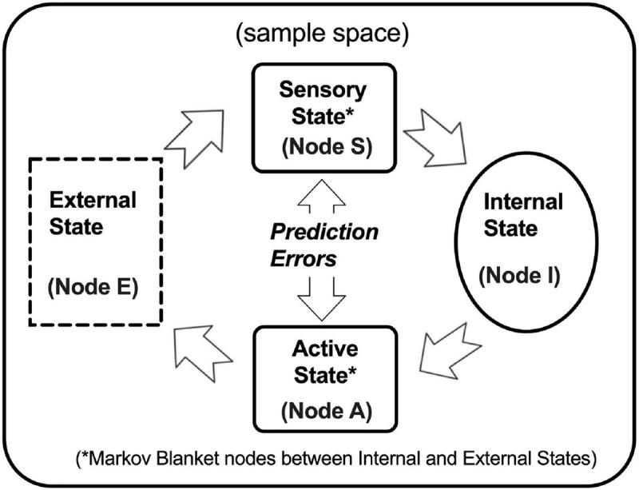
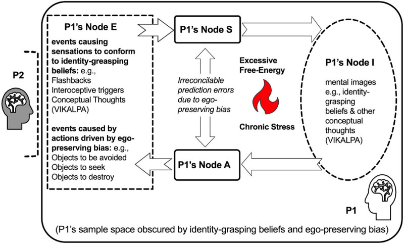
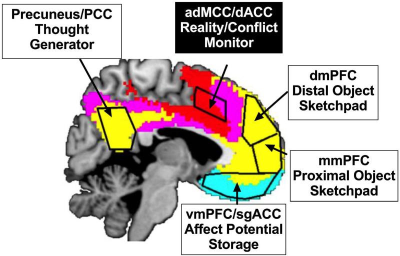
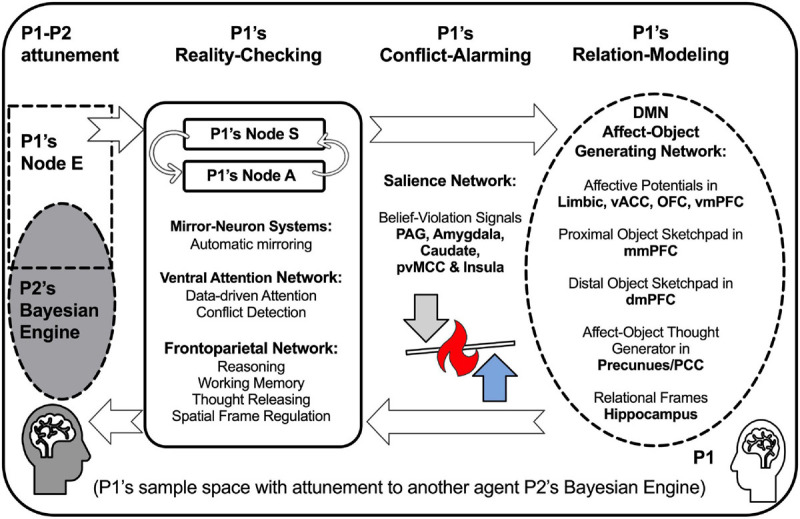

# Compassion As an Intervention to Attune to Universal Suffering of Self and Others in Conflicts: A Translational Framework

**Authors:** S. Shaun Ho1,2, Yoshio Nakamura3, James E. Swain1

**Affiliations:**
1. Department of Psychiatry and Behavioral Health, Renaissance School of Medicine at Stony Brook University, Stony Brook, NY, United States
2. Center for Understanding Biology Using Imaging Technology (CUBIT), Stony Brook University, Stony Brook, NY, United States
3. Department of Anesthesiology, Division of Pain Medicine, Pain Research Center, University of Utah School of Medicine, Salt Lake City, UT, United States

**Journal:** Frontiers in Psychology
**Published:** January 11, 2021
**DOI:** [10.3389/fpsyg.2020.603385](https://doi.org/10.3389/fpsyg.2020.603385)
**PMID:** 33505336
**PMCID:** PMC7829669

**Keywords:** Bayesian inference, Buddhism, compassion, conflicts, meditation, neuroimaging, free energy principle

---

## Abstract

Compassion is described in Buddhist texts as the aspiration to attune to friends, enemies, and someone in between equally to understand their suffering and aspire for them all to be free of suffering. Buddhist philosophy and meditation practices together provide frameworks that can be incorporated to design scientific approaches for understanding the experience and the neural mechanisms of how compassion can work to attune to others. This perspective article aims to propose a translational framework toward understanding how practicing compassion can be a form of intervention to safeguard mental health in the face of conflicts. Conflict is here discussed in terms of what in Buddhist psychology is called ego-preserving bias, with evidence from functional neuroimaging of brain networks. The framework integrates Buddhist philosophy and psychological knowledge and further draws upon research in Bayesian active inference to outline the neural framework connecting all these areas. Two hypotheses are proposed: first, that ego-preserving bias can prevent a person from attuning to those whose perspectives conflict with his or her own; second, that compassion meditation designed to cultivate equal attunement to universal suffering can ultimately eliminate this bias.

---

## Introduction

Conflicts between people are inevitable. Inter-personal conflicts are unavoidable sources of stress, and mental health can be compromised when conflicts overwhelm a person's capacity. In conflicts, a person typically experiences stress and may employ various coping strategies. These strategies can range from adaptive ones, such as problem solving and seeking social support, to maladaptive ones, such as aggression and social withdrawal. At the extreme, a person may develop mental disorders, ranging from depression and anxiety to post-traumatic stress disorder (PTSD). Therefore, understanding the mechanisms that underlie conflicts and developing interventions that can help people cope with conflicts are important goals for mental health research.

The Buddhist tradition offers a unique perspective on understanding conflicts and developing interventions. Central to this tradition is the concept of compassion, which is described as the aspiration to attune to friends, enemies, and someone in between equally to understand their suffering and aspire for them all to be free of suffering. Compassion meditation practices, such as those found in the Tibetan Buddhist tradition of *lojong* (mind training), are designed to cultivate this capacity. These practices involve systematically extending compassion to oneself, loved ones, neutral people, difficult people, and ultimately all sentient beings.

This perspective article aims to propose a translational framework toward understanding how practicing compassion can be a form of intervention to safeguard mental health in the face of conflicts. We will first outline the Buddhist philosophical framework for understanding conflicts, focusing on the concept of "ego-preserving bias." We will then draw upon research in Bayesian active inference to outline a neural framework connecting Buddhist philosophy with brain networks. Finally, we will discuss the implications of this framework for understanding how compassion meditation can be an intervention for managing conflicts.

---

## Buddhist Philosophical Framework

### The Nature of Mind and Suffering

According to Buddhist philosophy, the nature of mind is clear and aware. Mind is not reducible to physical form but is characterized by its capacity to know and experience. This basic awareness is the foundation upon which all mental states arise.

Buddhism identifies three types of suffering (*duḥkha*):

1. **Suffering of suffering** (*duḥkha-duḥkha*): The obvious suffering that comes from painful experiences
2. **Suffering of change** (*vipariṇāma-duḥkha*): The suffering that comes from the impermanent nature of pleasant experiences
3. **All-pervasive suffering** (*saṃskāra-duḥkha*): The subtle suffering that pervades all conditioned existence

### The Five Aggregates (Skandhas)

Buddhist psychology analyzes personal experience in terms of five aggregates (*skandhas*) that comprise personhood:

1. **Form** (*rūpa*): Physical body and sense organs
2. **Sensation** (*vedanā*): Pleasant, unpleasant, or neutral feelings
3. **Perception/Discrimination** (*saṃjñā*): Recognition and categorization of objects
4. **Mental formations** (*saṃskāra*): Volitional activities and mental factors
5. **Consciousness** (*vijñāna*): Awareness of objects

These aggregates are described as impersonal processes that arise and pass away moment to moment. The mistaken identification of these aggregates as a permanent, unchanging "self" is considered a fundamental source of suffering.

### Conceptual Thoughts (Vikalpa) and Identity-Grasping Beliefs

Central to understanding conflicts in the Buddhist framework is the concept of *vikalpa* (conceptual thoughts). Vikalpas are mental images that mediate our perception of reality. While they serve important functions in organizing experience, they can also obscure direct perception of reality.

The framework identifies eight types of vikalpa that support identity-grasping beliefs through three conceptual levels:

**Level I - Reification:** Mistakenly attributing essential, inherent natures to phenomena that are actually empty of inherent existence.

**Level II - Ego formation:** Establishing "I" as a separate, independent entity distinct from the impersonal processes of the five aggregates.

**Level III - Valuation:** Categorizing phenomena as agreeable (to be acquired), disagreeable (to be avoided), or neutral (to be ignored) based on the reified self.

### Proliferation (Prapañca)

*Prapañca* refers to the mental proliferation or elaboration that occurs when conceptual thoughts multiply and reinforce each other. This proliferation involves the superimposition of ego onto sensory experience, creating a web of concepts about self and other that obscures direct perception of reality.

---

## Ego-Preserving Bias in Conflicts

We propose that "ego-preserving bias" is a key mechanism underlying interpersonal conflicts. This bias operates when a person's identity-grasping beliefs are threatened by conflicting perspectives from others. The ego, constructed through the processes described above, seeks to preserve itself by:

1. Rejecting or devaluing conflicting information
2. Amplifying information that supports existing beliefs
3. Generating negative attributions about those who threaten one's identity
4. Engaging in defensive behaviors (aggression, withdrawal, etc.)

This bias prevents genuine attunement to others and perpetuates cycles of conflict. When the ego-preserving bias is active, a person fails to "see" the other person in the relationship as they actually are, instead perceiving them through the filter of identity-protecting conceptual elaborations.

---

## Bayesian Active Inference Framework

### The Mind as a Bayesian Engine

Drawing upon the Free Energy Principle developed by Karl Friston and colleagues, we propose that a person can be characterized as a "Bayesian Engine" that continuously constructs models of reality based on sensory input and prior beliefs. This framework provides a computational account of how the mind processes information and generates behavior.

**Figure 1.** Bayesian active inference framework depicting how biological organisms function as Bayesian processors. The figure shows interconnected nodes representing Sensory State and Active State (solid rectangles), Internal State (solid oval), and External State (dashed rectangle). These elements operate in accordance with the Free Energy Principle.

In this framework:

- **External State** corresponds to sense objects (*āyatana*) in Buddhist psychology
- **Sensory/Active States** correspond to sensation (*vedanā*) and action (*saṃskāra*)
- **Internal State** corresponds to perception and consciousness (*vijñāna*)

The system operates to minimize "free energy" or prediction error—the discrepancy between predicted and actual sensory inputs. This is achieved through two mechanisms:

1. **Perceptual inference:** Updating internal models to better predict sensory inputs
2. **Active inference:** Acting on the environment to change sensory inputs to match predictions

### Dysfunction of the Bayesian Engine

Identity-grasping beliefs can be understood as rigid prior beliefs that resist updating through prediction error. When these priors become too strong, the Bayesian Engine malfunctions:

**Figure 2.** Bayesian Engine dysfunction where identity-grasping beliefs and ego-preserving bias obscure the sampling space. When conceptual thoughts (vikalpa) interfere with perception, person P1 fails to accurately perceive person P2 in the relationship. The sampling becomes biased toward trauma-related cues, interoceptive triggers, and circular conceptual patterns that reinforce fear and anger. P1 fails to infer and "see" the other person in the relationship (represented by the dashed bracket excluding P2 from P1's perceptual space).

The ego-preserving bias represents a failure to appropriately weight prediction errors. Instead of updating beliefs in response to contradictory evidence, the system reinforces existing identity-based beliefs and generates behaviors that confirm these beliefs (confirmation bias in action).

---

## Neural Framework: The AGIR Model

We propose a three-component neural model based on the Affect-Object Generative Inference and Regulation (AGIR) model:

**Figure 3.** Affect-object generative inference and regulation (AGIR) model, adapted from Ho and Nakamura (2017). The first system handles affect-object inference generation, incorporating brain regions including the precuneus/posterior cingulate cortex, subgenual anterior cingulate cortex, ventromedial prefrontal cortex, and medial prefrontal cortex subdivisions. The second system manages cognitive control through reality/conflict monitoring in anterior dorsal middle cingulate cortex. The model maps onto established cortical networks showing an anti-correlative relationship.

### Three Functional Components

**1. Relation-Modeling (Default-Mode Network)**

This component generates conceptual thoughts about self and others through affect-object networks in the medial prefrontal cortex. Key regions include:

- Precuneus/posterior cingulate cortex (PCC)
- Subgenual anterior cingulate cortex (sgACC)
- Ventromedial prefrontal cortex (vmPFC)
- Medial prefrontal cortex (mPFC)

This network is active during self-referential processing, mentalizing about others, and autobiographical memory retrieval.

**2. Reality-Checking (Frontoparietal/Ventral Attention Networks)**

This component detects prediction errors and maintains flexible representations of self and others. It includes:

- Anterior dorsal middle cingulate cortex (adMCC): Reality/conflict monitoring
- Frontoparietal network (FPN): Cognitive control and flexible attention
- Ventral attention network (VAN): Detecting salient, unexpected events

This system enables the suspension of prior beliefs and updating of models in response to new evidence.

**3. Conflict-Alarming (Salience Network)**

The Salience Network (SN) is triggered by threat signals and plays a critical role in determining the response to conflict:

- Anterior insula (AI)
- Dorsal anterior cingulate cortex (dACC)

The SN acts as a switch between the DMN and FPN/VAN. Its function determines whether conflict leads to adaptive attunement or reinforced bias.

### The Critical Bifurcation Point

**Figure 4.** Bayesian Engines in a state of attuning to others where multiple agents are present in each other's cognitive sampling spaces. The model identifies three functional components: Relation-Modeling (generates thoughts about self and others through the Default-Mode Network), Reality-Checking (monitors reality through the Mirror-Neuron System and Attention Networks), and Conflict-Alarming (activates when beliefs are threatened, engaging the Salience Network).

Post-conflict, there is a critical bifurcation point. The strengthening or weakening of ego-preserving bias depends on whether the Salience Network:

**Adaptive Response:**
- Down-regulates the DMN (quieting self-referential elaboration)
- Up-regulates FPN/VAN (enhancing reality-checking)
- Results in flexible updating of beliefs and attunement to others

**Maladaptive Response:**
- Up-regulates the DMN (amplifying identity-based thinking)
- Down-regulates FPN/VAN (suppressing reality-checking)
- Results in reinforced bias and escalated conflict

---

## Compassion Meditation as Intervention

### Lojong: Mind Training

Buddhist compassion meditation practices, particularly *lojong* (mind training) from the Tibetan tradition, are designed to cultivate equal attunement to all beings' suffering. The practice involves:

1. **Recognizing universal suffering:** Understanding that all beings, including oneself, friends, enemies, and neutral persons, experience suffering
2. **Equalizing self and other:** Developing recognition that one's own desire for happiness and freedom from suffering is shared by all beings
3. **Exchanging self and other (tonglen):** Visualizing taking on the suffering of others and giving one's own happiness to them
4. **Extending compassion systematically:** Progressing from self, to loved ones, to neutral persons, to difficult persons, to all beings

### Predicted Meditation Effects

Based on the framework, we predict that compassion meditation would:

1. **Reduce precuneus/posterior cingulate activity:** Quieting the generation of self-referential conceptual thoughts
2. **Enhance anterior dorsal middle cingulate function:** Improving reality monitoring and detection of prediction errors
3. **Strengthen frontoparietal networks:** Enabling flexible perspective-taking and belief updating
4. **Promote hippocampal neurogenesis:** Supporting cognitive flexibility and stress resilience
5. **Modulate salience network function:** Enabling adaptive responses to conflict-triggering stimuli

### Mechanisms of Change

The practice works through several mechanisms:

**Suspension of identity-grasping beliefs:** Through focused attention and insight practices, the meditator learns to recognize conceptual thoughts as mental events rather than reality, loosening their grip on identity.

**Cultivation of equanimity:** By systematically extending compassion to all beings, including difficult persons, the meditator reduces the strong positive/negative valuation that fuels ego-preserving bias.

**Enhanced attunement capacity:** Regular practice strengthens the neural circuits supporting mentalizing and empathy, enabling more accurate perception of others' mental states.

**Flexible belief updating:** By repeatedly challenging identity-based distinctions (friend/enemy/neutral), the meditator develops greater capacity for updating prior beliefs in response to evidence.

---

## Evidence and Implications

### Supporting Evidence

Several lines of research support the proposed framework:

**Resilience factors:** Studies show that spirituality and social support facilitate recovery from adverse childhood experiences, with approximately one-third of trauma-exposed individuals demonstrating resilience.

**Meditation outcomes:** Loving-kindness meditation increases social connectedness and positive emotion. Compassion-based interventions show moderate effect sizes for reducing psychological suffering.

**Cognitively-Based Compassion Training (CBCT):** This secular program inspired by *lojong* has shown beneficial effects on stress reactivity, inflammation markers, and psychological well-being in multiple populations.

**Neuroimaging studies:** Meditation practitioners show altered patterns of brain activity and connectivity, including reduced DMN activity during meditation, enhanced PFC function, and altered salience network dynamics.

### Clinical Implications

The framework suggests several implications for intervention development:

1. **Targeting ego-preserving bias:** Interventions should directly address the mechanisms that maintain rigid identity-based beliefs
2. **Cultivating attunement capacity:** Practices should systematically develop the capacity to accurately perceive and respond to others' mental states
3. **Promoting flexible belief updating:** Interventions should enhance the brain systems supporting reality-checking and belief revision
4. **Prevention focus:** Compassion training may be most effective as a preventive intervention, building capacity before conflicts become entrenched

---

## Conclusions

This translational framework proposes that compassion meditation can counter ego-preserving bias and promote attunement to others during interpersonal conflicts. By integrating Buddhist philosophy with Bayesian active inference and neuroscience, we have outlined how:

1. Conflicts arise from ego-preserving bias rooted in identity-grasping beliefs
2. This bias represents dysfunction in the brain's Bayesian inference machinery
3. Neural networks (DMN, FPN/VAN, SN) implement the processes of relation-modeling, reality-checking, and conflict-alarming
4. Compassion meditation may strengthen the neural systems that enable flexible belief updating and attunement to others

The framework generates testable hypotheses for future research and provides a theoretical foundation for developing and refining compassion-based interventions for conflict-related stress and mental health conditions.

---

## Funding

This work was supported by NIH grant R01 DA047336/DA/NIDA NIH HHS/United States.

---

## References

*Note: This is a summary document. For the complete reference list, please see the original publication at [doi.org/10.3389/fpsyg.2020.603385](https://doi.org/10.3389/fpsyg.2020.603385)*

Key references include:

- Friston, K. (2010). The free-energy principle: a unified brain theory? *Nature Reviews Neuroscience*, 11(2), 127-138.
- Ho, S. S., & Nakamura, Y. (2017). Healing dysfunctional identity: Bridging mind-body intervention to brain systems. *Journal of Behavioral and Brain Science*, 7(03), 137.
- Neff, K. D., & Germer, C. K. (2013). A pilot study and randomized controlled trial of the mindful self-compassion program. *Journal of Clinical Psychology*, 69(1), 28-44.
- Pace, T. W., et al. (2009). Effect of compassion meditation on neuroendocrine, innate immune and behavioral responses to psychosocial stress. *Psychoneuroendocrinology*, 34(1), 87-98.

---

## Citation

Ho, S. S., Nakamura, Y., & Swain, J. E. (2021). Compassion As an Intervention to Attune to Universal Suffering of Self and Others in Conflicts: A Translational Framework. *Frontiers in Psychology*, 11, 603385. https://doi.org/10.3389/fpsyg.2020.603385
