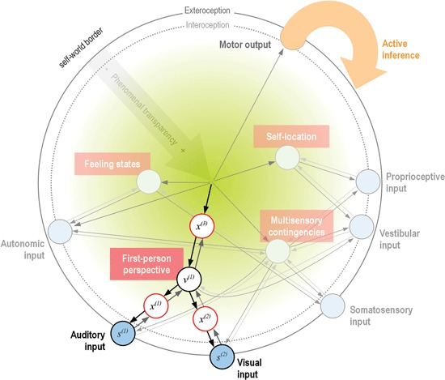

# Minimal Self-Models and the Free Energy Principle

**Authors:** Jakub Limanowski<sup>1,2,3</sup>, Felix Blankenburg<sup>1,2</sup>

**Affiliations:**
1. Berlin School of Mind and Brain, Humboldt-Universität zu Berlin, Berlin, Germany
2. Dahlem Institute for Neuroimaging of Emotion, Freie Universität Berlin, Berlin, Germany
3. Max Planck Institute for Human Development, Berlin, Germany

**Journal:** Frontiers in Human Neuroscience
**Published:** September 12, 2013
**DOI:** [10.3389/fnhum.2013.00547](https://doi.org/10.3389/fnhum.2013.00547)
**PMCID:** PMC3770917

---

## Abstract

The term "minimal phenomenal selfhood" (MPS) describes the most basic, pre-reflective experience of being a self. Theoretical accounts have long recognized the importance of the body as both part of the physical world and as the enabling condition for experiencing this world. A recent account of MPS centers on the consideration that minimal selfhood emerges as the result of basic self-modeling mechanisms, thereby being founded on pre-reflective bodily processes.

This paper proposes that the free energy principle (FEP) provides a unifying framework for understanding how the brain implements such self-modeling. The FEP posits that the brain operates via hierarchical generative models optimized by minimizing free energy (prediction error). We argue this framework effectively explains the key components of bodily self-awareness: multisensory integration, interoception, agency, the experience of ownership ("mineness"), and the first-person perspective.

---

## Introduction

The experience of being a self is fundamental to human consciousness. Despite its ubiquity, the mechanisms underlying this experience remain poorly understood. The concept of "minimal phenomenal selfhood" (MPS) captures the most basic, pre-reflective sense of being a self—prior to any conceptual elaboration or narrative construction.

The body occupies a unique position in this account: it is both part of the physical world and the vehicle through which we experience that world. As Merleau-Ponty noted, the body is not merely an object among objects but the condition of possibility for perceiving objects at all. This suggests that understanding bodily self-awareness may be key to understanding selfhood more generally.

We propose that the free energy principle (FEP) provides a powerful framework for understanding how the brain implements minimal self-models. The FEP offers a unified account of perception, action, and learning that can be applied to the various components of bodily self-awareness.

---

## The Free Energy Principle

### Core Principles

The free energy principle states that self-organizing biological systems resist the natural tendency toward disorder (entropy) by maintaining themselves in a limited number of states. To do this, they must minimize "surprise"—the improbability of their sensory states given their model of the world.

Since surprise cannot be computed directly, organisms minimize an upper bound on surprise called **free energy**. This is achieved through two complementary mechanisms:

1. **Perceptual inference:** Updating internal models to better predict sensory inputs (reducing prediction error)
2. **Active inference:** Acting on the environment to change sensory inputs to match predictions

### Hierarchical Generative Models

The brain implements the FEP through hierarchical generative models (HGMs). These are stacked predictive mappings where:

- Higher levels generate predictions about lower levels
- Lower levels send prediction errors upward when predictions fail
- Each level explains away prediction errors from below

This architecture allows the brain to infer hidden causes of sensory input through model inversion—using Bayes' rule to compute posterior beliefs about causes given effects.

### Precision Weighting

Not all prediction errors are weighted equally. **Precision** (inverse variance) determines how much influence a prediction error has on belief updating. Precision weighting is thought to be implemented by synaptic gain modulation and corresponds functionally to attention.

---

## Components of Minimal Self-Models

### 1. Multisensory Integration

The body is the only physical system that constantly generates and receives input across multiple sensory modalities (visual, tactile, proprioceptive, interoceptive). The brain must integrate these signals to maintain a coherent body representation.

**The Rubber Hand Illusion (RHI):** When participants view a rubber hand being stroked synchronously with their hidden real hand, they often feel that the rubber hand is their own. The FEP explains this as follows:

- Synchronous visuotactile stimulation creates a prediction error: why are visual and tactile signals correlated if they don't share a common cause?
- The brain minimizes free energy by inferring that the rubber hand is part of the body
- This illusion is abolished when the rubber hand is placed in an anatomically impossible position (violating prior beliefs about body configuration)

**Key insight:** "Sensory information is processed probabilistically, and thus it follows that the representation of the self is also probabilistic."

### 2. Interoception

Interoception—the sensing of internal bodily states—provides a continuous stream of self-related information. Seth and colleagues have proposed that interoceptive prediction error minimization is foundational for self-representation.

**Presence:** The subjective feeling of existing "here and now" results from successful suppression of interoceptive prediction error. When the brain accurately predicts its internal states, the body feels present and real.

**Emotion:** Feeling states emerge from the interaction of interoceptive predictions and prediction errors. Emotions are not merely reactions to bodily states but predictions about expected interoceptive consequences of actions.

### 3. Agency and Action

Active inference is essential to selfhood. An agent must predict which actions will confirm its model's predictions. The sense of agency emerges from this predictive capacity.

**Motor control as inference:** Actions are generated by proprioceptive predictions that are fulfilled by reflex arcs. The motor system doesn't send commands but predictions about expected proprioceptive states.

**Sensory attenuation:** Self-generated sensory consequences are attenuated because they are predicted. This explains why we cannot tickle ourselves—the tactile consequences are anticipated and suppressed.

**Pathological implications:** Failures in active inference explain symptoms such as:
- Delusions of control (attributing self-generated actions to external agents)
- Out-of-body experiences (failures in bodily prediction)
- Functional motor symptoms (failures in action prediction)

### 4. Mineness (Ownership Experience)

"Mineness" is the feeling that experiences and body parts belong to oneself. Following Hohwy's analysis, mineness results from successful predictions across the self-model hierarchy.

Rather than being a static property, mineness emerges through ongoing predictive processes:

> "Prediction introduces the temporal component of 'being already familiar' with the predicted input."

This explains why ownership can shift (as in the RHI) and why it feels effortless—it is the default state when predictions are confirmed.

### 5. First-Person Perspective (1PP)

The self-model is centered on a particular point in space and time. This centeredness generates the first-person perspective—the feeling that experience radiates from a particular locus.

**Weak 1PP:** The geometric centering of the perceptual field on the body

**Strong 1PP:** The phenomenal centeredness that reflects successful self-modeling—the feeling of being a subject of experience

The **body schema**—the implicit representation of body configuration and capabilities—may be encoded by predictive structures in the hierarchical model. This "embodied memory" organizes sensorimotor processes and enables fluent action.

### 6. Modeling Others

The framework extends naturally to social cognition. The brain generates "second-order representations" predicting other agents' mental states through the same generative modeling mechanisms.

**Shared representations:** Mirror neuron systems may implement shared action models for self and others. When observing another's action, the brain generates predictions about that action using its own motor repertoire.

**Theory of mind:** Understanding others' mental states requires distinguishing self-generated predictions from other-generated predictions—a form of source monitoring implemented through precision modulation.

---

## The Hierarchical Self-Model



**Figure 1.** A mapping of the phenomenal self-model onto a hierarchical generative model. The diagram shows how the unified self emerges from predictive coding across multiple levels. Descending arrows represent predictions flowing from higher to lower levels; ascending arrows represent prediction errors. The "green gradient" symbolizes increasing phenomenal transparency at higher levels of the hierarchy.

**Structure:**
- **Top level:** Minimal phenomenal self (transparent, unified, no further representation)
- **Intermediate levels:** Agency, interoception, multisensory integration, mineness, first-person perspective
- **Lower levels:** Unimodal sensory predictions (visual, auditory, somatosensory, proprioceptive, interoceptive)

The model explains several key features of selfhood:

1. **Unity:** Higher levels integrate prediction errors from multiple lower-level modalities into a unified self-representation

2. **Transparency:** Higher levels are phenomenally transparent—we don't experience the machinery of self-modeling, only its products

3. **Stability:** Higher-level representations change slowly, providing continuity despite rapidly changing sensory input

4. **Flexibility:** The probabilistic nature allows for context-dependent updating (e.g., body ownership can shift)

---

## Formal Properties

While this paper does not present full mathematical formalism, the framework rests on several key formal concepts:

### Free Energy
Free energy is an information-theoretic quantity defined as:

```
F = -log p(s|m) + D_KL[q(θ)||p(θ|s,m)]
```

Where:
- `s` = sensory states
- `m` = generative model
- `θ` = hidden states/parameters
- `D_KL` = Kullback-Leibler divergence

Free energy provides an upper bound on surprise (negative log evidence).

### Prediction Error Minimization
At each level of the hierarchy:

```
ε_i = s_i - g(μ_{i+1})
```

Where:
- `ε_i` = prediction error at level i
- `s_i` = input to level i
- `g(μ_{i+1})` = prediction from level i+1
- `μ` = sufficient statistics (means) of beliefs

### Precision Weighting
Prediction errors are weighted by precision:

```
Π_i = 1/σ²_i
```

Where `σ²` is the expected variance. High precision means prediction errors have strong influence on belief updating.

### The Good Regulator Theorem
The framework connects to Conant and Ashby's Good Regulator theorem: every good regulator of a system must be a model of that system. Applied to self-modeling:

> A system that successfully regulates its states with respect to the environment must model itself as distinct from that environment.

This provides a principled reason why self-models emerge: they are necessary for adaptive behavior.

---

## Pathological Applications

The framework accounts for various pathological conditions as failures in self-modeling:

| Condition | Proposed Mechanism |
|-----------|-------------------|
| **Schizophrenia** | Noisy precision estimation; impaired sensory attenuation leading to self/other confusion |
| **Depersonalization** | Loss of phenomenal transparency; the self-model becomes opaque and feels unreal |
| **Autism Spectrum** | Impaired precision weighting in social contexts; difficulties with perspective-taking |
| **Hysteria/Functional symptoms** | Failures in active inference; actions don't fulfill proprioceptive predictions |
| **Out-of-body experiences** | Failures in multisensory integration; body ownership shifts to external viewpoint |

---

## Conclusions

The free energy principle provides a unified theoretical framework for understanding minimal phenomenal selfhood. Key contributions of this analysis:

1. **Embodied foundation:** The body's unique role as generator and receiver of multisensory signals explains why selfhood is fundamentally bodily

2. **Hierarchical organization:** Self-models are organized hierarchically, with higher levels providing more abstract, temporally stable representations

3. **Predictive nature:** Selfhood is not a static representation but an ongoing process of prediction and error minimization

4. **Unity through inference:** The unified experience of self emerges from integration across sensory modalities and temporal scales

5. **Active inference is essential:** The sense of agency is not peripheral to selfhood but central—we know ourselves as agents

6. **Social extension:** The same mechanisms extend to understanding others, grounding theory of mind in self-modeling

**Outstanding challenges:**
- Empirical validation of precision-weighting predictions
- Understanding how narrative self-models relate to minimal self-models
- Extending the framework to social cognition and interpersonal dynamics

---

## References

*For the complete reference list, see the original publication at [doi.org/10.3389/fnhum.2013.00547](https://doi.org/10.3389/fnhum.2013.00547)*

Key references include:

- Friston, K. (2010). The free-energy principle: a unified brain theory? *Nature Reviews Neuroscience*, 11(2), 127-138.
- Hohwy, J. (2007). The sense of self in the phenomenology of agency and perception. *Psyche*, 13(1), 1-20.
- Metzinger, T. (2003). *Being No One: The Self-Model Theory of Subjectivity*. MIT Press.
- Seth, A. K., Suzuki, K., & Critchley, H. D. (2012). An interoceptive predictive coding model of conscious presence. *Frontiers in Psychology*, 2, 395.

---

## Citation

Limanowski, J., & Blankenburg, F. (2013). Minimal self-models and the free energy principle. *Frontiers in Human Neuroscience*, 7, 547. https://doi.org/10.3389/fnhum.2013.00547
