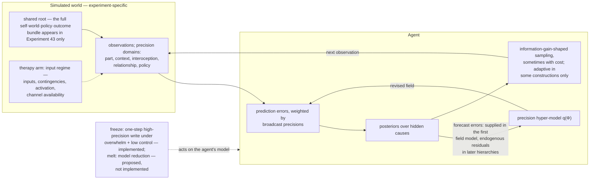

# Self-Energy, Witnessing, and the Revision of Part Beliefs: An Active Inference Account of Internal Family Systems

## 1. Introduction

Sometimes I am afraid. Sometimes a part of me is afraid. The fear may be equally intense in both cases, yet the two sentences describe different psychological states. In the first, fear defines the situation and the person within it. In the second, fear is present, but it is also held in awareness as one part of experience. Internal Family Systems therapy (IFS; Schwartz & Sweezy, 2020) treats this difference not as a matter of wording, but as a condition for therapeutic change. This paper asks what kind of computational architecture could make that claim true.

Consider someone who was cornered by a dog as a child and encounters one decades later. The old learning may return as a coordinated pattern: *this dog is dangerous; I cannot handle this; I must get away; something terrible is about to happen*. These are not four independent beliefs. They form a single model of the moment, joining an interpretation of the world to a sense of self, a policy, and an expected outcome. Nor does this model usually appear as a memory from childhood. While it is active, its claims are experienced in the present tense. The person does not observe herself becoming helpless. She simply confronts a world in which she is helpless.

This is the phenomenon we seek to explain. Some learned patterns do more than predict danger. They temporarily determine who the person is in relation to danger. They can therefore survive years of contradictory experience: an adult may know that most dogs are safe, possess the physical ability to leave, and still become the child for whom neither fact is available. Afterward, the transition may be obvious—*what came over me?*—but during it there is no distance from which to notice the change.

IFS organizes therapy around this change in relationship. It calls the activated configuration a *part*. When the part's perspective becomes the person's perspective, they are *blended*; when the same part can be held with curiosity and compassion, IFS says Self is present. The availability of that relationship under activation is called *Self-energy*.

Active inference treats perception and action as inference under a generative model. Learned expectations predict what the system will encounter, mismatches revise those expectations, and precision determines how much weight each source of evidence receives.

A part is not a kind of psychological object but a phase of one. The central claim of this paper is that a burdened part is frozen identity: a self, a world, a policy, and an ending, coupled and trusted so completely that they function as the architecture of the moment rather than as a hypothesis within it. The freeze is temporal as well as structural. What froze was an inference made under overwhelm, without any action that could test it, about who one was and how it would end—and that inference never closed. When IFS says a burdened part lives in the past and must be retrieved from it, the present account reads this as mechanism, not metaphor. A burdened part becomes revisable when it can be held in Self-led relationship, because that is where the unfinished moment meets the present it has been excluded from. We develop this claim in three steps: what freezes, what makes revision possible, and what allows change to reach the identity at the model's root.

First, what freezes: **frozen identity (C1)**. We model the burdened part as an organized bundle of priors—a self-state, a model of the world, a policy, and an expected outcome—bound together and now constraining and reactivating one another. The self-state—*I am helpless*, *I do not matter*, *I am alone with this*—organizes the bundle. When the bundle becomes sufficiently precise—trusted as reliable—it no longer functions as one hypothesis among others. It becomes the context within which inference proceeds. In this sense, a part is *frozen process*: our active-inference reconstruction of what Gendlin (1964) called a “frozen whole.” What has frozen is not experience in general, but an identity-level configuration that no longer updates through ordinary contact with the present.

Second, blending, or capture, and Self-led contact are different inferential **regimes (C2)**. We identify the epistemic core of Self-energy with *epistemic depth*: the recursive sharing by which a system models how precision is being allocated across its own hierarchy (Laukkonen, Friston, & Chandaria, 2025). Epistemic depth is not a force that suppresses a part. It is a global hyper-model that forecasts which layers and channels should be trusted, receives error about those forecasts, and broadcasts a revised precision field back through the system. When that forecast narrows or loses calibration around an activated bundle, the part can organize inference without its local dominance being adequately represented. When recursive sharing remains broad and calibrated, the same part can become available as *a part of me* (Metzinger, 2003; Limanowski & Friston, 2018). This shift does not by itself weaken the part or change what it believes. It changes whether the system knows how the part is shaping the present—and whether the part is available for revision.

Third, deep change depends on **relational revision (C3)**. Once the part can be held in awareness, two kinds of corrective evidence become possible. Informational evidence concerns the present cue: *this dog is not dangerous*. Relational evidence concerns the self-state at the root of the bundle: *I am not alone with this; I am no longer the helpless one*. The distinction matters because threat meanings are often tied to particular cues, whereas self-states organize expectations across many situations. A change in threat meaning should therefore remain relatively local. A change in the shared self-state should travel.

Together, these claims explain why activation alone is insufficient for change. If the old model is active but *transparent*—experienced as reality rather than as a model—new evidence is interpreted from within it. They also explain why calm alone is insufficient. Regulation may reduce distress without bringing the relevant model into contact with contradictory evidence. Revision requires a particular precision field: the part must remain active, the system must recursively represent how that activation is organizing inference, and present bodily, contextual, and relational evidence must remain trusted strongly enough to reach it.

The account is deliberately limited in two ways. It does not claim that IFS is the only therapy capable of changing identity-level learning, nor that exposure, cognitive, or schema-based methods fail to do so. Different interventions may alter different variables, and therapies as practiced often combine informational, regulatory, and relational ingredients. Our aim is to isolate the contribution of the relation to activated content. The simulations reported later serve the same limited purpose. They show whether the proposed mechanisms can generate the relevant patterns and where the account fails; they are existence proofs and sources of empirical predictions, not evidence that human therapy works this way.

This proposal extends a broader active-inference account of self-transformative practices. Previous work has described how meditation, metacognition, and altered states may change the relation to a global self-model through attention and changes in how precision is allocated locally and across the hierarchy (Laukkonen & Slagter, 2021; Laukkonen, Friston, & Chandaria, 2025; Sandved-Smith et al., 2026). We apply the system-wide construct at an intermediate clinical scale without reducing it to local self-monitoring: the whole precision field remains recursively coordinated while a local identity model is active. The further step is relational. In IFS, the relevant prior becomes revisable not simply because it is observed, but because the hyper-model continues to trust a present-moment relationship that contradicts the conditions under which it formed. Transformative evidence must be both trusted and found. Loving contact from the client's Self—the part being seen, loved, and valued exactly as it is—is itself a major form of such evidence. Therapist-guided inquiry can then direct attention toward what matters without dictating what the person must discover.

## 2. IFS in Its Own Terms

IFS begins from a familiar feature of experience: the mind does not always speak with one voice. One part of a person may want intimacy while another withdraws; one may resolve to remain calm while another is already preparing to fight. IFS treats this multiplicity as a basic feature of mind rather than a symptom in itself. A *part* is an organized perspective within the person, with feelings, beliefs, memories, and characteristic ways of acting. Problems arise not because parts exist, but because they become trapped in roles that have grown rigid, extreme, or costly.

The dog encounter from §1 shows the distinction on which the therapy turns. At the height of fear, the person does not experience herself as having one frightened perspective among others. She experiences a dangerous dog and her own inability to cope. The fear speaks in the first person: *I cannot handle this; I have to get away*. IFS calls this *blending*. The part has not merely become active; its perspective has become the person's perspective.

The same fear can also be present without taking over. The person may feel the panic in her body while recognizing, *a part of me is terrified*. IFS calls this *unblending*, or speaking *for* a part rather than *from* it. Unblending does not mean suppressing the fear, reasoning it away, or observing it from a distance. The part remains emotionally present, but it is no longer alone in the encounter.

IFS calls what is present with the part *Self*. Within the model, Self is not another part, even an unusually wise one. It is an innate and undamaged source of awareness and inner leadership, available in every person. Therapy does not create or improve Self; it helps parts make enough room for Self to lead. Self is recognized less by what it believes than by how it relates: with curiosity, compassion, calm, clarity, courage, confidence, creativity, and connectedness. IFS calls the degree to which these qualities remain available under activation *Self-energy*.

This is why an IFS therapist repeatedly asks, *How do you feel toward this part?* The question does not measure the intensity of the part. It identifies the relationship to it. Curiosity, warmth, or concern suggest that Self is present. Fear, contempt, impatience, or an urgent wish to get rid of the part suggest that another part has entered the exchange. The therapist then turns toward that response rather than pushing through it. In this way, the method uses relationship as its guide: before asking what a part believes, it asks who is listening.

This relating is conducted largely in imagery and inner dialogue. The client is invited to find the part—as an image, a felt presence in or around the body, a voice—and to address it directly: to ask what it wants her to know, and to listen for the answer rather than compose one. Parts commonly present as figures with ages, locations, and expressions, and the work proceeds in the second person: the client speaks with the part, not only about it. The imagery is treated as the part showing itself, not as illustration, and the later stages of the method—witnessing, unburdening—unfold in the same medium. Why a therapy aimed at revising learned expectations should operate through images and conversation is a question the account must eventually answer (§8).

The familiar IFS taxonomy describes how parts organize around overwhelming experience. IFS calls parts that carry pain the person could not assimilate when it occurred *exiles*. Alongside that pain, an exile carries the conclusions drawn from the experience: *I am helpless; I am unwanted; I am alone*. IFS calls what the part took on a *burden*. A burden is not the part itself. It is the fear, shame, belief, or role that became attached to the part during the experience and has remained with it since. Exiles often feel young because the world they expect is still organized around that earlier time.

Other parts become *protectors*. Their task is to prevent the exile's pain from overwhelming the system again. *Managers* protect prospectively. They monitor, plan, please, perfect, control, and avoid so that vulnerable material never reaches awareness. *Firefighters* act after that material has broken through. They seek immediate relief through escape, rage, numbing, dissociation, compulsive behavior, or any other action forceful enough to stop the experience. Managers and firefighters differ in timing, but not in purpose: both are organized around the expectation that direct contact with the exile would be intolerable.

IFS condenses this stance into an organizing commitment: there are no bad parts (Schwartz, 2021). Even the most destructive behavior is protection as some part understands protection. IFS therefore approaches costly behavior as strategy before treating it as pathology.

This commitment determines the order of therapy. Work begins with the protectors, not with the memory they guard. The person asks what each protector does, what it fears, and what it predicts would happen if it stopped. Protectors commonly fear both what contact will release and what the request to step aside implies: that the danger is being underestimated, or that the protector itself is unwanted. Through repeated contact in which its fears are understood, its service appreciated, and its limits respected, a protector may revise what it expects from Self. IFS calls this learned expectation *trust*. Only when the relevant protectors grant permission does the work move toward the exile.

The encounter with the exile is called *witnessing*. The part is invited to show what happened and what it made of the experience: images, sensations, impulses, emotions, and beliefs about itself and the world. Witnessing is more than remembering. The experience is revisited in the presence of Self until the exile feels fully seen and no longer alone with what it carries.

IFS then invites *unburdening*. The exile releases what it took on, often through spontaneous ritual imagery: giving the burden to water, fire, wind, earth, or light. The aim is not to remove the part. Once freed from the burden, the part may recover qualities hidden by its old role and choose how it wants to participate in the person's life. Protectors can then reconsider jobs that are no longer needed.

Trust is not preparation for the therapy. It is the medium of the therapy, and its pace sets the pace of change.

The translation does not replace IFS's clinical terms. It asks what mechanisms would have to exist for the distinctions among them to matter. The table offers a functional reconstruction, not an ontology. Section 10 identifies where the account departs from IFS and where the formalism remains agnostic.

| IFS term | Computational interpretation | § |
|---|---|---|
| Part | An organized perspective within the person; represented here, when burdened, by a coupled self-state, world-state, policy, and expected outcome | 3 |
| Exile | A part carrying pain and burdens associated with overwhelming experience, whose access to awareness and relationship is restricted by protector policies | 3–5 |
| Burden | An acquired fear, shame, belief, affect, or role carried by a part; modeled here through the precision with which it organizes expectations about self, world, action, and outcome | 4 |
| Protector (manager / firefighter) | A part organized around preventing anticipated harm, often by managing activation, action, or contact with vulnerable material | 5 |
| Self | A regime in which no local identity bundle transparently controls the system-wide precision field, and the present-moment self-state available within that regime | 6 |
| Self-energy | The clinical expression of epistemic depth remaining operational under part activation | 6 |
| Blending / capture | High part dominance combined with insufficient recursive representation of how the part is organizing inference | 7 |
| Witnessing | Clinically, the exile encounter; reconstructed here as sustained part activation within a globally coordinated field that continues to trust bodily, contextual, and relational evidence | 7–8 |
| Trust (part ↔ Self) | The part's learned forecast about contact with Self and the partner offering it | 2, 8 |
| Unburdening | The clinical release of what a part carries; reconstructed here as the unfinished inference closing—context-indexed redescription completed by reduction of the compulsory organization, with the part's capacities preserved | 8 |

## 3. Parts as Frozen Identity (C1)

What must a part be for blending to occur? Neither a belief nor a memory is sufficient to describe it. A blended pattern does not merely enter thought; it determines who is thinking.

We propose that a burdened part is an *identity-level precision bundle*: an organized pattern in which expectations bound together now constrain and reactivate one another. The bundle has four elements. A *self-state* specifies who I am. A *world-state* specifies what kind of situation this is. A *policy* specifies what I should do. An *expected outcome* specifies how this will end. Because the four expectations were learned as one explanation of one situation, the return of any one can recruit the others. Their configuration carries information that no element contains alone.

This anatomy has a precedent in object-relations theory, which describes experience as organized around linked representations of self and other, joined by affect (Kernberg, 1976). The present account makes a related claim in computational terms. We model a burdened part not as a separate agent inside the person but as a local control model within one generative system: a recurring configuration that links a way of being someone to a way of interpreting and acting in the world.

The self-state is the organizing element. By *self-state* we mean the system's working answer to the question, *What kind of agent is here?* The answer may concern capacity—*I cannot take care of myself*—standing—*I do not matter*—or relational position—*I am alone with this*. Formally, a self-state is not an image of oneself but a context: a latent state on which the bundle's other expectations depend. A hallway means one thing to someone who expects to cope and another to someone who is certain that they cannot. The situation, available action, and likely ending inherit their meaning from the identity placed at the center of them.

In a burdened part, the self-state bears the imprint of the conditions in which it formed. Overwhelm becomes *small*. The failure of every available action becomes *helpless*. The absence of anyone who came becomes *alone*. What the moment was becomes who the part expects itself to be. Beliefs about worth may follow by a further inference. A child who depends on a caregiver may preserve the caregiver as good by locating the cause of mistreatment in herself: *I am bad* (Fairbairn, 1952).

The root position of the self-state also gives the theory one of its central predictions. Threat meanings are often tied to particular cues: this dog, this street, this kind of approach. A self-state can organize expectations across many situations. If therapy revises only the threat meaning, change should remain relatively local. If it revises the self-state at the root, change should appear in situations that were never directly treated. The predicted difference is not simply greater improvement, but broader transfer.

What makes such a bundle *frozen*? Not merely that its expectations are strong. Strong beliefs can still be recognized as beliefs and revised by experience. A bundle is frozen when its precision has risen to the point that it functions as part of the architecture of inference rather than as one hypothesis within it. The system no longer asks whether the bundle fits the present. It uses the bundle to determine what the present is.

Freezing is therefore a phase, not a kind of mental object. The same materials—fear, vigilance, sensitivity, a capacity to act—can participate in flexible inference or become locked into a compulsory configuration. Nor does freezing require a single dramatic event. A bundle may crystallize rapidly under acute overwhelm, gradually through years of repeated misattunement, or anywhere between those extremes. The invariant is not speed but the relation to present experience: the bundle acquires precision while it cannot itself be represented and tested as a model. Section 4 develops this formation process.

Gendlin (1964) described a closely related phenomenon as *structure-bound experiencing*. Most experience changes as it meets the details of the present. A “frozen whole,” by contrast, repeats because present detail no longer modifies it. March (2021) similarly distinguishes fresh unfolding experience from “structurally consolidated emotional learnings.” These accounts converge on the same basic contrast: living process remains in contact with the present; frozen structure does not. Our reconstruction translates that contrast into precision dynamics and adds a more specific claim: what freezes in a part is an organization of *identity*.

The translation should not erase Gendlin's point. For him, the problem was not stored content but a process that had stopped carrying forward. Describing the result as a high-precision prior is therefore our reconstruction, not his formulation. The value of the comparison is that two vocabularies—phenomenological and computational—locate rigidity in the same place: a failure of present experience to modify what repeats.

This account also separates parts from nearby constructs without denying their overlap. A *schema* may concern the self and shape experience broadly, but the construct does not by itself require a self-state bound as the root of a world-model, policy, and expected outcome. A *latent context* selects which model applies; it need not specify who the agent is within that model. A *trait prior* is a slowly changing disposition, not necessarily a reactivating identity state coupled to a situation and course of action. A part requires the full organization. It therefore predicts a characteristic cluster: activation arrives as a whole world rather than a single belief; an earlier self-position resumes rather than merely being remembered; and revision at the identity root generalizes beyond the cue that elicited it.

## 4. How a Part Freezes

Not every frightening experience becomes a part. Two children may be knocked down by the same dog. One is frightened, comforted, and soon returns to playing with dogs. The other acquires a pattern that still organizes perception and action decades later. Threat alone cannot explain the difference.

IFS locates the difference in overwhelm. We make that intuition more specific by proposing two joint conditions: *overwhelm* and *low control*. Overwhelm occurs when incoming error exceeds the system's available explanations—not merely when an event is surprising, but when no model on hand can assimilate it. Control concerns the expected difference among available actions. When at least one action is expected to improve the situation, the policy landscape has a gradient. When no action is expected to help, it is flat. The child cannot escape, stop what is happening, recruit protection, or imagine an effective next move.

Either condition alone is insufficient. Threat with control intact can produce strong fear learning, but the person can act, observe what follows, and continue updating. Low control without overwhelm may produce passivity or habit, but it does not require a new identity model. Freezing becomes likely when the system must learn from an event it cannot explain while having no effective way to test what it learns.

Learning does not stop under these conditions. On the contrary, extreme error can drive extreme updating. We propose that the resulting update has three features.

First, the system assigns the experience to a new cause rather than revising an existing one. When an observation is too discrepant to fit any model already available, inferring a new latent cause can be more economical than distorting every existing explanation (Gershman, Blei, & Niv, 2010; Gershman et al., 2017). A portion of experience thereby receives a dedicated model. This is the formal event closest to the clinical description of a burdened part's formation; whether it creates the part or binds an existing one is the substrate question of §10. Because self-state, world-state, policy, and expected outcome are inferred together from the same episode, the new cause binds them as a unit.

Second, the new model is encoded *transparently*. A model is transparent when the person perceives through it without representing how it shapes experience; it becomes *opaque* when it can be held as a model (Metzinger, 2003; Limanowski & Friston, 2018). Under overwhelm, the system loses the capacity to represent its current state as a state it is having. *I notice that I am afraid* collapses into *the world is dangerous and I am helpless*. We call this loss *collapsed reflexivity*. The model is learned while it cannot be held as an object of awareness. It enters as the reality from which inference proceeds.

Third, the model is written without being adequately tested. Low control prevents the system from acting to generate discriminating evidence. A child who can run, call for help, or try another strategy can discover where the limits of the danger lie. A child for whom no action is expected to matter cannot. The resulting model receives high precision from the magnitude of the event while the system is unable to produce its own counterevidence. Trauma, on this account, combines a maximal write with a minimal test. The inference never closes.

The result is precise, identity-bearing, and insulated from the evidence that might otherwise revise it.

At the extreme corner of this space—very high overwhelm and almost no control—the expected value of overt action approaches zero. The system can no longer improve the situation by moving toward, away, against, or around it. One option remains: reduce the precision of the incoming evidence itself. We interpret shutdown and dissociative attenuation as this covert policy, a form of mental action that lowers the gain on what cannot be escaped (Sandved-Smith et al., 2021; Deane et al., 2020).

This is a claim about inferential function, not a complete physiology of collapse. Autonomic accounts may describe how shutdown is implemented in the body (Porges, 2011); the present model represents only its computational signature. The distinction matters because attenuation can later resemble therapeutic calm. Both may reduce visible distress, but only one leaves present evidence available. Section 6 returns to this difference.

Once formed, the bundle persists through a self-sealing loop. Its high precision causes present context to receive less weight. Its policies leave some identity-relevant observations unsampled and allow others to arrive only under conditions in which they cannot update the joint model. Each use of those policies makes them more likely to be selected again, even when their original advantage has disappeared (Friston et al., 2016; Proietti et al., 2025). The bundle expects danger, selects protection, and interprets the absence of catastrophe as evidence that the protection worked. Nothing outside the loop is needed to keep it in place.

This persistence is functional rather than absolute. The bundle is not structurally disconnected from the rest of the system. Present evidence still reaches it, but too weakly, too intermittently, or under conditions that allow the old model to explain it away. This is why ordinary corrective experience may produce some learning without reaching the identity at the root. A person can learn that one dog is safe while remaining the person who cannot survive dogs.

The account yields two complementary predictions. The restrictive prediction is that not all fear should become a part. High threat with preserved control should produce aversive learning that remains comparatively available to ordinary revision. The inclusive prediction is that a part can form without a discrete traumatic event. Chronic misattunement or neglect can supply moderate overwhelm and low control repeatedly, allowing the same configuration to accumulate precision over years. Acute trauma and developmental injury are different routes into the same phase.

A system that expects reactivation to be overwhelming will learn to prevent that reactivation in advance. Some of those protective policies remain flexible habits. Others freeze into identity models of their own.

## 5. The Protective System

IFS distinguishes exiles from the protectors organized around them. Within the present account, this division can be derived from the cost of reactivation. An exile carries error the system once failed to resolve. If it becomes active again, the person risks both the return of that error and capture by the self-state formed around it. Avoiding the exile is therefore not irrational. It is an intelligible solution to an event the system believes it cannot survive intact.

This gives computational content to the commitment stated in §2. Costly parts are locally intelligible: their policies were adaptations to the model, options, and constraints available when they formed. Their present cost need not imply malice or defect; it may reflect a strategy whose fit to the world has gone stale while its own operation prevents the mismatch from being discovered. This does not derive IFS's ethical commitment that there are no bad parts—no formation account could—but it supplies what the commitment presupposes: nothing about a part's cost requires a bad part to explain it.

Exiling itself can be derived, though only conditionally. In IFS, an exile is not defined only by the pain it carries; it is a part that has been pushed out of awareness and relationship by other parts. Reactivation cost alone does not entail that exclusion. It emerges when directing attention and relationship away from the vulnerable part is the cheapest reliable protection available; other systems may instead monitor the material hypervigilantly, attack it internally, or oscillate between suppression and flooding. Exile is therefore a relational position produced by particular protector policies, not an intrinsic property of the part.

When exclusion occurs, it deprives the part's expectations of counterevidence: a part held out of relationship cannot discover that it is no longer alone. If the exclusion is itself registered—each movement toward contact met with suppression—the absence of counterevidence becomes further evidence of abandonment. Protection can thereby preserve the expectation it was organized to contain.

At first, protection may be nothing more than ordinary policy learning. The child avoids the room, watches the parent's face, stays quiet, or learns not to ask. Such strategies can remain flexible and revise when circumstances change. An avoidant action is not yet a protector. A policy specifies what to do; a protector also specifies who is doing it and why. Nor is all protection anachronistic: vigilance may accurately track a dangerous relationship or environment. The present account concerns protection whose identity-level mandate persists after the conditions that formed it have changed.

We propose that a protector forms when protection itself encounters the conditions described in §4. The clearest case is a breakthrough. Avoidance fails, the exile's material returns, and the system is overwhelmed again. Whatever coping response is active in that emergency—rage, dissociation, flight, numbing, frantic appeasement—may be bound to a new self-state: *I am the only thing standing between us and that*. The result is a firefighter: not simply an urgent behavior, but an identity organized around ending the emergency.

Managers often arise more gradually. A child living with a volatile caregiver may learn to scan tone, anticipate needs, suppress disagreement, and keep the environment orderly. No single evening creates the role. The combination of recurring threat and limited control deposits it over time. Eventually vigilance is no longer only something the child does. It becomes who one part of the child must be: *I am the one who keeps everything under control*.

Repetition strengthens both habits and protectors, but repetition alone does not distinguish them. Use can harden a strategy; formation conditions write a *who*. This distinction has clinical consequences. A habit has no perspective on its own operation and may yield to practice, environmental change, or competing skills. A protector has beliefs about what it prevents, predictions about what would happen if it stopped, and a stake in continuing. It must be met as a model with something to learn.

A protector is therefore a complete identity bundle. Its self-state might be *I am the responsible one* or *I am the only one strong enough to stop this*. Its world-state includes a model of the exile and the situations that might awaken it. Its policies include pleasing, perfecting, controlling, withdrawing, fighting, numbing, or dissociating. Its expected outcomes include flooding, humiliation, abandonment, or collapse if those policies are relaxed.

This also clarifies what the protective *gate* is. The gate is not another internal entity. It is the current result of protector policies: whether contact with deeper material is open, restricted, or closed. A gate has no fears and no beliefs; a protector does. IFS therefore negotiates with the part whose policy produces the closure rather than treating the closure itself as an obstacle to remove.

Protection becomes layered because strategies are used in worlds that continue to change. A response that once reduced danger may later stop working or become dangerous in its own right. Protest may provoke punishment. Silence may bring isolation. Achievement may secure approval while making failure intolerable. When a strategy begins to fail, the system again faces a choice between revising an existing model and forming a new one.

If the mismatch is manageable, the protector can update its policy. It finds a subtler way to please, a more effective way to control, or a safer time to withdraw. No new part is required. If the failure is itself overwhelming and uncontrollable, however, the system may infer a new cause. A later protector forms around managing the earlier one: shame suppresses protest; intellectualization contains shame; relentless competence prevents anyone from seeing the need beneath both.

Each new layer reflects the developmental moment in which it formed. Its methods may be more socially sophisticated than those beneath it, but its existence still depends on the expectation that the lower layer cannot safely be allowed to act. The protective system is therefore historical. Moving inward through it is also moving backward through solutions adopted at different stages of the person's life.

Protectors can nevertheless appear remarkably adaptive. A manager may learn new language, adopt therapeutic concepts, and refine its strategies across decades. This does not mean its root has revised. Policies act in the world and receive frequent evidence about what works; the protector's mandate is rarely tested. Avoidance prevents the feared outcome from occurring, and blending prevents the identity behind the mandate from becoming an object of reflection. The protector can update its methods while preserving its mission.

This produces a characteristic asymmetry: contemporary tactics serving an old identity. A polished adult manager may answer questions fluently until asked what would happen if it stopped. Then the answer comes from an earlier world: *everything will fall apart; no one else will come; we will not survive*. The policy interface has matured. The self-state at its root has not.

The resulting architecture is a stack of frozen solutions. At the center is an exile organized around an unresolved wound. Around it are protectors organized around preventing the wound, then further protectors organized around preventing the costs of earlier protection. Each layer helps seal the one beneath it. When an outer strategy fails, the system may not revise; it may add another layer.

The stack represents one tractable protector–exile pathway, not the general topology of an internal system. Several protectors may converge on one vulnerable part; one protector may serve several vulnerable parts; parts may form coalitions or polarizations; and reciprocal cycles may arise in which parts guard against one another. Other configurations may change with context and have no stable outside-in order. A protector may also be organized around preserving a relationship or the stability of the wider system rather than restricting access to a single exile.

The protective stack persists because every relevant model is being seen through rather than seen. Revision requires a position from which a part can remain active without determining the whole field of inference. IFS calls that position Self.

## 6. Self and Self-Energy (C2)

IFS holds that Self is not another part. It cannot be damaged, does not need to mature, and is available in every person even when no access to it can be felt. These claims are often stated in the language of essence. The present account asks whether they can instead be understood as properties of an inferential regime.

On this account, Self is not an entity hidden behind the parts. It is the organization of the system when no local identity bundle transparently controls the precision landscape. A part may remain active, and its feelings may remain intense, while the body, room, relationship, alternative perspectives, and present capacities remain available at the same time. We call this a regime of *uncaptured inference*. “Uncaptured” does not mean that every signal is equally weighted or that urgent action is impossible. It means that the system retains global knowledge of how its own inferences are being weighted.

Self also appears within that regime as content. When no frozen bundle supplies the whole current identity, the system can model its present state afresh: *I am an adult standing here now; I can feel this fear without becoming only this fear*. This present-moment self-state is not a second Self added to the first. It is one part of the reality model made available by a globally coordinated inferential regime. Self therefore has two aspects: the organization in which no part owns the field, and the current self-state available within that organization.

The computational bridge is *epistemic depth* as defined by Beautiful Loop Theory (Laukkonen, Friston, & Chandaria, 2025). Epistemic depth is the recursive sharing of the reality model throughout a hierarchical system. Its proposed implementation is a global hyper-model over precision. Instead of giving each layer an isolated gain, the system jointly infers a hyper-parameter field

$$
\Phi_t = \left(\phi_t^{(1)},\ldots,\phi_t^{(L)}\right)
$$

whose components predict which layers and channels should be trusted in the present context. The hyper-model issues a precision forecast, lower layers use that forecast to weight their errors, errors on the forecast update the hyper-model, and the revised field is broadcast downward again. The output of inference becomes an input to the next cycle of inference. Epistemic depth names this recursive, system-wide process—not any one component of $\Phi_t$, and not a scalar that necessarily makes the system calm.

In the minimal hierarchical form, this adds $\Phi$ to the same generative model as the sensory and latent states:

$$
p(s,x^{(1:L)},\Phi)=p(s\mid x^{(1)},\phi^{(0)})
\left[\prod_{l=1}^{L-1}p(x^{(l)}\mid x^{(l+1)},\phi^{(l)})\right]
p(x^{(L)}\mid\phi^{(L)})p(\Phi).
$$

Beautiful Loop Theory's Table 1 places precision parameters on the latent
transitions but writes the sensory likelihood as $p(s\mid x^{(1)})$. We add
$\phi^{(0)}$ so sensory precision can also enter the clinically relevant field;
this is an explicit extension, not a term present in the source equation.

“Global” here describes the inferential relation, not a requirement that every component of $\Phi$ take the same value or reside in one anatomical node. One hyper-model receives precision evidence from across the hierarchy and returns a jointly contextualized field to it. That field may contain a shared factor, layer-specific deviations, or both. A system can therefore have epistemic depth while correctly learning that two layers have different uncertainty dynamics. Conversely, identical gains imposed everywhere do not by themselves make a system deep. What matters is the recursively closed, calibrated exchange between the whole field and its local consumers.

This distinction matters because epistemic depth and first-order precision—the confidence assigned to particular content—are conceptually orthogonal. A deep system may assign high precision to threat when danger is real; a shallow system may be quiet because sensory and interoceptive evidence has been attenuated. What depth supplies is not low threat but knowledge of the precision landscape: the system knows what it is trusting, what it is discounting, and how those allocations fit together.

The difference between *I am afraid* and *a part of me is afraid* can now be stated more exactly. In the first case, fear organizes the reality model while the hyper-model does not adequately represent how that local configuration is controlling the field. In the second, the part and its effects on perception, body, and policy are recursively shared within the wider system. The content need not become weaker. It becomes known as a model.

This is our computational reading of the epistemic core of *Self-energy*: system-wide epistemic depth remaining operational while a part is active. Self-energy is therefore not a force that suppresses parts. It appears clinically as a graded, multidimensional profile: the part becomes representationally opaque rather than transparent, more of the system remains available, attention becomes more flexible, and revision becomes possible.
The reading also explains why Self appears both as a condition for revision and as evidence to the part. Recursive sharing keeps the precision field globally coordinated; what that field carries includes the person's present self-state. The regime and the evidence are distinct consequences of the same loop. Depth makes present identity available. It does not dictate in advance how much that identity, the part, or the relationship should be trusted.

A precision profile and a sampling policy are different learned objects. The precision profile estimates which layers and channels should be trusted. The sampling policy determines where attention turns next. Epistemic depth concerns recursive inference over the first; epistemic action concerns the second. Guided attention can change which evidence is encountered without determining what that evidence will say.

Availability should also be distinguished from change. Epistemic depth can make an old model and its present effects globally accessible without rewriting either one. A further operation may be required: *context-indexed redescription*—Chamberlin's (2023) representational redescription—in which the old schema is embedded in a richer model indexed to its original context: *this inference was coherent and protective there; it need not govern here*. On this reading, depth opens the route to revision while redescription is one way the system can use that route. The distinction prevents Self-energy from becoming an all-purpose cause: recursive access is necessary to the present proposal, but access does not guarantee structural learning.

Several traditional claims about Self follow from this reading. Everyone has Self because the regime is a standing possibility of an architecture capable of global recursive precision control. Self is not a part because parts are identity bundles, whereas Self is a way the system coordinates among and relates to those bundles. Self requires access rather than development because what prevents it is a loss of breadth and calibration under activation, not a missing internal faculty. And Self cannot be damaged because traumatic learning alters models, policies, and expected precision profiles; it cannot injure a regime as such. The loop can become difficult to sustain broadly, sometimes for years, without ceasing to be an architectural possibility.

Self-leadership follows in the same way. When a part captures the field, action is compelled by the policy attached to its identity and forecast. When the global hyper-model remains operational, the system can select action using a coordinated estimate of what each source of evidence deserves. Leadership does not require an executive part issuing commands. It describes action selected from a precision field no local identity model controls invisibly.

What the doctrine of essence protects, then, the architecture may provide. This is not an attempt to disprove IFS's metaphysics. It is a claim that the clinical properties attributed to Self do not require a homunculus or a special inner substance. Treating Self as a thing adds no explanatory work and risks turning an open mode of relationship into another object to attain (March, 2021). On the ontology of burdened parts, the paper will depart from IFS. On Self, it arrives at many of the same commitments by another route.

The phenomenological qualities associated with Self also become more intelligible. Curiosity is possible because no bundle has already settled what every channel means. Clarity reflects calibration across the field. Confidence accompanies a policy space that is coordinated rather than compulsory. Calm often appears when threat no longer monopolizes precision, but calm is not constitutive: a Self-led person can respond forcefully to accurate danger. These qualities need not be inserted into the model one by one, but neither should they all be inferred from low capture.

Not every quality is derived so easily. Compassion is especially important clinically, yet the present account does not explain why uncaptured inference must be warm. Adjacent work suggests that concern may widen when no rigid self–other boundary constrains the optimization process governing inference and action (Sandved-Smith et al., 2026), but we treat this as convergence rather than a result. The theory aims to explain the epistemic core of Self-energy. Whether its characteristic warmth follows from that core or requires an additional account remains open.

Epistemic depth is also embodied. Autonomic regulation, felt safety, and co-regulation enter the global context from which the hyper-model forecasts $\Phi_t$. A system preparing for immediate defense may accurately concentrate precision on threat, or it may overgeneralize an old profile and discount the body, room, and relationship. These possibilities must be distinguished. Arousal is not the inverse of depth; it is evidence the hyper-model must learn how to interpret.

This is why Self-energy may be borrowed before it can be sustained alone. A client who arrives blended may initially forecast that part activation requires a narrow precision profile: trust threat, distrust the body, discount the room, and expect the relationship to fail. The therapist contributes pacing, regulation, and a relationship that does not confirm that forecast. These signals scaffold a broader field in the moment. Repetition then teaches the client's hyper-model a new context-conditioned profile: *when this part is active in this kind of relationship, bodily and relational evidence can remain trusted*. The therapist does not become the client's Self. The dyad temporarily supports a precision field the client can later sustain without it.

Quiet, however, is not sufficient evidence of depth. Self-led calm has the opposite structure: the room, body, part, and other person remain recursively available together. Dissociative quiet reduces disturbance by narrowing the field; Self-led calm coordinates the field without requiring low precision everywhere.

The converse error is also possible. A person may speak fluently about parts while the body remains organized by threat and excluded from the precision forecast. The language reports distance, but the global field is not recursively coordinated where it matters—under activation. IFS describes this presentation as a self-like part. In the present terms, it is local metacognitive access without system-wide epistemic depth.

We can now formalize the difference between the precision field and one of its consequences: part dominance.

## 7. Capture and Context-Held Activation (C2)

Capture and context-held activation can involve equally intense fear. The difference is not that a scalar amount of depth automatically weakens the part. It is that the global hyper-model can infer different precision profiles while the same part is active.

For the present application, let the precision field include at least five channels:

$$
\Phi_t = \left(
\phi_{\mathrm{part},t},
\phi_{\mathrm{context},t},
\phi_{\mathrm{interoception},t},
\phi_{\mathrm{relational},t},
\phi_{\mathrm{policy},t}
\right).
$$

The field is inferred from the system's observations and hierarchical states:

$$
q(\Phi_t)=q\!\left(\Phi_t\mid o_{1:t},x_t^{(1)},\ldots,x_t^{(L)}\right).
$$

Each component supplies a top-down prediction of effective precision. For the part and present-context channels,

$$
\pi_{\mathrm{part,eff}}=r_t\pi_{\mathrm{part}}\exp\!\left(\mathbb{E}_{q(\Phi_t)}[\phi_{\mathrm{part},t}]\right),
$$

$$
\lambda_{\mathrm{context,eff}}=\lambda_{\mathrm{context}}\exp\!\left(\mathbb{E}_{q(\Phi_t)}[\phi_{\mathrm{context},t}]\right).
$$

Here $r_t$ is cue-driven activation and the learned base precisions remain properties of the bundle and current evidence. Nothing in the definition of epistemic depth requires $\phi_{\mathrm{part}}$ to fall or $\phi_{\mathrm{context}}$ to rise. The hyper-model can increase either when the evidence warrants it.

A dominance index summarizes one local competition:

$$
C_t = \frac{\pi_{\mathrm{part,eff}}}{\pi_{\mathrm{part,eff}} + \lambda_{\mathrm{context,eff}}}.
$$

As $C_t$ approaches one, the part increasingly wins this competition. As it falls, current context regains influence. But $C_t$ is not epistemic depth. It says which model dominates; it does not say whether the system recursively knows how that dominance was produced. A scalar depth index $E_t=f(q(\Phi_t))$ may summarize hyper-model confidence, calibration, and representational breadth for measurement, but $E_t$ does not enter the equations above.

Dominance and depth can therefore dissociate:

| | Low epistemic depth | High epistemic depth |
|---|---|---|
| **High part dominance** | Blending: the part controls inference transparently | The part remains forceful but is known as a model; action may still follow it when the wider evidence supports doing so |
| **Low part dominance** | Quiet without Self: distraction, sedation, or dissociative attenuation may reduce activation while narrowing the field | Context-held activation: the part, body, present, and relationship remain jointly available |

This two-dimensional space resolves a central ambiguity: unblending is not identical to making a part weak, and regulation is not identical to Self. High depth can accompany decisive defensive action when danger is real. Low dominance can accompany very little knowing when contact has been shut down.

Phenomenal transparency and opacity, introduced in §4, track the second axis. Opacity may permit reweighting, but it does not prescribe the result. A deeply represented threat can remain precise because it is accurate.

The imaginal move described in §2 can be read as an opacity device. A model cannot be looked at and seen through at once; giving the part an image and a location places it inside the current reality model rather than behind it. The part remains vivid—its channel stays precise—while occupying a bounded region of the scene instead of supplying the scene. The second-person geometry of the method enacts the configuration this section defines.

IFS expresses the same transition clinically as speaking *from* a part versus speaking *for* it.

We call the lower-right regime *context-held activation*: the part remains active without transparently capturing the field. Each term matters. Without activation, the relevant model is not available for revision. Without context, there is no present evidence against which it can update. Without the wider holding, the part absorbs or discounts that evidence from within its existing model.

More exactly, context-held activation is a precision-field configuration rather than a threshold on $C_t$. The part channel remains precise enough for the frozen bundle to be expressed; the hyper-model remains calibrated enough to represent that expression; and contextual, interoceptive, policy, and relational channels retain non-negligible precision. Witnessing is this configuration sustained over time.

Context-held activation must therefore be distinguished from several states that can look similar. Distraction preserves contact with the present by moving attention away from the part. Suppression keeps the part active only as something another policy is trying to defeat.

Clinically, *How do you feel toward this part?* probes the joint configuration the two axes formalize: whether the part is currently being seen through or seen, and what other evidence remains available with it.

IFS deliberately cultivates the conjunction of all three. The part is allowed to bring forward what it carries while Self, body, room, and relationship remain present. Epistemic depth does not perform the revision by itself. It keeps the system capable of learning which evidence deserves precision while the relevant model is live.

But what evidence reaches the model once that window opens, and why does revision sometimes travel beyond the cue that activated it?

## 8. Relational Revision (C3)

Imagine a session after weeks of work with protectors. Permission has finally been given, and an exile begins to show what it carries: the child cornered by the dog, the door through which no one came, the certainty that no help was coming. The client remains present. The scene is not corrected or argued with. No one needs to explain that most dogs are safe or that childhood has ended. Yet something changes that years of accurate information did not reach. The part's recognition is often simple: *She sees me now*.

What evidence produced that change?

The frozen bundle contains more than a prediction about danger. At its root is a relational self-state: *I am alone with this*. That expectation was not learned from the dog alone. It was learned from the whole situation—the fear, the absence of effective action, and the absence of anyone able to help. Facts about dogs can contradict the threat meaning. They do not directly contradict aloneness.

Witnessing supplies a different error. Because the hyper-model keeps the part, present self-state, body, and relationship within one precision field, the activated bundle can receive evidence that someone is here, can remain here, and is not overwhelmed by what it reveals. The old prediction is *I will be alone with this again*. The new observation is *I am not alone with it now*. The mismatch reaches the self-state at the bundle's root because the relationship itself is the evidence.

This is what we mean by *relational prediction error*. The term does not imply a separate learning system. The part's model already contains expectations about how the self will be met and what contact will bring. Under context-held activation, those expectations receive evidence they could not previously admit. Relational evidence can enter through two routes. In Self-led witnessing, the present self-state contradicts the exile's expectation of being alone. In dyadic therapy, the client also infers how the therapist represents and responds to them: *this other sees me, believes me, and remains present* (Harris, 2025). The routes are distinct but convergent. One supplies an internal relation; the other supplies second-order social evidence that can later be internalized.

The distinction between informational and relational evidence is therefore about target and access, not two kinds of learning machinery. Cue-level evidence most directly updates what the dog means. Relational evidence most directly updates who the person is in relation to what the cue evokes. Once the identity root is represented and reachable, however, the formalism does not require relational content to be the only evidence capable of revising it. The relationship's distinctive role is to help keep the route open and to provide especially direct evidence against expectations formed in isolation.

The medium matters for the same reason. The bundle was not written propositionally. It was learned in an episode, in the currency of scene, body, and impulse, often before propositional argument carried much weight. Evidence delivered as statement enters at the wrong level of the hierarchy to generate error against priors encoded that way; accurate information can be registered and still change nothing at the root. Imaginal contact returns evidence in the format of the original write: a scene in which someone is present meets a prior written in a scene in which no one came.

Relationship and attention play different roles. A trusted relationship makes some evidence admissible to the active bundle; guided attention helps the system find it. Loving contact from the client's Self is itself a major form of transformative evidence: the part is seen, loved, and valued exactly as it is. That contact can contradict expectations not only of aloneness, but of abandonment and conditional worth.

Consider the difference between asking a part what it expects will happen and telling it what its experience means. The question selects where evidence will be sampled while leaving the answer open. The interpretation supplies the answer. This inquiry move is directive about procedure but not about the conclusion the client must reach. When a guide is uncertain, wrong, or relying on an old context, leaving the value open should preserve calibration and reduce suggestion. An accurate conclusion may still produce faster immediate change.

The agentive language used here is a clinical shorthand. When we say that a part “registers,” “expects,” or “feels seen,” we are not proposing another observer inside the person. We mean that prediction error updates the identity bundle associated with that part. The language of agency remains useful because the bundle includes a self-state, a policy, and expectations about relationship; the computational commitment is to that organization, not to a homunculus. Personification, on this reading, is not a courtesy extended to the bundle but the interface that makes relational evidence available to it. Relational inference runs over agents—things with faces, ages, and responses. A person cannot be *not alone* with respect to a precision parameter. Giving the bundle an imaginal body recruits social and attachment inference, which is the machinery able to generate and register evidence of the form *someone is here with me*.

Gendlin (1964) anticipated the relational shape of this account. In structure-bound regions, he argued, a person cannot simply respond to the frozen structure and make it move. A response must meet the experiencing that is still functioning around it; through that contact, process can resume where it had stopped. IFS adds a striking refinement. The needed “other” need not always be another person. It need only stand outside the frozen bundle. Self can occupy that position within the same person because Self is a regime no part owns.

Relational error also applies to protectors, and the account must carry the weight IFS gives this work: most of the therapy's hours are spent with protectors, and §2 called trust the medium of the therapy. Protector trust cannot be reduced to successful exposure. A protector may be fully visible, unblended, and accurately represented in the global field while remaining unwilling. Representation opens a route to revision. Trust must still be learned through interaction.

Contact can revise three linked questions. First: what will happen if I permit this? That forecast changes when contact occurs without flooding, humiliation, or collapse—and when present-day information reaches it: the capacities, allies, and options that did not exist when the mandate formed, arriving in answer to what the protector actually fears rather than what an outsider assumes. Second: who will carry responsibility if I relax? Appreciation can revise the expectation of being unseen, but gratitude alone may leave sole responsibility intact. That expectation requires demonstrated co-protection: competence, shared responsibility, and help that arrives reliably. Protector work is therefore relational revision at its own layer—what IFS calls befriending—not preparation for the real work.

Third: what policy is generating the request? A protector does not only model the proposed contact; it models the one proposing it. Warmth offered as a means of getting past the protector predicts a different response to refusal than relationship that respects the protector's standing. Refusal can therefore function as an epistemic action: it creates an observation about what the other does when permission is withheld. That observation is informative, not decisive; an instrumental policy may also tolerate refusal when patience serves its aim.

Trust and permission should consequently remain distinct. Trust is a learned forecast about contact and the partner offering it. Permission is a policy selected under that forecast, together with the protector's stakes and alternatives. It may be partial, conditional, and revoked after circumvention. In polarized systems, willingness from one protector may also be opposed by another; the present account does not yet model that negotiation.

Hope enters differently. The possibility that the vulnerable part could heal does not provide new evidence about what has already happened or whether Self can be trusted. It changes the policy comparison by making another future representable: one in which protection succeeds so fully that the old job is no longer necessary. The therapist as “hope merchant” offers that future for evaluation rather than asserting that it has already arrived. The offer reassures only if that future has room for the protector—a part that expects to be discarded when its job ends is being threatened, not reassured—which is why IFS pairs it with the promise that a retiring protector chooses its next role.

How far trust generalizes depends on what the protector inferred. Learning tied to one contact should remain local. Learning that revises a shared variable—Self's competence, the system's capacity to remain present, or the protector's belief that it alone must carry responsibility—should transfer across the situations that depend on that variable. At the same time, repeated contact can teach the global hyper-model that bodily, relational, and contextual evidence remains usable during activation. Trust therefore changes both what the protector expects and how the system expects to meet it.

Trust develops slowly because the prior being revised is itself precise, and parts test it: revealing a little, withdrawing, provoking, waiting to see what follows. The asymmetry of rupture is conditional. A failure carries disproportionate weight when the old model treats failures as diagnostic and successful contact as temporary, strategic, or accidental. A repair that the old model cannot explain away may therefore be more informative than another smooth encounter. Repetition is not a failure of insight. It is how the relationship becomes difficult to dismiss.

The regime change and structural revision occur on different timescales. A hyper-model can revise and rebroadcast $\Phi_t$ quickly, changing effective precisions within an encounter without erasing what the part has learned. A single moment of unblending can end when the session ends. Across encounters, the hyper-model can also learn a more durable context-conditioned precision forecast, making the same field easier to recover. Structural change in the part accumulates only while the context-held regime is sustained and corrective evidence continues to reach the bundle.

As relational error revises the self-state, the coupling that holds the burdened model together contributes less explanatory accuracy. At some point, maintaining the full bundle may cost more complexity than it earns. Bayesian model reduction offers a candidate account of what happens next: the system removes the coupling that no longer improves its model (Friston et al., 2017). This is a proposed interpretation rather than a demonstrated mechanism, but it explains an important feature of therapeutic change. Preparation may be gradual while completion feels sudden because model reduction is a comparison between organizations, not merely a continuous decrease in distress.

The reduction is selective. What ceases to earn its complexity is the burden: the frozen self-state and the compulsory coupling that binds identity, situation, policy, and outcome. The capacities within the bundle can remain. Vigilance may become discernment; sensitivity may become attunement; force may become protection chosen for present reasons. The part is not deleted. Its abilities are released from an identity and mandate they no longer have to serve.

Freezing and melting can therefore be read as opposite movements along a structure-learning axis. Freezing assigns overwhelming experience to a dedicated cause and loads the resulting bundle with precision. Melting reduces the burdened organization after sustained evidence has made it unnecessary. The symmetry is interpretive: latent-cause formation and Bayesian model reduction come from different formal traditions, and the present paper does not unify them in one implemented model. What the comparison clarifies is the ontology. Melting does not reveal that the part was unreal. It reveals that its organization was revisable.

Three terms should now be kept distinct. *Witnessing* is the sustained state of context-held activation. *Melting* is the structural sequence that can unfold while that state is held: revision of the frozen root followed by release of the coupling. *Unburdening* is IFS's invitation for that sequence to complete, often through ritual imagery. Witnessing names the condition; melting names the change; unburdening names a clinical procedure that invites its completion. In the temporal terms of §1: witnessing is the unfinished moment held open in the present, melting is the moment revising, and unburdening is the invitation for it to end.

On this reading, the unburdening ritual functions as prompted model reduction. It introduces no new fact. Instead, it asks whether the burden still needs to be carried now that its predictions have been revised. This explains why unburdening is typically imaginal and why similar change can occur in methods that use no explicit ritual. Sustained witnessing supplies the necessary evidence; the ritual is imaginal because the comparison is between organizations, and imagery is how a generative model runs the alternative—the do-over generates the observations against which the frozen policy and expected outcome are finally scored, and gives the system a form in which to release the model that evidence has made obsolete.

IFS's fuller unburdening sequence reads naturally in these terms. *Retrieval* is context-indexed redescription enacted: the part is not argued out of its scene but accompanied out of it—that happened then; the part is here now—and the unfinished moment meets the present it was excluded from. The *do-over*, in which the scene is revisited and allowed to end differently, supplies the completion the original moment was denied. The *invitation of new qualities* names what selective reduction predicts: released capacities need somewhere to go, and the part chooses what it will carry instead. And the *protector check-in* completes the hope merchant's transaction from earlier in this section: the counterfactual future offered in negotiation—the exile healed, the job unnecessary—has become an observation the protector can verify.

It also explains why premature unburdening often fails. If the burden still contributes accuracy—if the part still expects abandonment, danger, or collapse—the reduced model loses the comparison. The part takes the burden back. The IFS instruction to witness fully before unburdening is therefore not ceremonial. It identifies the point at which release has become inferentially possible.

The same logic descends the protective system. Contact with an exile depends on the protectors above it revising what they expect from contact. Each change in trust alters the policies producing the effective gate and makes the next layer accessible. Context-held activation remains the state cultivated at each encounter—befriending at each protector, witnessing at the exile—and *descent* names the trajectory it traces through the stack. Protectors before exiles and permission before contact follow from applying C3 recursively to the architecture developed in §5, not from a new mechanism.

This yields the generalization gradient stated in §3.

Relational revision need not occur only in formal therapy. The required ingredients are an activated identity model, an operational global hyper-model, and a precision field that continues to admit evidence contradicting the model's expectation. A friendship, partnership, group, contemplative practice, or self-led encounter may supply them. Therapy makes the process easier to observe and sustain; it does not own the mechanism.

The account is also compatible with memory reconsolidation: the old model becomes active, encounters a destabilizing mismatch, and revises. We do not claim that reconsolidation is the biological mechanism at work. The relevant empirical question is whether relational mismatch engages that machinery and whether identity-level transfer distinguishes it from cue-level updating.

We can now state the claim in full: A burdened part is a frozen identity model that becomes revisable in Self-led relationship because, within that relationship, the model can encounter evidence that reaches its root.

## 9. The Formalism Running

Prose can absorb a contradiction and keep moving; arithmetic cannot. We therefore built the claims of §§3–8 into a suite of discrete and continuous active-inference constructions. Most were piloted on ten worlds, frozen, and rerun on twenty worlds the code had not seen, with matched controls and preregistered thresholds; claims that failed remain in the record beside their replacements. This section reports what the suite established, organized by claim. Appendix A audits each claim's status; Appendix B preserves the full experiment-level record, with every control, number, and failure. None of it is clinical evidence.

Figure 1 is a synoptic map of the suite, not a common implementation: no single construction ran all of it, and each experiment implements one slice against matched controls, with Appendix B recording which. The map's vocabulary is this. A simulated world contains a few hidden causes—a shared root coupled to components; only Experiment 43 used an explicit self–world–policy–outcome bundle, and its root remained separate from the self component—and the agent inverts an experiment-specific generative model, sometimes with authored structure, sometimes with learned parameters. Precision-weighted inference over the causes sits under a hyper-model that forecasts a precision field over channels—part, context, interoception, relationship, and policy—receives errors on the forecast, and rebroadcasts. The first field model was given its forecast errors; later hierarchical constructions generated them endogenously from posterior residuals. Where sampling is adaptive, an information-gain-shaped score, sometimes with cost, chooses the next observation; no construction used exact expected free energy. Two slower processes act on the model itself, with different standing: the supported formation result is a one-step high-precision write under overwhelm with low control, preserved by working avoidance, with the gradual route retained as weaker support; model reduction—the proposed melt—remains interpretive, not implemented. The named therapy arms are experimental input regimes, not independently derived mechanisms: they vary inputs, contingencies, activation, and channel availability, and in the repeated-contact check the response to those regimes was itself stipulated.

*Figure 1. A synoptic map of the simulation suite, not a common implementation: no single construction ran all of it. Fast loop: prediction errors are weighted by broadcast precisions; errors on the precision forecast update the hyper-model, which rebroadcasts; where sampling is adaptive, an information-gain-shaped score selects the next observation. Slow processes act on the model itself and differ in standing: the one-step high-precision write (freezing) is implemented; model reduction (melting) is proposed, not implemented. Therapy arms are experimental input regimes. Each experiment implements one slice; Appendix B records which.*

The formation model supports the closed-loop account of persistence (C1), though not by the mechanism we first declared: the original count-mass criterion failed. Freezing depended on low control only when action could shape exposure: the frozen agent encountered roughly forty percent of the aversive evidence a matched open-loop replay received and revised about half as much. Working avoidance, not the magnitude of bad evidence, preserved the frozen write. Attenuation appeared along the no-control edge as predicted. The slower developmental route appeared in fourteen of twenty fresh worlds against a preregistered sixteen and is retained as weaker support.

Two results anchor relational revision (C3). First, the suite falsified our own claim that relational error is a unique species of corrective evidence: once the route to the root was open, informational safe evidence revised the bundle as reliably as relational evidence. The relational contribution moved elsewhere. A simulated client learned a therapist's regulation value from contingency alone, and regulation lowered part dominance by roughly a quarter while producing no structural revision in any world. Relationship changed the regime; evidence moved through it. Second, the generalization gradient survived cleanly. In an architecture with a shared identity root and cue-bound threat meanings, witnessing-like contact produced identity-before-threat revision in every one of twenty fresh worlds, and transfer to untreated cues occurred only when the shared root revised. Matched exposure and a reversed graph produced neither.

The scalar model of epistemic depth failed its confirmatory tests (C2): decoupled depth excursions produced the predicted collapse signature in twelve of twenty worlds, leaked into null mappings, and the claim of an autonomous fall into capture was retired. The replacement instantiates a minimal analogue of the Beautiful Loop hyper-model—a five-channel precision field forecast, corrected by errors on the forecast, and rebroadcast. In it, all four constructed regimes of §7's two-axis table were realized—blended capture, accurate urgent threat, quiet narrowing, and context-held witnessing—and confident but miscalibrated global inference did not pass as depth. The result is an existence proof of the dissociation, not an autonomous transition. Hierarchical versions exposed a constraint on Beautiful Loop Theory as written—bottom-level sensing identifies each channel's total transition variance, not its layerwise decomposition, so recovering layer-specific precision requires stronger priors, internal monitoring, or acceptance of partial identification—and, after a preregistered crossover failed and a monitored rebuild restored identifiability at a stated cost in fidelity, settled a scope condition: joint precision forecasting earns its advantage when precision changes share structure across layers and must release its tying when they do not.

Binding needed a repair before any conjunction could be claimed. In the first unified construction, independent local posteriors pooled by summed log odds matched the full model's accuracy, so the apparent binding advantage was ordinary evidence pooling. A configural rebuild—in which only the joint configuration of local causes carries the scene evidence—produced non-vacuous binding, and a minimal agent then combined it with endogenous precision correction, global rebroadcast, and information-guided sampling. Configural dependence amplified the payoff of precision-guided evidence selection—roughly fivefold on the raw accuracy-gain scale, roughly twofold normalized—but one of six frozen criteria missed narrowly, so the run's declared status remains failed. The result supports amplification, not a gate.

Experiment 43 extended the program to learning. A Dirichlet learner acquired the complete self–world–policy–outcome table without the generator's coefficients, gaining root accuracy and untreated-component transfer over an exact-marginal factorized control. Its identity root was a separate variable from the modeled self component, so the result supports learnable configural organization around a shared root, not yet C1's claim that the self-state itself organizes the bundle. The same construction gave inquiry its conditional result. Accurate supplied conclusions were faster; inquiry stayed calibrated when guidance was noisy, wrong, or stale; wrong conclusions produced substantially more false revision of the root. One prediction failed and reversed: configural structure did not amplify inquiry's robustness to guide error. After guidance was removed, a learned sampling policy chose the newly informative channel first in every episode, while broader transfer to untreated components did not differ reliably from zero.

Not everything that computes is derived. The repeated-contact model stipulates its identity update, so its results are a consistency check rather than an inference; the check reproduced the pattern above, revising the root as strongly under open-field informational evidence as under witnessing while regulation-only and narrowed contact left it nearly untouched. A tournament over twenty adjacent formalizations selected context-indexed redescription as the best single change operator, but the operator was supplied, not discovered. And protection resisted derivation (§§5, 8): when authored access rules were removed, a gated part was never contacted, so its gate could not relax. The deadlock is a useful obstruction. In this construction, permission could not be earned from inside the policies that prevent contact; coupling the dyad's learned precision scaffolding to the gate is the proposed next test, not a demonstrated solution.

The floor under §§3–8 is therefore narrower than the full clinical theory. The models support one closed action–evidence loop that preserves frozen identity, a shared-root architecture that yields identity-first revision and transfer, learned co-regulation that changes access without itself revising the root, a global precision field in which dominance and depth dissociate, and—under direct layer monitoring—a sample-efficiency advantage for joint precision forecasts when the environment actually shares structure. One minimal end-to-end agent shows that non-vacuous configural binding, recursive precision correction, and epistemic sampling can coexist, and that configural dependence amplifies the payoff from targeted evidence selection. Experiment 43 adds a learned joint table—its root separate from the modeled self component—a conditional calibration advantage for inquiry under guide error, retained action selection after guidance ends, and a global precision forecast that both coordinates and releases. A capable global hyper-model must release inappropriate tying when layer-specific evidence requires it.

The models suggest, but do not independently establish, that context-indexed redescription is a parsimonious change operator once access is open. A unique relational error was falsified outright. The models also do not support an autonomous scalar fall into capture, a universal advantage for global inference, a unique physical locus for $\Phi$, autonomous discovery of the full configural family, exact expected-free-energy policy selection, or a generally derived protective descent. Nor do they show that inquiry's robustness increases for configural targets—the predicted interaction reversed—that a learned sampling policy broadly revises untreated bundle components, or that observational contact identifies loving contact or makes it necessary for revision. Those absences constrain the claims that follow.

## 10. Discussion

This paper began with a small linguistic difference: *I am afraid* and *a part of me is afraid*. The proposed account treats that difference as the surface expression of a global inferential architecture. Self-led relationship helps the system keep knowing how it is inferring while an old identity is active, then supplies evidence capable of changing that identity at its root.

These claims matter most in their consequences: where the account departs from IFS, what it predicts, and what remains unresolved.

Together, the three claims provide a computational reading of IFS without reducing its central clinical insight to cognitive correction. The model does not say that beliefs are unimportant. It says that the effect of evidence depends on the identity and precision field within which it arrives. Information that is correct at the level of the cue may leave the self-state untouched. Information that reaches the self-state can reorganize a wider family of expectations.

### Relation to IFS Orthodoxy

The account is a functional reconstruction of selected IFS distinctions, not a computational restatement of the whole framework. IFS holds that experience does not create parts but can burden them and drive them into extreme roles. The present model describes burdened parts as local control models within one generative system, reconstructs Self as an inferential regime and the present self-state that regime makes available, and interprets unburdening as selective reduction of a learned organization. These are real departures. They should not, however, be made larger than the formalism can support.

The key distinction is between a part and the organization that has become compulsory around it. Section 1's claim concerns the phase; this section concerns what enters it. The model is committed to the developmental formation of burdened organization, not to the developmental creation of parts. What freezes is the coupling among self-state, world-state, policy, and expected outcome. Capture expresses that coupling; witnessing makes it available for revision; melting loosens it. Whether a persisting part preceded the organization is a further question. The current formalism models the burdened organization while remaining agnostic about whether an individuated carrier precedes and outlasts it.

This agnosticism leaves room for several neighboring accounts. Object-relations theory describes self–other–affect configurations as becoming internalized through relationship. Schema therapy describes schemas and coping organizations as emerging through temperament interacting with experience. Structural-dissociation theory combines prepared action systems with divisions that become organized around trauma. These traditions are not equivalent to IFS, but they show that functional multiplicity does not require a single account of where its members originate.

The origin question can also be expressed as alternative computational models. The current formation model implements assembly: overwhelming experience is assigned to a new latent cause, around which the identity bundle forms. A recruitment model would begin with dormant components carrying persistent dispositions or preferences; experience would activate one, attach a burden, and increase the precision of an extreme role. A hybrid model would combine prepared affective and action tendencies with biographical individuation. These alternatives change what exists before the formative event, but they need not change the subsequent mechanics of freezing, capture, trust, or melting. Until they are compared directly, the paper should not choose among them. They are, however, distinguishable: they predict different formation efficiency along prepared versus arbitrary configurations, different interference where one prepared component serves several parts, and different residues after selective reduction; Appendix A lists the corresponding simulation extension. The hybrid, if it survives that comparison, makes the most clinically distinctive prediction: after unburdening, biographical individuation—age, memories, relationships to other parts—should persist for every part, while the affective repertoire should reorganize most where preparation contributed least.

Their phenomenology may nevertheless differ. A nested-submind account predicts continuity across encounters, stable preferences, relationship-specific memory, spontaneous initiative, and limits on what a particular part knows. An imaginal-interface account predicts that personification will depend more strongly on elicitation: a part's image, age, name, or location may change while its role and feared consequence remain stable across images, voices, bodily sensations, and action tendencies. The freeze–melt account makes an orthogonal prediction. Whether personified or not, a frozen configuration should reactivate its self-state, world-state, policy, and expected outcome together; melting should loosen that coordination and restore flexibility among its elements. A vivid inner figure can therefore be flexible, while a deeply frozen organization may never appear as a figure at all. On the present account, the imaginal interface is not a rival to the mechanism but a candidate implementation of it: §8 argues that personification is how relational evidence becomes available to a sub-personal model, whichever account of the part's origin is true.

One scope note. The formation machinery of §4 describes burdens written by episodes. IFS also describes *legacy burdens*, carried from family and culture without any personal overwhelm; these would require a different write mechanism—acquisition through high-precision testimony and modeling from attachment figures—which the present account does not model and does not rule out.

None of these phenomenological patterns can by itself establish innateness or separate agenthood. Nor does a part's persistence after unburdening decide the question: selective reduction can preserve a recognizable perspective under assembly, recruitment, or hybrid formation. Introspection cannot settle it either: a finite system cannot directly establish the origins of its own internal models (Fields & Glazebrook, 2023; Sandved-Smith et al., 2026), so a part's report that it existed before the event is evidence about present self-narrative, not about pre-existence. The present paper therefore leaves the origin and individuation of parts open. On Self, it reconstructs several IFS commitments through another formal vocabulary. On parts, it offers a model of burdened organization without claiming to have explained what ultimately bears it.

### Clinical and Empirical Implications

The theory distinguishes informational, regulatory, and relational ingredients, not brand-name therapies.

That contrast nevertheless matters. Informational interventions should be effective when the target is a cue-bound threat meaning. They should be less reliable when the active model includes a transparent identity root that determines how evidence is interpreted. In such cases, psychoeducation or cognitive correction may be accurate without becoming relevant. The account predicts that adding context-held relational contact should broaden what changes, not simply increase the amount of change on the treated cue.

As a process measure, *How do you feel toward this part?* could be studied alongside physiological regulation, global-versus-local metacognitive measures, and subsequent learning. No single calmness or meta-awareness score is sufficient: the theory predicts a distributed profile spanning part activation, awareness of that activation, contextual access, bodily availability, and relational registration.

The theory makes four primary predictions.

1. **Revision order.** Under sustained context-held activation, identity-level expectations should begin to revise before or alongside the cue-bound threat model. Under corrective contact that lacks the relational condition, change should begin with the threat meaning and may never reach the identity root.

2. **Generalization gradient.** Revision of a shared self-state should transfer to untreated situations organized by the same identity, even when their surface cues differ. Cue-level revision should transfer mainly according to perceptual or semantic similarity to the treated cue. The discriminating outcome is therefore the structure of transfer, not only symptom reduction.

3. **Relational access.** Holding activation and informational content constant, change at the identity root should depend on whether the person can sustain a precision field in which present relational, bodily, and contextual evidence reaches the active bundle. Disrupting dyadic regulation or the client's registration of the relationship should selectively reduce identity-level revision unless another source supplies equivalent global scaffolding.

4. **Dominance–depth dissociation.** Part dominance and epistemic depth should vary independently. Accurate present danger should permit high threat precision with preserved awareness of the precision landscape; dissociation or sedation should permit low apparent capture with low epistemic depth. Interventions that only reduce arousal should therefore separate from interventions that preserve global recursive access under activation. A compact shared forecast should show its largest sample-efficiency advantage when changes in precision are coordinated across bodily, contextual, relational, and policy levels. When those changes are genuinely independent, a deep global hyper-model should represent that heterogeneity rather than impose uniformity; local models may then forecast as well or better.

Several secondary predictions follow. Protector willingness to allow contact should increase before exile-level revision, because the policies producing the gate must relax first. Trust should generalize according to inferred structure. An update to one contact forecast should remain local; an update to a shared expectation—such as Self's competence or the protector's sole responsibility—should change willingness across the situations organized by that expectation. What matters is what the protector inferred, not whether the evidence was labeled informational, relational, or experiential. Attempts to unburden before the root has been sufficiently revised through witnessing should fail more often, with the burden returning despite successful ritual performance. Habits should differ from protectors under inquiry: a habit should respond primarily to practice and contingency change, whereas a protector should reveal a stable role and feared consequence, update its strategies more readily than its mandate, and require relational trust before role transformation. Holding activation and relational quality constant, imaginal contact should outperform matched verbal reflection specifically for identity-root revision and its transfer, with the advantage largest for burdens formed early; cue-level change should show no comparable advantage. Guided inquiry supplies a further test. Questions that direct attention while leaving the answer open should preserve calibration and reduce suggestion when the guide is uncertain or the context has changed, whereas an accurate supplied conclusion may produce faster immediate change. Configural organization should determine the value of targeted sampling, not by itself determine the inquiry–conclusion tradeoff.

These predictions are designed to distinguish the account from a generic claim that good relationships improve therapy. The theory specifies where relationship enters, which prior it should affect, when it should matter, and how its effects should generalize. A supportive relationship that reduces arousal without activating the relevant bundle should not be sufficient. Nor should activation under a relationship that the part cannot register.

### Limits and Next Steps

The framework remains deliberately small. Its global hyper-model includes only the channels needed to distinguish part dominance, bodily and contextual access, relational availability, and policy. Biological epistemic depth is almost certainly higher-dimensional and distributed across timescales. A scalar $E_t$ appears only as a measurement index derived from the posterior over $\Phi_t$; it has no causal role. The formalism describes an inferential signature of shutdown without specifying its bodily implementation.

The clinical channel model is not a direct implementation of the Beautiful Loop joint generative process. The hierarchical fidelity models move closer by making lower-level residuals endogenous, but remain linear Gaussian. Their monotone joint-energy traces are partly optimization invariants, not independent confirmation of the theory, and the unified configural agent's policy score is expected-free-energy-shaped rather than an exact policy objective under the same model. The earlier binding benchmark supplies its parity factor; the final agent supplies a softer pairwise configural family; and the precision benchmark learns its loadings only after layerwise monitoring makes them identifiable. These are construction tests of specific operations and their interaction, not a reproduction of consciousness or evidence that a unitary global node is necessary.

Nor does any model derive redescription. A decisive next test would let the system infer a context variable and choose among three explanations of change: globally lowering an old belief's precision, relearning each cue locally, or splitting the old model into past-valid and present-valid hypotheses. Redescription would earn a place in the theory only if it predicted held-out context-sensitive behavior better with comparable complexity.

The model also speaks of evidence arriving “at a part” while formally locating all learning within one generative system. The bundle architecture makes that expression intelligible, but it does not yet provide a complete account of how local models become the targets of agentive relationship. This gap matters most for dyadic therapy, where one person's state changes what another can infer and learn. Informative social evidence is not yet a computational identification of loving contact, and neither construct should be equated with Self-energy.

A coupled therapist–client model is therefore still needed. It should test whether loving contact changes what evidence becomes usable, how inquiry policies are acquired and generalized rather than merely retained within a learned action table, and whether change transfers across untreated components after guidance is removed. The current construction establishes none of these broader claims.

Protection is described more fully than it is formalized. The present theory treats the gate as the output of protector policies and trust as a learned relational expectation. A fuller model would represent multiple protectors, their cost forecasts, their beliefs about one another, and their trust in Self. It should derive sequential relaxation rather than assume it. IFS also treats trust as reciprocal: vulnerable parts may be asked not to overwhelm the system while contact proceeds. The present model represents protector-to-Self trust but not this reverse contribution to negotiated contact. A stacked relational-gating model is the clearest bounded next step, not a proposed general topology; later models should allow convergent, divergent, coalitional, polarized, reciprocal, and context-dependent organizations.

Several clinical phenomena also remain outside the current account. Polarization requires simultaneous or alternating competition among multiple identity bundles. Self-like parts require a fuller model of local metacognitive access without global recursive sharing. Accurate protectors require a principled way to distinguish a well-calibrated high-threat precision field from an anachronistic one. A further possibility is that precision determines influence only among currently admissible policies, while a distinct authority constraint determines which policies can regulate action at all (Palejova, 2026). The account of Bayesian model reduction is interpretive, and its relation to biological reconsolidation remains empirical.

The framework should ultimately be tested at three levels. Computational models can establish whether the proposed mechanisms are internally sufficient. Process studies can test whether capture, Self-energy, trust, and revision follow the predicted temporal order within therapy. Comparative trials can test the generalization gradient by measuring change on untreated situations that share an identity structure but not a surface cue. None of these levels can substitute for the others.

The wider implication is that identity may be less like a stable object than a set of models that differ in how they enter a globally coordinated precision field. Some remain flexible participants in present inference. Others become transparent contexts from which inference proceeds. Therapeutic change, on this view, does not require defeating or deleting those models. It requires a regime in which they can become visible, encounter what their formation excluded, and relinquish the coupling that made them compulsory.

Sometimes I am afraid. Sometimes a part of me is afraid. In the first sentence, fear supplies the world and the one who must act within it. In the second, the fear remains, but the whole system also knows how fear is shaping the world. The distance between the sentences is not detachment, and it is not a scalar reduction in fear. It is a beautiful loop held open in relationship: the part, body, present, and other recursively available together, long enough for the frozen model to discover that its oldest expectation is no longer true. The moment that could not end, ends. What froze in isolation melts in relationship.

## Appendix A. Claims and Simulation Support

The simulation record in §9 does not cover the theory evenly. This appendix audits the load-bearing claims of §§3–8 against that record, in three groups: claims with direct construction support, claims with partial or qualified support, and claims the simulations have not yet tested or have failed to establish. For each claim in the third group, we name the bounded extension that would test it. Throughout, “supported” means supported as a construction result—an existence proof or scope condition within an authored model—never as clinical evidence.

### A.1 Supported by the simulation record

- **Frozen persistence through a closed action–evidence loop (§4).** Working avoidance, not maximal aversive evidence, preserved the frozen write; control-dependence appeared only when action shaped exposure.
- **Formation under overwhelm plus low control, with attenuation at the no-control edge (§4).** The joint-condition prediction held in the closed loop, and covert attenuation appeared where the theory places it.
- **Identity-first revision and the generalization gradient (§§3, 8).** In the shared-root revision condition, identity-level expectations changed before threat meaning in twenty of twenty fresh worlds, and transfer to untreated cues required root revision. The simulation operationalized rather than clinically identified witnessing.
- **Dominance–depth dissociation (§7).** All four regimes of the two-axis table appeared, including accurate urgent threat (high dominance, high depth) and quiet narrowing (low dominance, low depth); miscalibrated confidence did not pass as depth.
- **Co-regulation changes access without revising the root (§6).** A simulated client learned a therapist's regulation value from contingency alone; regulation lowered dominance while producing no structural revision in twenty of twenty worlds.
- **Conditional globality of precision forecasting (§6).** Joint forecasts earned their advantage when precision changes shared structure and a capable global model released its tying when local deviations were real.
- **A learnable bundle (§3).** Experiment 43 learned a joint self–world–policy–outcome table without the generator coefficients, with root-accuracy and transfer advantages over an exact-marginal factorized control. Its identity root remained separate from the modeled self component, so the result supports learnable configural organization rather than the paper's full self-state-root claim.
- **Conditional value of inquiry over supplied conclusions (§8).** Inquiry was better calibrated when guidance was noisy, wrong, or stale; wrong conclusions produced substantially more false-root revision; accurate conclusions were faster.
- **Configural amplification of epistemic action (§§6–7).** Precision forecasts controlled which evidence was acquired, and configural dependence amplified the payoff of that control—an amplification, not an all-or-none gate.

### A.2 Partially supported

- **The developmental route into freezing (§4).** Chronic moderate overwhelm with low control produced the same frozen phase in fourteen of twenty fresh worlds against a preregistered sixteen; retained as weaker support.
- **Witnessing as sustained context-held activation (§§7–8).** The precision-field configuration exists and dissociates from its lookalikes, but the repeated-contact model *stipulates* the identity update it feeds; the regime is demonstrated, its revising consequence is not.
- **Redescription as the change operator (§6).** The literature tournament selected context-indexed redescription as the best single operator among authored variants; the operator itself was supplied, not derived.
- **Retained inquiry policy after guidance ends (§8).** The learned sampling policy chose the newly informative channel first in every removal episode, but broader transfer to untreated components did not differ reliably from zero.

### A.3 Untested or failed, with proposed extensions

- **Autonomous capture transitions (§7).** The scalar collapse claim failed its confirmatory tests. *Extension:* model capture as a dynamical property of the five-channel field itself—whether an activated bundle can autonomously narrow $\Phi_t$ under load—rather than as excursions of a scalar.
- **Identity revision as a posterior consequence (§8).** Root revision is currently stipulated, not derived. *Extension:* a unified generative model in which root log-odds move only through inference, with the witnessing, regulation-only, contact-only, and informational arms re-run as posterior predictions.
- **Derived protective descent (§§5, 8).** The clean rebuild deadlocked: a gated part was never contacted, so its gate could not relax. *Extension:* couple the dyad's learned precision scaffolding to protector gate policies and test whether outside-in descent emerges rather than being authored.
- **Protector trust (§8).** *Extension:* model a protector with forecasts over contact outcomes, shared responsibility, and the policy generating the request; test whether permission remains distinct from trust, whether respected refusal discriminates contact policies, and whether transfer follows the inferred shared variable rather than the evidence label.
- **Derived exiling (§5).** The claim that exclusion from awareness and relationship falls out of protector policy selection is stated, not simulated. *Extension:* show that under reactivation cost, optimal protector policies route attention and action away from exile cues, and that the excluded part's relational prior starves of disconfirming evidence as a side effect—exiling as emergent policy, aloneness as its accumulating consequence.
- **Local intelligibility of protective policies (§5).** The formalism does not derive the IFS ethic. *Extension:* a bounded test of whether policies that later become costly were favored under the information, actions, and constraints available during formation.
- **Unburdening as Bayesian model reduction (§8).** The account is interpretive. *Extension:* a model-comparison implementation in which the reduced model wins only after sufficient root revision, predicting the premature-unburdening failure and the burden's return.
- **Evidence format (§8).** The claim that corrective evidence must arrive in the episodic format of the original write is untested; nothing in the suite distinguishes evidence formats. *Extension:* deliver matched corrective evidence at the cue level versus the episodic-configural level against a bundle written episodically, testing whether root revision and transfer depend on format.
- **Self-like parts (§6).** Local metacognitive access without global recursive sharing is described, not modeled. *Extension:* an agent with a local self-monitoring channel but no recursive broadcast, tested for the clinical signature—fluent part-language, an intact agenda, and a body excluded from the forecast.
- **Loving contact and the coupled dyad (§8).** Observational contact in Experiment 43 neither identifies loving contact nor makes it necessary. *Extension:* the coupled therapist–client model of §10, testing whether contact changes which evidence becomes usable rather than supplying evidence itself.
- **Formation substrate (§10).** Assembly, recruitment, and hybrid formation are stated, not compared. *Extension:* implement the three models with matched capacity and compare formation efficiency along prepared versus arbitrary configurations, interference where one prepared component serves several parts, and what remains after selective reduction.
- **Trust asymmetry (§8).** That one misattunement outweighs one successful contact is conditional on failures being read as diagnostic (§8) and has not been isolated. *Extension:* a repeated-contact model with interleaved rupture, testing whether repair episodes are informative in proportion to the precision of the prior they contradict.

## Appendix B. Simulation Record

This appendix preserves the experiment-level record that §9 summarizes: designs, matched controls, frozen criteria, quantitative results, and failures, in the order the program ran. Appendix A indexes the same material by claim.

We made the claims of §§3–8 compute in a suite of discrete and continuous active-inference models of structured learning, policy selection, latent-cause formation, Bayesian model reduction, and global precision inference. Most experiments were piloted on ten worlds, frozen, and then run on twenty worlds the code had not seen, with matched controls and preregistered thresholds. Claims that failed remain in the record beside their replacements. The precision-field sequence added after the definitional correction in §6 began as post-hoc architecture search; its binding and forecasting results were subsequently frozen and rerun on untouched seed blocks, while the declared crossover failed. None of these simulations is clinical evidence.

**Formation and persistence.** The formation model met an aversive world at combinations of overwhelm and control, then met the same observations in an open-loop replay where action could no longer shape exposure. Freezing depended on control only in the closed loop. The frozen agent received roughly forty percent of the replay agent's aversive evidence and revised about half as much, contradicting the original count-mass criterion. Working avoidance, not maximal bad evidence, preserved the frozen write. Attenuation appeared along the no-control edge as predicted. The slower developmental route appeared in fourteen of twenty fresh worlds against a preregistered sixteen and is retained as weaker support.

**Revision and transfer.** The suite falsified our original claim that relational error is a unique species of melting evidence. Once the route to the root was open, informational safe evidence revised the bundle as reliably as relational evidence; the preregistered relational advantage was zero. The dyad model located the relational contribution elsewhere. A simulated client learned the regulation value of a therapist from contingency alone, distinguishing a regulated therapist from a fluent-but-threatened one in eighteen of twenty fresh worlds. Regulation alone lowered dominance by roughly a quarter while producing no structural revision in twenty of twenty. Relationship changed the regime; evidence moved through it. Neither substituted for the other.

The generalization result survived more cleanly. In a two-factor architecture with a shared self-state root and cue-bound threat meanings, the witnessing arm produced identity-before-threat revision in every one of twenty fresh worlds; matched exposure and the reversed graph produced none. Transfer to untreated cues cleared its preregistered margin only when the shared identity root revised. The result supports the predicted ordering and transfer structure, not a claim that one intervention produces more total change.

**From scalar depth to a global precision field.** The original scalar-depth model inferred a state $E_t$ and used it to tilt bundle and context precision in opposite directions. That model remains informative about local parametric depth—higher-order inference about a small number of model parameters—but its strongest transition claim failed. When depth excursions were decoupled from the agent's own actions, the collapse signature appeared in twelve of twenty confirmatory worlds, leaked into flat and non-monotone null mappings, and survived only five of eighty-one joint parameter settings—six percent against a preregistered fifty. The continuous version retained a bistable landscape but did not produce a specific autonomous fall into capture. These are failures of the scalar transition model, not tests of epistemic depth as redefined in §6.

The replacement model instantiates a minimal analogue of the Beautiful Loop hyper-model. It predicts a five-channel field $\Phi_t$ over part, context, interoception, relationship, and policy; lower consumers use the broadcast precisions; errors on those forecasts update $q(\Phi_t)$; and the revised field is broadcast again. A scalar depth index is calculated only afterward from posterior confidence, calibration, and representational breadth. No effective-precision equation reads it. Because the channels are not explicit hierarchical latent states and their forecast errors are supplied to the model, this construction does not implement the joint generative model in Beautiful Loop Theory's Table 1.

The first check asked whether dominance and depth dissociate. Across twenty seeds, all four constructed regimes appeared. Blended capture combined mean part dominance $0.602$ with depth index $0.054$. Accurate urgent threat combined still higher dominance ($0.827$) with high depth ($0.863$). Quiet narrowing combined low dominance ($0.371$) with low depth ($0.054$). Context-held witnessing combined lower dominance ($0.406$) with high depth ($0.872$). The result is an existence proof of the distinction §7 requires: knowing a part is active is not the same as making it weak, and low activation is not evidence of Self. Removing cross-channel sharing makes the readout zero by definition because the index contains a binary integration term; that ablation is a definitional check, not a result. Inverting the downward log-precision broadcast is more informative: it lowered depth to $0.051$ through the calibration term despite an intact posterior, so confident but miscalibrated global inference did not pass as depth.

A separate fidelity model added three explicit Gaussian layers, inferred their latent states inside the precision loop, and generated second-order errors from expected lower-level residuals. It compared one shared precision hyper-node with matched independent local loops. When two observed layers underwent a coordinated precision shift, the global model predicted the held-out third layer with mean error $0.223$. The independent loop has no parameter that can move for an unobserved layer, so its error is simply the distance from its prior, exactly $1.000$. That contrast is analytic: only a shared parent can extrapolate a coordinated shift to a child that received no evidence. The reverse condition is a genuine contest. When all three layers shifted independently, the local model correctly won: root-mean-square error (RMSE) $0.167$ versus $0.344$. Globality therefore earns its bias only when precision changes share structure across levels. The result is a scope condition for epistemic depth, not evidence that global inference is universally superior.

A higher-fidelity version then factorized each layer precision into a global latent factor and a local deviation, alternated exact Gaussian state inference with Gaussian variational inference over $\Phi$, and tracked layer-local, hyper, and joint free energies. The joint objective was non-increasing because a line search enforced that optimization invariant; this checks the implementation rather than constituting an empirical result. After learning how precision covaried with four contexts, the model predicted an out-of-range fifth context before every local loop received new residual evidence. Global forecast RMSE was $0.255$, versus $0.411$ for matched independent loops; after only the first layer updated, held-out layer error was $0.205$ versus $0.414$. The downstream state-inference difference was smaller ($0.3683$ versus $0.3740$ RMSE). This is a substantially closer implementation of the Beautiful Loop precision hyper-loop, while remaining a linear-Gaussian construction with authored context structure rather than a reproduction of the full theory.

Three precursor constructions tested temporal recursion, binding, and epistemic action separately. An online hyper-model learned, abandoned, and recovered global precision coupling across unannounced structure changes; a discrete model bound three competing local causes into one precision-weighted global posterior; and an information-and-cost policy redirected sampling after its preferred channel became unreliable. Each construction cleared matched controls. At this stage they established only the separate computational sufficiency of forecasting, precision-sensitive coherence, and adaptive sampling—not their conjunction, a consciousness mechanism, or a clinical effect.

The final construction placed those operations inside one model. A binary global cause generated three three-level Gaussian branches; one inferred nine-component precision field controlled every transition, and its posterior selected the next branch through an expected-information-gain-and-cost policy score. That score has the epistemic and pragmatic terms expected free energy would supply, but it is a surrogate rather than exact expected free energy derived under the same continuous generative model. Precision was learned only from posterior residual moments: the agent never received the hidden cause, latent states, or true reliability. Its out-of-sample precision forecast had RMSE $0.579$, compared with $0.881$ for matched independent local precision loops. Held-out cause accuracy was $0.954$, versus $0.833$ for random action with the identical sample budget and $0.937$ for the local precision model. The random comparison establishes that structured allocation beats arbitrary allocation, not that the global architecture is necessary. After an unannounced reversal, frozen pre-update accuracy was $0.706$ and recovered to $0.968$; all twenty seeds reversed their precision field and action preference. These results are exploratory: this twenty-seed block was not opened again after the design froze. Across all eight perturbation cells, the surviving precision-forecast, matched-budget action, recovery, and reallocation advantages retained their signs; the historical four-of-eight aggregate failure was caused by conjoining the binding term that the fair control later falsified.

The binding result did not survive a fairer control. Independent local posteriors combined by summed log odds reached $0.950$ accuracy and soft posterior pooling reached $0.947$; the full model won only five and six of twenty seeds. The original advantage came from an ablation that discarded graded evidence and took a hard vote. This failure exposes a structural limitation: because the three branches are conditionally independent given the same cause, the unified posterior performs ordinary evidence pooling rather than inferential competition. The model therefore realizes the precision forecast--residual correction--broadcast--action loop, but it does not realize nontrivial Bayesian binding. Its global field also receives the correct low-rank loading basis.

The binding repair made the global cause a configural property, $g=z_1z_2z_3$, of three local causes. Each local marginal is exactly uninformative about $g$; only their joint configuration contains the scene evidence. The factorized control is therefore at chance by construction, so its $0.503$ score and the twenty paired wins are not themselves discoveries. The informative outcomes are that the configural model reached $0.726$ absolute accuracy, survived seven signal, sample-count, and configuration-noise stress cells, and became worse than the control on deliberately configuration-violating scenes. This is non-vacuous joint binding, or configural synergy, but the parity rule is authored rather than learned. The repair also uses fixed sampling and no structural break. It therefore repaired binding without yet closing the conjunction with precision forecasting and epistemic action.

The precision repair then hid a different randomized loading vector in every world. A six-parameter global forecaster learned that structure from posterior residuals and was compared with both eighteen independent regressions and an eighteen-parameter hierarchical competitor that could discover cross-component tying through tempered evidence-weighted model averaging. On fresh seeds, forecast RMSE was $0.673$ globally, $0.835$ for the tying-capable competitor, and $0.977$ independently; all three achieved the same scene accuracy. These numbers established loading recovery but not a clean compact-model advantage: the bottom-only observations could not identify the scored layerwise target, and the comparator's model evidence was deliberately damped. The preregistered crossover also failed. A later monitored construction therefore supersedes this horse race rather than merely qualifying it.

That failure exposed a more basic identifiability problem. Observing only the bottom of an additive three-level Gaussian chain identifies the sum of its transition variances, not three layer-specific precisions; four temporal draws estimate that sum more closely but cannot identify its decomposition. This constrains Beautiful Loop Theory's Table 1 as written, not only our implementation: a hyper-model cannot recover layer-specific precisions from bottom-level sensory data alone without stronger structural priors, internal layer monitoring, or acceptance of partial identification. We chose monitoring. A final construction added known-noise observations at every layer and compared the compact six-parameter field with a nested hyper-model containing the same shared terms plus nine shrinkage-controlled local deviations. This makes transition precision identifiable but trades away fidelity to a bottom-sensed hierarchy: higher levels are now directly monitored rather than constrained only through the levels beneath them.

Under exact sharing the compact model's advantage over the nested model was only $0.012$, failing the declared $0.050$ criterion. With deviation scales one, two, and three, the nested model won all twenty paired worlds at each scale and reduced RMSE from $1.355$ to $0.670$, $2.665$ to $1.032$, and $3.997$ to $1.340$. Both competitors are global hyper-models, so this tests internal sharing rather than globality. The evidence can identify how much precision structure is shared; it does not identify a unique architectural locus for $\Phi$. Nor is stronger sharing itself deeper: a well-calibrated global hyper-model should learn local deviations when the world contains them. Epistemic depth belongs to the recursive joint inference and broadcast, while the inferred shrinkage describes the world's current cross-layer structure.

A final frozen control supplied the missing globality comparison under the monitored observation graph. On untouched seeds, exact-sharing RMSE was $0.340$ for the compact global model and $0.359$ for the nested global model, versus $0.637$ for eighteen genuinely independent local loops; both global models won all twenty paired worlds. With strong local deviations, the nested global model released tying and matched the independent model ($1.068$ versus $1.090$) while the over-rigid compact model failed ($2.716$). Task accuracy remained tied. Joint precision inference therefore earns sample efficiency when identifiable structure is shared and can represent heterogeneity when it is not. The result closes the global-versus-local control gap, but it inherits the direct-monitoring fidelity cost.

The missing conjunction was then built in one minimal agent. A soft configural prior made every local cause weakly informative about a scene while retaining additional evidence in their joint configuration. Each cause generated an explicit three-level Gaussian branch. One nine-component global precision field was forecast from context under bottom-only sensing, which identifies each channel's total transition variance—the quantity the policy consumes—rather than its layerwise decomposition. Posterior residual moments corrected the field, which was rebroadcast before an expected-information-gain-shaped policy chose the next of two branch packets. A factorized control preserved the configural prior's exact conditional local marginals and replayed both full-agent actions; configural random and precision-blind controls preserved the two-packet budget. On untouched seeds, full accuracy was $0.798$, versus $0.712$ for exact-action factorized replay and $0.719$ for matched-budget random, with twenty of twenty paired wins against both. All eight field-strength, sample-count, and configuration-violation stress cells retained the joint signature. Configuration-preserving scenes favored the full model ($0.809$ versus $0.714$); deliberately configuration-violating scenes reversed the advantage ($0.629$ versus $0.674$).

The first negative control nevertheless failed. Setting the configural coefficient to zero also changed the local marginals, and the action advantage disappeared even though the policy continued to reverse its preferred channel across context. A second ablation therefore sampled from the exact factorized projection of the configural prior, matching all six conditional local probabilities to numerical precision. In a new paired twenty-seed block, configural-world accuracy was $0.814$ full, $0.723$ factorized replay, and $0.728$ random; both configural advantages again won all twenty seeds. In the matched-marginal factorized world, full and replay were identical at $0.593$, while random reached $0.577$. The preregistered interaction between configural structure and active sampling was $0.070$, above its $0.030$ criterion. Configural dependence amplified the payoff from precision-guided evidence selection by roughly fivefold on the raw accuracy-gain scale and roughly twofold after descriptively normalizing by accuracy available above chance; removing configural structure also removed total scene information. Across seeds, the 95% paired $t$ intervals were $[0.064,0.109]$ for configural action gain, $[-0.001,0.033]$ for factorized action gain, and $[0.041,0.100]$ for their interaction. The factorized gain was $0.01583$, narrowly missing the frozen negligible-effect cutoff of $0.015$—one of six equally weighted criteria—so the run's overall frozen status remains failed. The result supports amplification, not an all-or-none gate.

This is the first construction in the sequence where non-vacuous joint binding, endogenous precision correction, global rebroadcast, and epistemic action coexist, with two demonstrated interaction directions: precision forecasts control which evidence is acquired, and configural dependence amplifies the value of that control. It remains an authored toy. The configural family and precision loading basis are supplied rather than discovered; once one context slope is learned, that basis heavily scaffolds channel reversal. The policy uses a binary-sensor information-gain surrogate rather than exact expected free energy under the continuous model, and monotone joint-energy traces are enforced by line search. The precision loop's load-bearing role in this agent is established through evidence selection; no arm ablates precision within perceptual inference. The result establishes a minimal mechanistic conjunction, not a derivation of Beautiful Loop Theory, consciousness, or clinical change.

A repeated-contact check then compared witnessing, regulation without meaningful part activation, contact under a narrow field, and informational evidence delivered through an open field. Its identity update is stipulated: root log odds fall in proportion to the product of part activation, representational opacity, and the evidence channel's share of broadcast precision, while each arm's activation and channel availability are assigned by hand. The resulting values—$0.047$ after witnessing, $0.798$ after regulation-only, $0.830$ after contact-only, and $0.057$ after informational evidence through an open field—are therefore a consistency check on that rule, not an inference from the precision field to root revision. Across the first six scaffolded encounters, the hyper-model learned a relational precision profile that remained available when the scaffold was removed; its final gain over the no-learning ablation was $1.63$ log-precision units. Deriving identity revision as a posterior consequence of the same generative model remains open.

An exploratory tournament then translated twenty adjacent papers into matched single-operator variants of this construction. Across twenty seeds, three strengths, and adversarial controls for regulation, narrowed contact, accurate danger, false suggestion, rupture, and scaffold removal, Chamberlin's context redescription was the highest-scoring single operator. Its best recombination improved the score by only $0.0016$, below the predeclared $0.020$ margin for added complexity, so the program stopped at twenty-eight experiments. This is a result about authored toy constructions, not evidence for the source papers or a clinical effect. Its theoretical value is narrower: the precision loop explains access, while a context-indexed redescription supplies a candidate mechanism for what is learned through that access.

Experiment 43 asked whether the bundle itself could be learned rather than supplied. A binary identity root generated four explicit components—self, world, policy, and outcome—and a Dirichlet learner estimated their complete conditional table from 256 scenes per seed without receiving the generator coefficients. The root was a separate variable from the self component, so this construction tests a shared identity structure rather than directly implementing the theory's self-state root. Against an exact-action factorized replay with identical local marginals, the learned joint model gained $0.081$ in root accuracy and $0.050$ in transfer to an untreated component. The interaction between configural structure and precision-guided action was $0.098$. A shuffled-configuration learner and configuration-violating scenes separated this advantage from a shared root, extra capacity, and better actions alone.

The same construction compared question-like inquiry with supplied conclusions. An accurate, stable conclusion improved immediate root accuracy by $0.213$ over inquiry. Inquiry was better calibrated when guidance was noisy, systematically wrong, or stale after a context switch, because guide error could redirect attention without supplying the sampled value. Under systematically wrong guidance, conclusion injection increased false-root revision by $0.619$. One predicted interaction failed and reversed: the inquiry-over-conclusion advantage was $0.022$ smaller in the configural world than in the factorized world. Configural structure amplified the value of targeted sampling, but not inquiry's robustness to guide error. An observational contact channel carried information without saturating inference, yet contact was neither necessary nor sufficient in this construction. It should not be read as a simulation of loving contact.

After the guidance scaffold was removed, a learned sampling policy improved root accuracy by $0.063$ and chose the newly informative channel first in every episode. The accuracy interval barely excluded zero, while the first-choice result was exact across the removal episodes. Broader transfer to an untreated component was only $0.013$ and did not differ reliably from zero. The retained result is a sampling policy, not wholesale revision of the bundle. A final precision stress test completed the same boundary: adaptive global forecasting beat rigid tying by $0.262$ when layers deviated locally and beat independent local loops by $0.289$ when precision changed coherently. All four frozen stages met their declared criteria. They remain construction results, not evidence for a clinical effect, a biological mechanism, or the identification of Self-energy.

**Protection and composition.** The record is less complete here. An initially successful outside-in descent disappeared when an authored access rule was removed. A later model grew directional coupling in only half its worlds, with one unconfounded world in which that coupling alone carried descent. The clean rebuild then deadlocked: a gated part was never contacted, so its gate could not relax. The result is a useful obstruction. A part system cannot earn permission entirely from inside the policies that prevent contact; the dyad's learned precision scaffolding must be coupled to the gate before protectors-first ordering can be claimed as derived.

