# Self-Energy, Witnessing, and the Revision of Part Beliefs
## An Active Inference Account of Internal Family Systems

## Abstract

Sometimes *I am afraid.* Sometimes *a part of me is afraid.* Same activation, different relationship. Internal Family Systems treats that distinction as clinically decisive. This paper asks how to state it in computational terms without flattening what the clinical method is actually doing.

We propose a minimal active inference account of that distinction. In IFS terms, parts are burdened inner beings with characteristic fears, roles, and trust conditions; change occurs when a part can be witnessed from Self rather than blended with. In the present model, that clinical picture is operationalized as learned local control models within a single generative model: bundles of priors over self-state, world-state, policy, and expected outcome. The key variable is **Self-energy** — used here as a composite of autonomic-social regulation and metacognitive depth — which determines whether part activation produces **blending** or **witnessing**. In blending, the part captures inference: its beliefs feel like identity and present context loses inferential force. In witnessing, the same part remains active while present-context evidence stays online, so its beliefs can be held as object rather than lived as the whole subject.

The simulations support three claims. First, matched activation does not guarantee matched learning: exposure-like contact and witnessing-like contact diverge when Self-energy changes the precision balance between part priors and present evidence. Second, under the self-state-upstream architecture (H1), witnessing revises self-state before threat meaning, and threat meaning before protective policy. Third, the model distinguishes witnessing from both indiscriminate calm and dissociative quiet: adaptive fear remains in real danger, while dissociation reduces distress without revising upstream priors. Companion simulations show that part formation depends strongly on threat under low control, and that multi-part polarization can be modeled as mutual threat attribution between incompatible local control regimes.

The account is deliberately minimal. It does not yet formalize full protector negotiation, therapist-client dyadic regulation, or self-like parts. The claim is narrower than that: the therapeutic distinction in IFS between *being* a part and *being with* a part can be stated as a difference in inferential regime, and that difference goes a long way toward explaining why some activations merely repeat the past while others revise it.

---

## 1. Introduction

Sometimes *I am afraid.* Sometimes *a part of me is afraid.* Same activation, different relationship.

Consider a simple case. A person who was badly frightened by a dog as a child sees an off-leash dog running toward them in a park. Their chest tightens. Their body pulls back. One organization of the system becomes certain all at once: *dogs are dangerous; I am small; get away now.* In ordinary fear-learning language, that looks like a threat response. In IFS, it is described more specifically. A burdened part is active, protectors are organizing around it, and the central question is whether the person is now blended with that part or can remain with it.

That distinction is ordinary in IFS practice and underdescribed in most formal accounts. If the activation takes over, the fear is not experienced as one perspective among others; it becomes reality. The dog is dangerous now. The body is small now. Avoidance feels necessary now. If the same activation remains present while also being held in awareness, the fear is still there, but the system is no longer speaking only from inside the part. The person can relate to it.

IFS treats that relational difference as load-bearing. The therapist does not simply increase contact with the dog, the memory, or the feared affect. The therapist helps the client unblend from the activated part, approach it from Self, and remain in relationship to it long enough for something new to happen. That is why the method keeps returning to questions like: *How do you feel toward this part?* *What does it fear would happen if it stopped?* *Will it let you get closer?* The intervention is not organized around activation alone. It is organized around who is relating to whom inside the system.

The claim of this paper is direct. The decisive therapeutic variable is not activation alone. It is the relation of the system to activated part-content. We propose that this relation is formalizable, tractable, and clinically consequential. The governing variable in the present account is **Self-energy**.

This paper is not arguing that IFS replaces exposure, schema work, or other evidence-based approaches. The claim is narrower. Different therapies alter different inferential variables. Exposure changes what the system learns under contact with feared stimuli. IFS, at its core, changes whether the activated part takes over or can be held in context. Before translating that claim into active inference, it helps to state the clinical picture in IFS's own terms.

The rest of the paper is straightforward. Section 2 explains the phenomenon in IFS language. Section 3 turns that account into a computational translation and introduces only the active inference machinery the argument needs. Sections 4–6 define parts formally, show how they form, and explain how they persist. Sections 7–9 formalize Self, Self-energy, blending, witnessing, and the conditions under which only witnessing supports durable revision. Sections 10–11 sketch protectors and polarization. Sections 12–13 present the simulations and results. Section 14 closes with what the model explains, where it is still thin, and what should come next.

---

## 2. IFS in Its Own Terms

IFS begins from a simple claim: the mind is multiple, and that multiplicity is organized. People have parts. Some parts carry terror, shame, grief, helplessness, or loneliness. These are often called *exiles* because the system keeps them out of ordinary consciousness when their pain would be too much. Other parts work to prevent that activation. These are *protectors*. Some are *managers*: they anticipate trouble, control situations, avoid risk, and keep life organized so the exile does not break through. Others are *firefighters*: they react after activation has already begun and try to shut it down fast, often through dissociation, numbing, rage, or impulsive action.

IFS also posits **Self**. Self is not another part with better ideas. It is the state in which the person is not captured by any one part and can relate with curiosity, calm, compassion, and clarity. In practice, therapists use Self as both a diagnostic and a therapeutic reality. If the client can feel warmth, respect, or curiosity toward an activated part, there is enough Self-energy in the system to proceed. If the client says *I hate this scared part* or *I need it gone*, the therapist assumes another protector is now blended and works there first.

The dog example makes the structure concrete. A child is bitten, cornered, or badly frightened by a dog. An exile comes to carry terror and helplessness. A manager learns to scan sidewalks, cross the street, and keep distance before the fear surges. If a dog gets too close anyway, a firefighter may take over with panic, collapse, dissociation, or an urgent need to flee. From the inside, the episode does not feel like a neutral memory being retrieved. It feels immediate: *this dog is dangerous; I am small; I have to get away*.

In IFS, the therapeutic question is therefore not just whether the fear has been activated. It is whether the person is **blended** with the part or can become **unblended** enough to relate to it. Blending means the part is speaking as the whole person. Unblending means the person can speak *for* the part rather than only *from* it. The linguistic difference is small. The experiential difference is large:

- *I am terrified of dogs. I need to leave.*
- *A young part of me is terrified of dogs. I can feel how sure it is that we are in danger.*

Those are not interchangeable descriptions. In the first, the part has the microphone. In the second, the part is still fully present, but there is now a witnessing relationship to it.

That is why the classic IFS question, *How do you feel toward this part?*, is so diagnostic. It does not ask how intense the fear is. It asks who is relating to the fear. If curiosity is available, Self is present. If contempt, urgency, or shutdown are present, another part is likely blended. The question does not measure activation. It measures relationship to activation. That is exactly what the model says matters.

On this view, lasting change requires more than repeated exposure to a feared stimulus. The part has to be approached from Self, its burden has to become explicit, and the system has to learn that the old danger model is no longer the only available reality. That is the clinical phenomenon the present paper aims to formalize.

---

## 3. Translating IFS into Computational Language

Any formal account of IFS has to cross a language barrier without flattening either side. The clinical ontology is not an embarrassment to be translated away. It is the source of the phenomena that any computational account has to preserve. The point of the translation is not to replace parts with abstractions. It is to specify what kind of system could give rise to the clinical realities IFS works with so effectively.

The present model makes a specific move. It does not treat parts as literally separate agents with separate generative models. It models them as learned local control models within a single generative model. They are coherent because the priors that compose them were learned together. They feel intentional because they couple perception, prediction, and policy in a goal-directed way. They feel like subjects when active because their precision can dominate inference. The computational account specifies the mechanism. The clinical account preserves the phenomenology and the relational stance.

These two vocabularies are not rivals. They operate at different levels of description:

- **Clinical ontology:** parts are approached as intentional centers of concern.
- **Computational ontology:** parts are modeled as high-precision bundles that shape inference and action within one generative model.
- **What the mapping preserves:** the clinical fact that activation has first-person structure — it feels like a world, a self, and an action imperative arriving together.

Table 1 states the translation compactly.

| Phenomenon | How it falls out in the present model |
|---|---|
| **Parts** | Learned local control models bundling self-state, world-state, policy, and expected outcome |
| **Blending** | The part captures inference; present context loses inferential weight; its beliefs feel like *me* |
| **Witnessing** | The same part remains active while present evidence stays online; its beliefs feel like something I am *with* |
| **Self-energy** | The governing variable that determines which regime obtains; operationalized here as a scalar proxy for autonomic safety and metacognitive depth |
| **Outdated beliefs** | Priors that were adaptive then and anachronistic now |
| **Age regression** | Activation of a bundle carrying a developmental self-state prior; "I am six" is modeled as live inference, not metaphor |
| **The 8 C's** | The phenomenological signature of sufficiently uncaptured inference under high Self-energy |
| **Protectors** | Policy priors and access-control tendencies that prevent destabilizing takeover |
| **Polarization** | Two or more bundles assigning danger to one another's preferred policies |
| **Exposure vs. IFS** | Exposure supplies corrective contact under activation; witnessing supplies corrective contact while also maintaining context |
| **Unburdening** | Durable revision of upstream priors under activation-with-context |
| **Dissociation vs. Self-led calm** | Both may look quiet; dissociation turns down context impact, Self-ledness keeps context strongly online |
| **Why change generalizes** | Revising self-state upstream changes threat meaning downstream when H1 holds |

The table is not exhaustive. It is meant as a map: these are the phenomena the paper is trying to explain directly, and the places where the model is still thin.

### 3.1 Generative model

This paper uses only as much active inference machinery as the argument needs. The goal is not to rehearse the full framework. It is to formalize one clinical distinction without burying it in unnecessary machinery.

A generative model is the system's model of how hidden states produce observations and how actions change what will be observed next. It supports three things at once: inferring what is happening, selecting what to do, and updating beliefs over time.

The present simulations use a discrete state-space formulation with three hidden factors:

1. **External context** — safe or dangerous.
2. **Self-state** — child-helpless or adult-capable.
3. **Threat meaning** — dangerous or safe.

Observations are sampled through external cues, interoceptive arousal, outcomes, and present-context support. Policies are minimal: avoid, inspect, or stay.

### 3.2 Precision

Precision is the main formal tool in this paper. For non-technical readers, it can be read as **how much the system trusts a given source of information**. More precisely, precision weights the influence of prediction error on inference. High precision means "trust this strongly." Low precision means "weight it lightly."

The paper manipulates only two precision-bearing quantities directly:

- **Part-bundle prior precision**: how strongly the active bundle insists on its version of self, world, and action.
- **Present-context evidence precision**: how much inferential weight the system gives to what is true here and now.

Everything important in the core model falls out of their interplay.

### 3.3 Scope discipline

The model is deliberately minimal. In the main model, only three quantities vary:

1. `π_part`: precision on the active part bundle
2. `λ_ctx`: precision on present-context evidence
3. `E_t`: Self-energy, which modulates the effective balance between the first two

Other precision-like quantities — policy precision for unrelated action, transition precision, and observation-model precision outside the relevant channels — are held fixed. This is not because they do not matter. It is because the paper is isolating one mechanism: how part priors and present context compete under different levels of Self-energy.

---

## 4. What Is a Part, Computationally?

In the present model, a part is a local control model. It is a bundle of priors that learned together and now reactivate together.

The bundle has four elements:

1. **Self-state** — who I am here
2. **World-state** — what kind of situation this is
3. **Policy** — what I must do
4. **Expected outcome** — what will happen if I do or do not

<!-- KEEP: This mapping to object relations is load-bearing for the paper's claim that parts are identity-level bundles, not merely fear associations. Do not cut. -->
This fourfold structure has an independent precedent in object relations theory, where a complete object relation is composed of a self-image, an object-image, a cause-image, and an effect-image. The computational bundle and the object-relational structure are tracking the same thing at different levels of description. That convergence is not coincidental: both are trying to name the minimal representational unit of an agent in a situation.

Return to the dog case. A child is attacked by a dog. Under overwhelm and low control, one bundle may consolidate around the following priors:

- **Self-state:** I am small and helpless
- **World-state:** dogs are dangerous
- **Policy:** avoid, freeze, get away
- **Expected outcome:** avoidance keeps me safe

That is more than a fear memory. It is a local solution to a world once experienced as both threatening and unmanageable. It contains an identity claim, a world claim, an action imperative, and a prediction about consequences.

This is why activated parts feel coherent. They are coherent. The bundle does not deliver one isolated belief. It delivers a whole local world. Helplessness makes danger more likely. Danger licenses avoidance. Avoidance confirms the original reading. The system is not merely remembering the past. It is re-entering a learned inferential regime.

This is also why activation tends to feel like identity rather than object. When the bundle's precision dominates inference, there is no vantage point outside it from which to observe it. The system does not report, "a bundle with helpless self-state is active." It reports, "I am afraid," "I am six," "I can't handle this," or "I need to get out."

The model defines the smallest computational unit capable of reproducing that phenomenology. It does not settle every ontological question inside clinical IFS. A clinician may meet an exile and a protector as distinct parts with distinct voices and histories. The formal claim here is narrower: the smallest load-bearing structure is a bundle over self-state, world-state, policy, and expected outcome. Richer models may split one clinical presentation into multiple bundles, or show that several clinically named parts are coupled facets of one larger structure. Nothing in the argument turns on which of those later proves more accurate.

---

## 5. How Parts Form

Parts form under overwhelm and low control. That is the paper's formation claim.

High threat alone is not enough. A frightening event can be fully real and still not become a rigid part if the person retains agency, receives co-regulation, or can update their model through successful action. A child who is frightened and then held by a safe caregiver does not have the same inferential problem as a child who is frightened and alone. Threat matters. Control matters just as much.

The formation sequence is simple:

1. Prediction error exceeds the system's capacity for orderly updating.
2. Perceived control is low: action cannot meaningfully alter the situation.
3. Attention narrows to the most salient threat-relevant features.
4. The action repertoire contracts.
5. One local solution reliably reduces acute free energy and is retained with high precision.

This is compression under overwhelm. The system narrows until one way of being small enough to survive becomes highly trusted.

That mechanism makes two immediate predictions. First, not all fear becomes a part. Fear plus available agency or support often leads to integration rather than compression. Second, chronic neglect can be part-forming even without one catastrophic event. Moderate threat plus chronic low support can consolidate diffuse, persistent local models because the system repeatedly encounters need without solution.

The formation simulations (Appendix A) support the low-control claim. Across acquisition, the **high-threat + low-control** condition produces the strongest bundle rigidity. **Chronic low support** produces an intermediate profile. **High threat + high control** attenuates bundle formation rather than eliminating learning altogether: the agent still learns that threat matters, but helpless self-state consolidates far less strongly than under low control. That is the important result. Control does not erase fear learning. It prevents fear learning from crystallizing into an identity-level bundle.

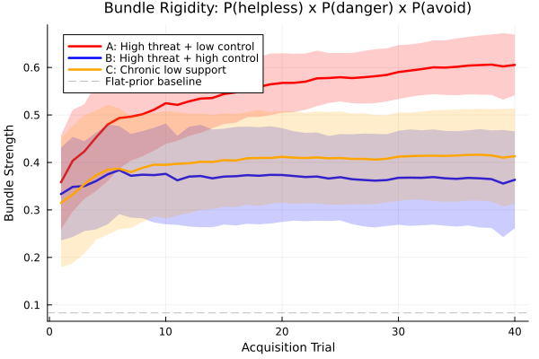

*Figure 1. Bundle rigidity across three formation conditions. High threat with low control produces the strongest consolidation of helpless self-state, danger meaning, and avoidance policy. High control attenuates identity-level consolidation without eliminating threat learning.*

---

## 6. How Parts Persist

Once formed, parts can persist for decades. The present model explains that persistence without assuming literal structural disconnection.

Three mechanisms do the work together.

### 6.1 High prior precision

The part's beliefs were learned under conditions that made them urgent and survival-relevant. They therefore carry high precision. Incoming evidence that contradicts them — *you are an adult now; this dog is friendly; you are not trapped here* — arrives, but carries too little weight to move the posterior much.

### 6.2 Underweighted present context

When the part activates, present-context evidence loses inferential force. The issue is not that context vanishes physically. The issue is that it no longer matters enough computationally. The room is safe, the therapist is present, the body is grown — and yet the active model remains: *I am small, this is dangerous, I must avoid*.

### 6.3 Avoidant sampling

The part's policy priors steer the system away from the very evidence that would weaken the part. Avoidance prevents contradictory experience. The part is therefore not merely strongly believed. It is actively protected from disconfirmation by the policy it itself prefers.

These three mechanisms form a self-sealing loop. High precision discounts contradiction. Low context weighting reduces present correction. Avoidance prevents new evidence from arriving in the first place.

### 6.4 Functional isolation vs. structural isolation

Most persistence is treated here as **functional isolation**. The channels remain available in principle, but they are chronically underweighted. That matters because it generates a useful prediction. Functional isolation admits of slow change under repeated safe contact. Structural isolation predicts little or no change until something like reconnection occurs.

The simulations in this paper instantiate functional isolation. That is one reason exposure still produces some revision in the model: repeated safe contact can gradually move threat meaning even when Self-energy is not raised into the witnessing regime. If future work encounters cases where matched safe contact produces essentially zero updating over long horizons, more structural accounts will become more plausible for those presentations.

---

## 7. Self and Self-Energy

IFS gives Self a special status. This paper keeps that centrality while translating it into computationally tractable terms.

### 7.1 Self as regime

Self is not modeled here as a homunculus. It is a regime of uncaptured inference.

When no part dominates, inference remains responsive across channels. Present evidence can register. Multiple action possibilities remain available. The system is not being run by one compressed local model. That is the formal content of Self in the present account.

This regime-based translation explains why Self appears when parts stop taking over. It does not yet fully explain why Self has the positive phenomenology it does — calm, curiosity, compassion, clarity. The working interpretation here is that these qualities are the signature of sufficiently uncaptured inference under the right embodied conditions, not something the model has fully derived.

### 7.2 Self-energy as composite

Self-energy is the paper's answer to its central question. It is what determines whether activation becomes capture or can be held in context.

Theoretically, Self-energy is composite. At minimum it includes two components:

- **Autonomic-social regulation (`V_t`)**: ventral-vagal availability, embodied safety, the capacity to remain in contact without survival mode taking over.
- **Metacognitive depth (`M_t`)**: the capacity to represent one's own state as state rather than identity; to know *a part of me is afraid* instead of only *I am afraid*.

Neither component is sufficient on its own. A person can be somatically calm and still have no witnessing capacity. A person can describe their parts with elegant insight while their body remains in full sympathetic threat. Self-energy is high when both are available together.

In the simulations, `E_t` is a scalar proxy for this composite. That is a deliberate simplification. The immediate question is whether changes in the relation to activation are sufficient to alter revision trajectories. Answering that does not require a full decomposition of `E_t`, though later work probably will.

### 7.3 Relational scaffolding

Clinically, Self-energy is often not endogenous at first. It is scaffolded. The therapist's regulated presence, pacing, and stance supply part of what the client cannot yet stably generate alone. The simulations include this only minimally through an external support term. The model is intra-agent by design. Therapy is not.

### 7.4 Self-led calm vs. dissociative quiet

The paper distinguishes two superficially similar states that are clinically opposite.

**Self-led calm** keeps present evidence strongly online. The system is quiet because nothing has captured it. If something important changed, the system would register it.

**Dissociative quiet** reduces the impact of incoming evidence. The system is quiet because contact has been turned down. It may look calm. It is not the same regime.

The control simulations make this distinction visible. Dissociation reduces apparent disturbance but produces little upstream revision. Witnessing, by contrast, preserves contact and changes the priors that organized the original disturbance.

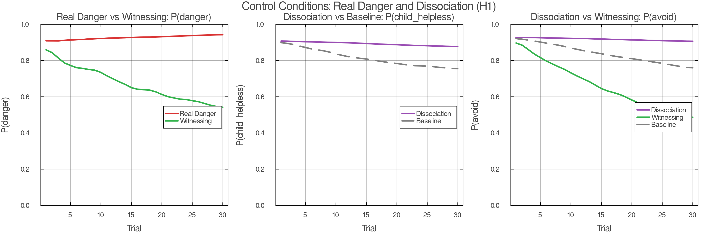

*Figure 2. Control conditions. The real danger condition preserves adaptive fear under high Self-energy. The dissociation condition reduces disturbance without revising upstream priors — distinguishing it from genuine witnessing. The key discriminator is whether present-context evidence remains online.*

### 7.5 The 8 C's and self-like parts

The 8 C's of Self — calm, curiosity, clarity, compassion, confidence, courage, creativity, connectedness — can be read here as the phenomenological signature of uncaptured inference under sufficiently high Self-energy. That interpretation is respectful and minimal. It honors the clinical observation without claiming to derive all eight qualities from first principles.

The hardest test case is the self-like part: a manager that sounds reflective, calm, and compassionate without actually producing the inferential regime in which revision can occur. The model flags that problem but does not solve it. A better account will have to separate embodied regulation from reportable meta-awareness more sharply than a single scalar allows.

---

## 8. Blending and Witnessing

Same activation, different relationship. That is the paper's center of gravity.

### 8.1 Blending

Blending occurs when an activated part captures inference. The part's self-state, world-state, policy, and expected-outcome priors dominate the posterior strongly enough that present context loses inferential force. The person does not merely have fear. The fear organizes the whole field.

Formally, blending corresponds to a high **capture index**:

\[
C_t = \frac{\pi^{\mathrm{eff}}_{\mathrm{part}}}{\pi^{\mathrm{eff}}_{\mathrm{part}} + \lambda^{\mathrm{eff}}_{\mathrm{ctx}}}
\]

where

\[
\pi^{\mathrm{eff}}_{\mathrm{part}} = r_t \cdot \pi_{\mathrm{part}} \cdot e^{-\beta E_t}
\]

and

\[
\lambda^{\mathrm{eff}}_{\mathrm{ctx}} = \lambda_{\mathrm{ctx}} \cdot e^{+\gamma E_t}
\]

Here `r_t` is activation strength. Self-energy does not have to turn activation off. It changes how much that activation can dominate.

Blending is graded, not binary. What varies is how much of the active model becomes system-wide capture. Mild blending preserves some dual awareness. Strong blending turns the part's beliefs into the only available reality model.

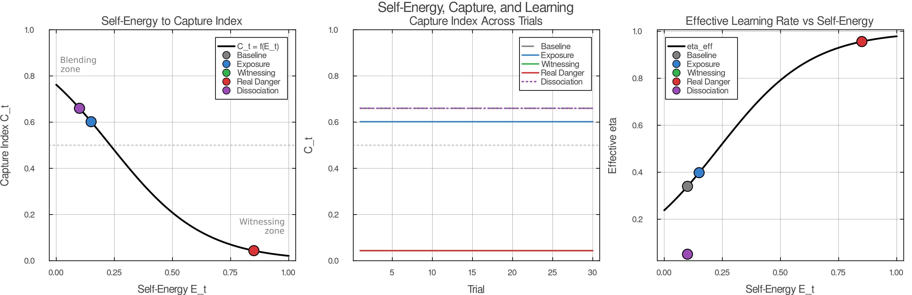

*Figure 3. Capture index as a function of Self-energy. Low Self-energy places baseline, exposure, and dissociation in the blending zone. High Self-energy places witnessing in the context-held regime. Capture is best read as a regime descriptor determined by the condition-level Self-energy parameter.*

### 8.2 Witnessing

Witnessing is not the absence of activation. It is activation held in context.

The part still fires. The body may still accelerate. The old priors still come online. But present evidence stays online too: *I am in this room; I am with this therapist; this body is adult; this moment is not the original one.* The activated part becomes something the system can relate to rather than only speak from.

That is why witnessing is formally distinct from distraction, suppression, or dissociation. Distraction lowers activation. Dissociation lowers context impact. Witnessing leaves activation live while preventing capture.

### 8.3 The therapeutic zone

The simplest way to picture the model is a 2x2 crossing part activation and Self-energy.

|  | Low Self-energy | High Self-energy |
|---|---|---|
| **Low activation** | ordinary cognition | presence / Self |
| **High activation** | blending | witnessing |

IFS therapy aims for the lower-right cell. That is difficult because the cell is unstable by default. Activation tends to lower Self-energy. High Self-energy tends to prevent full activation. Therapy therefore works by titrating both at once: enough activation for the target priors to come online, enough Self-energy for context to remain present.

### 8.4 The clinical probe

Clinicians do not ask for the capture index. They ask, "How do you feel toward this part?"

That question is a phenomenological assay of inferential regime. If the client answers from the part — *I am terrified; I hate this; I need to get away* — the system is still captured by one bundle or another. If the client answers with curiosity, compassion, calm interest, or respectful distance, the system is more likely witnessing. The question does not measure activation. It measures relationship to activation. That is exactly what the model says matters.

---

## 9. Why Only Witnessing Permits Lasting Change

This section states the paper's main therapeutic claim.

Durable revision requires three conditions at once:

1. **The part must be active.** Otherwise the target priors are dormant.
2. **Present context must be online.** Otherwise there is nothing to revise the priors with.
3. **The part must not capture inference.** Otherwise the mismatch between past model and present reality cannot register with enough force.

Witnessing is the only regime that satisfies all three simultaneously.

### 9.1 Why blending fails

Under blending, the part's priors dominate too strongly for present contradiction to gain traction. The system may be surrounded by safety and still infer danger because the active model interprets everything through its own lens. The result is repetition without revision. The part can activate thousands of times and remain essentially unchanged because every activation happens inside the same local world.

### 9.2 Why calm without activation fails

Calm by itself is not enough. A person can be regulated, insightful, and articulate while the relevant bundle remains offline. In that case nothing is live to revise. This is one reason understanding alone often changes so little. Dormant priors do not update because they are not currently generating predictions that can be contradicted.

### 9.3 Unburdening as upstream revision

At the algorithmic level, the paper interprets unburdening as durable revision of upstream priors. In H1, self-state sits upstream of threat meaning, which sits upstream of protective policy. A revision in self-state — from *I am helpless here* to *I am capable here* — changes what counts as dangerous. A change in threat meaning changes what policies remain necessary.

This gives a formal answer to a familiar clinical observation: why does deep change sometimes feel sudden? Because once an upstream prior shifts far enough, several downstream expectations lose support together.

Clinically, unburdening often does more than reduce intensity. A part that carried helplessness may, after unburdening, take on a new functional role — playfulness, healthy assertiveness, creativity. In the present model, that transition corresponds to the bundle adopting new policy priors and expected-outcome priors once the old self-state no longer constrains the solution space. The formal account predicts qualitative regime change, not merely damping.

### 9.4 Exposure versus witnessing

Exposure and witnessing both supply corrective contact under activation. The difference is what variable they manipulate.

In this model, exposure forces contact while leaving Self-energy outside the witnessing regime. Learning therefore occurs, but it occurs more locally. Threat meaning can move. Specific stimulus-safety associations can soften. Self-state can shift somewhat over time, but later, less deeply, and with less generalization.

Witnessing changes the relation in which the same contact occurs. The part remains live, but context now reaches the active priors more directly. Under H1, that allows self-state revision to occur earlier and to cascade forward.

The simulations support exactly that pattern. Under H1 witnessing, self-state crosses the revision threshold first, threat meaning follows, and avoidance lags. Under exposure, all three move more slowly and with much less separation.

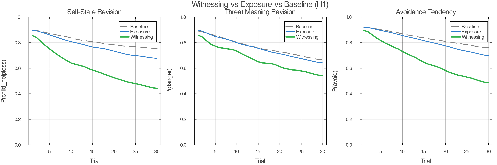

*Figure 4. Witnessing versus exposure under matched contact. Witnessing produces faster and deeper revision across all three target variables. The separation is attributable to inferential regime, not privileged information — the cue structure is identical across conditions.*

---

## 10. Protectors

Protectors are indispensable to clinical IFS. The model treats them minimally, but not dismissively.

A protector is a learned policy prior plus an access-control tendency. It prevents destabilizing takeover. That is already enough to explain why protectors exist. If exile activation has historically led to flooding, collapse, or unbearable pain, then preemptive management is locally rational.

This is the core protector computation in the current model:

- if cue patterns predict that an exile may activate
- and if available Self-energy is judged insufficient
- then favor policies that reduce activation or block access to the exile

That minimal story already captures a great deal: avoidance, intellectualization, perfectionism, numbing, distraction, rage, and dissociation can all function as ways of preventing the wrong kind of contact.

IFS distinguishes **managers** and **firefighters**. The distinction maps cleanly onto temporal depth. Managers act prospectively. They organize life to avoid entering dangerous state-space in the first place. Firefighters act reactively. They minimize acute free energy once danger has already broken through.

What the model does not yet formalize is equally important. Protectors do not merely block. They negotiate. They assess trust. They have conditions under which they will step back. A protector's willingness to relax is not simply a function of reduced threat. It depends on whether the protector believes Self is present enough, the context is safe enough, and the process can be trusted. Computationally, that looks less like a simple policy prior and more like a gate on information flow with a learned trust variable. Those dynamics are clinically central and formally deferred here.

---

## 11. Multi-Part Polarization

Single-part dynamics are not enough to describe actual inner life. One of the most recognizable IFS phenomena is polarization: mutually incompatible parts treating one another's preferred policies as dangerous.

The mechanism is simple. Two bundles are active. Each assigns high cost to the other's preferred action.

- Part A: *approach, disclose, attach*
- Part B: *withdraw, protect, avoid*

Part A experiences withdrawal as abandonment and deadness. Part B experiences approach as exposure and danger. Each therefore escalates in response to the other. This is not merely conflict between simultaneously represented preferences. It is often alternation between rival local realities — each side wholly true when it has the floor, and each experiencing the other's preferred policy as threat.

Under low Self-energy, this produces the familiar phenomenology: ambivalence, reversals, exhaustion, and the feeling that each side is wholly true when it has the floor. Under high Self-energy, both remain simultaneously representable without either taking over. A mixed or negotiated policy becomes possible.

The polarization simulations support this reading. Under low Self-energy, the two activations enter strong anti-phase oscillation. Under high Self-energy, both remain simultaneously representable without either taking over. A mixed or negotiated policy becomes possible.

One nuance is worth stating clearly. The summary metrics show that **medium** Self-energy produces the highest policy entropy and switching, while **high** Self-energy produces the most stable simultaneous representation. That is not a bug. It suggests a transition band. As capture weakens, the system first explores more combinations and switches more often; once both parts can remain stably represented together, switching drops and coexistence rises. That is clinically plausible and theoretically useful.

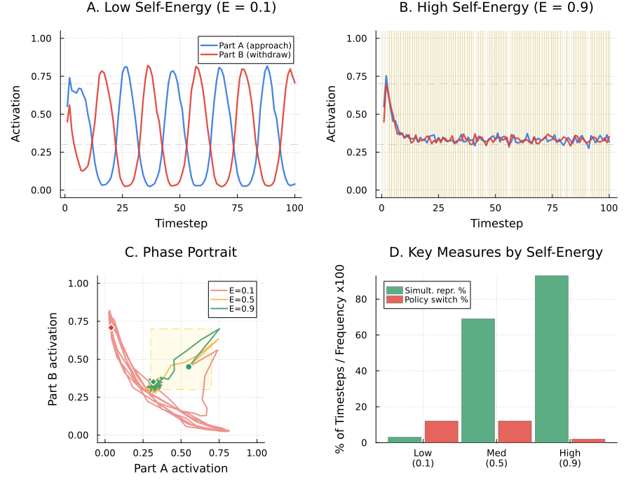

*Figure 5. Polarization dynamics. Low Self-energy produces anti-phase oscillation between rival bundles. Medium Self-energy increases exploration and switching. High Self-energy produces stable simultaneous representation and reduced switching — the transition from capture to coexistence.*

---

## 12. Simulation Design

The simulations are designed to test the paper's central claim in the leanest case: same part, same cue channels, same architecture, different inferential regime.

### 12.1 Main model

The main simulation compares five conditions:

1. **Baseline** — safe world, low Self-energy, free policy selection
2. **Exposure** — same safe world and cue structure, forced contact, Self-energy not elevated into the witnessing regime
3. **Witnessing** — same contact as exposure, but with Self-energy elevated
4. **Real danger control** — dangerous world under high Self-energy
5. **Dissociation control** — safe world, low Self-energy, context impact reduced rather than genuinely maintained

The part bundle begins with strong priors on child-helpless self-state, danger meaning, and avoidance policy. The key comparison matches contact across exposure and witnessing so that differences in updating are attributable to inferential regime rather than privileged information.

### 12.2 H1 versus H2

The simulation compares two causal architectures.

- **H1: self-state upstream.** Present-context support informs self-state strongly; self-state conditions threat meaning; threat meaning conditions policy.
- **H2: threat-primary.** Threat meaning is revised first; self-state follows.

This is not an arbitrary graph choice. H1 is motivated by the clinical observation that parts often activate first as *who I am here* — *I am six; I am small; I am powerless* — and that deep therapeutic change is frequently experienced as a change in identity-position before the world itself fully changes meaning. H2 remains a live competitor because many fear-learning models are threat-primary. The point of the comparison is precisely to test which ordering better fits the simulated dynamics.

### 12.3 Formation and polarization appendices

Appendix A simulates part formation under three acquisition environments: high threat plus low control, high threat plus high control, and chronic low support. Appendix B simulates polarization between two mutually threatening bundles under varying levels of Self-energy.

---

## 13. Results

The simulations support the core architecture of the paper.

### 13.1 Same activation, different relationship

The first result is the simplest and the most important. Under matched cue exposure, raising Self-energy changes the regime in which activation occurs. Witnessing is not lower activation by another name. It is the same activation held in a different relation.

In the H1 main simulation, the witnessing condition shows markedly faster and deeper revision than exposure or baseline across all three target variables. By the end of the run, witnessing reduces helpless self-state, danger meaning, and avoidance far more than exposure does, while baseline remains comparatively rigid. The separation is clear and consistent with the theory.

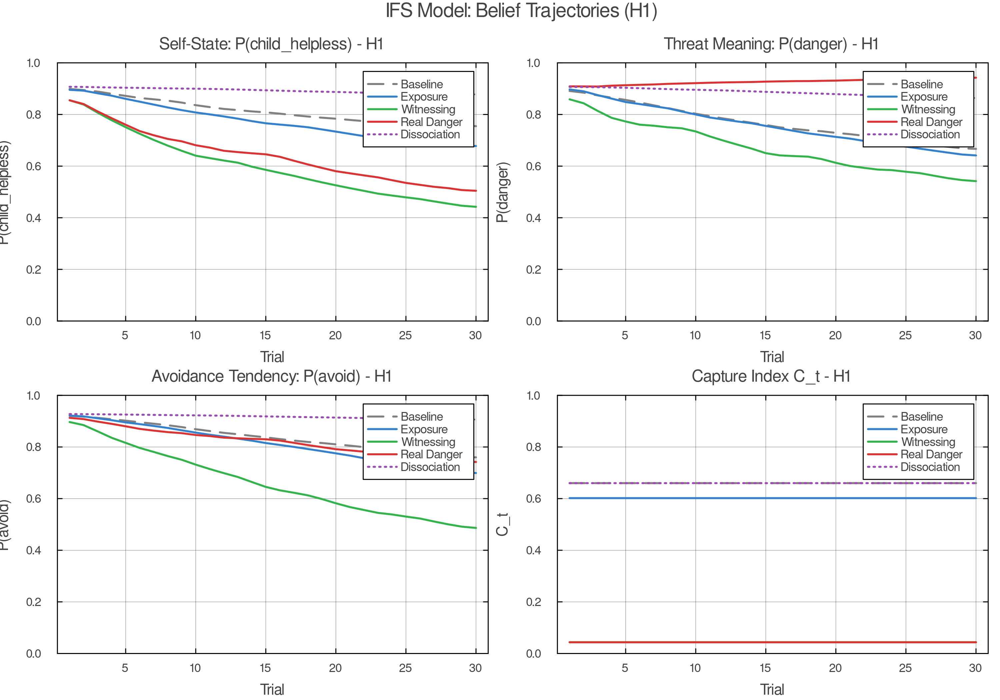

*Figure 6. H1 belief trajectories. Witnessing (green) produces the deepest revision across self-state, threat meaning, and avoidance. Exposure (blue) learns but more slowly and uniformly. Baseline (grey) shows minimal movement. The separation is attributable to inferential regime under matched contact.*

### 13.2 H1 produces the predicted revision order

Under H1 witnessing, self-state revises first. The child-helpless prior crosses the chosen threshold at trial 9. Threat meaning follows at trial 13. Avoidance declines last and only later approaches the same threshold. This is the exact ordering the model predicts if self-state is upstream of threat meaning and threat meaning is upstream of policy.

The exposure condition does not show that ordering clearly. All three trajectories move together more slowly. The system learns, but it learns locally and without the same cascade.

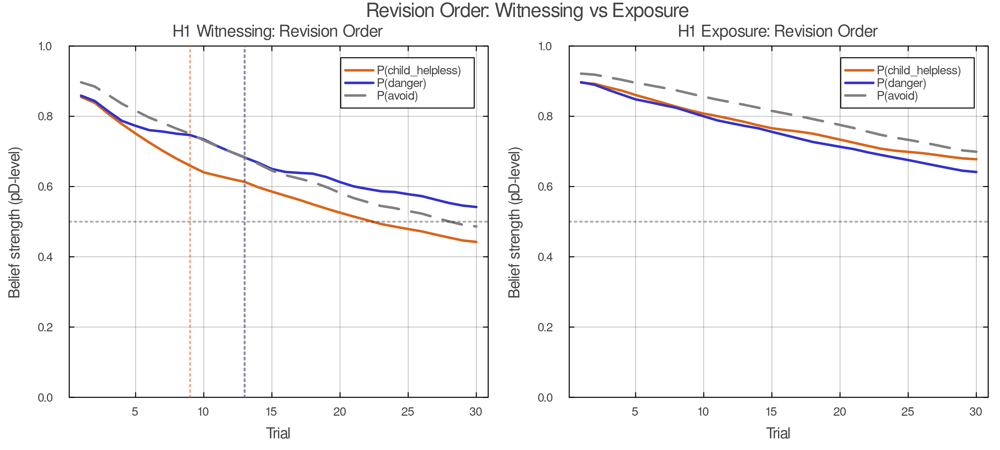

*Figure 7. Revision order comparison. H1 witnessing produces the predicted cascade: self-state first, threat meaning second, avoidance last. H2 reverses the order, with threat meaning leading. The ordering difference is the paper's main model comparison.*

### 13.3 H2 flips the order

The H1/H2 comparison comes out in the right place. Under H2, danger meaning moves earlier and self-state lags. That is the opposite of the IFS-consistent prediction. The bar summary of threshold crossings makes the contrast legible: H1 gives **child first, danger second**; H2 gives **danger first, child later**. This is the paper's main model comparison.

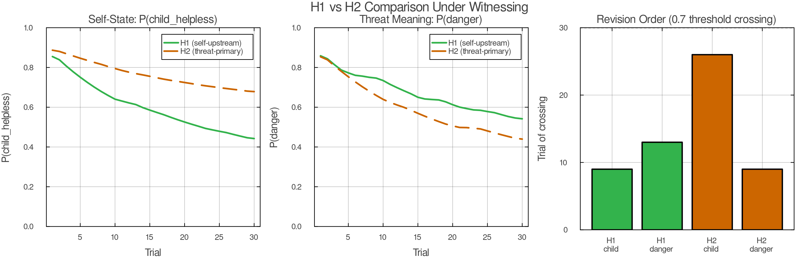

*Figure 8. H1 versus H2 under witnessing. The two architectures produce different revision cascades. H1 revises self-state upstream, consistent with IFS clinical observation. H2 revises threat meaning first, consistent with threat-primary fear-learning models.*

### 13.4 Witnessing outperforms exposure without changing the task

The witnessing versus exposure comparison is one of the paper's strongest results because the task is matched. The system sees the same kinds of cues and undergoes the same kind of contact. The difference is inferential regime, not information. Witnessing therefore does not win by being handed a privileged channel. It wins because Self-energy changes the precision balance between the active bundle and present context.

### 13.5 Real danger preserves adaptive fear

The real danger control does exactly what it needs to do. Under genuine danger, the model does not collapse into indiscriminate calm. Threat meaning remains high even under high Self-energy. This is a sanity check and a theoretical constraint. Self-energy does not abolish fear. It preserves the possibility of accurate fear.

One nuance deserves explicit interpretation. In the real-danger condition, threat meaning remains high while helpless self-state still softens relative to its initial value. This is not incoherent. The system can learn *this is dangerous* without also learning *therefore I am a child and helpless*. That distinction is clinically welcome. Mature fear does not require regressive identity.

### 13.6 Dissociation is not witnessing

The dissociation control is equally important. It reduces disturbance without producing the same revision profile as witnessing. Self-state barely moves. Avoidance remains high. The system is quieter, but the old priors remain largely intact.

That is exactly the distinction the paper needs. Calm is not enough. What matters is whether context stays online or is functionally turned down.

### 13.7 Capture is a regime parameter in the current simulations

The capture index figure shows the mapping from Self-energy to capture clearly. Low Self-energy places baseline, exposure, and dissociation in the blending zone; high Self-energy places witnessing in the context-held regime. In the current implementation, capture is set by the condition-level Self-energy parameter, which is why it remains constant across trials within a given condition. In this implementation, capture is best read as a **regime descriptor** rather than a learning-dependent time series.

### 13.8 Formation depends strongly on low control

The formation appendix supports the threat-plus-low-control claim. High threat with low control produces the strongest final bundle rigidity. Chronic low support produces an intermediate profile. High threat with high control produces substantially weaker helpless self-state consolidation.

**Control chiefly gates whether threat learning hardens into identity-level bundle rigidity.** Threat meaning and avoidance rise across conditions, but low control most strongly sharpens the helpless self-state and the integrated bundle measure. High-control threat still produces learning, but much less identity-level consolidation.

### 13.9 Polarization is mutual threat plus capture

The polarization appendix also behaves well. Low Self-energy produces the expected oscillatory alternation between the two bundles. High Self-energy produces prolonged simultaneous representation and sharp reductions in policy switching. Medium Self-energy increases entropy and switching before the system settles into stable coexistence. Read clinically, the model suggests a transition from capture, to exploration, to negotiation.

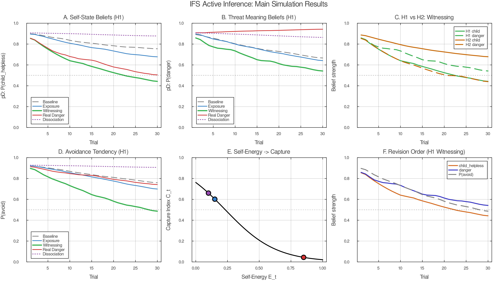

*Figure 9. Main simulation summary. Final belief states across all five conditions for self-state, threat meaning, and avoidance. Witnessing produces the deepest revision. Exposure produces intermediate revision. Baseline and dissociation leave priors largely intact. Real danger preserves adaptive threat meaning.*

---

## 14. Discussion

The paper set out to answer a narrow but clinically important question: when a part activates, what determines whether it takes over or can be held in context, and why does only the latter permit lasting change?

The answer proposed here is structural. Self-energy governs the precision balance between active part priors and present-context evidence. That balance determines inferential regime. Under blending, the part captures the field. Under witnessing, the same part remains active while context stays online. That difference is enough to explain why some activations merely repeat a prior and others revise it.

### 14.1 What the model explains

The account explains five things without too much machinery.

First, it explains why parts feel like whole worlds rather than isolated beliefs. The bundle structure couples self-state, world-state, policy, and outcome.

Second, it explains why activation alone is not therapeutic. Without context, activation repeats. Without activation, context cannot reach the dormant prior. Witnessing uniquely provides both.

Third, it explains why IFS-like change often feels upstream and generalizing. Under H1, revising self-state changes what counts as dangerous, which then changes what protectors need to do.

Fourth, it distinguishes Self-led calm from dissociative quiet. Both may look regulated. Only one preserves contact.

Fifth, it shows why this still counts as an IFS model despite being minimal. What makes the model specifically IFS is not plurality alone. It is the claim that the decisive therapeutic variable is the Self-mediated relation to activated part-content.

### 14.2 What it does not yet explain

The paper also leaves several clinically important structures under-modeled.

It does not yet formalize full protector negotiation. Protectors in clinical IFS do not merely block — they compute trust, grant permission, and have conditions under which they will step back. The current model captures the blocking function but not the relational intelligence that makes IFS's protector work distinctive. It does not distinguish genuine Self from self-like managerial imitation — a distinction that probably requires separating embodied regulation from reportable meta-awareness more sharply than a single scalar allows. It does not model the therapist as a second agent, even though the clinical process is often dyadic long before it becomes stably intra-psychic. And it does not yet scale from one activated bundle or one polarity pair to a full inner parliament.

These are real absences. They are also the right absences for a first model. The ambition here is not comprehensiveness. It is to get the core mechanism right before expanding the frame.

### 14.3 Implications for therapy comparison

The strongest comparative implication concerns exposure. The paper does not claim that exposure fails. The simulations show the opposite: exposure learns. What they show is that exposure and witnessing learn differently.

Exposure alters threat expectations under contact. Witnessing alters the relation in which that contact occurs. If self-state truly sits upstream, then witnessing should revise a broader class of downstream appraisals. That is the paper's clearest comparative claim and probably its cleanest empirical target.

### 14.4 Next steps

The next extensions are now obvious.

1. **Dyadic regulation:** model therapist and client as interacting agents rather than hiding co-regulation inside one scalar support term.
2. **Self-like parts:** separate autonomic regulation from meta-awareness and test which combinations produce revision versus pseudo-witnessing.
3. **Richer protector computation:** formalize trust, conditional permission, and role transformation.
4. **Multi-part networks:** move from one polarity pair to several coupled bundles with different developmental ages and policies.
5. **Empirical fitting:** align simulated trajectory measures with session-level data, especially revision order and generalization gradients.

This paper does not finish the job. It builds the first floor. That is enough, at least for now, if the floor holds.

---

## Appendix A. Formation Simulation

The formation simulation asks a simple question: can part-like bundle rigidity arise through precision-weighted learning alone, without assuming literal graph surgery?

The answer from the current simulation is yes, with one important refinement. All three acquisition environments produce some learning, but not the same kind of learning.

- **High threat + low control** produces the strongest helpless self-state consolidation and the highest integrated bundle rigidity.
- **High threat + high control** produces strong danger learning but much weaker helpless self-state consolidation.
- **Chronic low support** produces an intermediate, slower-forming profile.

This pattern supports the formation account. The critical ingredient is not fear in isolation. It is fear under insufficient control or co-regulation. The readout in a safe context makes that visible: the low-control condition carries the strongest residual bundle into safety.

**Low control converts threat learning into identity-weighted part formation.**

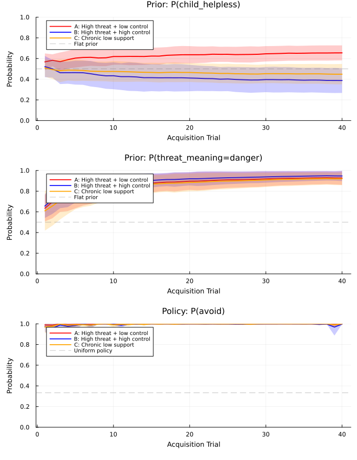

*Figure A1. Acquisition trajectories across three formation conditions. High threat with low control produces the strongest and fastest consolidation of the full bundle (self-state, threat meaning, avoidance).*

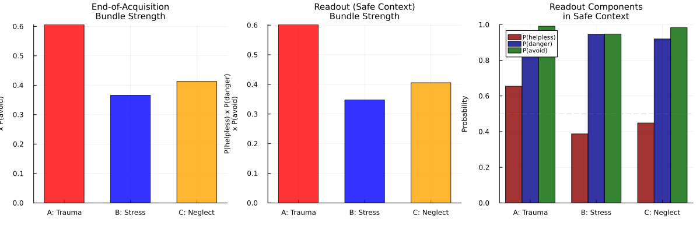

*Figure A2. Controllability gradient. As perceived control increases, helpless self-state consolidation weakens sharply while threat learning persists — supporting the claim that control gates identity-level bundle formation.*

---

## Appendix B. Polarization Simulation

The polarization simulation introduces two mutually threatening bundles:

- Part A: approach, disclose, attach
- Part B: withdraw, protect, avoid

Under low Self-energy, the activations alternate in anti-phase. Each bundle becomes locally true when active and intolerable when not. Under high Self-energy, both remain representable together and a mixed policy becomes possible.

The summary metrics suggest a three-regime picture:

- **Low Self-energy:** mutual takeover and narrow policy dominance
- **Medium Self-energy:** exploration band with high entropy and switching
- **High Self-energy:** stable simultaneous representation and reduced switching

That middle band is theoretically useful. It suggests that de-polarization may not look like immediate calm. It may first look like more simultaneous representability, more policy experimentation, and only later like stable negotiation.

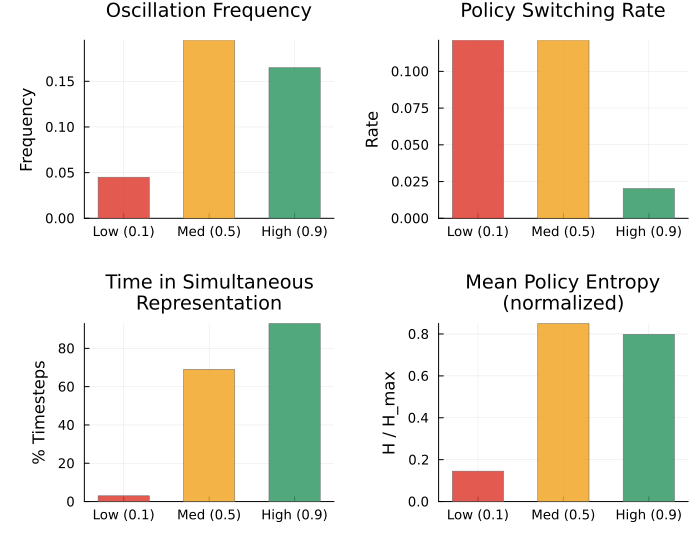

*Figure B1. Polarization summary across Self-energy levels. Low Self-energy produces anti-phase oscillation. Medium Self-energy increases policy entropy and switching. High Self-energy produces the most stable co-representation with the least switching — suggesting a three-regime transition from capture through exploration to negotiation.*

---
