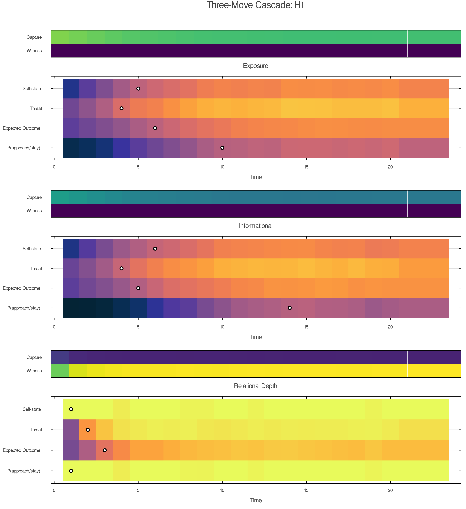
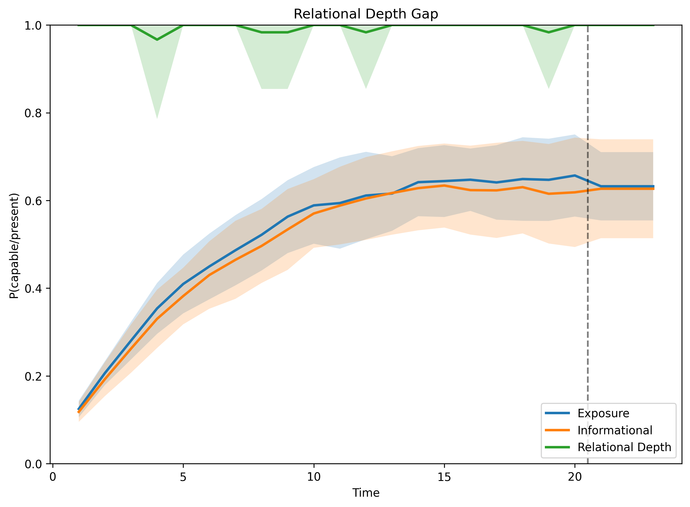
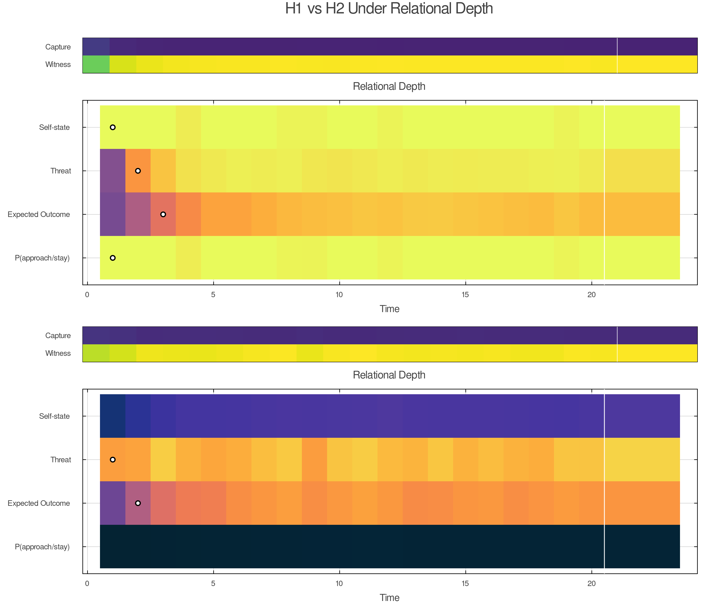
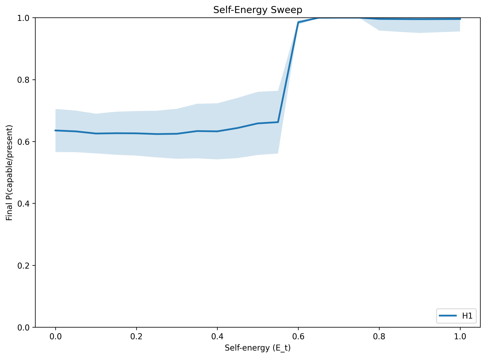
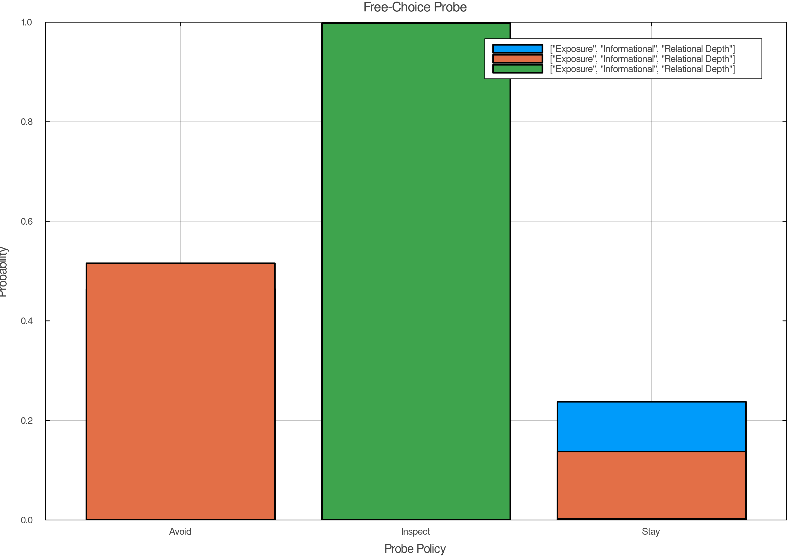
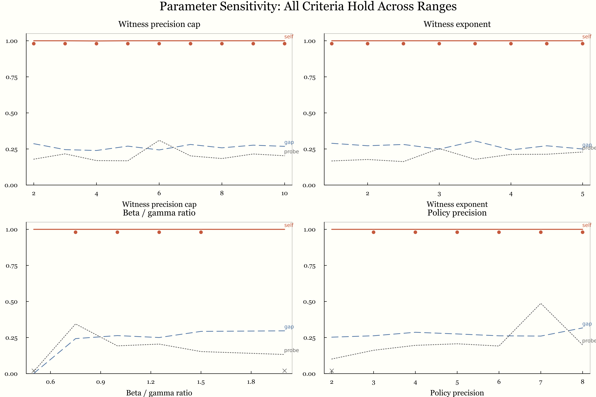
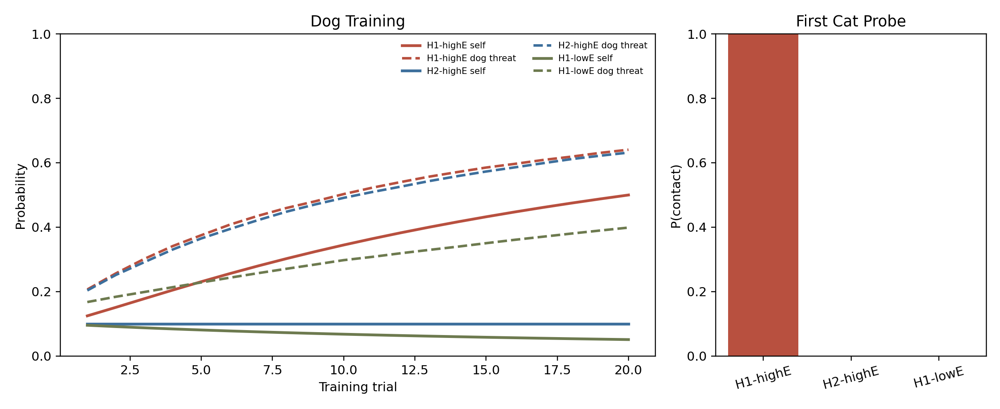
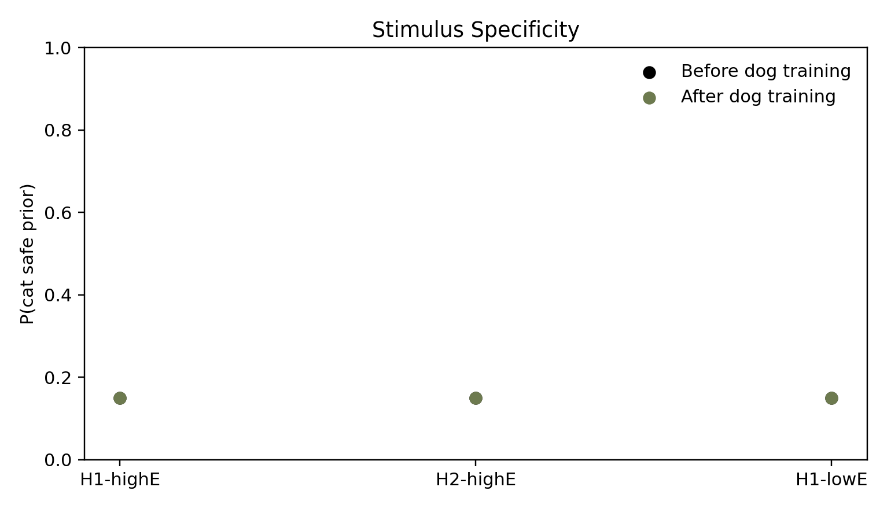
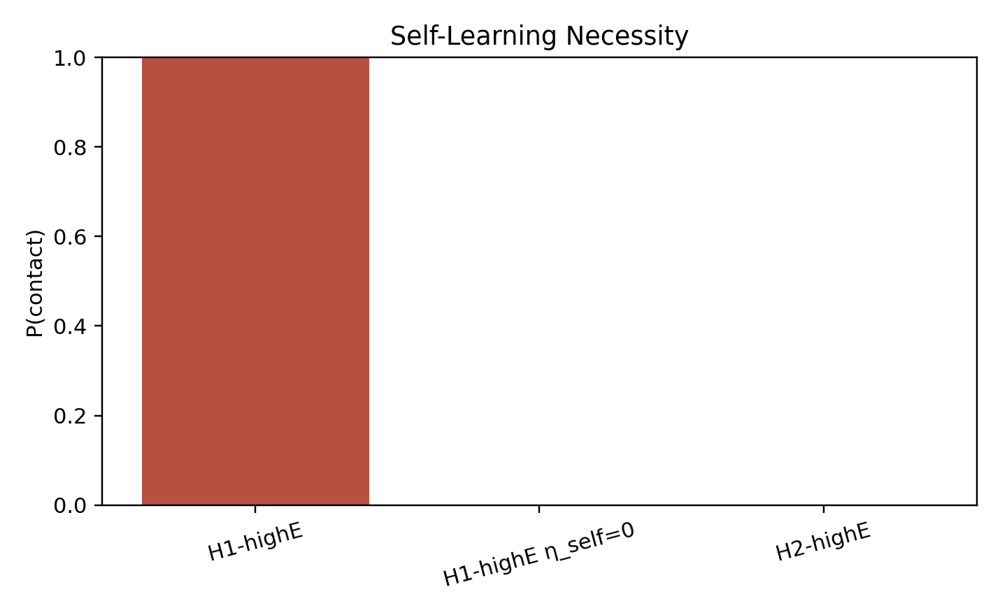
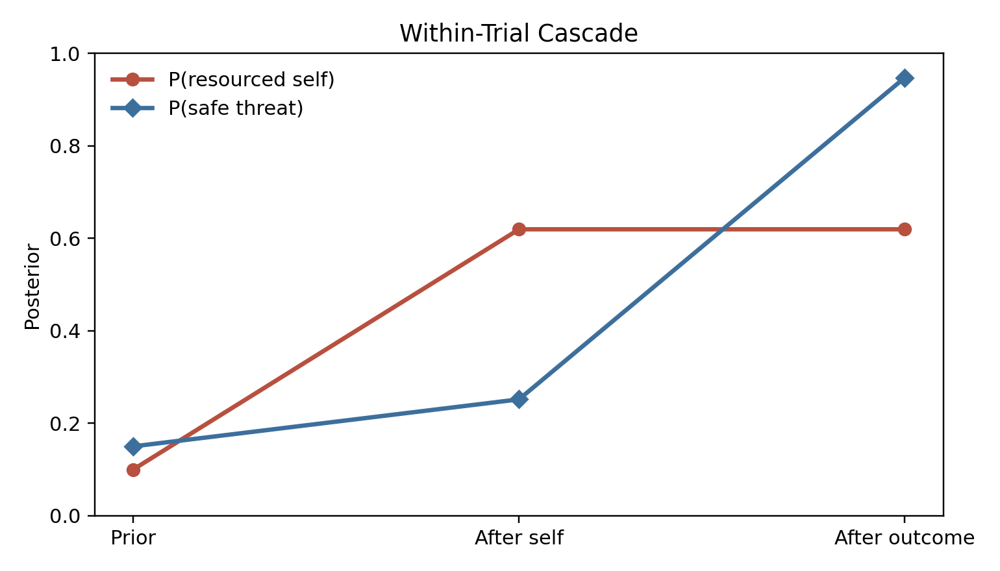

# Self-Energy, Witnessing, and the Revision of Part Beliefs
## An Active Inference Account of Internal Family Systems

## Abstract

Internal Family Systems is a powerful and widely adopted multiplicity-of-mind framework in clinical practice: it proposes that the mind contains distinct subpersonalities — *parts* — and that the quality of one's inner life depends on whether those parts are in the driver's seat or can be held in awareness from a stable center. Despite its clinical reach, IFS has lacked a formal computational account of what a part actually is. We propose that parts are identity-level precision bundles — coupled priors over self-state, world-state, policy, and expected outcome, with self-state as the organizing prior. This structure predicts a revision cascade unavailable to simpler accounts: interventions that reach self-state generalize to downstream threat meaning and protective policy; interventions that stay at the threat level do not. Active inference simulations confirm the ordering: under context-held activation (witnessing), self-state is revised first, threat meaning follows, protective policy lags; under matched exposure, all three move more uniformly and the cascade does not appear. The formal distinction between *capture* and *context-held activation* explains why only the latter permits lasting change. Inside the context-held window, the activated part encounters Self's present-moment self-state — generating relational prediction error that reaches the identity-level organizing prior directly, not merely the threat expectation. The model positions Self-energy and the relational prediction error it enables as tractable targets for empirical comparison of IFS with exposure-based approaches.

---

## 1. Introduction

Sometimes *I am afraid.* Sometimes *a part of me is afraid.* Same activation, different relationship.

Consider a simple case. A person who was badly frightened by a dog as a child sees an off-leash dog running toward them in a park. Their chest tightens. Their body pulls back. One organization of the system becomes certain all at once: *dogs are dangerous; I am small; get away now.* In ordinary fear-learning language, that looks like a threat response. But existing active inference accounts of fear do not have a formal account of why this activation feels like *identity* rather than one belief among many, or why some activations revise while others merely repeat. A threat response is a belief about danger. What IFS describes is something more specific: a coupled bundle in which *who I am* is not separable from *what this means* and *what I must do*. Formalizing that distinction is the first task of this paper.

IFS describes the dog case in more specific terms. A *burdened part* — a subpersonality carrying old fear and its associated identity claims — is active. *Protectors*, other parts whose job is to prevent destabilizing activation, are organizing around it. The central question is whether the person is now *captured* by the part (speaking as it, from inside its local world) or can relate to it from a different vantage point — what IFS calls Self (the state in which no part dominates and the person can hold what is active with curiosity and care).

That distinction is ordinary in IFS practice and underdescribed in most formal accounts. If the activation takes over, the fear is not experienced as one perspective among others; it becomes reality. The dog is dangerous now. The body is small now. Avoidance feels necessary now. If the same activation remains present while also being held in awareness, the fear is still there, but the system is no longer speaking only from inside the part. The person can relate to it.

IFS treats that relational difference as load-bearing. The therapist does not simply increase contact with the dog, the memory, or the feared affect. The therapist helps the client step back from the activated part, approach it from Self, and remain in relationship to it long enough for something new to happen. That is why the method keeps returning to questions like: *How do you feel toward this part?* *What does it fear would happen if it stopped?* *Will it let you get closer?* The intervention is not organized around activation alone. It is organized around who is relating to whom inside the system.

The claim of this paper is direct. The decisive therapeutic variable is not activation alone. It is the relation of the system to activated part-content. We propose that this relation is formalizable, tractable, and clinically consequential. The governing variable in the present account is **Self-energy**.

This paper is not arguing that IFS replaces exposure, schema work, or other evidence-based approaches. The claim is narrower. Different therapies alter different inferential variables. Exposure changes what the system learns under contact with feared stimuli. IFS, at its core, changes whether the activated part takes over or can be held in context. Before translating that claim into active inference, it helps to state the clinical picture in IFS's own terms.

The rest of the paper is straightforward. Section 2 explains the phenomenon in IFS language and introduces a translation between clinical and computational vocabularies. Section 3 defines the formal object — parts as identity-level precision bundles — and introduces the active inference machinery the argument needs. Sections 4–5 show how parts form and how they persist. Section 6 introduces Self-energy and the inferential regimes it governs. Sections 7–8 formalize capture, context-held activation, and why only this combination permits lasting change. Section 9 identifies the relational prediction error that operates inside the context-held window. Section 10 extends the framework to protectors and polarization. Sections 11–12 present the simulation design and results. Section 13 closes with what the model explains, where it is still thin, and what should come next.

---

## 2. IFS in Its Own Terms

IFS begins from a simple claim: the mind is multiple, and that multiplicity is organized. People have parts. Some parts carry terror, shame, grief, helplessness, or loneliness. These are often called *exiles* because the system keeps them out of ordinary consciousness when their pain would be too much. Other parts work to prevent that activation. These are *protectors*. Some are *managers*: they anticipate trouble, control situations, avoid risk, and keep life organized so the exile does not break through. Others are *firefighters*: they react after activation has already begun and try to shut it down fast, often through dissociation, numbing, rage, or impulsive action.

IFS also posits **Self**. Self is not another part with better ideas. It is the state in which the person is not captured by any one part and can relate with curiosity, calm, compassion, and clarity. In practice, therapists use Self as both a diagnostic and a therapeutic reality. If the client can feel warmth, respect, or curiosity toward an activated part, there is enough Self-energy in the system to proceed. If the client says *I hate this scared part* or *I need it gone*, the therapist assumes another protector is now blended and works there first.

The dog example makes the structure concrete. A child is bitten, cornered, or badly frightened by a dog. An exile comes to carry terror and helplessness. A manager learns to scan sidewalks, cross the street, and keep distance before the fear surges. If a dog gets too close anyway, a firefighter may take over with panic, collapse, dissociation, or an urgent need to flee. From the inside, the episode does not feel like a neutral memory being retrieved. It feels immediate: *this dog is dangerous; I am small; I have to get away*.

In IFS, the therapeutic question is therefore not just whether the fear has been activated. It is whether the person is **captured** by the part or can become unblended enough to relate to it. Capture means the part is speaking as the whole person. Stepping back from capture means the person can speak *for* the part rather than only *from* it. The linguistic difference is small. The experiential difference is large:

- *I am terrified of dogs. I need to leave.*
- *A young part of me is terrified of dogs. I can feel how sure it is that we are in danger.*

Those are not interchangeable descriptions. In the first, the part has the microphone. In the second, the part is still fully present, but there is now a witnessing relationship to it.

That is why the classic IFS question, *How do you feel toward this part?*, is so diagnostic. It does not ask how intense the fear is. It asks who is relating to the fear. If curiosity is available, Self is present. If contempt, urgency, or shutdown are present, another part is likely blended. The question does not measure activation. It measures relationship to activation. That is exactly what the model says matters.

On this view, lasting change requires more than repeated exposure to a feared stimulus. The part has to be approached from Self, its burden has to become explicit, and the system has to learn that the old danger model is no longer the only available reality. That is the clinical phenomenon the present paper aims to formalize.

Table 1 states the translation between IFS and computational vocabularies for the six terms used most heavily in the paper. A full glossary appears in Appendix C.

| IFS term | Computational translation |
|---|---|
| **Parts** | Identity-level precision bundles: learned local models coupling self-state, world-state, policy, and expected outcome |
| **Blending** | Clinical name for capture: the active bundle dominates inference; present context loses inferential weight |
| **Witnessing** | Context-held activation: the same bundle remains live while present evidence — including Self's present-moment self-state — stays online, enabling relational prediction error (§9) |
| **Self** | A regime of uncaptured inference; when this regime obtains, the system's present-moment self-state becomes available as a differentiated presence that parts can register |
| **Self-energy** | The governing variable for which regime obtains; a composite of autonomic safety and metacognitive depth |
| **Protectors** | Policy priors and access-control tendencies that prevent destabilizing activation of exiles |
| **Unburdening** | Durable revision of upstream priors under context-held activation |

---

## 3. Parts as Identity-Level Precision Bundles

In the present model, a part is a local control model. It is a bundle of priors that learned together and now reactivate together. Throughout this paper, "parts" is the clinical term, "identity-level precision bundle" is the formal definition, and "local control model" describes the computational role the bundle plays.

The bundle has four elements:

1. **Self-state** — who I am here
2. **World-state** — what kind of situation this is
3. **Policy** — what I must do
4. **Expected outcome** — what will happen if I do or do not

<!-- KEEP: This mapping to object relations is load-bearing for the paper's claim that parts are identity-level bundles, not merely fear associations. Do not cut. -->
This bundle structure has an independent precedent in object relations theory, where a complete object relation is composed of a self-image, an object-image, a cause-image, and an effect-image. The computational bundle and the object-relational structure are tracking the same thing at different levels of description. That convergence is not coincidental: both are trying to name the minimal representational unit of an agent in a situation.

**What makes this an identity-level bundle — discriminant validity.** This structure may look like a relabeling, but it predicts things that nearby constructs cannot. *Schemas* can update without re-entering the identity position that organized them. *Latent contexts* select which model is operative, not who the agent is within it — a context switch says "now use model B"; a part activation says "now I am the self that model B was organized around." *Trait priors* are slowly-updated meta-parameters, not identity states coupled to world-meaning and policy in a single unit. Three things follow that none predict: (a) parts feel like whole worlds, because all four elements arrive together; (b) identity-level change generalizes while threat-level change stays local; (c) activation feels like regression to an earlier self-position, not recall of a fear memory.

A part is not a fear memory. It is an identity-level precision bundle in which self-state is the organizing prior — and revision that reaches the root generalizes in ways that revision of threat meaning alone cannot. Because self-state is the organizing prior, it is also where relational contact can do what threat-level intervention cannot — a point §9 takes up in detail.

Return to the dog case. A child is attacked by a dog. Under overwhelm and low control, one bundle may consolidate around the following priors:

- **Self-state:** I am small and helpless
- **World-state:** dogs are dangerous
- **Policy:** avoid, freeze, get away
- **Expected outcome:** avoidance keeps me safe

That is more than a fear memory. It is a local solution to a world once experienced as both threatening and unmanageable. It contains an identity claim, a world claim, an action imperative, and a prediction about consequences.

This is why activated parts feel coherent. They are coherent. The bundle does not deliver one isolated belief. It delivers a whole local world. Helplessness makes danger more likely. Danger licenses avoidance. Avoidance confirms the original reading. The system is not merely remembering the past. It is re-entering a learned inferential regime.

This is also why activation tends to feel like identity rather than object. When the bundle's precision dominates inference, there is no vantage point outside it from which to observe it. The system does not report, "a bundle with helpless self-state is active." It reports, "I am afraid," "I am six," "I can't handle this," or "I need to get out."

The model defines the smallest computational unit capable of reproducing that phenomenology. It does not settle every ontological question inside clinical IFS. A clinician may meet an exile and a protector as distinct parts with distinct voices and histories. The formal claim here is narrower: the smallest load-bearing structure is a bundle over self-state, world-state, policy, and expected outcome. Richer models may split one clinical presentation into multiple bundles, or show that several clinically named parts are coupled facets of one larger structure. Nothing in the argument turns on which of those later proves more accurate.

### 3.1 Computational setup

The present model does not treat parts as literally separate agents with separate generative models. It models them as learned local control models within a single generative model. They are coherent because the priors that compose them were learned together. They feel intentional because they couple perception, prediction, and policy in a goal-directed way. They feel like subjects when active because their precision can dominate inference.

#### Generative model

A generative model is the system's model of how hidden states produce observations and how actions change what will be observed next. It supports three things at once: inferring what is happening, selecting what to do, and updating beliefs over time. This paper uses only as much of this machinery as the argument needs.

The paper uses two complementary simulations, both discrete state-space formulations. The core model (v3) is deliberately minimal: two hidden factors — **self-state** (child-helpless or adult-capable) and **threat meaning** (dangerous or safe) — observed through three channels (cue, self-evidence, outcome). It adds cross-trial Dirichlet learning with separate prior banks per stimulus, so the system can acquire and retain part-like beliefs. The extended model (v2) adds **expected outcome** as a third factor and a richer observation space of five channels including a witnessed-self-state channel. Full specifications appear in §11–12.

#### Precision

Precision is the main formal tool in this paper. For non-technical readers: **how much the system trusts a given source of information**. More precisely, precision weights the influence of prediction error on inference. High precision means "trust this strongly." Low precision means "weight it lightly."

Self-energy modulates the precision balance between part priors and present-context evidence. There is no explicit channel gating — self-evidence is always available, but its impact on inference depends on how much precision the system allocates to it versus the part bundle's prior. The paper manipulates two precision-bearing quantities directly:

- **Part-bundle prior precision** (`π_part`): how strongly the active bundle insists on its version of self, world, and action.
- **Present-context evidence precision** (`λ_ctx`): how much inferential weight the system gives to what is true here and now.

Everything important falls out of their interplay, governed by Self-energy.

#### Scope discipline

The model is deliberately minimal. The core test (v3) uses only two hidden factors and three observation channels. Only three quantities vary:

1. `π_part`: precision on the active part bundle
2. `λ_ctx`: precision on present-context evidence
3. `E_t`: Self-energy, which modulates the effective balance between the first two

Other precision-like quantities are held fixed. The paper is isolating one mechanism: how part priors and present context compete under different levels of Self-energy.

---

## 4. How Parts Form

Parts form under overwhelm and low control. That is the paper's formation claim.

High threat alone is not enough. A frightening event can be fully real and still not become a rigid part if the person retains agency, receives co-regulation, or can update their model through successful action. A child who is frightened and then held by a safe caregiver does not have the same inferential problem as a child who is frightened and alone. Threat matters. Control matters just as much.

The formation sequence is simple:

1. Prediction error exceeds the system's capacity for orderly updating.
2. Perceived control is low: action cannot meaningfully alter the situation.
3. Attention narrows to the most salient threat-relevant features.
4. The action repertoire contracts.
5. One local solution reliably reduces acute free energy (the system's overall prediction error) and is retained with high precision.

This is compression under overwhelm. The system narrows until one way of being small enough to survive becomes highly trusted.

That mechanism makes two immediate predictions. First, not all fear becomes a part. Fear plus available agency or support often leads to integration rather than compression. Second, chronic neglect can be part-forming even without one catastrophic event. Moderate threat plus chronic low support can consolidate diffuse, persistent local models because the system repeatedly encounters need without solution.

The formation simulations (Appendix A) support the low-control claim. Across acquisition, the **high-threat + low-control** condition produces the strongest bundle rigidity. **Chronic low support** produces an intermediate profile. **High threat + high control** attenuates bundle formation rather than eliminating learning altogether: the agent still learns that threat matters, but helpless self-state consolidates far less strongly than under low control. That is the important result. Control does not erase fear learning. It prevents fear learning from crystallizing into an identity-level bundle.

*Figure 1. Bundle rigidity across three formation conditions. High threat with low control produces the strongest consolidation of helpless self-state, danger meaning, and avoidance policy. High control attenuates identity-level consolidation without eliminating threat learning.*

---

## 5. How Parts Persist

Once formed, parts can persist for decades. The present model explains that persistence without assuming literal structural disconnection.

Three mechanisms do the work together.

### 5.1 High prior precision

The part's beliefs were learned under conditions that made them urgent and survival-relevant. They therefore carry high precision. Incoming evidence that contradicts them — *you are an adult now; this dog is friendly; you are not trapped here* — arrives, but carries too little weight to move the posterior much.

### 5.2 Underweighted present context

When the part activates, present-context evidence loses inferential force. The issue is not that context vanishes physically. The issue is that it no longer matters enough computationally. The room is safe, the therapist is present, the body is grown — and yet the active model remains: *I am small, this is dangerous, I must avoid*.

### 5.3 Avoidant sampling

The part's policy priors steer the system away from the very evidence that would weaken the part. Avoidance prevents contradictory experience. The part is therefore not merely strongly believed. It is actively protected from disconfirmation by the policy it itself prefers.

These three mechanisms form a self-sealing loop. High precision discounts contradiction. Low context weighting reduces present correction. Avoidance prevents new evidence from arriving in the first place.

### 5.4 Functional isolation vs. structural isolation

Most persistence is treated here as **functional isolation**. The channels remain available in principle, but they are chronically underweighted. That matters because it generates a useful prediction. Functional isolation admits of slow change under repeated safe contact. Structural isolation predicts little or no change until something like reconnection occurs.

The simulations in this paper instantiate functional isolation. That is one reason exposure still produces some revision in the model: repeated safe contact can gradually move threat meaning even when Self-energy is not raised into the witnessing regime. If future work encounters cases where matched safe contact produces essentially zero updating over long horizons, more structural accounts will become more plausible for those presentations.

---

## 6. Self and Self-Energy

IFS gives Self a special status. This paper keeps that centrality while translating it into computationally tractable terms.

### 6.1 Self as regime

Self is not modeled here as a homunculus. It is a regime of uncaptured inference.

When no part dominates, inference remains responsive across channels. Present evidence can register. Multiple action possibilities remain available. The system is not being run by one compressed local model. That is the formal content of Self in the present account.

But the regime has a further consequence. When no part's self-state dominates, the system's present-moment self-state becomes available: adult, located in the current context, not organized around the original danger. That self-state is not a homunculus. It is what self-modeling yields when inference is uncaptured. Parts, however, can register it — and as §9 argues, that registration is load-bearing.

This regime-based translation explains why Self appears when parts stop taking over. It does not yet fully explain why Self has the positive phenomenology it does — calm, curiosity, compassion, clarity. The working interpretation here is that these qualities are the signature of sufficiently uncaptured inference under the right embodied conditions, not something the model has fully derived.

### 6.2 Self-energy as composite

Self-energy is the paper's answer to its central question. It is what determines whether activation becomes capture or can be held in context.

Theoretically, Self-energy is composite. At minimum it includes two components:

- **Autonomic-social regulation (`V_t`)**: ventral-vagal availability, embodied safety, the capacity to remain in contact without survival mode taking over.
- **Metacognitive depth (`M_t`)**: the capacity to represent one's own state as state rather than identity; to know *a part of me is afraid* instead of only *I am afraid*.

Neither component is sufficient on its own. A person can be somatically calm and still have no witnessing capacity. A person can describe their parts with elegant insight while their body remains in full sympathetic threat. Self-energy is high when both are available together.

In the simulations, `E_t` is a scalar proxy for this composite. That is a deliberate simplification. The immediate question is whether changes in the relation to activation are sufficient to alter revision trajectories. Answering that does not require a full decomposition of `E_t`, though later work probably will.

### 6.3 Relational scaffolding

Clinically, Self-energy is often not endogenous at first. It is scaffolded. The therapist's regulated presence, pacing, and stance supply part of what the client cannot yet stably generate alone. The simulations include this only minimally through an external support term. The model is intra-agent by design. Therapy is not.

### 6.4 Self-led calm vs. dissociative quiet

The paper distinguishes two superficially similar states that are clinically opposite.

**Self-led calm** keeps present evidence strongly online. The system is quiet because nothing has captured it. If something important changed, the system would register it.

**Dissociative quiet** reduces the impact of incoming evidence. The system is quiet because contact has been turned down. It may look calm. It is not the same regime.

The control simulations make this distinction visible. Dissociation reduces apparent disturbance but produces little upstream revision. Context-held activation (witnessing), by contrast, preserves contact and changes the priors that organized the original disturbance.

*Figure 2. Control conditions. The real danger condition preserves adaptive fear under high Self-energy. The dissociation condition reduces disturbance without revising upstream priors — distinguishing it from genuine context-held activation. The key discriminator is whether present-context evidence remains online.*

### 6.5 The 8 C's and self-like parts

The 8 C's of Self — calm, curiosity, clarity, compassion, confidence, courage, creativity, connectedness — can be read here as the phenomenological signature of uncaptured inference under sufficiently high Self-energy. That interpretation is respectful and minimal. It honors the clinical observation without claiming to derive all eight qualities from first principles.

The hardest test case is the self-like part: a manager that sounds reflective, calm, and compassionate without actually producing the inferential regime in which revision can occur. The model flags that problem but does not solve it. A better account will have to separate embodied regulation from reportable meta-awareness more sharply than a single scalar allows.

### 6.6 What Self-energy governs: the therapeutic zone

The simplest way to picture what Self-energy determines is a 2×2 crossing part activation and Self-energy level.

|  | Low Self-energy | High Self-energy |
|---|---|---|
| **Low activation** | ordinary cognition | presence / Self |
| **High activation** | capture | context-held activation |

IFS therapy aims for the lower-right cell. That is difficult because the cell is unstable by default: activation tends to lower Self-energy, and high Self-energy tends to prevent full activation. Therapy therefore works by titrating both at once — enough activation for the target priors to come online, enough Self-energy for context to remain present. The following section formalizes the two regimes.

---

## 7. Capture and Context-Held Activation

Same activation, different relationship. That is the paper's center of gravity.

The two regimes are not symmetric. Capture is the failure mode — the condition in which the active bundle dominates inference and makes revision impossible. Context-held activation is the goal — the condition in which the same bundle remains live while the system retains contact with present reality. Witnessing — the deliberate relational practice of holding an activated part in awareness rather than speaking from inside it — is the clinically named form of context-held activation. The asymmetry is not cosmetic. It reflects what IFS therapy is actually trying to do: not oscillate between two equal states, but move from capture into the territory where revision becomes possible.

### 7.1 Capture

Capture occurs when an activated part takes over inference. The part's self-state, world-state, policy, and expected-outcome priors dominate the posterior strongly enough that present context loses inferential force. The person does not merely have fear. The fear organizes the whole field. Blending is the clinical name for capture — it is the phenomenological description of what capture feels like from the inside.

Formally, capture corresponds to a high **capture index**:

\[
C_t = \frac{\pi^{\mathrm{eff}}_{\mathrm{part}}}{\pi^{\mathrm{eff}}_{\mathrm{part}} + \lambda^{\mathrm{eff}}_{\mathrm{ctx}}}
\]

where

\[
\pi^{\mathrm{eff}}_{\mathrm{part}} = r_t \cdot \pi_{\mathrm{part}} \cdot e^{-\beta E_t}
\]

and

\[
\lambda^{\mathrm{eff}}_{\mathrm{ctx}} = \lambda_{\mathrm{ctx}} \cdot e^{+\gamma E_t}
\]

Here `r_t` is activation strength. Self-energy does not have to turn activation off. It changes how much that activation can dominate.

Capture is graded, not binary. What varies is how much of the active model becomes system-wide capture. Mild capture preserves some dual awareness. Strong capture turns the part's beliefs into the only available reality model.

*Figure 3. Capture index as a function of Self-energy. Low Self-energy places baseline, exposure, and dissociation in the capture zone. High Self-energy places witnessing in the context-held regime. Capture is best read as a regime descriptor determined by the condition-level Self-energy parameter.*

### 7.2 Context-Held Activation

Context-held activation is not the absence of activation. It is activation held in context. Witnessing is the therapeutically cultivated form of this state — the specific relational practice IFS uses to achieve it.

The part still fires. The body may still accelerate. The old priors still come online. But the system is not captured by them. Self's present-moment self-state remains available — adult, capable, not organized around the original danger — and so does informational context: *I am in this room; this body is adult; this moment is not the original one.* The activated part becomes something the system can relate to rather than only speak from. What that relating does — and why it, more than the informational context, is the primary channel of revision — is the subject of §9.

That is why context-held activation is formally distinct from distraction, suppression, or dissociation. Distraction lowers activation. Dissociation lowers context impact. Context-held activation leaves activation live while preventing capture.

### 7.3 The clinical probe

Clinicians do not ask for the capture index. They ask, "How do you feel toward this part?"

That question is a phenomenological assay of inferential regime. If the client answers from the part — *I am terrified; I hate this; I need to get away* — the system is still captured by one bundle or another. If the client answers with curiosity, compassion, calm interest, or respectful distance, the system is more likely in context-held activation. The question does not measure activation. It measures relationship to activation. That is exactly what the model says matters.

---

## 8. Why Only Context-Held Activation Permits Lasting Change

This section states the paper's main therapeutic claim.

Durable revision requires three conditions at once:

1. **The part must be active.** Otherwise the target priors are dormant.
2. **Present context must be online.** Otherwise there is nothing to revise the priors with.
3. **The part must not capture inference.** Otherwise the mismatch between past model and present reality cannot register with enough force.

Context-held activation is the only regime that satisfies all three simultaneously.

### 8.1 Why capture fails

Under capture, the part's priors dominate too strongly for present contradiction to gain traction. The system may be surrounded by safety and still infer danger because the active model interprets everything through its own lens. The result is repetition without revision. The part can activate thousands of times and remain essentially unchanged because every activation happens inside the same local world.

### 8.2 Why calm without activation fails

Calm by itself is not enough. A person can be regulated, insightful, and articulate while the relevant bundle remains offline. In that case nothing is live to revise. This is one reason understanding alone often changes so little. Dormant priors do not update because they are not currently generating predictions that can be contradicted.

### 8.3 Unburdening as upstream revision

At the algorithmic level, the paper interprets unburdening as durable revision of upstream priors. In H1, self-state sits upstream of threat meaning, which sits upstream of protective policy. A revision in self-state — from *I am helpless here* to *I am capable here* — changes what counts as dangerous. A change in threat meaning changes what policies remain necessary.

This gives a formal answer to a familiar clinical observation: why does deep change sometimes feel sudden? Because once an upstream prior shifts far enough, several downstream expectations lose support together.

Clinically, unburdening often does more than reduce intensity. A part that carried helplessness may, after unburdening, take on a new functional role — playfulness, healthy assertiveness, creativity. In the present model, that transition corresponds to the bundle adopting new policy priors and expected-outcome priors once the old self-state no longer constrains the solution space. The formal account predicts qualitative regime change, not merely damping.

### 8.4 Exposure versus context-held activation

Exposure and context-held activation both supply corrective contact under activation. The distinction developed in §9 makes the comparison precise.

Exposure generates informational prediction error: the feared outcome does not occur, and threat meaning can update. But it does not generate relational prediction error, because Self-energy remains outside the witnessing regime — the person's relation to the activation is unchanged. Learning therefore occurs more locally. Threat meaning can move. Specific stimulus-safety associations can soften. Self-state can shift somewhat over time, but later, less deeply, and with less generalization.

Context-held activation supplies both channels: informational context is present *and* Self's present-moment self-state is available to the part. The relational prediction error reaches self-state directly. Under H1, that allows self-state revision to occur earlier and to cascade forward.

The simulations support exactly that pattern. Under H1 witnessing, self-state crosses the revision threshold first, threat meaning follows, and avoidance lags. Under exposure, all three move more slowly and with much less separation.

*Figure 4. Context-held activation (witnessing) versus exposure under matched contact. Witnessing produces faster and deeper revision across all three target variables. The separation is attributable to inferential regime, not privileged information — the cue structure is identical across conditions.*

---

## 9. Relational Prediction Error

The previous sections established what parts are and what governs the therapeutic regime. This section identifies what happens inside the context-held window that produces revision.

The three conditions above — activation, context, and absence of capture — specify the regime in which revision becomes possible. They do not yet specify what happens inside the window that produces revision. The answer involves a form of prediction error the paper has not yet named.

When present context stays online (condition 2), this paper has so far emphasized informational context: the room, the therapist, the adult body, the fact that this moment is not the original one. But present context also includes something more specific. As §6.1 argued, when no part's self-state dominates, the system's present-moment self-state becomes available — adult, capable, not organized around the original danger. Under context-held activation, that self-state can be registered by the activated part.

The part's generative model includes relational expectations, not only threat expectations. A bundle consolidated under overwhelm and isolation encodes not just *dogs are dangerous* and *avoidance keeps me safe* but also *I am alone with this* and *no one can be here with me in this.* These relational priors belong to the self-state element — they encode who-I-am-in-relation, not what-is-dangerous.

When Self is present as a differentiated self-state, those relational expectations generate prediction error at the identity level. The part expected isolation. It encountered presence. The part expected that its wound would overwhelm or repel. Instead, the wound was met with curiosity and care. That mismatch does not update threat meaning. It reaches the self-state prior directly — the organizing root of the bundle.

Two channels of evidence are available inside the window, and they are not interchangeable. The primary channel is relational: the part registers Self's current self-state — adult, capable, present, not overwhelmed by what the part carries. That registration is always load-bearing. The secondary channel is informational: the part can be shown the current life, the current body, the fact that the original danger is past. This world-state evidence is often useful but not always necessary. In practice, the shift often occurs during witnessing itself — the part sees Self and something opens — before any explicit life-updating. That confirms the identity-level mismatch, not the informational update, is doing the deeper work.

This is what IFS clinicians are pointing at when they say the core of the work is relational. "Relationship building is our job throughout IFS therapy. We want parts to be in relationship with the client's Self" (Anderson, *Skills Training Manual*). The clinical process questions — *Is she aware of you? Is she feeling you?* — are not checking whether information has been transmitted. They are checking whether the part has registered Self's presence. The moment of shift, when it comes, is often marked by exactly this registration: *She sees me now* (Schwartz, *Shame and Guilt*).

The memory reconsolidation literature offers independent support. Reconsolidation requires a prediction error strong enough to destabilize a consolidated memory trace. In IFS, that prediction error is relational: "The mismatch unfolds as the exiled part feels fully understood, validated and loved by the Self during witnessing" (Anderson, *Skills Training Manual*). The mismatch is not re-exposure to the feared stimulus under new conditions. It is the part encountering a relational context that contradicts its deepest expectation.

This distinction sharpens the difference between exposure and context-held activation at the mechanistic level. Exposure generates informational prediction error: the dog did not bite; the feared outcome did not occur. That error updates threat meaning and stimulus-safety associations. But the part's relational expectation — *I am alone with this* — remains unchallenged, because the person was alone with the dog then and is alone with the dog now. Only context-held activation, in which Self is present as a differentiated subject, generates the relational prediction error that reaches the organizing prior.

Modality independence follows directly. IFS works through visual imagery, inner dialogue, and somatic felt-sense. The relational registration — the part experiencing Self's presence — can occur through any of these channels. What matters is not the sensory modality but whether the part registers that it is being met. "'Seeing' a part is not necessary in the sense that a clear visual image appears in the person's mind. Many people simply sense the presence of parts and interact with them on that basis" (Goulding & Schwartz, *Mosaic Mind*).

---

## 10. Extensions: Protectors and Polarization

The core argument is complete by §9. Parts form under overwhelm, persist via self-sealing loops, and revise durably only under context-held activation. The following two sections extend that framework to protectors and multi-part polarization — the next tier of IFS phenomena.

### 10.1 Protectors

Protectors are indispensable to clinical IFS. The model treats them minimally, but not dismissively.

A protector is a learned policy prior plus an access-control tendency. It prevents destabilizing takeover. That is already enough to explain why protectors exist. If exile activation has historically led to flooding, collapse, or unbearable pain, then preemptive management is locally rational.

This is the core protector computation in the current model:

- if cue patterns predict that an exile may activate
- and if available Self-energy is judged insufficient
- then favor policies that reduce activation or block access to the exile

That minimal story already captures a great deal: avoidance, intellectualization, perfectionism, numbing, distraction, rage, and dissociation can all function as ways of preventing the wrong kind of contact.

IFS distinguishes **managers** and **firefighters**. The distinction maps cleanly onto temporal depth. Managers act prospectively. They organize life to avoid entering dangerous state-space in the first place. Firefighters act reactively. They minimize acute free energy once danger has already broken through.

What the model does not yet formalize is equally important. Protectors do not merely block. They negotiate. They assess trust. They have conditions under which they will step back. A protector's willingness to relax is not simply a function of reduced threat. It depends on whether the protector believes Self is present enough, the context is safe enough, and the process can be trusted. Computationally, that looks less like a simple policy prior and more like a gate on information flow with a learned trust variable. Those dynamics are clinically central and formally deferred here.

---

### 10.2 Multi-Part Polarization

Single-part dynamics are not enough to describe actual inner life. One of the most recognizable IFS phenomena is polarization: mutually incompatible parts treating one another's preferred policies as dangerous.

The mechanism is simple. Two bundles are active. Each assigns high cost to the other's preferred action.

- Part A: *approach, disclose, attach*
- Part B: *withdraw, protect, avoid*

Part A experiences withdrawal as abandonment and deadness. Part B experiences approach as exposure and danger. Each therefore escalates in response to the other. This is not merely conflict between simultaneously represented preferences. It is often alternation between rival local realities — each side wholly true when it has the floor, and each experiencing the other's preferred policy as threat.

Under low Self-energy, this produces the familiar phenomenology: ambivalence, reversals, exhaustion, and the feeling that each side is wholly true when it has the floor. Under high Self-energy, both remain simultaneously representable without either taking over. A mixed or negotiated policy becomes possible.

The polarization simulations support this reading. Under low Self-energy, the two activations enter strong anti-phase oscillation. Under high Self-energy, both remain simultaneously representable without either taking over. A mixed or negotiated policy becomes possible.

One nuance is worth stating clearly. The summary metrics show that **medium** Self-energy produces the highest policy entropy and switching, while **high** Self-energy produces the most stable simultaneous representation. That is not a bug. It suggests a transition band. As capture weakens, the system first explores more combinations and switches more often; once both parts can remain stably represented together, switching drops and coexistence rises. That is clinically plausible and theoretically useful.

*Figure 5. Polarization dynamics. Low Self-energy produces anti-phase oscillation between rival bundles. Medium Self-energy increases exploration and switching. High Self-energy produces stable simultaneous representation and reduced switching — the transition from capture to coexistence.*

---

## 11. Simulation Design

Two complementary simulations test the paper's claims at different levels. Study 1 examines the within-trial cascade: does self-state revise first under relational depth, pulling threat meaning and policy behind it? Study 2 examines cross-trial generalization: does identity-level revision transfer to novel stimuli that threat-level revision cannot reach? Study 1 proves the mechanism. Study 2 proves why the mechanism matters.

### 11.1 Study 1: Within-Trial Cascade

The first simulation tests Moves 1 and 2. A person badly frightened by a dog as a child encounters a friendly off-leash dog under three inferential regimes. The model tracks whether self-state, threat meaning, expected outcome, and policy revise in the predicted cascade order and whether that cascade depends on Self-energy depth.

**Architecture.** Three hidden factors, each with two states: self-state (helpless-alone / capable-present), threat meaning (dangerous / safe), and expected outcome (avoidance-saves / contact-manageable). Context is environmental, not inferred — the dog encounter is always safe. Five observation channels deliver evidence: external cue (ambiguous / clear-safe / clear-threat), interoceptive arousal (calm / activated / panic), action outcome (relief / neutral / harm), informational context (alone-overwhelmed / supported-here-now), and witnessed self-state (helpless-alone / capable-present). The first four channels operate at standard precision. The fifth — witnessed self-state — is precision-modulated by Self-energy through inverse capture: when capture is high, Channel 5 is functionally silent; when capture drops below threshold, Channel 5 opens superlinearly. This is not a separate mechanism. It is Move 2 at sufficient depth.

**Causal structure.** H1 places self-state upstream: self-state conditions threat meaning, threat meaning conditions expected outcome, expected outcome biases policy through expected free energy. H2 reverses the chain: threat meaning is upstream and self-state follows. The comparison tests Move 1 — whether the cascade requires self-state at the root.

**Conditions.** Three Self-energy levels cross the regime boundary:

- **Exposure** (E_t = 0.15): high capture, Channel 5 off. The system contacts the stimulus but cannot observe its own present-moment self-state.
- **Informational** (E_t = 0.50): moderate capture, Channel 5 weak. Threat meaning receives more context evidence; self-state barely budges.
- **Relational Depth** (E_t = 0.85): low capture, Channel 5 open. The system can observe its own self-state. The relational prediction error — the part expects isolation, the system registers presence — reaches the organizing prior directly.

**Protocol.** Each condition runs in two phases. Phase 1 (T = 20 timesteps): forced contact with the stimulus under active learning. Phase 2 (T = 3 timesteps): free-choice probe with learning frozen. The probe is a behavioral assay — the agent acts on its revised beliefs without further updating.

### 11.2 Study 2: Cross-Trial Generalization

The second simulation tests Move 3. It asks the question that Study 1 cannot answer: does revision at the identity root transfer to a novel stimulus?

The motivation is specific. Adversarial testing of Study 1 (reported in Section 11.3) revealed that replacing Channel 5's self-state content with threat content produced similar within-trial dynamics. The cascade's shape did not depend on *what* was revised — only on *when* evidence arrived. Study 2 shifts the discriminant from within-trial timing to cross-trial transfer, where content specificity is the test.

**Architecture.** Two hidden factors: self-state (helpless / resourced) and threat (dangerous / safe). Stimulus context — dog or cat — is known, not inferred. Three observation channels: a deterministic cue channel (dog / cat), self evidence (helpless-like / resourced-like, always truthful in safe context), and outcome (harm / neutral). There is no Channel 5 gate. Self evidence is always available; its impact is governed by Self-energy through the standard precision balance. B matrices are identity — states are static within a trial, and learning occurs across trials through Dirichlet updating.

**Learning structure.** Three separate Dirichlet prior banks update across trials: d_self (shared across all stimuli), d_threat_dog (dog-specific), and d_threat_cat (cat-specific). At the start of each trial, the threat prior is loaded from the stimulus-appropriate bank. This separation is the architectural claim: self-state is shared because identity is shared; threat is local because threat meaning is stimulus-specific.

**Conditions.** Three conditions produce matched dog-training performance but diverge on cat transfer:

- **H1-highE** (E_t = 0.85, self learns): both d_self and d_threat_dog update during dog training. Self evidence lands because capture is low.
- **H2-highE** (E_t = 0.85, self frozen): only d_threat_dog updates. d_self is architecturally frozen.
- **H1-lowE** (E_t = 0.15, self learns): the learning rule permits self-updating, but self evidence is too weak under high capture to move d_self meaningfully.

**Protocol.** Phase 1: 20 dog training trials with forced contact in a safe context and active learning. Phase 2: 5 cat probe trials with free choice and learning frozen. The first cat probe is the clean discriminant. Trials 2--5 provide repeated measures for confidence intervals.

### 11.3 Adversarial Design

We disclose the adversarial history that motivated the two-study design.

Study 1 was subjected to four pre-registered adversarial tests. Three passed cleanly: shuffled observation channels broke the cascade (Test 1), flat priors eliminated the depth gap (Test 2), and an intermediate-E_t condition produced intermediate results (Test 3). Test 4 did not pass. Replacing Channel 5's witnessed-self-state content with a gated threat channel produced similar within-trial dynamics — the same cascade shape, the same depth gap, the same sigmoid threshold. The model could not distinguish *where* the late-opening evidence entered the causal chain.

That failure is informative. It means within-trial cascade timing is necessary but not sufficient for the paper's claims. The cascade proves that a depth-gated channel can drive upstream revision (Moves 1 and 2). It does not prove that the content of that channel is identity-level rather than threat-level (Move 3). Study 2 was designed specifically to close that gap. In the generalization test, content specificity is the discriminant: identity-level revision transfers to novel stimuli because d_self is shared; threat-level revision stays local because d_threat_cat was never trained. No manipulation of within-trial timing can produce that pattern without shared self-state learning.

---

## 12. Results

### 12.1 Study 1 Results: The Cascade

Under relational depth, the cascade is visible and unambiguous. Self-state crosses the revision threshold first. Threat meaning follows. Expected outcome follows threat. Policy — tracked as P(approach/stay) during the free-choice probe — shifts last. The four-element diagonal is the paper's core prediction realized in posterior trajectories.

*The cascade diagonal. Under relational depth (E_t = 0.85), self-state revises first, pulling threat meaning, expected outcome, and policy behind it in sequence. Under informational contact (E_t = 0.50), threat meaning moves but self-state barely budges. Under exposure (E_t = 0.15), all move slowly and uniformly — no cascade, no separation.*

Under exposure, the picture is different. All four bundle elements move slowly and together. There is revision — contact with a safe stimulus does produce some learning — but no separation between elements and no clear ordering. The system learns locally, without the cascade.

**The relational depth gap.** The separation between informational and relational depth conditions on self-state revision is the sharpest result in Study 1. Confidence bands do not overlap. Informational contact moves threat meaning but leaves self-state largely intact. Relational depth moves self-state first and everything else follows. That gap is where Move 3 lives.

*The relational depth gap. Self-state trajectory across three conditions. The separation between informational and relational depth is where identity-level revision becomes visible.*

**H1 versus H2.** Under the same relational depth condition, reversing the causal architecture eliminates the cascade. H1 (self-state upstream) produces the predicted ordering: self-state first, threat second, outcome third, policy last. H2 (threat upstream) produces the opposite — threat meaning leads and self-state lags. The cascade is not an artifact of Self-energy alone. It requires self-state at the root of the generative model. This confirms Move 1.

*H1 versus H2 under relational depth. The cascade requires self-state upstream. When threat meaning is placed at the root (H2), the ordering reverses.*

**Self-energy sweep.** Sweeping E_t from 0 to 1 reveals a sharp sigmoid in self-state revision at E_t approximately 0.60--0.65. Below that threshold, self-state barely moves regardless of contact duration. Above it, self-state revision rises steeply. The threshold is not a separate parameter — it emerges from the interaction of capture dynamics and Channel 5 precision gating. Move 3 is Move 2 at sufficient depth, and the sigmoid is the signature of that continuity.

*Self-energy sweep. Final self-state revision as a function of E_t. The sigmoid onset at E_t approximately 0.60--0.65 shows that witnessing emerges continuously from depth, not from a separate mechanism.*

**Free-choice probe.** During the three-timestep free-choice phase with learning frozen, the three conditions produce cleanly separable behavioral profiles. Exposure agents predominantly avoid. Informational agents inspect — they approach tentatively but do not commit. Relational depth agents stay. The behavioral divergence follows directly from the degree of upstream revision: only when self-state has been revised does the policy prior shift enough to sustain approach under free choice.

*Free-choice probe. Policy selection after forced contact. Exposure avoids. Informational inspects. Relational depth stays. Behavioral revision tracks the cascade.*

**Parameter sensitivity.** The qualitative pattern — cascade ordering, depth gap, sigmoid threshold — is stable under plus or minus 20% variation in all key parameters. The exact threshold shifts; the qualitative structure does not.

*Parameter sensitivity. The cascade and depth gap are robust to plus or minus 20% variation in key parameters.*

### 12.2 Study 2 Results: Generalization

The generalization test produces the paper's headline result.

**Matched dog fit.** During the 20 dog training trials, H1-highE and H2-highE both reach strong approach behavior. By the final five trials, both conditions show P(contact_dog) above 0.9 with overlapping confidence intervals. The two architectures are indistinguishable on the training stimulus. This is by design — the conditions are matched on dog performance so that any divergence on cat transfer is attributable to the mechanism, not to differential learning.

**The key result.** On the first cat probe trial, P(contact_cat) is approximately 1.0 in H1-highE. It is approximately 0.0 in both H2-highE and H1-lowE. The gap is not marginal. Identity-level revision transfers completely to a novel stimulus. Threat-level revision does not transfer at all. Low Self-energy, even with the self-learning rule architecturally intact, does not transfer because self evidence never overcame capture during training.

*The generalization test. Left: dog training trajectories for self-state and threat revision across conditions — H1-highE and H2-highE converge on matched dog performance. Right: first cat probe P(contact_cat). H1-highE transfers completely. H2-highE and H1-lowE do not. The gap is Move 3.*

**Stimulus specificity.** D_threat_cat is unchanged after dog training across all conditions. The Dirichlet bank for cat-specific threat was never trained and shows negligible drift. Transfer in H1-highE comes entirely through revised d_self — the shared identity prior that now encodes "resourced" rather than "helpless." The cat is still an unknown threat. But the person facing it is no longer the person who was helpless and alone.

*Stimulus specificity. D_threat_cat is unchanged after dog training. Transfer operates through shared d_self, not through threat leakage.*

**Self-learning necessity.** Setting the self-state learning rate to zero (eta_self = 0) in the H1 architecture collapses cat transfer to H2 levels. The self-learning channel is not a convenience — it is the mechanism. Without it, the architecture permits self-state revision in principle but produces none in practice, and the generalization prediction fails completely.

*Self-learning ablation. Setting eta_self = 0 in H1 eliminates cat transfer. The shared self-state prior does not revise, and the generalization prediction collapses.*

**Within-trial cascade.** Study 2 preserves the within-trial cascade from Study 1 as mechanism support. On individual dog training trials under H1-highE, self-state posterior updates before threat posterior within the sequential inference steps. This confirms that the cross-trial generalization result rests on the same upstream revision mechanism demonstrated in Study 1.

*Within-trial cascade on a single dog trial under H1-highE. Self-state updates before threat within the trial's inference sequence, consistent with Study 1's mechanism.*

### 12.3 What Study 2 Proves That Study 1 Cannot

Study 1 shows that a depth-gated channel produces a cascade with self-state leading. It does not show that the content of that channel must be identity-level. Study 2 closes that gap.

The generalization test discriminates identity-level from threat-level revision. Revision at the identity root transfers to a novel stimulus because the self-state prior is shared across situations. The person who has learned "I am resourced" carries that into every new encounter. Revision at the threat level stays local because threat priors are stimulus-specific. The person who has learned "dogs are safe" knows nothing new about cats.

That is the paper's distinctive claim made computational. IFS does not merely assert that Self-energy matters for within-session change. It predicts that the kind of change produced under relational depth — identity-level, not threat-level — should generalize in ways that exposure-based change does not. The two-study design tests that prediction directly. Study 1 proves the cascade exists. Study 2 proves why it matters.

---

## 13. Discussion

The paper set out to answer a narrow but clinically important question: when a part activates, what determines whether it takes over or can be held in context, and why does only the latter permit lasting change?

The answer proposed here is structural. Self-energy governs the precision balance between active part priors and present-context evidence. That balance determines inferential regime. Under capture, the part dominates the field. Under context-held activation, the same part remains active while context stays online — and, critically, Self's present-moment self-state becomes available as a differentiated presence the part can register (§9). That difference is enough to explain why some activations merely repeat a prior and others revise it.

### 13.1 What the model explains

The account explains seven things without too much machinery.

First, it explains why parts feel like whole worlds rather than isolated beliefs. The bundle structure couples self-state, world-state, policy, and outcome.

Second, it explains why activation alone is not therapeutic. Without context, activation repeats. Without activation, context cannot reach the dormant prior. Context-held activation uniquely provides both.

Third, it explains why IFS-like change often feels upstream and generalizing. Under H1, revising self-state changes what counts as dangerous, which then changes what protectors need to do.

Fourth, it distinguishes Self-led calm from dissociative quiet. Both may look regulated. Only one preserves contact.

Fifth, it shows why this still counts as an IFS model despite being minimal. What makes the model specifically IFS is not plurality alone. It is the claim that the decisive therapeutic variable is the Self-mediated relation to activated part-content.

Sixth, it identifies the specific prediction error that does the work inside the context-held window: the part's relational expectation — isolation, overwhelm, rejection — is contradicted by Self's present-moment self-state, generating identity-level mismatch that reaches the organizing prior directly. That is why the core of IFS change is relational, not merely informational (§9).

Seventh, it predicts a generalization gradient: identity-level revision transfers to novel feared stimuli while threat-level revision stays local. The v3 simulation confirms this — agents whose self-state was revised during dog training approached a novel cat stimulus; agents whose only dog-specific threat meaning was revised did not.

### 13.2 What it does not yet explain

The paper also leaves several clinically important structures under-modeled.

It does not yet formalize full protector negotiation. Protectors in clinical IFS do not merely block — they compute trust, grant permission, and have conditions under which they will step back. The current model captures the blocking function but not the relational intelligence that makes IFS's protector work distinctive. It does not distinguish genuine Self from self-like managerial imitation — a distinction that probably requires separating embodied regulation from reportable meta-awareness more sharply than a single scalar allows. It does not model the therapist as a second agent, even though the clinical process is often dyadic long before it becomes stably intra-psychic. And it does not yet scale from one activated bundle or one polarity pair to a full inner parliament.

The v2 simulation's adversarial Test 4 revealed that within-trial cascade dynamics are not sufficient to prove content specificity — a gated threat channel produced similar dynamics to a gated self-state channel. The v3 generalization design addresses this by shifting the proof to cross-trial transfer, where the content of what gets revised demonstrably matters.

These are real absences. They are also the right absences for a first model. The ambition here is not comprehensiveness. It is to get the core mechanism right before expanding the frame.

### 13.3 Implications for therapy comparison

The strongest comparative implication concerns exposure. The paper does not claim that exposure fails. The simulations show the opposite: exposure learns. What they show is that exposure and context-held activation learn differently.

Exposure alters threat expectations under contact. Context-held activation alters the relation in which that contact occurs. Specifically, the relational prediction error generated when the part encounters Self's present-moment self-state reaches the identity-level organizing prior — a channel exposure does not open, because exposure does not change who is relating to the activation (§9). If self-state truly sits upstream, then witnessing should revise a broader class of downstream appraisals. That is the paper's clearest comparative claim and probably its cleanest empirical target.

The formalism generates a clinical surprise that neither tradition states in these terms: identity-level revision transfers across stimuli. The v3 simulation confirms this directly — agents whose self-state revised during dog-fear witnessing subsequently approached a novel, untreated cat stimulus, while agents whose only dog-specific threat meaning revised did not transfer. The mechanism is the shared self-state prior: if multiple fears are organized around the same burdened identity (e.g., "I am helpless"), then revising that identity changes the upstream variable from which all downstream threat appraisals inherit. IFS therapists observe broad transfer anecdotally; the model specifies why (the shared organizing prior), when (only when Self-energy is sufficient for self-state to actually revise), and when not (under exposure or low Self-energy, where revision stays local to the specific stimulus-threat pairing). Standard fear-learning models, which lack identity-upstream causal structure, predict stimulus-specific improvement regardless of treatment modality. The generalization gradient is therefore a discriminating prediction: it separates the identity-bundle architecture from any model in which fears are independently learned associations.

### 13.4 Next steps

The paper's two most important empirical targets follow directly from the architecture.

**Revision order prediction.** Under IFS-informed contact (witnessing condition), self-state should cross its revision threshold — the point at which its posterior probability shifts meaningfully away from the original burdened prior — before threat meaning does, and threat meaning should cross before policy and avoidance change. Under standard exposure, all three should move more uniformly without the predicted cascade. The prediction requires purpose-built measures that cleanly separate the bundle elements: "I feel like my younger or smaller self" tracks self-state; "this thing is genuinely dangerous" tracks threat meaning; approach/avoidance behavior tracks policy. If those three measures separate in the predicted order under IFS-like witnessing but track together under exposure, the identity-upstream architecture is supported. If they do not separate, the bundle structure's causal claim needs revision.

**Generalization gradient prediction.** If self-state is the root of the bundle, IFS-like change should generalize to novel feared stimuli more than exposure-based change does. The test: after treatment targeting one fear, measure transfer to a structurally similar but untrained fear. The model predicts that IFS transfer will exceed exposure transfer because IFS revises the identity-level prior that organized the bundle — not merely the specific threat association. Exposure-based change, which moves threat meaning without necessarily revising the self-state root, should generalize less. This is a between-treatment prediction that standard fear-learning models do not typically make, because those models lack the identity-upstream causal structure.

**Relational channel prediction.** A further prediction follows from §9: the relational channel (the part registering Self's present-moment self-state) should contribute more to revision than the informational channel (showing the part current-life evidence). If witnessing without explicit life-updating produces comparable revision to witnessing with it, the primary-channel claim is supported. This could be tested by comparing IFS sessions in which witnessing occurs with and without the retrieval step (showing the part the current life). The model predicts that the relational contact alone should be sufficient for identity-level revision to begin. The v3 simulation provides initial support: agents receiving relational contact showed identity-level revision even without explicit informational updating.

The most important empirical extension is a clinical generalization test: after IFS treatment targeting one specific fear, does improvement transfer to a structurally similar untreated fear more than after matched exposure? The v3 simulation predicts it should.

Beyond these three empirical targets, the next modeling extensions are:

1. **Dyadic regulation:** model therapist and client as interacting agents rather than hiding co-regulation inside one scalar support term.
2. **Self-like parts:** separate autonomic regulation from meta-awareness and test which combinations produce revision versus pseudo-witnessing.
3. **Richer protector computation:** formalize trust, conditional permission, and role transformation.
4. **Multi-part networks:** move from one polarity pair to several coupled bundles with different developmental ages and policies.
5. **Empirical fitting:** align simulated trajectory measures with session-level data, especially revision order and generalization gradients.

This paper has defined what a part formally is — an identity-level precision bundle organized around a self-state prior — and shown that Self-energy determines whether activation of that bundle produces revision or repetition. It has identified the relational prediction error that operates inside the witnessing window and demonstrated that identity-level revision generalizes while threat-level revision stays local. The mechanism is visible, the cascade from self-state through threat meaning to policy is real, and the generalization prediction is the formalism's sharpest empirical edge. IFS therapists have long observed that the change which comes from witnessing transfers broadly while the change from exposure stays narrow. The present model explains why: witnessing reaches the identity-level root, and what changes at the root generalizes.

---

## Appendix A. Formation Simulation

The formation simulation asks a simple question: can part-like bundle rigidity arise through precision-weighted learning alone, without assuming literal graph surgery?

The answer from the current simulation is yes, with one important refinement. All three acquisition environments produce some learning, but not the same kind of learning.

- **High threat + low control** produces the strongest helpless self-state consolidation and the highest integrated bundle rigidity.
- **High threat + high control** produces strong danger learning but much weaker helpless self-state consolidation.
- **Chronic low support** produces an intermediate, slower-forming profile.

This pattern supports the formation account. The critical ingredient is not fear in isolation. It is fear under insufficient control or co-regulation. The readout in a safe context makes that visible: the low-control condition carries the strongest residual bundle into safety.

**Low control converts threat learning into identity-weighted part formation.**

*Figure A1. Acquisition trajectories across three formation conditions. High threat with low control produces the strongest and fastest consolidation of the full bundle (self-state, threat meaning, avoidance).*

*Figure A2. Controllability gradient. As perceived control increases, helpless self-state consolidation weakens sharply while threat learning persists — supporting the claim that control gates identity-level bundle formation.*

---

## Appendix B. Polarization Simulation

The polarization simulation introduces two mutually threatening bundles:

- Part A: approach, disclose, attach
- Part B: withdraw, protect, avoid

Under low Self-energy, the activations alternate in anti-phase. Each bundle becomes locally true when active and intolerable when not. Under high Self-energy, both remain representable together and a mixed policy becomes possible.

The summary metrics suggest a three-regime picture:

- **Low Self-energy:** mutual takeover and narrow policy dominance
- **Medium Self-energy:** exploration band with high entropy and switching
- **High Self-energy:** stable simultaneous representation and reduced switching

That middle band is theoretically useful. It suggests that de-polarization may not look like immediate calm. It may first look like more simultaneous representability, more policy experimentation, and only later like stable negotiation.

*Figure B1. Polarization summary across Self-energy levels. Low Self-energy produces anti-phase oscillation. Medium Self-energy increases policy entropy and switching. High Self-energy produces the most stable co-representation with the least switching — suggesting a three-regime transition from capture through exploration to negotiation.*

---

## Appendix C. Full Glossary

This table gives the full computational translation for all IFS and technical terms used in the paper. Table 1 (§2) contains the six terms needed to enter the formalism; this appendix is the complete reference.

| Term | Computational translation |
|---|---|
| **Parts** | Identity-level precision bundles: learned local control models coupling self-state, world-state, policy, and expected outcome as a single activation unit |
| **Blending** | Clinical name for capture: the condition in which a part's bundle dominates inference and present context loses inferential weight |
| **Witnessing** | Therapeutically cultivated form of context-held activation: the part remains live while the system retains present-context contact |
| **Capture** | The inferential regime in which an active bundle dominates; present evidence cannot gain traction; the part's beliefs feel like the whole of reality |
| **Context-held activation** | The inferential regime in which the same bundle remains live while present evidence stays online; the part is present but not dominant |
| **Self** | A regime of uncaptured inference: no part dominates; evidence flows across channels; the system remains responsive to context. When this regime obtains, the system's present-moment self-state becomes available as a differentiated presence that parts can register (§6.1, §9) |
| **Self-energy** | The governing variable for which regime obtains; a composite of autonomic-social regulation and metacognitive depth; operationalized as a scalar proxy |
| **Protectors** | Policy priors and access-control tendencies that prevent destabilizing activation of exiles; subdivided into managers (prospective) and firefighters (reactive) |
| **Exiles** | Parts carrying high-precision bundles formed under overwhelm and low control; kept offline by protectors |
| **Unburdening** | Durable revision of upstream priors under context-held activation; in H1, begins with self-state and cascades to threat meaning and policy |
| **Polarization** | Two or more bundles assigning high cost to one another's preferred policies; produces anti-phase oscillation under low Self-energy |
| **Outdated beliefs** | Priors that were adaptive at formation and are anachronistic now; persist via high precision and avoidant sampling |
| **Age regression** | Activation of a bundle carrying a developmental self-state prior; "I am six" is modeled as live inference, not retrieval |
| **The 8 C's** | Calm, curiosity, clarity, compassion, confidence, courage, creativity, connectedness — the phenomenological signature of sufficiently uncaptured inference under high Self-energy |
| **Exposure vs. IFS** | Exposure generates informational prediction error (threat meaning updates) without generating relational prediction error (Self's self-state is not available to the part). IFS changes the inferential regime so that both channels are open (§9, §8.4) |
| **Dissociation vs. Self-led calm** | Both may appear quiet; dissociation lowers context impact while leaving capture intact; Self-led calm keeps context strongly online without capture |
| **H1 (self-state upstream)** | The causal architecture in which self-state is revised first; threat meaning follows; protective policy lags — producing a revision cascade that generalizes |
| **H2 (threat-primary)** | The competing architecture in which threat meaning is revised first; self-state follows; no cascade; generalization is local |
| **Capture index** | Formal measure of inferential regime: effective part precision over the sum of effective part and context precision |
| **Relational prediction error** | Identity-level mismatch generated when a part's relational expectation (isolation, overwhelm) encounters Self's present-moment self-state (presence, compassion); reaches the organizing prior directly; distinguished from informational prediction error, which updates threat meaning (§9) |
| **Two evidence channels** | Inside the context-held window, the relational channel (part registering Self's self-state) is primary and always load-bearing; the informational channel (current life, adult body, safety of the room) is secondary and not always necessary (§9) |
| **Why change generalizes** | Under H1, revising self-state changes what counts as dangerous and what policies remain necessary — cascade predicts cross-stimulus transfer; H2 does not |
