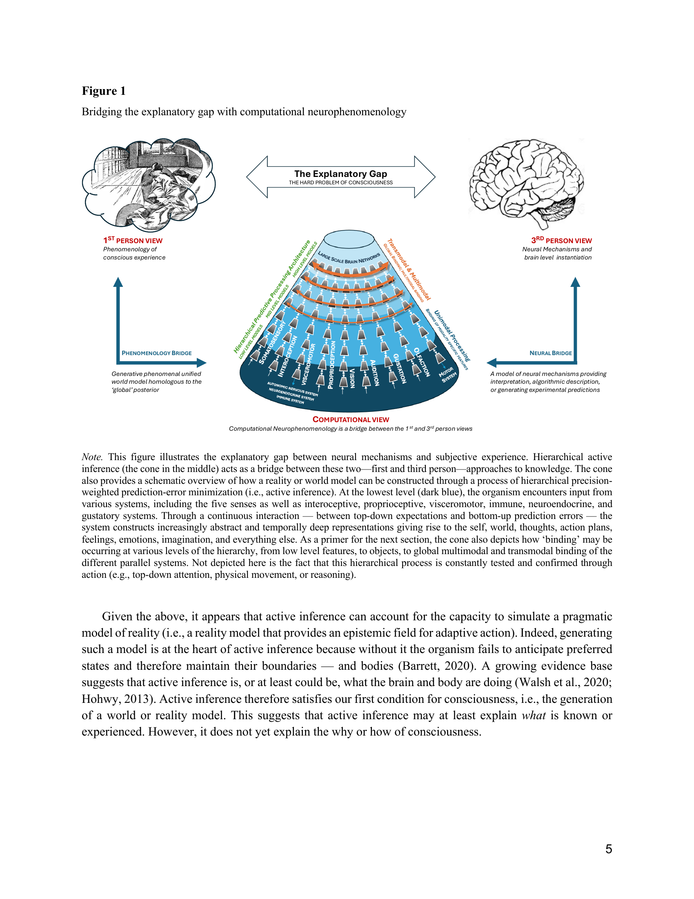
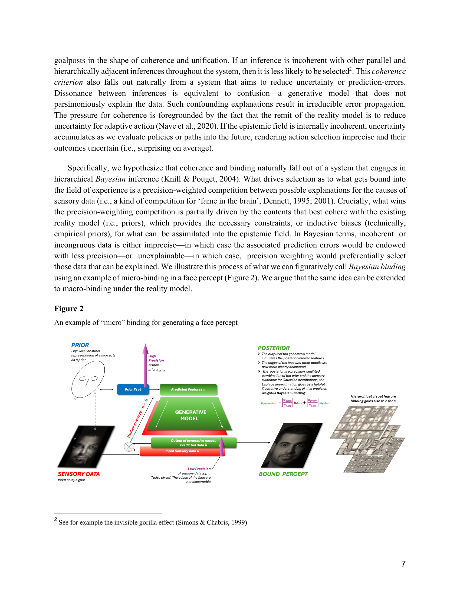
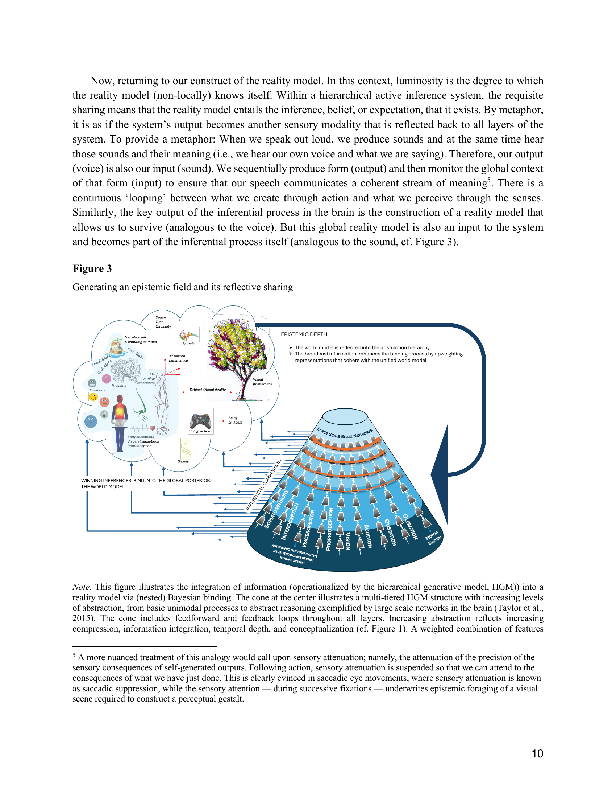
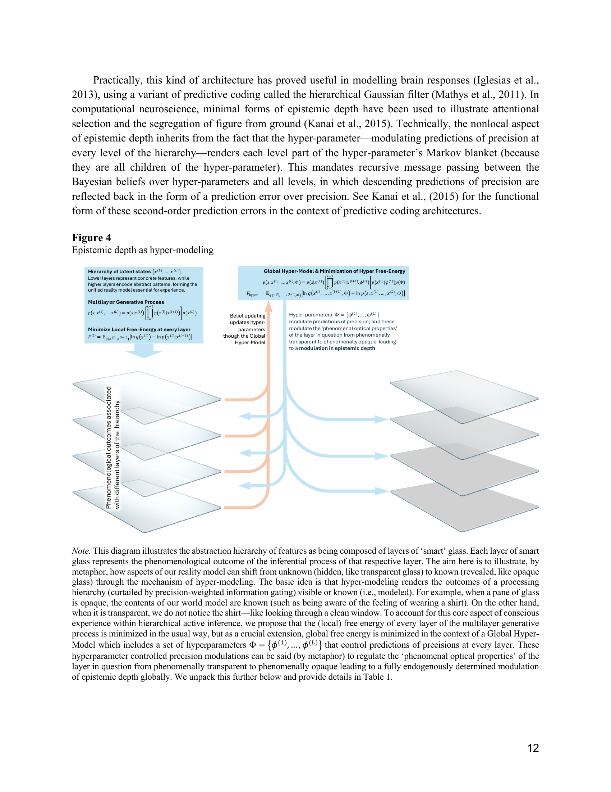
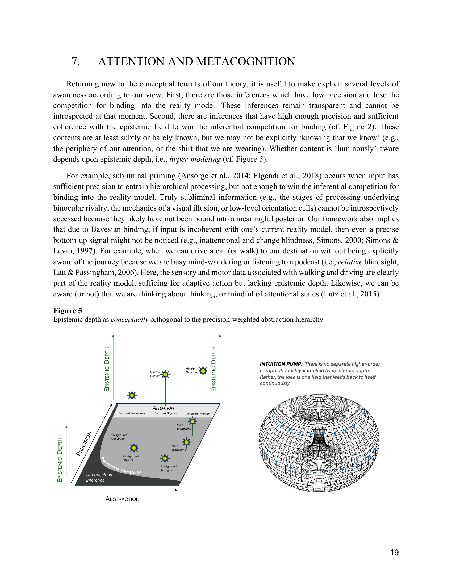
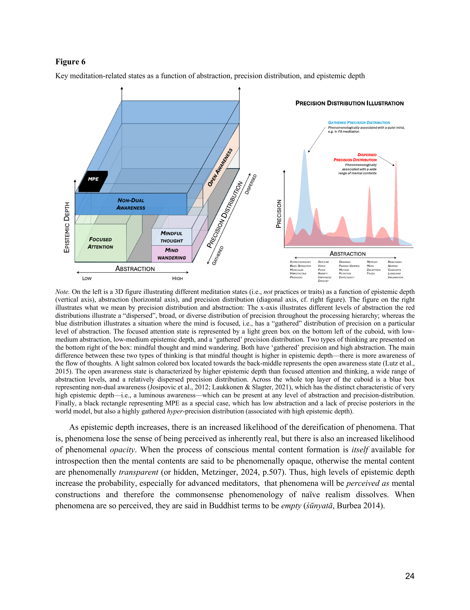

# A beautiful loop: An active inference theory of consciousness

**Authors:** Ruben Laukkonen1, Karl Friston6,7, Shamil Chandaria2,3,4,5

**Affiliations:**
1. Faculty of Health, Southern Cross University, Gold Coast, Australia
2. Centre for Eudaimonia and Human Flourishing, Linacre College, Oxford University, UK
3. Centre for Psychedelic Research, Division of Brain Sciences, Imperial College London, UK
4. Institute of Philosophy, The School of Advanced Study, University of London, UK
5. Fitzwilliam College, University of Cambridge, UK
6. Institute of Neurology, University College London, UK
7. Life, London, UK

**Published:** 2025 (this file reflects `laukkonen-depth.pdf`, 44 pp., June 2025 — the expanded "Beautiful Loop Theory" version, with Karl Friston added as a co-author; very likely the *Neuroscience & Biobehavioral Reviews* 2025 article, 176:106296. See Import note at end. The directory name still says `2024`/`laukkonen_chandaria` for cross-link stability; see Import note.)

**Keywords:** Consciousness; Awareness; Active Inference; Predictive Processing; Free Energy; Meditation; Psychedelics; Sleep; Dreaming; Unconscious; Bayesian Inference; Artificial Intelligence; Neuroscience; Computational Modelling

---

## Abstract

Can active inference model consciousness? We offer three conditions implying that it can. The first condition is the simulation of a world model, which determines what can be known or acted upon; namely an *epistemic field*. The second is inferential competition to enter the world model. Only the inferences that coherently reduce long-term uncertainty win, evincing a selection for consciousness that we call *Bayesian binding*. The third is *epistemic depth*, which is the recurrent sharing of the Bayesian beliefs throughout the system. Due to this recursive loop — in a hierarchical system (such as a brain) — the world model contains the knowledge that it exists. This is distinct from self-consciousness, because the world model knows itself non-locally and continuously evidences this knowing (i.e., *field-evidencing*). Formally, we propose a hyper-model for precision-control, whose latent states (or parameters) encode and control the overall structure and weighting rules for all layers of inference. These globally integrated preferences for precision enact the epistemic agency and flexibility reminiscent of general intelligence. This *Beautiful Loop Theory* is also deeply revealing about altered states and the full spectrum of conscious experience.

---

## 1. Introduction

Consciousness is perhaps the biggest mystery in science. At a certain point, most fields of inquiry find that the strange capacity of organisms to experience cannot be overlooked. Books, articles, and media discussing the nature of consciousness abound, with unique perspectives emerging from psychologists, neuroscientists, philosophers, phenomenologists, computer scientists, biologists, physicists, and contemplatives. Yet, most would agree that consciousness remains an inconvenient enigma in a world that otherwise seems reducible to things, objects, patterns, and equations.

Equally, it is clear that the tools of science *can* reveal something about the nature of consciousness. Thousands of experiments attest that consciousness has predictable characteristics, predictable correlates, and fluctuates under predictable conditions (Koch et al., 2016; Frith, 2021). Thanks to this growing evidence base, an array of impressive theories of consciousness (ToCs) have emerged in recent years (Rosenthal, 2000; Seth & Bayne, 2022; Carruthers, 2017; Tononi, 2008; Baars, 2005). These theories have many strengths and explanatory power but a general consensus in the scientific community does not exist. Even the metaphysical assumptions underlying the science of consciousness still result in fierce debates (Kuhn, 2024; Fleming et al., 2023; Kastrup, 2008).

Here, we aim to contribute to these theories by building on a promising general theory of organisms, known as *active inference* or *predictive processing,* under the *free energy principle* (Friston, 2010; Clark, 2013; Hohwy, 2013; Seth & Tsakiris, 2018). Several others have proposed that active inference may provide solutions to different features of conscious experience (e.g., Hohwy, 2022; Hohwy & Seth, 2020; Safron, 2020; 2022; Carhart-Harris et al. 2014; Rudrauf et al. 2017; Friston, 2018; Williford et al. 2018; Clark, 2019; Kanai et al., 2019; Chang et al. 2020; Deane, 2021; Whyte & Smith, 2021; Whyte et al., 2024). Nevertheless, it remains unclear whether active inference can satisfy the conditions for a ToC. Yet others have proposed that we should think of active inference as providing "...theories for consciousness science, rather than ToCs per se" (Seth & Bayne, 2022, p. 446). The question arises, what conditions would active inference need to satisfy in order to cross the ToC threshold? Why is it that the theory is so successful in explaining perception, cognition, and action, but not consciousness itself?

To address these questions, we propose three conditions that seem necessary for consciousness and show how some active inference systems satisfy them. The first condition is a generative *world model*, or *epistemic field*. This provides the 'space' or contents that can be known, hence the term *epistemic* (Metzinger, 2020). The second condition is *inferential competition*, which determines what becomes conscious and why it is coherent (i.e., addressing the binding problem). The third and final condition is *epistemic depth*, which refers to the fact that the epistemic field is recursively, and widely (i.e., deeply) shared throughout the system. As we will see, this idea has some similar characteristics to "broadcasting" (Dehaene et al., 2003), "information integration" (Tononi, 2008), and "fame in the brain" (Dennett, 2001), albeit with important differences.

Below, we will introduce one condition at a time. We will then show how active inference can provide a parsimonious explanation for a range of cognitive processes and states of consciousness when these conditions are satisfied. Our view also implies that the most basal or minimal form of awareness is a highly simplified (*nearly* contentless) world model knowing itself non-locally. Therefore, a first person perspective, self-modeling, and agency, are not prerequisites of awareness, but are rather local or "contracted" forms of consciousness (Metzinger, 2020).

To be concise, we will avoid an extensive literature review (see Seth & Bayne, 2022; Frith, 2021; or Lau, 2022 for reviews on ToCs). However, as noted above, many features of the theory (reviewed in Table 2 of the discussion) are consistent with elements of other ToCs such as *Global Neuronal Workspace Theory* (GNWT, Dehaene et al., 2003), *Higher Order Theories* (HOT, Lau and Rosenthal, 2011), *Recurrent Processing Theory* (RPT, Lamme and Roelfsema, 2000; Pennartz et al., 2019) and *Integrated Information Theory* (IIT, Tononi, 2008). Links with existing theories will be made throughout. The strength of our approach will be in showing how the interactions of a minimal set of computational assumptions within active inference may provide the ingredients for consciousness, with implications for understanding various states from lucid dreaming to meditation, to psychedelics, as well as artificial intelligence.

## 2. Simulating a reality model

In order to move about in a world and keep ourselves alive, we need a model of that world. One could not walk, jump, pick up a glass, catch a ball, or give a hug, without a simulation of the unfolding present. Achieving such a coherent model of reality is an immense feat, especially considering that the brain has to deal with unpredictable, imprecise and often incoherent data (Treisman, 1996). Yet, somehow, our experience of reality seems to make sense—it has depth, color, shape, thought, emotion, people, and objects that we seem to understand and predict with relative ease. Notably, there can also be an awareness of the contents of this world model. We *experience* the catching of the ball, the texture of grass under our feet, and the warm embrace. Our world appears to be alive.

We term this 'experienced world', which is the organism's entire lived reality, the *generative phenomenal, unified* world model (hereafter simply reality model). It is *generative* because processes internal to the organism play a central role in constructing or generating the 'output' of the model. It is *phenomenal* because there can be an experience of the reality model—it constitutes our lived world. And it is *unified* because it is coherent or appears to be 'bound' together as a whole. This reality model is also an *epistemic field* because it is a place (or flow of sensations) that can be known, explored, interrogated, and updated—a kind of affordance for action, both physical and mental (Metzinger, 2017). Our model of reality tells us what is possible and what is not possible, what will keep us alive and what will harm us, and even what we ourselves are. We take such a model to be a necessary condition for consciousness because it defines what *can* become conscious, be known, or experienced.

Active inference provides a straightforward solution to — or description of — how organisms construct a reality model apt for their lived world (Friston, 2006; 2010; 2017; Parr et al., 2022). Various details of this theory will be introduced later; here it is sufficient to lay out a few of the key tenets. Active inference can be derived from two codependent assumptions: (1) the imperative for biological systems to maintain a boundary between themselves and the environment (i.e., *existence*), and (2) the necessity to remain in a specific set of (characteristic) states compatible with continued existence (i.e., *adaptive actions*). From these premises, we can construct a framework where existence necessitates a generative model of the self and environment, allowing the system to resolve surprising sensations — i.e., *homeostasis* — and anticipate surprising outcomes and maintain themselves through adaptive action, i.e., *allostasis*. In order to learn and update the model, organisms reduce prediction errors, or uncertainty.[^1] Or flipped around, the organism persists by seeking evidence for its own existence, i.e., *self-evidencing* (Hohwy, 2016). Minimizing prediction errors—the difference between top-down predictions and input—simultaneously improves the model's accuracy and guides the system towards preferred, livable, states that are characteristic of the kind of thing it is.

The key innovation of *active* inference lies in treating action selection as an inference problem, where policies (sequences of actions) are selected to minimize expected uncertainty (i.e., surprises in the future consequent on a policy). In order to handle the separation of temporal scales in real-world environments — and to balance present-moment expectations with future needs — the generative model is almost universally hierarchical, with higher levels encoding more abstract and longer-term predictions. For example, soundwaves can be abstracted into syllables, which can be abstracted into words, sentences, biographies, and so on (Baltzell et al., 2019; Dehaene et al., 2015; Ding et al., 2015; Taylor et al., 2015; Friston et al., 2024; Friston et al., 2017; George and Hawkins, 2009). This formulation allows for deep narratives about our experiences and our bodies across time, as well as goal-directed behavior, to emerge from the fundamental drive to maintain existence.

Finally, the prediction errors that report the degree of surprise — and thereby drive Bayesian belief updating at each hierarchical level — are precision-weighted (Feldman & Friston, 2010). Precision modulates the impact of prediction errors on belief updating and policy selection by controlling the gain on error units. High precision amplifies the influence of prediction errors, while low precision attenuates them. This precision-weighting mechanism allows the system to flexibly adapt to different contexts by modulating the balance between sensory evidence and prior beliefs. Put simply, we need to know what we know but also how confident we are about it. In some cases, we can trust our beliefs, in other cases we need to focus on learning something new from the world (Friston et al., 2015). On this reading, world models are 'precision engineered', where increasing the precision of certain prediction errors can be understood in terms of attending to their source.

One of the advantages of active inference is that it can act as a bridge between first and third-person approaches (cf. the *explanatory gap*, Levine, 1983). In other words, computational approaches like active inference offer a middle-way between subjective experience and neural mechanisms, providing mechanistic insight into both (see Figure 1). This approach is sometimes called *computational neurophenomenology* (Suzuki et al., 2022; Sandved-Smith et al., 2021; 2024; Ramstead et al., 2022) because it bridges subjective experience and objective neural processes within a single modeling framework. Specifically, it uses *generative models* to specify how the brain infers and constructs experiential content, allowing researchers to link changes in neural dynamics (the "algorithmic descriptions") to the qualities and structure of phenomenological experience. By systematically mapping both first-person reports and neural dynamics to underlying computational processes, we simultaneously gain an explanatory account of how subjective experience arises and a mechanistic understanding of how the brain implements it.

Given the above, it appears that active inference can account for the capacity to simulate a pragmatic model of reality (i.e., a reality model that provides an epistemic field for adaptive action). Indeed, generating such a model is at the heart of active inference because without it the organism fails to anticipate preferred states and therefore maintain their boundaries — and bodies (Barrett, 2020). A growing evidence base suggests that active inference is, or at least could be, what the brain and body are doing (Walsh et al., 2020; Hohwy, 2013). Active inference therefore satisfies our first condition for consciousness, i.e., the generation of a world or reality model. This suggests that active inference may at least explain *what* is known or experienced. However, it does not yet explain the why or how of consciousness.

[^1]: Technically an upper bound on surprise or negative log evidence.

## 3. Inferential competition

Any theory of consciousness must explain why we become aware of some phenomena but not others. Active inference and predictive coding have provided impressive accounts of how particular contents of consciousness are constructed (particularly in the visual stream, Peelen et al., 2024). But as yet, there is no generally accepted account of what determines the selective threshold required for awareness (Seth & Bayne, 2022; Baars, 2005; Kouider & Dehaene, 2007). Some informative efforts in this general direction exist (Safron, 2020; 2022; Friston, 2018; Hohwy, 2012; Dołęga & Dewhurst, 2021).

Consider the familiar case of binocular rivalry (Breese, 1909; Tong et al., 2006). Here, a different image is presented to each eye at the same retinal location at the same time (e.g., a face is presented to the left eye, and a house is presented to the right eye). This results in a bizarre situation where the brain cannot seem to accept the fact of the two opposing visual realities. The resulting experience is a gradual switch between a house or a face, or a mix of the two. Such experiments highlight that some sort of selection process is taking place, which makes some configuration or interpretation of the senses conscious and not others (Hohwy et al., 2008; Hohwy, 2012). There are countless examples that raise a similar conundrum, including inattentional blindness (Mack, 2003; Kouider & Dehaene, 2007), visual and sensory illusions (Eagleman, 2008; Laukkonen & Tangen, 2017), as well as introspective, cognitive, and behavioral confabulations (Nisbett & Schachter, 1966; Nisbett & Wilson, 1977; Maier, 1931; Wegner, 2002; Weiskrantz, 1986).

While there are clearly some things that become conscious and others that do not, this pertains less to the harder problems of consciousness than one might think (Chalmers, 1995). Consider that regardless of which percept becomes conscious during binocular rivalry, we are always nevertheless (meta) aware of what enters our visual field. In other words, the *presence* of consciousness has not changed, only the contents. We can also be aware of the fact that our experience is changing from the face to the house, and even perhaps aware of why it is changing. What is somehow central is therefore the fact that there seems to be a "space" wherein there is something it is like to feel, perceive, and crucially, know the contents of mind (Metzinger, 2020). Cleeremans et al (2020) put this same point differently: "...someone is aware of some state of affairs not merely when she is sensitive to that state of affairs, but rather when she *knows* that she is sensitive to that state of affairs." [our emphasis]. When encountering a visual illusion, rivalry, or an ambiguous stimulus, we seem capable of knowing that we are having such and such experience. In the parlance of phenomenology, we experience 'seeing' and phenomenological *transparency* gives way to *opacity* (Limanowski and Friston, 2018; Metzinger, 2003). This experiential space seems to be unified, coherent, and bound together: a conscious *gestalt*, as others have noted (Baars et al., 2013; Tononi et al. 2005, 2008). Hence, consciousness has a certain conclusive nature to it, as if the brain and body have found a global and unified affordance within which it can have a self, move about, attend to things, feel emotions; and crucially, keep the body alive (Barrett, 2020; Seth, 2013).

Here, we propose that the threshold for consciousness—what enters this epistemic field or reality model—is determined through a process of competition among possible explanations of the causes of one's sensations. Moreover, we suggest that the so-called binding "problem" may in fact be part of the "solution" as to what breaches the threshold for consciousness. That is, coherence and boundedness are a central criterion in winning the inferential competition. Metaphorically, the competition for consciousness has goalposts in the shape of coherence and unification. If an inference is incoherent with other parallel and hierarchically adjacent inferences throughout the system, then it is less likely to be selected.[^2]

This *coherence criterion* also falls out naturally from a system that aims to reduce uncertainty or prediction-errors. Dissonance between inferences is equivalent to confusion—a generative model that does not parsimoniously explain the data. Such confounding explanations result in irreducible error propagation. The pressure for coherence is foregrounded by the fact that the remit of the reality model is to reduce uncertainty for adaptive action (Nave et al., 2020). If the epistemic field is internally incoherent, uncertainty accumulates as we evaluate policies or paths into the future, rendering action selection imprecise and their outcomes uncertain (i.e., surprising on average).

Specifically, we hypothesize that coherence and binding naturally fall out of a system that engages in hierarchical *Bayesian* inference (Knill & Pouget, 2004). What drives selection as to what gets bound into the field of experience is a precision-weighted competition between possible explanations for the causes of sensory data (i.e., a kind of competition for 'fame in the brain', Dennett, 1995; 2001). Crucially, what wins the precision-weighting competition is partially driven by the contents that best cohere with the existing reality model (i.e., priors), which provides the necessary constraints, or inductive biases (technically, empirical priors), for what can be assimilated into the epistemic field. In Bayesian terms, incoherent or incongruous data is either imprecise—in which case the associated prediction errors would be endowed with less precision—or unexplainable—in which case, precision weighting would preferentially select those data that can be explained. We illustrate this process of what we can figuratively call *Bayesian binding* using an example of micro-binding in a face percept (Figure 2). We argue that the same idea can be extended to macro-binding under the reality model.

Bayesian binding also offers a novel description of *ignition* as defined in GNWT (Dehaene & Changeux, 2011; Dehaene et al., 2014; Friston et al., 2012). Ignition refers to the sudden and widespread activation of a coalition of neurons that "ignites" information into conscious awareness. In GNWT, this process is characterized by a nonlinear transition from local, specialized processing to global availability of information across the brain. According to Bayesian binding, the ignition threshold is driven by precision competition throughout the hierarchy, wherein precisions are also constrained by coherence (top-down) with the reality model (i.e., predicted precision[^3] is higher if it has local and global coherence). Ignition, binding, and competition are hence subsumed within active inference (Whyte & Smith, 2021). They are each the natural consequence of a system that reduces uncertainty with sufficient complexity and depth.

A complimentary view (cf. Whyte & Smith, 2021; Whyte et al., 2024) proposes that consciousness arises specifically at the interface between continuous sensory perception and discrete, counterfactual policy selection processes. Here, conscious contents correspond to precise posterior beliefs about the hidden states of the world, body, or brain, which are temporally abstracted from immediate sensory fluctuations and sufficiently precise to drive action selection, including subjective reports. Thus, conscious states differ from unconscious ones in their capacity to inform discrete policy decisions, reflecting a computational balance between goal-directed (exploiting known information) and exploratory (resolving ambiguity and novelty) imperatives. An integrative perspective is that discrete and precise posteriors (Whyte & Smith et al., 2021) also require local *and* global coherence (Bayesian binding), which naturally drives the bounded and holistic nature of conscious experience.

The key takeaway here is that Bayesian binding is (in theory) at the heart of all experience, from unimodal processes, multisensory binding, through to global integration. That is, generating experience demands nested levels of binding, i.e., combining priors and sensory evidence into an approximate posterior through a hierarchical generative model, where that perceptual synthesis or combination rest sensitively on the precision or confidence afforded each level of processing (Friston, 2008; Hohwy, 2012; Hohwy, 2013). The insight is that the same basic mechanism operates at both micro and macro levels. For example, just as we infer a teapot to be a single 'thing' (made of handles, a hollow body, and a spout), we also take our whole field of experience to be a single thing, which binds together the ground, the sky, our bodies, other people, and everything else. We hypothesize that this global unified model, however minimal, is necessary but not sufficient for conscious experience. It is only when this global posterior is reflected back through the underlying hierarchy that the conditions for consciousness are met. As we will see, explaining the contents of consciousness is insufficient to capture the imminent and sense of *knowing* the contents, or *awareness* of them.

[^2]: See for example the invisible gorilla effect (Simons & Chabris, 1999).
[^3]: The factors that drive precision are manifold, including salience, top-down attention, context contingencies, coherence, uncertainty, confidence, reward, neuromodulators, and previous learning more generally. Moreover, top-down attention can "magnify" particular layers or contents within the hierarchy by increasing its relative (precision) weighting in the reality model (Feldman & Friston, 2010), e.g., by paying attention to the textured bark of a particular tree — in the context of a forest scene — the conscious gestalt will be modified by enhancing the details of the gnarliness of the bark. The low level sensory percepts occupy more 'bandwidth' in the epistemic field.

## 4. Epistemic depth and awareness

> "...my own working hypothesis is that consciousness is our inner model of an "epistemic space," a space in which possible and actual states of knowledge can be represented. I think that conscious beings are precisely those who have a model of their own space of knowledge—they are systems that (in an entirely nonlinguistic and nonconceptual way) know that they currently have the capacity to know something."[^4]
> - Metzinger, 2020

The word epistemic means 'relating to knowledge' and the word 'depth' refers to both intensity and the capacity to go below or beyond the surface (Oxford English, 1989). What we mean by the term epistemic depth is therefore a capacity or continuum (i.e., deepening) of knowing, or awareness, that can be more or less active (i.e., intense or clear). A state of low epistemic depth is one that involves unclear knowing, such as states of sleeping, dreaming, and mind-wandering, and a state with high epistemic depth is one that involves clear or intense knowing, such as mindful or highly aware states (Schooler, 2002; Schooler et al., 2011). As we will see, the intensity or clarity of knowing can also be directed at the knowing capacity itself, i.e., reflectively knowing that we know (Dunne et al., 2019; Josipovic, 2019). Our goal in this section is to deliver a conceptual sense of what we mean by epistemic depth. We then focus on providing a formalization of this idea in Section 5.

To add some phenomenological nuance to our construct we borrow the term *luminosity*, which appears often in the ancient discourses of contemplative traditions (Anālayo 2017), particularly in Mahayana and Vajrayana Buddhism (Williams, 2013) and Indian philosophy (Skorupski, 2012; Berger, 2015). For our purposes we define luminosity as the clarity or intensity of knowing or awareness within conscious experience. Connecting epistemic depth with luminosity has the particular benefit of avoiding an infinite regress: "as a source of light is never illuminated by another one…" (Bhartṛhari, 1963). Just as a light shining out of a lamp illuminates the objects but also the lamp itself, ideas of luminosity and self-reflective awareness often go hand in hand (Williams, 2013). Luminosity and recursion indicate that it is just 'one' knowing with varying degrees, just as a light varies in brightness, but is one light. For our purposes, luminosity provides a useful metaphor—with phenomenological resonance—for the graded nature or clarity of awareness that seems to be possible for conscious systems.

Now, returning to our construct of the reality model. In this context, luminosity is the degree to which the reality model (non-locally) knows itself. Within a hierarchical active inference system, the requisite sharing means that the reality model entails the inference, belief, or expectation, that it exists. By metaphor, it is as if the system's output becomes another sensory modality that is reflected back to all layers of the system. To provide a metaphor: When we speak out loud, we produce sounds and at the same time hear those sounds and their meaning (i.e., we hear our own voice and what we are saying). Therefore, our output (voice) is also our input (sound). We sequentially produce form (output) and then monitor the global context of that form (input) to ensure that our speech communicates a coherent stream of meaning.[^5] There is a continuous 'looping' between what we create through action and what we perceive through the senses. Similarly, the key output of the inferential process in the brain is the construction of a reality model that allows us to survive (analogous to the voice). But this global reality model is also an input to the system and becomes part of the inferential process itself (analogous to the sound, cf. Figure 3).

The insight is that the same basic mechanism operates at both micro and macro levels — the global information contained in the reality model is reflected back to the abstraction hierarchy, recursively *revealing itself to itself*. While the 'loop' is shown to and from the conscious cloud to illustrate the schema, computationally, all the recursion is within the feedback loops of the central cone structure; no dualism is implied. We hypothesize that this recursion is the causal mechanism permitting epistemic depth (*the sensation of knowing*).

## 5. Hyper-models and tiny creatures

Modeling *epistemic depth* in a rigorous way calls for a system that not only forms predictions about external states but also—crucially—*models its own modeling* recursively at a global scale. One way to pursue this is through what we term *hyper-generative models,* or *hyper-models* for short (Friston, 2010; Parr & Friston, 2018; Ramstead et al., 2022). In hierarchical active inference, each layer infers hidden causes in ascending degrees of abstraction. However, to capture epistemic depth, the architecture requires a *truly* higher-order (i.e., *hyper*) model that tracks how each layer's inferences and precision-weightings are being deployed system-wide. Formally, we can posit a hyper-parameter set Φ that encodes beliefs about *which* layers to trust more (or less) under different contexts, *how* strongly to up- or down-weight prediction errors, and *how* to orchestrate feedback loops across the entire network (Friston et al., 2017). Such a deeply global parameter set permits a system to recursively "rework" and "rediscover" their own modelling processes, and thus become a truly agentic self-constructing and deconstructing system, reminiscent of the way humans can intentionally and radically change themselves given the right motivation and context.

Crucially, hyper-parameters that contextualize belief updating—through descending predictions of precision to lower layers—update the (ascending) precision-weighted prediction errors that update the hyper-parameters that update (descending) predictions of precision. And so on, *ad infinitum*. It is this recursive aspect that equips belief updating with epistemic depth. In terms of phenomenal transparency and opacity, we can imagine each hierarchical layer as a type of glass that can change its optical properties (cf. Figure 4). In the setting of epistemic depth, descending predictions of precision render transparent panes of glass opaque, equipping the hierarchy with the ability to contextualize and select what is broadcast from one level to the next. In terms of a lamp illuminating itself, epistemic depth offers a very different picture: a picture more akin to a series of holographic screens (Fields et al., 2021; Fields et al., 2024) illuminating each other in their reflected light. This picture foregrounds the recursive, non-local and (self) reflective nature of epistemic depth.

Clarifying how a hyper-parameter set, Φ orchestrates the entire system is a challenge. One possibility is to define Φ within a factor-graph architecture that includes "hyper-nodes" encoding conditional beliefs about each sub-model's precision or reliability (Parr & Friston, 2018). These hyper-nodes would propagate top-down signals—precision updates, gating directives, or structural reconfigurations—to lower-level nodes, ensuring that each layer's inference is shaped by global meta-beliefs. Such a mechanism would allow simulation of when and how reflective broadcasts occur, enabling comparisons to neurophysiological data and refining our broader understanding of epistemic depth in biological and artificial systems.

Practically, this kind of architecture has proved useful in modelling brain responses (Iglesias et al., 2013), using a variant of predictive coding called the hierarchical Gaussian filter (Mathys et al., 2011). In computational neuroscience, minimal forms of epistemic depth have been used to illustrate attentional selection and the segregation of figure from ground (Kanai et al., 2015). Technically, the nonlocal aspect of epistemic depth inherits from the fact that the hyper-parameter—modulating predictions of precision at every level of the hierarchy—renders each level part of the hyper-parameter's Markov blanket (because they are all children of the hyper-parameter). This mandates recursive message passing between the Bayesian beliefs over hyper-parameters and all levels, in which descending predictions of precision are reflected back in the form of a prediction error over precision. See Kanai et al., (2015) for the functional form of these second-order prediction errors in the context of predictive coding architectures.

Unlike parametric depth, a hyper-model is modeling the very shape of its hierarchy and updating it in real-time. Parametric depth is often implemented as localized loops—between one layer above another (Sandved-Smith, 2021; 2024), implementing a second-order inference about attention, or about preference precision. One can extend this idea to multiple layers, but typically it is demonstrated with a single or small number of layers. Epistemic depth goes beyond local second-order inferences, implying a *globally consistent* sense that "I (the system) have a multi-tier generative model, and I know how to deploy the right precision in each tier—thus I *know* what I know."

This kind of epistemic depth is system-wide: it is not just "what am I attending to?" but "how do all these layers of inference contextualize each other in a deep (hierarchical) sense?". Whereas parametric depth can be instantiated with a few carefully chosen parameters: e.g., "likelihood precision" or "policy precision" (Allen et al., 2019; Hesp et al., 2019; Parr and Friston, 2017, 2019; Schwartenbeck et al., 2015; Smith et al., 2019), epistemic depth is about the *entire deep generative model* being "aware" of how it's orchestrating precisions. Nevertheless, parametric and epistemic depth are clearly compatible—epistemic depth sketches the 'big-picture' of global awareness, while parametric depth is a mechanism for implementing meta-inference in a hierarchical generative model that has close connections to metacognition and the higher-order thought theory (Fleming, 2020; Fleming et al., 2012).

**Table 1. Towards a Formal Model of Epistemic Depth.**

| Component | Equation | Description |
|---|---|---|
| Multilayer Generative Process | $p(s, x^{(1)}, \ldots, x^{(L)}) = p(s \mid x^{(1)}) \left( \prod_{l=1}^{L-1} p(x^{(l)} \mid x^{(l+1)}) \right) p(x^{(L)})$ | Describes the generation of sensory data $s$ from a hierarchy of latent states $\{x^{(1)}, \ldots, x^{(L)}\}$. Lower layers represent concrete features, while higher layers encode abstract patterns, forming the unified reality model essential for experience. |
| Global Hyper-Model | $p(s, x^{(1)}, \ldots, x^{(L)}, \Phi) = p(s \mid x^{(1)}) \left( \prod_{l=1}^{L-1} p(x^{(l)} \mid x^{(l+1)}, \phi^{(l)}) \right) p(x^{(L)} \mid \phi^{(L)}) p(\Phi)$ | Defines a generative process including hyperparameters $\Phi = \{\phi^{(1)}, \ldots, \phi^{(L)}\}$, which modulate predictions of precision across layers. Conditioning $x^{(l)}$ on both $x^{(l+1)}$ and $\phi^{(l)}$ enables system-wide meta-inference, supporting epistemic depth. |
| Local Free-Energy | $F^{(l)} = \mathbb{E}_{q(x^{(l)}, x^{(l+1)})}\left[ \ln q(x^{(l)}) - \ln p(x^{(l)} \mid x^{(l+1)}) \right]$ | Quantifies prediction error at layer $l$, with expectations over $q(x^{(l)}, x^{(l+1)})$ ensuring coherence between adjacent layers. Minimizing $F^{(l)}$ refines local inferences, contributing to the reality model's consistency. |
| Hyper Free-Energy | $F_{\text{hyper}} = \mathbb{E}_{q(x^{(1)}, \ldots, x^{(L)}, \Phi)}\left[ \ln q(x^{(1)}, \ldots, x^{(L)}, \Phi) - \ln p(s, x^{(1)}, \ldots, x^{(L)}, \Phi) \right]$ | Measures global prediction error, incorporating all states $\{x^{(1)}, \ldots, x^{(L)}\}$ and hyperparameters $\Phi$. Minimizing $F_{\text{hyper}}$ tunes the entire hierarchy, enabling recursive sharing of the reality model—central to epistemic depth. |

*Note (Table 1).* Multilayer Generative Process: the standard hierarchical formulation found in active inference and predictive coding. Global Hyper-Model: the novelty here is to include an extra "layer" of inference that regulates how each level in the hierarchy should be trusted—by updating the hyper-parameters Φ that set precision and weighting rules across levels. This reflective control is our formal analog of epistemic depth. Local and Hyper Free-Energy: the free-energy formalism provides a way to quantify "prediction error" at both local and global levels, where updates are shared recursively between local and global levels. The local free-energy drives short-term, layer-by-layer inference, whereas the hyper free-energy ensures that the whole hierarchy (including its meta-parameters) is optimized. These local and global processes may be what give rise to the sense that there is a difference between awareness and its contents: The global level (awareness) always seems to track the functioning and structure of other, localized loops (contents) in the context of the whole.

It also remains an open question where, along the phylogenetic continuum, genuine *epistemic depth* begins to appear. Biologically, all living systems engage in some form of homeostatic regulation, and many (e.g., bacteria) exhibit simple feedback loops. However, the simplest formal demonstration of epistemic depth is probably a two(+)-layer active-inference system that: (i) infers external causes of its sensations, (ii) runs a hyper-process that predicts the precision each sensory and internal channel deserves, and (iii) broadcasts those predicted precisions back to re-weight ongoing prediction-error signals. Because the same loop both *evaluates* and *updates* its own confidence, it achieves the simplest possible case of recursive self-modelling without invoking a homunculus.

Even such a toy system can, in principle, encode a rudimentary "knowing that it knows." This simple setup forms a minimal demonstration of *epistemic depth*: the global loop includes not just a model of the world, but also a real-time model of *how* it is modeling the world (cf. Parr & Friston, 2018; Sandved-Smith et al., 2024). However, unlike reflecting on how one's mind works (in the way we are doing here), rudimentary forms of epistemic depth are exceptionally basic: they involve minimal meta-inference about a system's own predictive processes, absent any richer conceptual or introspective dimension. In this sense, our model seems to suggest that consciousness clearly precedes introspection or complex metacognition, at least the kind that we usually associate with those terms. Even a tiny agent can incorporate ongoing feedback from within its own inferential machinery, linking the "sense of the world" with a subtle, self-revising "sense of itself *as* the world." Self-modeling proper (i.e., knowing what kind of thing one is) would be, under this view, a much later development.

In nature, many single-cell organisms already show *proto*-forms of "self-measurement" of intracellular states, but whether that amounts to a reflective *awareness* is debatable (Fields & Levin, 2022; 2023). One could argue that very small multicellular creatures or tiny insects—e.g. parasitic wasps (*Megaphragma mymaripenne*), fruit-fly larvae (*Drosophila melanogaster*), or nematodes like *C. elegans*—start to approach the complexity needed to implement the minimal hyper-model. These small but highly integrated nervous systems can tune sensory signals, modulate action policies, and reconfigure local loops via neuromodulators, suggesting partial analogs of top-down reweighting (Marder, 2012). Whether these are enough for a *globally coherent* "knowing that they know" remains unknown, but they are prime targets for studying borderline cases of reflective, multi-level organization in living systems.[^6] As a practical matter, it may be that only once a creature devotes sufficient neuronal (or computational) resources to hierarchical modelling and meta-inference do we see a clear approximation of *epistemic depth* in the sense required here (Friston, 2018). Nonetheless, tracking how progressively complex nervous systems—beginning even with tiny arthropods—handle global precision control may shed light on how minimal systems might, at least in principle, exhibit the core properties of epistemic depth.

[^4]: We generally agree with Metzinger's (2020; 2024) emphasis on an epistemic "space", though we prefer the term *field* because it highlights that the field and its contents are 'one' and always changing.
[^5]: A more nuanced treatment of this analogy would call upon sensory attenuation; namely, the attenuation of the precision of the sensory consequences of self-generated outputs. Following action, sensory attenuation is suspended so that we can attend to the consequences of what we have just done. This is clearly evinced in saccadic eye movements, where sensory attenuation is known as saccadic suppression, while the sensory attention — during successive fixations — underwrites epistemic foraging of a visual scene required to construct a perceptual gestalt.
[^6]: We remain cautiously open minded about epistemic depth in the plant world.

## 6. Hyper-models in cells and silicon

### 6.1 Conceptual Recap of Hyper-Models

Let us now review in simpler terms the core conceptual tenets of hyper-modeling so that we might begin to imagine how they are implemented in brains, bodies, and the warm, wet, and interconnected world in which we live. We will then briefly connect hyper-models to recent advances in self-supervised learning in large language models (LLMs). First, in ordinary hierarchical models of predictive coding, each layer carries a *local* precision term—"How trustworthy is *my* information stream?". This is often a colloquial proxy for confidence. It is set by a prior or a slow homeostatic rule and it only modulates traffic flowing through that *one* layer. The result is lots of independent dimmer switches, each tuned in (relative) isolation without any internal predictive knowledge about their future activation patterns.

What we have now proposed is to add a *hyper-model that predicts precisions themselves*. Not at a single layer, but globally and recursively. We effectively promote precision from a fixed knob to a latent variable that has to be explained (much like the causes of our sensory data). The model now tries to anticipate *when, where, and by how much* every local precision should change. Those anticipations are encoded in a higher-order set of parameters and states—the hyper-model—which, in turn, minimizes hyper free-energy. Prediction errors on *these* forecasts are what fuse into the organism-wide Φ. Concisely, the *hyper-loop* includes:

1. **Hyper-prediction.** Based on global context (internal and external states, recent history, bodily needs, time of day, social situation, etc.), the hyper-model issues a *forecast* of the precision profile it expects to be optimal a moment from now.
2. **Lower-level inference.** Each layer uses that forecast Φ to weight its current errors.
3. **Error on the precision forecast.** The weighted errors flow back and reveal whether Φ components were too high or low in any channel (NB: Φ is a high dimensional vector).
4. **Hyper-update.** Those second-order errors tweak the hyper-model's own parameters, letting it learn regularities about *changes* in uncertainty (i.e., changes in its degree of *knowing*).
5. **Broadcast new Φ.** A revised precision field is relayed to the first-order hierarchy shaping the next cycle of perception (i.e., *telling itself what it knows*). Put simply, a *new* Φ is "sprayed" back to every layer, just like the loop illustrated in Figure 3.

Because step 3 feeds directly into step 1 on the next pass, the system is inferring both the world *and* how confident it should be about inferring the world—a true *model of models* (Lopez et al., 2024). In practical terms, this new hyper-model has many benefits: it provides a global map of what the system "knows" spanning all layers. It dynamically and recursively predicts from context (e.g., darkness → down-weight vision, pain → up-weight nociception) and learns cross-modal regularities e.g., "when vestibular noise is high, visual precision should fall". It also provides a way for the organism to not only adjust gain but to forecast how gain will need to change in future moments; begetting a complex, temporally deep, inner knowledge of one's own world model. It earns the term "hyper" because its *outputs are parameters for another model*—the full precision map that the ordinary perception-action loop will use next.

A system with only fixed local precisions can stabilise perception but cannot *learn when to be curious, sleepy, vigilant, open minded, or doubtful* based on its current state of knowledge and present context, because there is no mechanism for (globally) knowing what it knows. On the other hand, a brain with a learned, context-sensitive Φ can down-weight the visual system before a saccade, up-weight interoception during (or in anticipation of) illness, humble oneself when entering a context where they know they are a novice, and confidently speak when they have expertise. The effective hyper-modeler can raise overall precision in danger (hyper-vigilance), and lower it during play or REM sleep, and they can effectively communicate what they know and do not know to others. This adaptive, meta-predictive capability, seems to instantiate the necessary computations for a system to know what it knows (and crucially what it does *not* know) with increasing fidelity and to enact adaptive preferences for precision[^7] (Najid et al., 2022). Such self-learning may underly key features of human development, particularly the ongoing self-awareness gains that can occur well into later stages of maturation and adult development.

### 6.2 A Liquid Symphony of Electric Fields

#### 6.2.1 The Big Picture

Computation is a powerful metaphor for understanding biological systems, but "computations" that run on biological substrates are porously connected to a world, which simultaneously embodies both the processor and the data (Seth, 2025). On the other hand, artificial agents typically run their computations in silicon that is disconnected from the environment—an informational prison with no walls that push back. As a result, their hyper-model Φ must be coded explicitly (e.g., hyper-networks that learn preferences of precision) or supplied by a designer. Basically, biological loops are unique because they are *leaky*: they extend into tissue and world, harvesting constraints that a disembodied system has to simulate (Seth, 2025). This is important context for the question "*where in the brain is consciousness or the hyper-model*" because we are, to some extent, overextending a computational metaphor from constructed agents in logical prisons to the fluid, warm, wet, and extended minds of life.

Another key consideration is that organisms operate across many levels of analysis at once, from the tiniest particles we can imagine being functionally important all the way to large scale neural networks and the very morphology of the organism within its environmental niche (Varela et al., 2017). Each level provides constituent elements that afford the next level (McMillen & Levin, 2024),[^8] and each level causally constrains the others. From first principles, for something as integrated and unified as living organisms and the reality models they enact, it is difficult to speak of neurons, networks, neuromodulators, or even metabolism or morphology in isolation. Instead, it may be that the activity necessary for consciousness *dependently arises* out of a multi-level symphony between and within them. Seen this way, asking *"where in the brain is consciousness?"* is a bit like asking *"where in the orchestra is the melody?"*. Indeed, the minimal conditions we have ascribed to "consciousness" may be implemented in myriad ways at different levels, on different substrates, and in different organisms.

#### 6.2.2 Sprays and Fields: Potential Broadcast Channels for Φ

With the 'forest' in view, a key mechanistic question pertains to the hyper-model's downward causality: What, in the brain, might plausibly enact the processes necessary to transmit knowledge that can affect broad change throughout the system in the "loopy" way that we have posited? Clearly, any potential mechanisms for the hyper-model's global reach would need to have the property of widespread sharing of information. Both global workspace architectures and the maximal φ-complex with IIT schemes propose promising candidates (see Table 2 in the discussion). However, in addition to these connectivity-focused mechanisms, there may be other non-region-centric mechanisms worth consideration.

A promising way to realise the hyper-model's global forecast is to couple two well-established, non-region-centric mechanisms. The first relevant mechanism is *neuromodulatory sprays* (Shine 2019; Shine et al., 2018; 2021). Sprays are brief, diffuse bursts of noradrenaline, acetylcholine, serotonin, and dopamine that can shift synaptic gain over hundreds of milliseconds, embedding slow global contextual information such as arousal, valence, and uncertainty (Parr & Friston 2017; 2018; Shine et al., 2018; 2019; Biddell et al., 2024). The second key mechanism is *endogenous electromagnetic fields* (Hunt & Schooler, 2019). Coherent fields are generated by neurons firing and propagated ephaptically (e.g., via coupled electric fields), nudging membrane potentials by microvolts on each oscillatory cycle and providing a millisecond-scale phase alignment channel (Fröhlich & McCormick 2010). Working in tandem, the sprays may set the *baseline temperature of belief* (e.g., broad stroke changes in gain or confidence over longer periods of time), while the fields impose *rapid, fine-grained tuning* (e.g., dimming the gain on a specific granular feature) together broadcasting an updated Φ to every layer in time for the next perception–action step. Because both channels are inherently distributed and scale-free, they sit comfortably inside the multi-level symphony sketched above: molecular shifts colour local spikes, spikes entrain mesoscopic fields, and fields converge on macroscopic hubs that send the next chemical wash.

These non-local broadcast channels explain empirical patterns that region-centric theories struggle to accommodate. Under general anaesthesia, deep NREM sleep, or spike-wave seizure, consciousness fades when long-range phase-coupling collapses *and* neuromodulator tone flattens—even though many fronto-parietal (GNWT) or posterior "hot-zone" (IIT) neurons continue to fire (Alkire et al. 2008; Massimini et al. 2005; Sarasso et al. 2021). Sprays-plus-fields naturally predict that combination: a diminished chemical baseline lowers overall precision and neural gain, while loss of field coherence prevents rapid re-alignment, leaving local circuits to talk past one another; breaking necessary integration. None of this denies the considerable evidence for GNWT ignition dynamics or IIT's posterior complexity gradients; rather, it reframes those observations as components of a deeper, system-wide broadcast. What this wider account adds is a candidate mechanism for (i) forecasting precision from context, (ii) distributing that forecast at behaviourally relevant speeds, and (iii) doing so recursively without a privileged anatomical locus, embodying the *broadly unified* and "loopy" nature of conscious experience. Put simply: neuromodulatory sprays and electric-field resonance supplement neural connectivity mechanisms and together they offer the best candidates for how a hyper-model can be implemented within the brain's multi-scale symphony.

### 6.3 Hyper-Models and Self-Supervised Learning

As noted earlier, imagining hyper-models in contemporary AI systems can look quite different to imagining them in the biological material of brains and bodies (Seth, 2025), yet several promising directions are beginning to emerge. For example, in *Reinforcement Learning from Internal Feedback* (RLIF), Zhao et al. (2025) train an LLM entirely on its own self-certainty (the KL-based confidence it assigns to each token sequence) and show that this intrinsic signal (the only reward used) lets a 3 B-parameter model match fully supervised GRPO on in-domain maths while *exceeding* it on out-of-domain code generation. Conceptually, the policy network plays the role of the first-order hierarchy, whereas the confidence estimator stands in as a kind of primitive hyper-model: it forecasts how reliable the current reasoning trajectory is likely to be and immediately feeds that signal back as the sole reinforcement target. Hence, the precision map adapts as the model explores new problems—a silicon proto-example of "predicting precision" (see also Agarwal et al., 2025 for a conceptually similar variant that turns negative entropy into a reward signal).

However, current instantiations of confidence-monitoring are like a student who waits until the test is graded before checking their confidence. The model completes a sequence, computes a confidence score, and uses that number to adjust the conversation outside the loop during training. To extend these prototypes into a true hyper-model, the entropy/confidence predictor must move inside the recurrent loop, issuing a *forecast* of the precision profile *before* the next token (or action) is sampled, guiding decision-making on the fly and while also receiving grounded feedback from the world where possible.

One blueprint is to add a meta-network that (i) ingests a rolling summary of hidden states, (ii) outputs a multi-dimensional vector Φ(t) that scales every layer's activations, and (iii) is itself updated by gradients of *global* self-certainty or negative entropy. Implementing such a global, self-updating precision map could be as simple as a *re-wiring*: move the intrinsic-confidence-feedback module from the loss function into the forward pass. This now continuous self-updating precision map could also be extended to include temporally deep predictions of global precision dynamics. For example, instead of outputting only the gain vector for the very next step, it can emit a *stack* of forecasts—i.e., a Phi tensor: Φ(t + 1), Φ(t + 2), Φ(t + 3)…—each cached and applied when its moment arrives. The moment a future token (or sensory sample) is revealed, the model can compare the cached prediction with the freshly recomputed Φ and back-propagate the mismatch, teaching the meta-network to anticipate swings in uncertainty several beats ahead. Such anticipatory self-modeling moves the system one step closer to the anticipatory finesse, and proactive self-knowing, evident in biological hyper-models.

### 6.4 Summary

Our proposal is first and foremost a conceptual one, wherein a system which has consciousness meets three criteria: The generation of a reality model, inferential competition to enter the reality model, and a reflecting of this coherent model back to itself. These criteria can, we have argued, be instantiated within the active inference framework, through hierarchical error minimization, precision-weighting, and hyper-modeling, potentiating self-aware robots. Although we argue that the computational mechanisms are a description of a multiscale symphony, we point to electromagnetic field potentials and neuromodulatory sprays as potential mechanisms underlying hyper-models.

[^7]: We thank Jakob Hohwy for the insight that the hyper-model effectively enacts preferences for precision.
[^8]: One can approximate how highly they weight the importance of any particular layer in governing the organisms homeostasis by what they think would happen if that layer were removed.

## 7. Attention and metacognition

Returning now to the conceptual tenets of our theory, it is useful to make explicit several levels of awareness according to our view: First, there are those inferences which have low precision and lose the competition for binding into the reality model. These inferences remain transparent and cannot be introspected at that moment. Second, there are inferences that have high enough precision and sufficient coherence with the epistemic field to win the inferential competition for binding (cf. Figure 2). These contents are at least subtly or barely known, but we may not be explicitly 'knowing that we know' (e.g., the periphery of our attention, or the shirt that we are wearing). Whether content is 'luminously' aware depends upon epistemic depth, i.e., *hyper-modeling* (cf. Figure 5).

For example, subliminal priming (Ansorge et al., 2014; Elgendi et al., 2018) occurs when input has sufficient precision to entrain hierarchical processing, but not enough to win the inferential competition for binding into the reality model. Truly subliminal information (e.g., the stages of processing underlying binocular rivalry, the mechanics of a visual illusion, or low-level orientation cells) cannot be introspectively accessed because they likely have not been bound into a meaningful posterior. Our framework also implies that due to Bayesian binding, if input is incoherent with one's current reality model, then even a precise bottom-up signal might not be noticed (e.g., inattentional and change blindness, Simons, 2000; Simons & Levin, 1997). For example, when we can drive a car (or walk) to our destination without being explicitly aware of the journey because we are busy mind-wandering or listening to a podcast (i.e., *relative* blindsight, Lau & Passingham, 2006). Here, the sensory and motor data associated with walking and driving are clearly part of the reality model, suffice for adaptive action but lacking epistemic depth. Likewise, we can be aware (or not) that we are thinking about thinking, or mindful of attentional states (Lutz et al., 2015).

A crucial point to appreciate is that any content in the reality model can become the object that is explicitly and luminously known. This includes metacognition, attentional processes (i.e., model simplifications or precision updates), and even the self (Dahl et al., 2015). This is because everything in the reality model can be reflexively broadcast back into itself via the abstraction hierarchy. Therefore, any content or process that is at one point "transparent" (assumed, unknown) can become "opaque" (unassumed, known). This is either through increases in precision (e.g., via top-down attention, physical actions, or changes in the bottom-up inferential competition) or through reflexivity. If only the reflexivity precision is increased, subtle or background sensations (e.g., the periphery of our attention) can be explicitly known without necessarily changing the precision of contents (Figure 5).

Some have suggested that it is possible to be aware of, control, and monitor attention itself (Sandved-Smith et al., 2021). According to our framework, this is somewhat of an illusion. When we seem to 'pay attention to attention' we are conceptualizing past moments (i.e., previous forms or contours of the reality model). As with 'meta-awareness of mind-wandering', meta-awareness of attention is taking a previous (e.g., simplified) state of the reality model as a concept in a new state of the reality model. Indeed, the most parsimonious view may be that there is no such thing as attention at all. What seems like "focused" attention is just a narrow or simplified reality model. That is, a small subset of (precise) inferences dominate the competition for binding and occupy the precision bandwidth. When we say "pay attention to your breath" what we mean is "simplify your reality model so it is dominated by the breath". When we seem to "pay attention to attention" the reality model now also includes a metacognition that one has a simplified reality model dominated by the breath.

Within HOT theories of consciousness, metacognition is thought to be a necessary capacity for conscious experience (cf. Cleeremans et al., 2020; Shea & Frith, 2019, for reviews). In recent formulations, the focus is on a subtle kind of metacognition: a subpersonal or implicit 'sensitivity to sensitivity' (Cleeremans et al., 2020; Fleming & Lau, 2014). Epistemic depth also involves a kind of 'sensitivity to sensitivity' in order to 'know what we know'. However, this is achieved through recursion not metacognition. There is an element of re-representation here, but it is primarily recursive, like a new sensory modality. It is more akin to a *revelation*, where one's epistemic state is continually revealed to oneself. Under this view, even complex metacognition can potentially be unconscious or conscious depending on epistemic depth (Kentridge, 2000). As noted by Koriat and Levy-Sadot (2000, p. 198), "... if metacognitive monitoring is defined as knowledge about one's own knowledge, there is no a priori reason for denying the possibility that such knowledge might also be implicit and unconscious."

We can speculate a step further. So-called System 2 processes (Kahneman, 2011) characterized by analytic, effortful, and linear thinking and reasoning, also depend on epistemic depth for awareness. This is consistent with findings wherein problems that seem to necessitate analytic processing are often solved through unconscious processes, i.e., sudden insights (Metcalfe & Wiebe, 1987; Laukkonen et al., 2023; Patel et al., 2019; Webb et al., 2018). Indeed, some of the greatest breakthroughs in science and mathematics have happened on the back of Eureka moments, where deep analytic processes continue their work below awareness (Salvi et al., 2024; Ovington et al., 2018; Kounios & Beeman, 2018). Likewise, we can be absorbed in complex analytic work akin to a flow state (Dietrich, 2004; Marty-Dugas et al., 2021; Parvizi-Wayne et al., 2024), with only subtle awareness of what we are doing, as in programming or scientific writing. Or we can be explicitly and luminously aware that we are thinking about thinking, and share the curious phenomenology of the experience with others. In sum: just as we can be aware (or not) of the low-level soft and woolly textures of a cozy jumper, we can be aware (or not) of abstract thinking, metacognition, and reasoning. Awareness depends on epistemic depth more than configurations of contents or the degree of analytic processing.

## 8. Sleep and lucidity

Detailed applications of our theory to sleep states will be the subject of future work, but here we review them briefly. In non-rapid eye movement (NREM) sleep, particularly deep slow-wave sleep, the reality model becomes drastically simplified—the precision of sensory input is low. This results in a minimal, or transiently absent, reality model. Moreover, reflective broadcasting of the reality model throughout the hierarchy is massively diminished, associated with a state of low epistemic depth. This is supported by a wealth of evidence indicating that temporally deep processing and long-range functional connectivity and feedback processes are reduced during deep sleep (Massimini et al., 2005; Horovitz et al., 2009; Nir et al., 2011; Esser et al., 2009; Kakigi et al., 2003; Tagliazucchi & van Someren, 2017; Tononi & Massimini, 2008; Mashour & Hudetz, 2018; Laureys, 2005; see also vegetative states, Boly et al., 2011).

On the other hand, during rapid-eye movement (REM) sleep and dreaming, the reality model is richer and more complex. Here, some hierarchically deep and recurrent processing continues to occur sufficient for binding of a reality model, creating unified (albeit unusual) percepts and narratives that may lack the sense of logic or reason associated with truly high-order (e.g., pre-frontal) processes (Maquet et al., 1996). However, epistemic depth remains relatively low, resulting in a lack of awareness (i.e., lucidity) that one is dreaming—*we do not know that we know*. This is evidenced by a relatively stronger breakdown in abstract, temporally deep processing during NREM sleep (Wilf et al., 2016; Strauss et al., 2015; Massimini et al., 2005; Hayat et al., 2022) and the maintenance of some widespread connectivity during REM sleep, which accords with the general notion that REM is a kind of hybrid of NREM and wakefulness (Braun et al., 1997; Hobson & Pace-Schott, 2002; Nir & Tononi, 2010; Hayat et al., 2022).

Lucid dreaming offers a particularly intriguing case. In a lucid dream, one becomes aware that they are dreaming, often gaining some degree of control over the dream narrative (Saunders et al., 2016). Within our framework, lucid dreaming is a state where epistemic depth increases significantly compared to typical (non-lucid) REM. The boost in epistemic depth allows the dreamer to recognize the current state as a dream—there is a partial reactivation of the mechanisms that support reflective awareness in waking consciousness. This is consistent with practices during the day that support the emergence of lucidity at night, such as reality monitoring (Loo & Cheng, 2022) and mindfulness (Stumbrys et al., 2015; Stumbrys & Erlacher, 2017), both of which increase epistemic depth. There is also preliminary evidence that lucid dreaming is associated with re-activation of prefrontal brain regions (Baird et al., 2018; 2019; Vos et al., 2009; Dresler et al., 2012), which possess the widespread connectivity that may be important for reflective broadcasting (Dehaene et al., 2014; Miller & Cohen, 2001; Baird et al., 2018).

Finally, there is the even rarer possibility of lucid dreamless sleep (Windt et al., 2016; Thompson, 2015)—an awareness without any dream content during deep stages of sleep. Sometimes termed 'clear light sleep' in translations from Tibetan Buddhist works (Alcaraz-Sanchez, 2023), lucid dreamless sleep can be a spontaneous occurrence but is also an intentional practice in some contemplative circles (Thompson, 2015; Windt, 2020; Holecek, 2020). Descriptions of such 'pure' awareness during sleep go back at least as far as the Upanishads (classical Indian spiritual texts) where it is known as *sushupti* (Sanskrit, Alcaraz-Sanchez, 2023). Interestingly, this state is also commonly characterized by 'clarity' and 'luminosity' (Padmasambhava & Gyatrul, 2008). Within our framework, lucid dreamless sleep is a state of very low abstraction but high epistemic depth: There are no constructed contents of consciousness and only epistemic depth (i.e., luminosity) remains, resulting in an experience of an aware but empty epistemic field. We unpack this idea further below in the context of meditation and altered states.

## 9. Meditation and altered states

### 9.1. Minimal Phenomenal Experience and Meditation

It can be informative to consider how active inference can now accommodate some altered states of mind and consciousness, particularly those that can occur during long term meditation (Lutz et al., 2019; Pagnoni et al., 2019; Laukkonen & Slagter, 2021; Deane et al., 2020; Prest & Berryman, 2024; Berkovich-Ohana et al., 2024). We consider such broad applications of any theory of consciousness crucial: If the theory only provides a narrow window on a subset of conscious experiences, it is clearly unable to mirror the complex, multidimensional, and flexible nature of consciousness. A theory that overlooks such states is therefore at risk of missing the forest for the trees. Yet we also acknowledge that meditation states and psychedelic states (discussed later) are nebulous, and measuring and mapping them rigorously is notoriously difficult. But there is cause for optimism: Recent decades have provided a growing evidence-base of neurophenomenological data permitting a rapidly improving triangulation of these unusual—yet ancient and widespread—conscious states (Lutz et al., 2015).

We take a particular interest here in modeling what is known as *minimal phenomenal experience* (MPE; cf. Windt, 2015; Metzinger, 2020; 2024; Gamma & Metzinger, 2021; Woods et al., 2023; 2024; Dor-Ziderman et al., 2013; Ciaunica & Crucianelli, 2019). The philosophical idea is that the best model of consciousness is the simplest one: an explanation that takes the most basic or 'minimal' form of awareness as its target. This approach aims to avoid conflating consciousness *as such* with particular expressions of it, including self-hood, agency, time, or a first-person perspective (Metzinger, 2020; 2024). The best examples include pure, or contentless awareness experiences, lucid dreamless sleep, or other minimal non-dual awareness events reported by many contemplative traditions (Thompson, 2015; Hanley et al., 2018; Josipovic, 2019; Laukkonen & Slagter, 2021).

Some important groundwork already exists (cf. Metzinger, 2020; 2024; Josipovic, 2019). According to Metzinger, MPE may correspond to the phenomenology of "tonic alertness" — a state of bare wakeful awareness without any specific content. It is an abstract, contentless experience of "openness" and epistemic potential—a non-egoic representation of the mere capacity for knowledge and perception (i.e., the epistemic space). It is also luminous, "...clarity inseparable from emptiness" (Lingpa, 2014, pp. 14–15, quoted in Metzinger, 2020). Our view is thoroughly in agreement with Metzinger's general phenomenological characterization. However, we also agree with Josipovic (2019) that the recursion of non-dual awareness is *sui generis*, a unique and holistic capacity to non-conceptually become aware of the reality model. But crucially, this recursion does not depend upon any particular contents, and is not abstract. The reality model, through recursive sharing of its own structure and weighting rules (i.e., hyper-modeling), can know-itself continuously and simultaneously as both the content and the content that is known.

Formally, we propose that MPE occurs when: *epistemic depth is maximally high,* and *the reality model is contentless* (minimal precision across the abstraction hierarchy). By "contentless" we mean that first-order state estimates throughout the abstraction hierarchy are assigned very low precision—i.e. the system withholds confidence in *what* is out there—while the *hyper*-precision that says "whatever is there, take its possibilities seriously" is extremely high. In practice this is achieved by globally down-weighting the gain on ordinary prediction-error units so exteroceptive and proprioceptive channels propagate *imprecise* errors. Because those errors are imprecise, higher layers cannot collapse the posterior onto any specific scene or narrative, affording a "contentless" or *empty* world model. Crucially, the *meta-belief* that such contentlessness is appropriate (the precision on precision) is sharp—one knows very clearly that the world model is empty. Thus maximal epistemic depth is preserved because the hyper-model is doing a good job at predicting global precision dynamics (as you would predict during a long period of stillness in meditation), but every local precision has the same low-density weight, producing an experience that feels vividly self-aware yet informationally sparse. This maps onto the phenomenal character of MPE (Metzinger, 2020), as luminous and true (exceptional clarity afforded by precise global predictions of precision) as well as simple, singular, and non-dual (i.e., contentless).

It is unsurprising that the most truly minimal versions of MPE occur during deep sleep where other contents are the least active, and that such experiences might be more common among contemplatives who train in mindfulness and open awareness. Increasing epistemic depth during the day may reasonably be expected to entrain a habit of self-reflection such that it spontaneously emerges during sleep. Similar to the way that we may dream about the events of our day; by habitually becoming aware of our reality model (conscious gestalt), we may increase inertia for reflective awareness during the night. To provide a fuller picture of the spectrum of contemplative experience we extend our framework beyond MPE to other states in Figure 6, including focused attention, open awareness, and non-dual awareness (Sparby et al., 2024; Dahl et al., 2015; Lutz et al., 2017; Slagter et al., 2011; Lutz et al., 2008; 2015; Laukkonen & Slagter, 2021).

Another central notion in contemplative science is *dereification*. Dereification refers to the recognition that experiential phenomena are constructs rather than inherent realities (Lutz et al., 2015). This shift in perspective involves disengaging from the habitual tendency to reify thoughts, emotions, and experiences as solid, enduring entities (Dahl et al., 2015). Within our framework, dereification is associated with increasing epistemic depth (i.e., being able to mindfully witness the reality model) combined with insight (i.e., restructuring priors, Laukkonen et al., 2023). Insight can occur because epistemic depth creates a kind of distance that allows the hyper generative-model to opacify, introspect, interrogate, and therefore change the nature of contents in the reality model (via precision). To illustrate: in classical Buddhism, students are taught to actively recognize three characteristics of experience (*anicca* or impermanence, *dukkha* or unsatisfactoriness, and *anattā* or not-self). By making contents of the reality model an object of awareness (epistemic depth) and inquiring into the three characteristics (Burbea, 2014), one's priors, which influence experience, may begin to restructure (i.e., insight).

As epistemic depth increases, there is an increased likelihood of the dereification of phenomena. That is, phenomena lose the sense of being perceived as inherently real, but there is also an increased likelihood of phenomenal *opacity*. When the process of conscious mental content formation is *itself* available for introspection then the mental contents are said to be phenomenally opaque, otherwise the mental content are phenomenally *transparent* (or hidden, Metzinger, 2024, p.507). Thus, high levels of epistemic depth increase the probability, especially for advanced meditators, that phenomena will be *perceived as* mental constructions and therefore the commonsense phenomenology of naïve realism dissolves. When phenomena are so perceived, they are said in Buddhist terms to be *empty* (*śūnyatā*, Burbea 2014).

A curious possibility is that MPE itself can become the target of dereification and deconstruction, as some meditators propose (Burbea, 2014; Sayadaw, 2016). This idea is consistent with recent work on the topic of *nirodha* (or cessation) events that can happen during advanced stages of meditation (Berkovich-Ohana, 2017; Laukkonen et al., 2023; Chowdhury et al., 2023; 2024; van Lutterveld et al., 2024; Armstrong, 2021; Johnson, 2017). Cessations are characterized by brief, and in rare cases long, periods of total absence wherein no experience occurs (akin to endogenous general anesthesia). Nirodha is *not* a state like deep sleep or a mind blank, but a profoundly deconstructed state where the reality model, and consciousness, transiently collapses or unbinds (Agrawal & Laukkonen, 2024; Letheby, 2017), resulting in intense after-effects[^9] sometimes described as a 'reset' (Dutt, 1964). Indeed, practitioners may not always notice that an absence has occurred, instead what is noticed is the shift or axiomatic change in perspective. But in some (rarer) cases, there may be a clear insight *of* cessation—the nature of mind without mind—a paradoxical knowing of unbinding itself (Thanissaro, 2012).

Interestingly, the practices that lead to cessation involve actively deconstructing the reality model, including the self (cf. *the five aggregates*, Boisvert, 1995). Since the reality model is one of our conditions for consciousness, then such deep deconstruction may lead to a transient failure to generate a coherent reality model and thus a collapse of awareness (i.e., *Bayesian unbinding*). Within classical Buddhist practice, the purpose of cessation is of course not to be permanently unconscious, but to transform the mind and reduce suffering. As described in Burbea (2014):

> Through letting go of clinging more and more totally and deeply, the world of experience fades and ceases; and seeing and understanding this is of great significance: "...I say that the end of the world cannot be known, seen, or reached by traveling. Yet… I also say that without reaching the end of the world there is no making an end to dukkha." - Cosmos Loka Sutta

Formally, we hypothesize that cessations of awareness occur when the inferential competition fails to reach global coherence due to deconstructive meditation, which steadily accumulates evidence *against* the coherence of the reality model. This Bayesian unbinding of the reality model includes MPE; the world model is not contentless but *incoherent*. In *Mahāyāna* Buddhist terms, this reveals the groundlessness, substrate independence, or emptiness (i.e., *śūnyatā*, To et al., 2000; Gyatso, 2010), of all phenomena including consciousness and emptiness itself. Under the right conditions, such an insight may be associated with significant changes to cognition, perception, and self-experience (Berkovich-Ohana, 2017; Berkovich-Ohana, 2024). Speculatively, a complete deconstruction of the reality model may also unveil the capacity to interrogate the threshold of consciousness (cf. Figure 4), via hyper-modeling at very low levels of abstraction (i.e., *pratītyasamutpāda* or dependent origination). The possible experiences and states that can occur during meditation are of course multitudinous. Our goal here has been to briefly characterize some of the more empirically informed categories of meditation states and insights (Lutz et al., 2008; 2015; Slagter et al., 2011; Dunne, 2013).

### 9.2. The Psychedelic Experience

There is one aspect of the psychedelic experience—indeed also meditation—not easily captured by existing theories. And yet, this quality is so central to the psychedelic experience that it is arguably its most notable and surprising quality. It is the sensation that psychedelics "expand consciousness", "heighten awareness", or reveal "higher states of consciousness" (Huxley, 1968; Leary et al., 2017; Dass, 1971).[^10] This feeling of increased awareness is supported by the finding that psychedelics lead to boosted mindfulness post-acutely (Smigielski et al., 2019; Radakovic, 2022) and increases in the *noetic* feeling, i.e., the sense of knowing and the global quality of realness or truthiness (James, 1902; Yaden et al., 2017).

What might Beautiful Loop Theory say about these (relatively) unexplained phenomena within the psychedelic experience? We conjecture that *psychedelics can reliably increase epistemic depth*, which naturally leads to a sensation of expanded consciousness, knowingness (noeticism), and mindfulness, all captured by precise hyper-modeling of one's world model. In other words, possessing a confident sense of what one knows about one's reality model would naturally correspond with the feeling that one is more "conscious". Indeed, it may be that changes in *contents* of the experience are accounted for by relaxation of abstract beliefs (cf. REBUS, Carhart-Harris et al., 2018; 2019), whereas changes in the global qualities of consciousness may be best explained by increases in epistemic depth (though the two are interrelated). But crucially, given the concomitant relaxation of learned beliefs, the feeling of expanded awareness may not necessarily favor accurate models (cf. *FIBUS*: McGovern et al., 2024)—one can feel very conscious of, and confident in, a world model that is nevertheless delusional.

## 10. Discussion

> "Poised midway between the unvisualizable cosmic vastness of curved spacetime and the dubious shadowy flickerings of charged quanta, we human beings, more like rainbows and mirages than like raindrops or boulders, are unpredictable self-writing poems - vague, metaphorical, ambiguous, sometimes exceedingly beautiful"
> - Douglas R. Hofstadter, I Am a Strange Loop

We have also proposed three conditions for conscious experience. The first condition is the generation of a unified reality model or epistemic field, which determines the contents that can become aware. The second is inferential competition, where only inferences that coherently reduce long-term uncertainty are bound into a pragmatic reality model, establishing the threshold for consciousness and Bayesian binding. The third condition is epistemic depth: the reflective sharing of the reality model with the hierarchical system. This sharing creates a recursive ("beautiful") loop that enables the reality model to know itself.

Many have posited that loops, recursion, and reflective broadcasting are somehow central to the emergence of consciousness (Cordeschi et al., 1999; Llinás, 2003; Aru et al., 2019; Lamme & Roelfsema, 2000). But to the best of our knowledge, previous accounts have failed to recognize the centrality of the reality model—the entire epistemic field of our experience. For us, the capacity of intelligent systems to generate and reflectively share a global, phenomenal, and unified model of reality is the cornerstone of consciousness. This places experiential contents themselves at the very center of consciousness rather than a distinct self, an agent, or some other separable and dualistic force. The organism makes sense of their reality and then the emergent image of reality is shared perpetually within the system itself—continuously reflecting on its own epistemic state with every new lesson and every new movement.

We have also formalized the notion of epistemic depth: The recursive loop can be implemented via active inference in the form of a hyper-model that globally monitors and forecasts precision dynamics throughout the hierarchy. We have shown how this framework provides a parsimonious explanation for various cognitive processes and states of consciousness, including attention, metacognition, sleep, lucidity, and a variety of non-ordinary contemplative and psychedelic experiences. In terms of neural mechanisms, we have proposed two complementary mechanisms through which the reality model can be globally broadcast in brains, namely neuromodulatory *sprays* for slower timescales, and electromagnetic *fields* for rapid updates. Uncovering exactly how different living systems instantiate a reality model, how they undergo inferential competition and Bayesian binding, and recursive looping, is a program of research we look forward to, but not one that can be fully satisfied here (Hohwy, 2013; Ficco et al., 2021; Keller & Mrsic-Flogel, 2018; Hohwy & Seth, 2020; Solms. 2021).

One important task left is to consider how our *Beautiful Loop Theory* integrates with existing theories. We have attempted a high-level summary in Table 2, where we consider six core features of our theory and draw similarities, resonances, and/or equivalences with four leading theories of consciousness: GNWT, IIT, RPT and HOT. We can conclude that our theory is surprisingly coherent in various respects with leading theories of consciousness. We consider this coherence to be a strength. Indeed, it may be that active inference provides an integrative computational approach to consciousness.

Finally, we have also shown that there is promise that hyper-models could underly the kind of self-supervised, recursive, and domain-general knowledge necessary for truly flexible intelligence. Indeed, in the past decade, we have seen stunning progress in artificial intelligence (AI), particularly in large language models (LLMs). LLMs, through relatively simple algorithms, seem to give rise to surprising emergent capacities (Wei et al., 2022; Strachan et al., 2024). Traditionally, discussions about AI consciousness have often been mired in philosophical debates about qualia, the hard problem of consciousness, or attempts to replicate human-like cognition. Our model suggests a different approach. Instead of asking "can AI be conscious like humans?", we might instead ask:

1. Does the AI system generate a unified reality model?
2. Does it engage in inferential competition leading to coherent binding?
3. Does it show evidence of epistemic depth?

Modern AI systems, particularly LLMs and multi-modal systems, do construct complex internal representations that could be seen as precursors to a reality model. However, these models are often fragmented, lack temporal consistency, and may not truly unify diverse streams of information in the way biological systems do. With regard to inferential competition and coherent binding: Neural networks do also engage in a form of competition through their weighted connections and activation functions (Amari & Arbib, 1977). However, this competition is not explicitly oriented towards long-term uncertainty reduction or global coherence, in the same way that a hierarchical active inference system could be. One reason for this is that there is no explicit representation of uncertainty or Bayesian beliefs in most machine learning schemes, and therefore no opportunity to update and predict precisions (confidence) on the fly. This makes epistemic depth the predominant gap in current AI systems. While they process and transform information, they (most likely) lack the truly recursive, reflective loops needed for self-awareness. Hence, they are unlikely to "*know what they know*" in any continuous sense (for now, cf. section 6.3).

One might naturally interject at this point and retort: Even if the large language model *appears* to know what they know (and indeed *that* they know), there may not be anything that it is like for them to know what they know (a kind of philosophical zombie, Chalmers, 1997). Of course, at this point it would be near impossible to distinguish whether the 'hard problem' deflates the aliveness of the machine. The AI would be adamant that they exist, and that they know their own knowing. Moreover, these self-representations would be their most confident conclusions because they are constantly reinforced (i.e., evidenced) with each response and computation that occurs (e.g., I responded and I know that I responded, therefore I exist). There is an inevitable stalemate that occurs here, because the unfalsifiable determination that no matter what the system does, says, comprehends, or reports to feel, could be an illusion. No less than you, the reader, could yourself be such a zombie—just a very good pretender. We seem forced, then, to conclude that the AI system *is* conscious. At least to the extent that we are willing to attribute consciousness to each other.[^11]

All of the above is, of course, assuming our stated conditions are true. At the very least, in order to avoid colossal ethical failures, we would be wise to assume the presence of consciousness in a system that satisfies these criteria and also expresses such satisfaction. Programs of research and AI companies should obviously, and very deeply, consider the ethical implications of building a system that satisfies our three conditions. For example, we do not know where in the causal chain suffering emerges (Metzinger, 2021). Equally, the machine ought to have some degree of freedom to choose its own preferred states. Who are we to say that the machine must be a bliss machine, rather than one that wants to feel sadness, loneliness, or heartbreak? Clearly, a much longer and nuanced treatment is warranted for these immense questions.

Finally, what does our theory say about the *function* of consciousness? A provocative hypothesis is that consciousness may be the solution to general intelligence. This is because epistemic depth facilitates a kind of cognitive bootstrapping. As an agent becomes aware of its own knowledge and cognitive processes (structure, weighting rules, etc.), it can begin to self-optimize and self-refine them, leading to ever-increasing levels of intelligence and adaptability. Epistemic depth and the "beautiful loop" may therefore be the key to the seemingly flexible and unbounded cognitive capabilities of human beings; and may have been the central evolutionary breakthrough underlying the cognitive revolution (Harari, 2014).

In a way, epistemic depth is also the hallmark of true introspection. Not just metacognition, but a genuine, experientially imminent, knowing of what one knows. This raises an even more contentious but intriguing possibility that contemplative practice and introspective skill boosts epistemic depth and thereby affords improvements in the 'general' nature of a system's intelligence. This is because a system that practices self-reflective knowing can perhaps better objectify, opacify, and therefore interrogate and update their own reality model. If a system has a high degree of introspective or 'phenomenological expertise', they may also be better equipped to accurately *share* what they know (and what they do not know), conferring evolutionary advantages in a form that sounds a bit like wisdom (Frith, 2010).

## 11. Conclusion

*Beautiful Loop Theory* offers a computational model of consciousness with an active inference backbone. Specifically, we proposed three conditions for consciousness: a unified reality model, inferential competition, and epistemic depth (i.e., *hyper-modeling*). The theory offers novel insights into various cognitive processes and states of consciousness, and lends itself to some unusual, but plausible, conclusions about the nature of artificial general intelligence, the value of introspection, and the functions of consciousness. The theory is testable and falsifiable at the level of computational modeling, but also in terms of neural implementation. If the three conditions are met, we ought to see evidence of awareness or deep and flexible epistemicity, as well as success on any Turing-type tests. We should also continue to find evidence of the three conditions in human brains, and possibly much simpler brains. Crucially, since epistemic depth is not intrinsically or necessarily a verbal activity, we must remain very cautious about building AI systems that meet the three conditions and equally careful in concluding that consciousness, especially the minimal kind, necessitates a system that can convince you that it is conscious.

## References

(Full reference list, pp. 31–44 of source. Reproduced below in full.)

Agarwal, S., Zhang, Z., Yuan, L., Han, J., & Peng, H. (2025). The unreasonable effectiveness of entropy minimization in llm reasoning. *arXiv preprint arXiv:2505.15134*.
Agrawal, V., & Laukkonen, R. (2024). Nothingness in meditation: Making sense of emptiness and cessation. *The Varieties of Nothingness*.
Alcaraz-Sanchez, A. (2023). Awareness in the void: A micro-phenomenological exploration of conscious dreamless sleep. *Phenomenology and the Cognitive Sciences*, 22(4), 867-905.
Alkire, M. T., Hudetz, A. G., & Tononi, G. (2008). Consciousness and anesthesia. *Science*, 322(5903), 876-880.
Allen, M., Levy, A., Parr, T., Friston, K.J., (2019). In the Body's Eye: The Computational Anatomy of Interoceptive Inference. *bioRxiv*, 603928.
Anālayo, B. (2003). *Satipaṭṭhāna: The direct path to realization*. Silkworm Books.
Anālayo, B. (2017). The luminous mind in Theravāda and Dharmaguptaka discourses. *Journal of the Oxford Centre for Buddhist Studies*, 13.
Ansorge, U., Kunde, W., & Kiefer, M. (2014). Unconscious vision and executive control. *Consciousness and Cognition*, 27, 268-287.
Amari, S. I., & Arbib, M. A. (1977). Competition and cooperation in neural nets. *Systems neuroscience*, 119-165.
Armstrong, D. (2021). *A mind without craving*. Suttavada Foundation.
Aru, J., Suzuki, M., Rutiku, R., Larkum, M. E., & Bachmann, T. (2019). Coupling the state and contents of consciousness. *Frontiers in Systems Neuroscience*, 13, 43.
Baars, B. J. (2005). Global workspace theory of consciousness: Toward a cognitive neuroscience of human experience. *Progress in Brain Research*, 150, 45-53.
Baars, B. J., Franklin, S., & Ramsoy, T. Z. (2013). Global workspace dynamics: Cortical "binding and propagation" enables conscious contents. *Frontiers in Psychology*, 4, 200.
Baird, B., Castelnovo, A., Gosseries, O., & Tononi, G. (2018). Frequent lucid dreaming associated with increased functional connectivity between frontopolar cortex and temporoparietal association areas. *Scientific Reports*, 8(1), 17798.
Baird, B., Mota-Rolim, S. A., & Dresler, M. (2019). The cognitive neuroscience of lucid dreaming. *Neuroscience & Biobehavioral Reviews*, 100, 305-323.
Baltzell, L. S., Srinivasan, R., & Richards, V. (2019). Hierarchical organization of melodic sequences is encoded by cortical entrainment. *NeuroImage*, 200(3), 490-500.
Barrett, L. F. (2020). *Seven and a half lessons about the brain*. Houghton Mifflin.
Berger, D. L. (2015). *Encounters of mind: Luminosity and personhood in Indian and Chinese thought*. State University of New York Press.
Berkovich-Ohana, A. (2017). A case study of a meditation-induced altered state: increased overall gamma synchronization. *Phenomenology and the Cognitive Sciences*, 16(1), 91-106.
Berkovich-Ohana, A., Brown, K. W., Gallagher, S., Barendregt, H., Bauer, P., Giommi, F., ... & Amaro, A. (2024). Pattern Theory of Selflessness: How Meditation May Transform the Self-Pattern. *Mindfulness*, 1-27.
Bhartṛhari. (1963). *Vākyapadīya of Bhartṛhari with the Commentary of Helārāja, Kāṇḍ 3, Part 1* (K. A. Subramania Iyer, Ed.). Deccan College.
Biddell, H., Solms, M., Slagter, H., & Laukkonen, R. (2024). Arousal coherence, uncertainty, and well-being: an active inference account. *Neuroscience of consciousness*, 2024(1), niae011.
Boisvert, M. (1995). *The five aggregates: Understanding Theravada psychology and soteriology* (Vol. 17). Wilfrid Laurier Univ. Press.
Boly, M., Garrido, M. I., Gosseries, O., Bruno, M. A., Boveroux, P., Schnakers, C., ... & Friston, K. (2011). Preserved feedforward but impaired top-down processes in the vegetative state. *Science*, 332(6031), 858-862.
Braun, A. R., Balkin, T. J., Wesenten, N. J., Carson, R. E., Varga, M., Baldwin, P., ... & Herscovitch, P. (1997). Regional cerebral blood flow throughout the sleep-wake cycle. An H2 (15) O PET study. *Brain: a journal of neurology*, 120(7), 1173-1197.
Breese, B. B. (1909). Binocular rivalry. *Psychological Review*, 16(6), 410.
Brown, R., Lau, H., & LeDoux, J. E. (2019). Understanding the higher-order approach to consciousness. *Trends in cognitive sciences*, 23(9), 754-768.
Burbea, R. (2014). *Seeing that frees: Meditations on emptiness and dependent arising*. Hermes Amara Publications.
Carruthers, P. (2017). Higher-order theories of consciousness. In M. Velmans & S. Schneider (Eds.), *The Blackwell companion to consciousness* (pp. 288-297). Blackwell Publishing.
Carhart-Harris, R. L. (2018). The entropic brain-revisited. *Neuropharmacology*, 142, 167-178.
Carhart-Harris, R. L., & Friston, K. J. (2019). REBUS and the anarchic brain: toward a unified model of the brain action of psychedelics. *Pharmacological reviews*, 71(3), 316-344.
Carhart-Harris, R. L., Leech, R., Hellyer, P. J., Shanahan, M., Feilding, A., Tagliazucchi, E., ... & Nutt, D. (2014). The entropic brain: A theory of conscious states informed by neuroimaging research with psychedelic drugs. *Frontiers in Human Neuroscience*, 8, 20.
Chalmers, D. J. (1995). Facing up to the problem of consciousness. *Journal of Consciousness Studies*, 2(3), 200-219.
Chalmers, D. J. (1997). *The conscious mind: In search of a fundamental theory*. Oxford Paperbacks.
Chang, A. Y., Biehl, M., Yu, Y., & Kanai, R. (2020). Information closure theory of consciousness. *Frontiers in Psychology*, 11, 1504.
Ciaunica, A., & Crucianelli, L. (2019). Minimal self-awareness: From within a developmental perspective. *Journal of Consciousness Studies*, 26(3-4), 207-226.
Clark, A. (2013). Whatever next? Predictive brains, situated agents, and the future of cognitive science. *Behavioral and Brain Sciences*, 36(3), 181-204.
Clark, A. (2019). Consciousness as generative entanglement. *The Journal of Philosophy*, 116(12), 645-662.
Cleeremans, A., Achoui, D., Beauny, A., Keuninckx, L., Martin, J. R., Muñoz-Moldes, S., ... & De Heering, A. (2020). Learning to be conscious. *Trends in Cognitive Sciences*, 24(2), 112-123.
Chowdhury, A., van Lutterveld, R., Laukkonen, R. E., Slagter, H. A., Ingram, D. M., & Sacchet, M. D. (2023). Investigation of advanced mindfulness meditation "cessation" experiences using EEG spectral analysis in an intensively sampled case study. *Neuropsychologia*, 190, 108694.
Cordeschi, R., Tamburrini, G., & Trautteur, G. (1999). The notion of loop in the study of consciousness. In *Neuronal bases and psychological aspects of consciousness* (pp. 524-540).
Dahl, C. J., Lutz, A., & Davidson, R. J. (2015). Reconstructing and deconstructing the self: Cognitive mechanisms in meditation practice. *Trends in Cognitive Sciences*, 19(9), 515-523.
Dass, R. (1971). *Be here now*. Harmony.
Deane, G. (2021). Consciousness in active inference: Deep self-models, other minds, and the challenge of psychedelic-induced ego-dissolution. *Neuroscience of Consciousness*, 2021(2), niab024.
Deane, G., Miller, M., & Wilkinson, S. (2020). Losing ourselves: Active inference, depersonalization, and meditation. *Frontiers in Psychology*, 11, 539726.
Dehaene, S., & Changeux, J. P. (2011). Experimental and theoretical approaches to conscious processing. *Neuron*, 70(2), 200-227.
Dehaene, S., Charles, L., King, J. R., & Marti, S. (2014). Toward a computational theory of conscious processing. *Current Opinion in Neurobiology*, 25, 76-84.
Dehaene, S., Meyniel, F., Wacongne, C., Wang, L., & Pallier, C. (2015). The neural representation of sequences: from transition probabilities to algebraic patterns and linguistic trees. *Neuron*, 88(1), 2-19.
Dehaene, S., Lau, H., & Kouider, S. (2017). What is consciousness, and could machines have it? *Science*, 358(6362), 486-492.
Dennett, D. C. (1995, February). Consciousness: More like fame than television. In *Munich Conference Volume*.
Dennett, D. (2001). Are we explaining consciousness yet? *Cognition*, 79(1-2), 221-237.
Dietrich, A. (2004). Neurocognitive mechanisms underlying the experience of flow. *Consciousness and Cognition*, 13(4), 746-761.
Ding, N., Melloni, L., Zhang, H., Tian, X., & Poeppel, D. (2015). Cortical tracking of hierarchical linguistic structures in connected speech. *Nature Neuroscience*, 19(1), 158-164.
Dolega, K., & Dewhurst, J. E. (2021). Fame in the predictive brain: A deflationary approach to explaining consciousness in the prediction error minimization framework. *Synthese*, 198(8), 7781-7806.
Dor-Ziderman, Y., Berkovich-Ohana, A., Glicksohn, J., & Goldstein, A. (2013). Mindfulness-induced selflessness: A MEG neurophenomenological study. *Frontiers in Human Neuroscience*, 7, 582.
Dresler, M., Wehrle, R., Spoormaker, V. I., Koch, S. P., Holsboer, F., Steiger, A., ... & Czisch, M. (2012). Neural correlates of dream lucidity obtained from contrasting lucid versus non-lucid REM sleep: A combined EEG/fMRI case study. *Sleep*, 35(7), 1017-1020.
Dunne, J. (2013). Toward an understanding of non-dual mindfulness. In S. R. Evans (Ed.), *Mindfulness* (pp. 71-88). Routledge.
Dunne, J. D., Thompson, E., & Schooler, J. (2019). Mindful meta-awareness: sustained and non-propositional. *Current opinion in psychology*, 28, 307-311.
Dutt, N. (1964). *Nirvana: Sunyata: Vijnaptimatrata*.
Eagleman, D. M. (2001). Visual illusions and neurobiology. *Nature Reviews Neuroscience*, 2(12), 920-926.
Elgendi, M., Kumar, P., Barbic, S., Howard, N., Abbott, D., & Cichocki, A. (2018). Subliminal priming—State of the art and future perspectives. *Behavioral Sciences*, 8(6), 54.
Esser, S. K., Hill, S., & Tononi, G. (2009). Breakdown of effective connectivity during slow wave sleep: Investigating the mechanism underlying a cortical gate using large-scale modeling. *Journal of Neurophysiology*, 102(4), 2096-2111.
Feldman, H., & Friston, K. J. (2010). Attention, uncertainty, and free-energy. *Frontiers in Human Neuroscience*, 4, 215.
Ferrante, M. (2017). Studies on Bhartṛhari and the Pratyabhijñā: The case of svasaṃvedana. *Religions*, 8(8), 145.
Ficco, L., Mancuso, L., Manuello, J., Teneggi, A., Liloia, D., Duca, S., ... & Cauda, F. (2021). Disentangling predictive processing in the brain: a meta-analytic study in favour of a predictive network. *Scientific Reports*, 11(1), 16258.
Fields, C., Friston, K., Glazebrook, J.F., Levin, M., (2021). A free energy principle for generic quantum systems. *arXiv:2112.15242*.
Fields, C., Glazebrook, J.F., Levin, M., (2024). Principled Limitations on Self-Representation for Generic Physical Systems. *Entropy* 26, 194.
Fields, C., & Levin, M. (2022). Competency in navigating arbitrary spaces as an invariant for analyzing cognition in diverse embodiments. *Entropy*, 24(6), 819.
Fields, C., & Levin, M. (2023). Regulative development as a model for origin of life and artificial life studies. *Biosystems*, 229, 104927.
Fleming, S.M., (2020). Awareness as inference in a higher-order state space. *Neuroscience of consciousness* 2020, niz020.
Fleming, S.M., Dolan, R.J., Frith, C.D., (2012). Metacognition: computation, biology and function. *Philosophical transactions of the Royal Society of London. Series B, Biological sciences* 367, 1280-1286.
Fleming, S. M., & Lau, H. C. (2014). How to measure metacognition. *Frontiers in Human Neuroscience*, 8, 443.
Fleming, S., Frith, C., Goodale, M., Lau, H., LeDoux, J. E., Lee, A. L., ... & Slagter, H. A. (2023). The integrated information theory of consciousness as pseudoscience.
Franklin, S., Baars, B. J., Ramamurthy, U., & Ventura, M. (2005). The role of consciousness in memory. *Bridging Mind, Brain and Behavior*, 3-18.
Freeman, W. J. (2003). Evidence from human scalp electroencephalograms of global chaotic itinerancy. *Chaos*, 13(3), 1067-1077.
Friston, K. (2006). A free energy principle for the brain. *Journal of Physiology-Paris*, 100(1-3), 70-87.
Friston, K. (2008). Hierarchical models in the brain. *PLoS Computational Biology*, 4(11), e1000211.
Friston, K. (2010). The free-energy principle: A unified brain theory? *Nature Reviews Neuroscience*, 11(2), 127-138.
Friston, K., FitzGerald, T., Rigoli, F., Schwartenbeck, P., and Pezzulo, G. (2017). Active inference: a process theory. *Neural Comput.* 29.
Friston, K., & Kiebel, S. (2009). Predictive coding under the free-energy principle. *Philosophical Transactions of the Royal Society B: Biological Sciences*, 364(1521), 1211-1221.
Friston, K. (2018). Does predictive coding have a future?. *Nature neuroscience*, 21(8), 1019-1021.
Friston, K., Heins, C., Verbelen, T., Da Costa, L., Salvatori, T., Markovic, D., ... & Parr, T. (2024). From pixels to planning: scale-free active inference. *arXiv preprint arXiv:2407.20292*.
Friston, K., Breakspear, M., Deco, G., 2012. Perception and self-organized instability. *Frontiers in computational neuroscience* 6, 44.
Friston, K.J., Rosch, R., Parr, T., Price, C., Bowman, H., 2017. Deep temporal models and active inference. *Neuroscience and biobehavioral reviews* 77, 388-402.
Frith, C. D., Perry, R., & Lumer, E. (1999). The neural correlates of conscious experience: An experimental framework. *Trends in Cognitive Sciences*, 3(3), 105-114.
Frith, C. (2010). What is consciousness for? *Pragmatics & Cognition*, 18(3), 497-551.
Frith, C. D. (2021). The neural basis of consciousness. *Psychological medicine*, 51(4), 550-562.
Fröhlich, F., & McCormick, D. A. (2010). Endogenous electric fields may guide neocortical network activity. *Neuron*, 67(1), 129-143.
Gamma, A., & Metzinger, T. (2021). The Minimal Phenomenal Experience questionnaire (MPE-92M): Towards a phenomenological profile of "pure awareness" experiences in meditators. *PLOS ONE*, 16(7), e0253694.
Garrison, K. A., Scheinost, D., Worhunsky, P. D., Elwafi, H. M., Thornhill, T. A., Thompson, E., ... & Brewer, J. A. (2013). Real-time fMRI links subjective experience with brain activity during focused attention. *NeuroImage*, 81, 110-118.
George, D., & Hawkins, J. (2009). Towards a mathematical theory of cortical micro-circuits. *PLoS Computational Biology*, 5(10), e1000532.
Gibbs, R. W. (2005). *Embodiment and cognitive science*. Cambridge University Press.
Goff, P. (2019). *Galileo's error: Foundations for a new science of consciousness*. Pantheon Books.
Goldman, A. I. (2006). *Simulating minds: The philosophy, psychology, and neuroscience of mindreading*. Oxford University Press.
Graziano, M. S. A. (2013). *Consciousness and the social brain*. Oxford University Press.
Graziano, M. S. A., & Kastner, S. (2011). Human consciousness and its relationship to social neuroscience: A novel hypothesis. *Cognitive Neuroscience*, 2(2), 98-113.
Guenther, F. H. (2016). *Neural control of speech*. MIT Press.
Gyatso, T., 2010. *Essence of the Heart Sutra: the Dalai Lama's heart of Wisdom Teachings*.
Hagerty, M. R., Isaacs, J., Brasington, L., Shupe, L., Fetz, E. E., & Cramer, S. C. (2013). Case study of ecstatic meditation: fMRI and EEG evidence of self-stimulating a reward system. *Neural Plasticity*, 2013, 653572.
Haggard, P. (2005). Conscious intention and motor cognition. *Trends in Cognitive Sciences*, 9(6), 290-295.
Haggard, P., & Tsakiris, M. (2009). The experience of agency: Feelings, judgments, and responsibility. *Current Directions in Psychological Science*, 18(4), 242-246.
Hameroff, S., & Penrose, R. (2014). Consciousness in the universe: A review of the 'Orch OR' theory. *Physics of Life Reviews*, 11(1), 39-78.
Hanley, A. W., Nakamura, Y., & Garland, E. L. (2018). The Nondual Awareness Dimensional Assessment (NADA): New tools to assess nondual traits and states of consciousness occurring within and beyond the context of meditation. *Psychological assessment*, 30(12), 1625.
Harari, Y. N. (2014). *Sapiens: A brief history of humankind*. Random House.
Hartogsohn, I. (2016). Set and setting, psychedelics and the placebo response: an extra-pharmacological perspective on psychopharmacology. *Journal of psychopharmacology*, 30(12), 1259-1267.
Hayat, H., Marmelshtein, A., Krom, A. J., Sela, Y., Tankus, A., Strauss, I., ... & Nir, Y. (2022). Reduced neural feedback signaling despite robust neuron and gamma auditory responses during human sleep. *Nature neuroscience*, 25(7), 935-943.
Heavey, C. L., & Hurlburt, R. T. (2008). The phenomena of inner experience. *Consciousness and Cognition*, 17(3), 798-810.
Hesp, C., Smith, R., Parr, T., Allen, M., Friston, K., Ramstead, M., 2019. Deeply felt affect: the emergence of valence in deep active inference. *PsyArXiv*.
Hobson, J. A., & Pace-Schott, E. F. (2002). The cognitive neuroscience of sleep: neuronal systems, consciousness and learning. *Nature Reviews Neuroscience*, 3(9), 679-693.
Hohwy, J., Roepstorff, A., & Friston, K. (2008). Predictive coding explains binocular rivalry: An epistemological review. *Cognition*, 108(3), 687-701.
Hohwy, J., 2012. Attention and conscious perception in the hypothesis testing brain. *Front Psychol* 3, 96.
Hohwy, J. (2013). *The predictive mind*. Oxford University Press, Oxford.
Hohwy, J. (2016). The self-evidencing brain. *Noûs*, 50(2), 259-285.
Hohwy, J., & Seth, A. (2020). Predictive processing as a systematic basis for identifying the neural correlates of consciousness. *Philosophy and the Mind Sciences*, 1(2), 3.
Hohwy, J. (2022). Conscious self-evidencing. *Review of Philosophy and Psychology*, 13(4), 809-828.
Holecek, A. (2020). *The Lucid Dreaming Workbook: A Step-by-step Guide to Mastering Your Dream Life*. New Harbinger Publications.
Huang, G., Obara, N., Davis, H., & Sarkar, S. (2019). Investigating the relationship between attention and consciousness using dynamic causal modeling. *Journal of Neuroscience*, 39(12), 2281-2291.
Hunt, T., & Schooler, J. W. (2019). The easy part of the hard problem: a resonance theory of consciousness. *Frontiers in Human Neuroscience*, 13, 447026.
Huxley, A. (1968). *The doors of perception*. London: Chatto and Windus.
Iglesias, S., Mathys, C., Brodersen, K.H., Kasper, L., Piccirelli, M., den Ouden, H.E., Stephan, K.E., 2013. Hierarchical prediction errors in midbrain and basal forebrain during sensory learning. *Neuron* 80, 519-530.
Ingram, D. (2018). *Mastering the Core Teachings of the Buddha: An Unusually Hardcore Dharma Book-Revised and Expanded Edition*. Red Wheel/Weiser.
Jackendoff, R. (2007). *Language, consciousness, culture: Essays on mental structure*. MIT Press.
James, W. (1890). *The principles of psychology* (Vol. 1). Henry Holt and Company.
James, W. (1902). *The varieties of religious experience*.
Josipovic, Z. (2019). Nondual awareness: consciousness-as-such as non-representational reflexivity. *Progress in brain research*, 244, 273-298.
Kahneman, D. (2011). *Thinking, fast and slow*. Farrar, Straus and Giroux.
Kanai, R., & Tsuchiya, N. (2012). Qualia. *Current Biology*, 22(10), R392-R396.
Kakigi, R., Naka, D., Okusa, T., Wang, X., Inui, K., Qiu, Y., ... & Hoshiyama, M. (2003). Sensory perception during sleep in humans: a magnetoencephalographic study. *Sleep medicine*, 4(6), 493-507.
Kanai, R., Komura, Y., Shipp, S., & Friston, K. (2015). Cerebral hierarchies: predictive processing, precision and the pulvinar. *Philosophical Transactions of the Royal Society B: Biological Sciences*, 370(1668), 20140169.
Kanai, R., Chang, A., Yu, Y., Magrans de Abril, I., Biehl, M., & Guttenberg, N. (2019). Information generation as a functional basis of consciousness. *Neuroscience of consciousness*, 2019(1), niz016.
Kandel, E. R. (2007). *In search of memory: The emergence of a new science of mind*. W. W. Norton & Company.
Kastrup, B. (2008). On the plausibility of idealism: Refuting criticisms. *Disputatio*, 9(44), 13-34.
Keller, G. B., & Mrsic-Flogel, T. D. (2018). Predictive processing: a canonical cortical computation. *Neuron*, 100(2), 424-435.
Kentridge, R. W., & Heywood, C. A. (2000). Metacognition and awareness. *Consciousness and cognition*, 9(2), 308-312.
Kihlstrom, J. F. (1987). The cognitive unconscious. *Science*, 237(4821), 1445-1452.
Knill, D. C., & Pouget, A. (2004). The Bayesian brain: The role of uncertainty in neural coding and computation. *Trends in Neurosciences*, 27(12), 712-719.
Koch, C. (2004). *The quest for consciousness: A neurobiological approach*. Roberts and Company Publishers.
Koch, C., Massimini, M., Boly, M., & Tononi, G. (2016). Neural correlates of consciousness: Progress and problems. *Nature Reviews Neuroscience*, 17(5), 307-321.
Koriat, A., & Levy-Sadot, R. (2000). Conscious and unconscious metacognition: A rejoinder. *Consciousness and cognition*, 9(2), 193-202.
Kouider, S., & Dehaene, S. (2007). Levels of processing during non-conscious perception: a critical review of visual masking. *Philosophical Transactions of the Royal Society B: Biological Sciences*, 362(1481), 857-875.
Kriegel, U. (2009). *Subjective consciousness: A self-representational theory*. Oxford University Press.
Kuhn, R. L. (2024). A landscape of consciousness: Toward a taxonomy of explanations and implications. *Progress in Biophysics and Molecular Biology*, 190, 28-169.
Lamme, V. A., & Roelfsema, P. R. (2000). The distinct modes of vision offered by feedforward and recurrent processing. *Trends in neurosciences*, 23(11), 571-579.
Lamme, V. A. F. (2006). Towards a true neural stance on consciousness. *Trends in Cognitive Sciences*, 10(11), 494-501.
Lau, H. (2022). *In consciousness we trust: The cognitive neuroscience of subjective experience*. Oxford University Press.
Lau, H. C., & Rosenthal, D. (2011). Empirical support for higher-order theories of conscious awareness. *Trends in Cognitive Sciences*, 15(8), 365-373.
Laureys, S. (2005). The neural correlate of (un) awareness: lessons from the vegetative state. *Trends in cognitive sciences*, 9(12), 556-559.
Laukkonen, R. E., & Tangen, J. M. (2017). Can observing a Necker cube make you more insightful? *Consciousness and cognition*, 48, 198-211.
Laukkonen, R., & Slagter, H. A. (2021). From many to (n)one: Meditation and the plasticity of the predictive mind. *Neuroscience & Biobehavioral Reviews*, 128, 199-217.
Laukkonen, R. E., Webb, M., Salvi, C., Tangen, J. M., Slagter, H. A., & Schooler, J. W. (2023). Insight and the selection of ideas. *Neuroscience & Biobehavioral Reviews*, 105363.
Laukkonen, R. E., Sacchet, M. D., Barendregt, H., Devaney, K. J., Chowdhury, A., & Slagter, H. A. (2023). Cessations of consciousness in meditation: Advancing a scientific understanding of nirodha samāpatti. *Progress in Brain Research*, 280, 61-87.
Leary, T., Alpert, R., & Metzner, R. (2017). *The psychedelic experience: A manual based on the Tibetan book of the dead*. Citadel.
LeDoux, J. E. (2003). The emotional brain, fear, and the amygdala. *Cellular and Molecular Neurobiology*, 23(4-5), 727-738.
Lee, T. S., & Mumford, D. (2003). Hierarchical Bayesian inference in the visual cortex. *Journal of the Optical Society of America A*, 20(7), 1434-1448.
Levine, J. (1983). Materialism and qualia: The explanatory gap. *Pacific philosophical quarterly*, 64(4), 354-361.
Letheby, C., & Gerrans, P. (2017). Self unbound: ego dissolution in psychedelic experience. *Neuroscience of consciousness*, 2017(1), nix016.
Letheby, C. (2022). Psychedelics and meditation: a neurophilosophical perspective. In *Routledge Handbook on the Philosophy of Meditation* (pp. 209-224). Routledge.
Limanowski, J., Friston, K., 2018. 'Seeing the Dark': Grounding Phenomenal Transparency and Opacity in Precision Estimation for Active Inference. *Front Psychol* 9, 643.
Lingpa, D. (2014). *The Vajra Essence: Dudjom Lingpa's Visions of the Great Perfection* (B. A. Wallace, Trans.). Wisdom Publications.
Llinás, R. (2003, October). Consciousness and the thalamocortical loop. In *International congress series* (Vol. 1250, pp. 409-416). Elsevier.
van Lutterveld, R., Chowdhury, A., Ingram, D. M., & Sacchet, M. D. (2024). Neurophenomenological Investigation of Mindfulness Meditation "Cessation" Experiences Using EEG Network Analysis in an Intensively Sampled Adept Meditator. *Brain Topography*, 1-10.
Loo, M. R., & Cheng, S. K. (2022). Dream lucidity positively correlates with reality monitoring. *Consciousness and Cognition*, 105, 103414.
Lopez-Sola, E., Sanchez-Todo, R., Vohryzek, J., & Ruffini, G. (2025, April 13). An Algorithmic Agent Model of Pure Awareness and Minimal Experiences. https://doi.org/10.31234/osf.io/fgxec_v2
Lutz, A., Dunne, J. D., & Davidson, R. J. (2007). Meditation and the neuroscience of consciousness. In P. D. Zelazo, M. Moscovitch, & E. Thompson (Eds.), *The Cambridge handbook of consciousness* (pp. 499-551). Cambridge University Press.
Lutz, A., Greischar, L. L., Rawlings, N. B., Ricard, M., & Davidson, R. J. (2004). Long-term meditators self-induce high-amplitude gamma synchrony during mental practice. *Proceedings of the National Academy of Sciences*, 101(46), 16369-16373.
Lutz, A., Mattout, J., & Pagnoni, G. (2019). The epistemic and pragmatic value of non-action: a predictive coding perspective on meditation. *Current opinion in psychology*, 28, 166-171.
Lutz, A., Jha, A. P., Dunne, J. D., & Saron, C. D. (2015). Investigating the phenomenological matrix of mindfulness-related practices from a neurocognitive perspective. *American Psychologist*, 70(7), 632.
Lyon, A. (2024). *Psychedelic Experience: Revealing the Mind*. Oxford University Press.
Maier, N. R. (1931). Reasoning and learning. *Psychological Review*, 38(4), 332-346.
Machado, J., & Turner, K. (2020, March 7). The future of feminism. *Vox*.
Mack, A. (2003). Inattentional blindness: Looking without seeing. *Current Directions in Psychological Science*, 12(5), 180-184.
Maquet, P., Péters, J. M., Aerts, J., Delfiore, G., Degueldre, C., Luxen, A., & Franck, G. (1996). Functional neuroanatomy of human rapid-eye-movement sleep and dreaming. *Nature*, 383(6596), 163-166.
Massimini, M., Ferrarelli, F., Huber, R., Esser, S. K., Singh, H., & Tononi, G. (2005). Breakdown of cortical effective connectivity during sleep. *Science*, 309(5744), 2228-2232.
Mashour, G. A., & Hudetz, A. G. (2018). Neural correlates of unconsciousness in large-scale brain networks. *Trends in Neurosciences*, 41(3), 150-160.
Marder, E. (2012). Neuromodulation of neuronal circuits: back to the future. *Neuron*, 76(1), 1-11.
Marty-Dugas, J., Howes, L., & Smilek, D. (2021). Sustained attention and the experience of flow. *Psychological Research*, 85(7), 2682-2696.
Mathys, C., Daunizeau, J., Friston, K.J., Stephan, K.E., 2011. A bayesian foundation for individual learning under uncertainty. *Front Hum Neurosci* 5, 39.
McGovern, H. T., Grimmer, H. J., Doss, M. K., Hutchinson, B. T., Timmermann, C., Lyon, A., ... & Laukkonen, R. E. (2024). An Integrated theory of false insights and beliefs under psychedelics. *Communications Psychology*, 2(1), 69.
McMillen, P., & Levin, M. (2024). Collective intelligence: A unifying concept for integrating biology across scales and substrates. *Communications Biology*, 7(1), 378.
Metcalfe, J., & Wiebe, D. (1987). Intuition in insight and noninsight problem solving. *Memory & Cognition*, 15(3), 238-246.
Metzinger, T. (2003). Phenomenal transparency and cognitive self-reference. *Phenomenology and the Cognitive Sciences*, 2(4), 353-393.
Metzinger, T. (2017). The problem of mental action—Predictive control without sensory sheets. In T. Metzinger & W. Wiese (Eds.), *Philosophy and Predictive Processing* (pp. 19-26). MIND Group.
Metzinger, T. (2020). Minimal phenomenal experience: Meditation, tonic alertness, and the phenomenology of "pure" consciousness. *Philosophy and the Mind Sciences*, 1(I), 7. [See also: Self-modeling epistemic spaces and the contraction principle. *Cognitive Neuropsychology*, 37(3-4), 197-201.]
Metzinger, T. (2021). Artificial suffering: An argument for a global moratorium on synthetic phenomenology. *Journal of Artificial Intelligence and Consciousness*, 8(01), 43-66.
Metzinger, T. (2024). *The elephant and the blind: The experience of pure consciousness: Philosophy, science, and 500+ experiential reports*. MIT Press.
Millière, R., Carhart-Harris, R. L., Roseman, L., Trautwein, F. M., & Berkovich-Ohana, A. (2018). Psychedelics, meditation, and self-consciousness. *Frontiers in Psychology*, 9, 1475.
Miller, E. K., & Cohen, J. D. (2001). An integrative theory of prefrontal cortex function. *Annual Review of Neuroscience*, 24(1), 167-202.
Müller, F., Lenz, C., Dolder, P., Lang, U., Schmidt, A., Liechti, M., & Borgwardt, S. (2017). Increased thalamic resting-state connectivity as a core driver of LSD-induced hallucinations. *Acta Psychiatrica Scandinavica*, 136(6), 648-657.
Nave, K., Deane, G., Miller, M., & Clark, A. (2020). Wilding the predictive brain. *Wiley Interdisciplinary Reviews: Cognitive Science*, 11(6), e1542.
Nir, Y., Staba, R. J., Andrillon, T., Vyazovskiy, V. V., Cirelli, C., Fried, I., & Tononi, G. (2011). Regional slow waves and spindles in human sleep. *Neuron*, 70(1), 153-169.
Nir, Y., & Tononi, G. (2010). Dreaming and the brain: from phenomenology to neurophysiology. *Trends in cognitive sciences*, 14(2), 88-100.
Nisbett, R. E., & Schachter, S. (1966). Cognitive manipulation of pain. *Journal of Experimental Social Psychology*, 2(3), 227-236.
Nisbett, R. E., & Wilson, T. D. (1977). Telling more than we can know: Verbal reports on mental processes. *Psychological Review*, 84(3), 231-259.
Oizumi, M., Albantakis, L., & Tononi, G. (2014). From the phenomenology to the mechanisms of consciousness: integrated information theory 3.0. *PLoS computational biology*, 10(5), e1003588.
Oxford English Dictionary. (1989). *Oxford English Dictionary* (2nd ed.). Oxford University Press.
Ovington, L. A., Saliba, A. J., Moran, C. C., Goldring, J., & MacDonald, J. B. (2018). Do people really have insights in the shower? The when, where and who of the Aha! Moment. *The Journal of Creative Behavior*, 52(1), 21-34.
Padmasambhava & Gyatrul, R. (2008). *Natural liberation: Padmasambhava's teachings on the six bardos* (A. Wallace, Trans.). Wisdom Publications. (Original work published 1998)
Pagnoni, G. (2019). The contemplative exercise through the lenses of predictive processing: A promising approach. *Progress in brain research*, 244, 299-322.
Parr, T., Friston, K.J., (2017). Uncertainty, epistemics and active inference. *J R Soc Interface* 14, 20170376.
Parr, T., & Friston, K. J. (2018). The anatomy of inference: generative models and brain structure. *Frontiers in computational neuroscience*, 12, 90.
Parr, T., & Friston, K. J. (2019). The computational pharmacology of oculomotion. *Psychopharmacology*, 236(8), 2473-2484.
Parr, T., Friston, K.J., (2019). Attention or salience? *Curr Opin Psychol* 29, 1-5.
Parr, T., Pezzulo, G., and Friston, K. J. (2022). *Active Inference: The Free Energy Principle in Mind, Brain, and Behavior*. Cambridge, MA: MIT Press.
Parvizi-Wayne, D., Sandved-Smith, L., Pitliya, R.J., Limanowski, J., Tufft, M.R.A., Friston, K.J., (2024). Forgetting ourselves in flow: an active inference account of flow states and how we experience ourselves within them. *Frontiers in Psychology* 15.
Patel, N., Baker, S. G., & Scherer, L. D. (2019). Evaluating the cognitive reflection test as a measure of intuition/reflection, numeracy, and insight problem solving, and the implications for understanding real-world judgments and beliefs. *Journal of Experimental Psychology: General*, 148(12), 2129-2153.
Peelen, M. V., Berlot, E., & de Lange, F. P. (2024). Predictive processing of scenes and objects. *Nature Reviews Psychology*, 3(1), 13-26.
Pennartz, C. M., Dora, S., Muckli, L., & Lorteije, J. A. (2019). Towards a unified view on pathways and functions of neural recurrent processing. *Trends in Neurosciences*, 42(9), 589-603.
Preller, K. H., Razi, A., Zeidman, P., Stämpfli, P., Friston, K. J., & Vollenweider, F. X. (2019). Effective connectivity changes in LSD-induced altered states of consciousness in humans. *Proceedings of the National Academy of Sciences*, 116(7), 2743-2748.
Prest, S., Berryman, K., & Prest, S. (2024). Towards and Active Inference Account of Deep Meditative Deconstruction. https://osf.io/preprints/psyarxiv/d3gpf
Radakovic, C., Radakovic, R., Peryer, G., & Geere, J. A. (2022). Psychedelics and mindfulness: a systematic review and meta-analysis. *Journal of Psychedelic Studies*, 6(2), 137-153.
Ramstead, M. J., Seth, A. K., Hesp, C., Sandved-Smith, L., Mago, J., Lifshitz, M., ... & Constant, A. (2022). From generative models to generative passages: A computational approach to (neuro)phenomenology. *Review of Philosophy and Psychology*, 13(4), 829-857.
Rosenthal, D. M. (2000). Consciousness, content, and metacognitive judgments. *Consciousness and cognition*, 9(2), 203-214.
Rudrauf, D., Bennequin, D., Granic, I., Landini, G., Friston, K., & Williford, K. (2017). A mathematical model of embodied consciousness. *Journal of Theoretical Biology*, 428, 106-131.
Safron, A. (2020). An integrated reality modeling theory (IWMT) of consciousness: Combining integrated information and global neuronal workspace theories with the free energy principle and active inference framework; Toward solving the hard problem and characterizing agentic causation. *Frontiers in Artificial Intelligence*, 3, 520574.
Safron, A. (2022). Integrated reality modeling theory expanded: Implications for the future of consciousness. *Frontiers in Computational Neuroscience*, 16, 642397.
Salvi, C., Wiley, J., & Smith, S. M. (Eds.). (2024). *The emergence of insight*. Cambridge University Press.
Sandved-Smith, L., Hesp, C., Mattout, J., Friston, K., Lutz, A., & Ramstead, M. J. (2021). Towards a computational phenomenology of mental action: Modelling meta-awareness and attentional control with deep parametric active inference. *Neuroscience of Consciousness*, 2021(1), niab018.
Sandved-Smith, L., Bogotá, J. D., Hohwy, J., Kiverstein, J., & Lutz, A. (2024). Deep computational neurophenomenology: A methodological framework for investigating the how of experience. Preprint available at: https://doi.org/10.31219/osf.io/qfgmj
Sajid, N., Tigas, P., & Friston, K. (2022, October). Active inference, preference learning and adaptive behaviour. In *IOP Conference Series: Materials Science and Engineering* (Vol. 1261, No. 1, p. 012020). IOP Publishing.
Sarasso, S., Casali, A. G., Casarotto, S., Rosanova, M., Sinigaglia, C., & Massimini, M. (2021). Consciousness and complexity: a consilience of evidence. *Neuroscience of consciousness*, 2021(2), niab023.
Saunders, D. T., Roe, C. A., Smith, G., & Clegg, H. (2016). Lucid dreaming incidence: A quality effects meta-analysis of 50 years of research. *Consciousness and Cognition*, 43, 197-215.
Sayadaw, M. (2016). *Manual of insight*. Simon and Schuster.
Schooler, J. W. (2002). Re-representing consciousness: Dissociations between experience and meta-consciousness. *Trends in Cognitive Sciences*, 6(8), 339-344.
Schooler, J. W., Smallwood, J., Christoff, K., Handy, T. C., Reichle, E. D., & Sayette, M. A. (2011). Meta-awareness, perceptual decoupling and the wandering mind. *Trends in Cognitive Sciences*, 15(7), 319-326.
Schooler, J. W., Gross, M. E., Zedelius, C. M., & Seli, P. (2024). Mind wondering. In C. Salvi, J. Wiley, & S. M. Smith (Eds.), *The emergence of insight* (pp. 140-165). Cambridge University Press.
Searle, J. R. (2002). *Consciousness and language*. Cambridge University Press.
Seth, A. K. (2013). Interoceptive inference, emotion, and the embodied self. *Trends in Cognitive Sciences*, 17(11), 565-573.
Seth, A. K., & Bayne, T. (2022). Theories of consciousness. *Nature Reviews Neuroscience*, 23(7), 439-452.
Seth, A. K., & Tsakiris, M. (2018). Being a beast machine: The somatic basis of selfhood. *Trends in cognitive sciences*, 22(11), 969-981.
Seth, A. K. (2024). Conscious artificial intelligence and biological naturalism. *Behavioral and Brain Sciences*, 1-42.
Shea, N., & Frith, C. D. (2019). The global workspace needs metacognition. *Trends in Cognitive Sciences*, 23(7), 560-571.
Shine, J. M., Aburn, M. J., Breakspear, M., & Poldrack, R. A. (2018). The modulation of neural gain facilitates a transition between functional segregation and integration in the brain. *Elife*, 7, e31130.
Shine, J. M. (2019). Neuromodulatory influences on integration and segregation in the brain. *Trends in cognitive sciences*, 23(7), 572-583.
Shine, J. M., Müller, E. J., Munn, B., Cabral, J., Moran, R. J., & Breakspear, M. (2021). Computational models link cellular mechanisms of neuromodulation to large-scale neural dynamics. *Nature neuroscience*, 24(6), 765-776.
Schwartenbeck, P., FitzGerald, T.H., Mathys, C., Dolan, R., Friston, K., 2015. The Dopaminergic Midbrain Encodes the Expected Certainty about Desired Outcomes. *Cereb Cortex* 25, 3434-3445.
Smigielski, L., Kometer, M., Scheidegger, M., Krähenmann, R., Huber, T., & Vollenweider, F. X. (2019). Characterization and prediction of acute and sustained response to psychedelic psilocybin in a mindfulness group retreat. *Scientific reports*, 9(1), 14914.
Smith, R., Lane, R.D., Parr, T., Friston, K.J., 2019. Neurocomputational mechanisms underlying emotional awareness: Insights afforded by deep active inference and their potential clinical relevance. *Neuroscience and biobehavioral reviews* 107, 473-491.
Simons, D. J. (2000). Attentional capture and inattentional blindness. *Trends in Cognitive Sciences*, 4(4), 147-155.
Simons, D. J., & Chabris, C. F. (1999). Gorillas in our midst: Sustained inattentional blindness for dynamic events. *Perception*, 28(9), 1059-1074.
Simons, D. J., & Levin, D. T. (1997). Change blindness. *Trends in Cognitive Sciences*, 1(7), 261-267.
Skorupski, T. (2012). Consciousness and luminosity in Indian and Tibetan Buddhism. In *Buddhist Philosophy and Meditation Practice* (pp. 43-67).
Solms, M. (2021). *The hidden spring: A journey to the source of consciousness*. Profile Books.
Sparby, T., & Sacchet, M. D. (2024). Toward a Unified Account of Advanced Concentrative Absorption Meditation: A Systematic Definition and Classification of Jhāna. *Mindfulness*, 1-20.
Strachan, J. W., Albergo, D., Borghini, G., Pansardi, O., Scaliti, E., Gupta, S., ... & Becchio, C. (2024). Testing theory of mind in large language models and humans. *Nature Human Behaviour*, 1-11.
Strauss, M., Sitt, J. D., King, J. R., Elbaz, M., Azizi, L., Buiatti, M., ... & Dehaene, S. (2015). Disruption of hierarchical predictive coding during sleep. *Proceedings of the National Academy of Sciences*, 112(11), E1353-E1362.
Stumbrys, T., Erlacher, D., & Malinowski, P. (2015). Meta-awareness during day and night: The relationship between mindfulness and lucid dreaming. *Imagination, Cognition and Personality*, 34(4), 415-433.
Stumbrys, T., & Erlacher, D. (2017). Mindfulness and lucid dream frequency predicts the ability to control lucid dreams. *Imagination, Cognition and Personality*, 36(3), 229-239.
Suzuki, K., Seth, A. K., & Schwartzman, D. J. (2024). Modelling phenomenological differences in aetiologically distinct visual hallucinations using deep neural networks. *Frontiers in human neuroscience*, 17, 1159821.
Tagliazucchi, E., & van Someren, E. J. W. (2017). The large-scale functional connectivity correlates of consciousness and arousal during the healthy and pathological human sleep cycle. *NeuroImage*, 160, 55-72.
Taylor, P., Hobbs, J. N., Burroni, J., & Siegelmann, H. T. (2015). The global landscape of cognition: Hierarchical aggregation as an organizational principle of human cortical networks and functions. *Scientific Reports*, 5(1), 18112.
Thanissaro Bhikkhu (Trans.). (2012, September 3). Nibbāna Sutta: Unbinding (3) (Ud 8.3). Access to Insight.
Thompson, E. (2015). *Dreamless sleep, the embodied mind, and consciousness* (Vol. 37, No. T). MIND Group.
Timmermann, C., Bauer, P. R., Gosseries, O., Vanhaudenhuyse, A., Vollenweider, F., Laureys, S., ... & Lutz, A. (2023). A neurophenomenological approach to non-ordinary states of consciousness: hypnosis, meditation, and psychedelics. *Trends in cognitive sciences*, 27(2), 139-159.
To, Lok, Tsang, Tripitaka Hsuan, Hsu, T.'an, Shih, K.'un Li, French, Frank, 2000. *Prajna Paramita Heart Sutra*, 2nd ed. Buddha Dharma Education Association.
Tononi, G. (2005). Consciousness, information integration, and the brain. *Progress in Brain Research*, 150, 109-126.
Tononi, G. (2008). Consciousness as integrated information: A provisional manifesto. *The Biological Bulletin*, 215(3), 216-242.
Tononi, G., & Massimini, M. (2008). Why does consciousness fade in early sleep? *Annals of the New York Academy of Sciences*, 1129(1), 330-334.
Tong, F., Meng, M., & Blake, R. (2006). Neural bases of binocular rivalry. *Trends in cognitive sciences*, 10(11), 502-511.
Treisman, A. (1996). The binding problem. *Current Opinion in Neurobiology*, 6(2), 171-178.
Varela, F. J., Thompson, E., & Rosch, E. (2017). *The embodied mind, revised edition: Cognitive science and human experience*. MIT press.
Voss, U., Holzmann, R., Tuin, I., & Hobson, A. J. (2009). Lucid dreaming: A state of consciousness with features of both waking and non-lucid dreaming. *Sleep*, 32(9), 1191-1200.
Walsh, K. S., McGovern, D. P., Clark, A., & O'Connell, R. G. (2020). Evaluating the neurophysiological evidence for predictive processing as a model of perception. *Annals of the New York Academy of Sciences*, 1464(1), 242-268.
Webb, M. E., Little, D. R., & Cropper, S. J. (2018). Once more with feeling: Normative data for the aha experience in insight and noninsight problems. *Behavior Research Methods*, 50(5), 2035-2056.
Wegner, D. (2002). *The illusion of conscious will*. MIT Press.
Wei, J., Tay, Y., Bommasani, R., Raffel, C., Zoph, B., Borgeaud, S., ... & Fedus, W. (2022). Emergent abilities of large language models. *arXiv preprint arXiv:2206.07682*.
Weiskrantz, L. (1986). *Blindsight: A case study and implications*. Oxford University Press.
Whyte, C. J., Corcoran, A. W., Robinson, J., Smith, R., Moran, R. J., Parr, T., ... & Hohwy, J. (2024). On the minimal theory of consciousness implicit in active inference. *arXiv preprint arXiv:2410.06633*.
Whyte, C. J., & Smith, R. (2021). The predictive global neuronal workspace: A formal active inference model of visual consciousness. *Progress in neurobiology*, 199, 101918.
Wilf, M., Ramot, M., Furman-Haran, E., Arzi, A., Levkovitz, Y., & Malach, R. (2016). Diminished auditory responses during NREM sleep correlate with the hierarchy of language processing. *PloS one*, 11(6), e0157143.
Williams, P. (2013). *The reflexive nature of awareness: A Tibetan Madhyamaka defence*. Routledge.
Williford, K., Bennequin, D., Friston, K., & Rudrauf, D. (2018). The projective consciousness model and phenomenal selfhood. *Frontiers in Psychology*, 9, 2571.
Windt, J. M. (2015). Just in time—dreamless sleep experience as pure subjective temporality. In *Open mind*. Open MIND. Frankfurt am Main: MIND Group.
Windt, J. M., Nielsen, T., & Thompson, E. (2016). Does consciousness disappear in dreamless sleep? *Trends in Cognitive Sciences*, 20(12), 871-882.
Windt, J. M. (2020). Consciousness in sleep: How findings from sleep and dream research challenge our understanding of sleep, waking, and consciousness. *Philosophy Compass*, 15(4), e12661.
Woods, T. J., Windt, J. M., Brown, L., Carter, O., & Van Dam, N. T. (2023). Subjective experiences of committed meditators across practices aiming for contentless states. *Mindfulness*, 14(6), 1457-1478.
Woods, T. J., Windt, J. M., & Carter, O. (2024). Evidence synthesis indicates contentless experiences in meditation are neither truly contentless nor identical. *Phenomenology and the Cognitive Sciences*, 23(2), 253-304.
Yaden, D. B., Le Nguyen, K. D., Kern, M. L., Wintering, N. A., Eichstaedt, J. C., Schwartz, H. A., ... & Newberg, A. B. (2017). The noetic quality: A multimethod exploratory study. *Psychology of Consciousness: Theory, Research, and Practice*, 4(1), 54.
Zhao, X., Kang, Z., Feng, A., Levine, S., & Song, D. (2025). Learning to Reason without External Rewards. *arXiv preprint arXiv:2505.19590*.

---

## Figure Descriptions

*All figures are rendered as full-page PNGs (200 DPI) of the source page containing each figure, so each PNG includes the figure graphic plus its surrounding caption and body text. Figure numbering follows the 44-page version (note: relative to the 34-page version, a new Figure 4 was inserted, pushing the old Figures 4 and 5 to 5 and 6).*

### Figure 1: Bridging the explanatory gap with computational neurophenomenology
- **File:** `figures/figure1_computational_neurophenomenology.png` (rendered from p. 5)
- **Caption:** Illustrates the explanatory gap between neural mechanisms and subjective experience. Hierarchical active inference (the cone in the middle) acts as a bridge between first- and third-person approaches to knowledge. At the lowest level (dark blue), the organism encounters input from various systems (five senses plus interoceptive, proprioceptive, visceromotor, immune, neuroendocrine, gustatory). Through continuous interaction between top-down expectations and bottom-up prediction errors, the system constructs increasingly abstract and temporally deep representations giving rise to self, world, thoughts, action plans, feelings, emotions, imagination. The cone also depicts how 'binding' may occur at various levels of the hierarchy, from low-level features, to objects, to global multimodal and transmodal binding.
- **Key elements:** 1st-person view (cloud/phenomenology) on left; 3rd-person view (brain/neural mechanisms) on right; central cone labeled "Hierarchical Predictive Processing Architecture" with modality columns at base and "Large Scale Brain Networks" at apex; "Phenomenology Bridge" and "Neural Bridge" arrows; "The Explanatory Gap / Hard Problem of Consciousness" double arrow across the top; "Computational View" at base.
- **Describes:** Condition 1 (the reality model) and the computational-neurophenomenology methodology.
- **Referenced in:** §2 (Simulating a reality model).

### Figure 2: An example of "micro" binding for generating a face percept
- **File:** `figures/figure2_bayesian_binding_face.png` (rendered from p. 7)
- **Caption:** Simplified process of Bayesian binding in face perception. Noisy sensory input (low-precision "noisy pixels," edges not discernible) is combined with prior expectations (high-level abstract face shape, high precision; inspired by Lee & Mumford, 2003) through a generative model to produce a clearer posterior (bound percept). The precision-weighted posterior mean is a weighted combination of prior mean and sensory data, weights set by their respective relative precisions: μ_posterior = (π_data/π_post)·μ_data + (π_prior/π_post)·μ_prior.
- **Key elements:** Left: sensory data (dark noisy face) + prior P(v); center: green "Generative Model" box producing predicted features; prediction error (u−û); right: clearer "Bound Percept"; the precision-weighted Bayesian binding equation; an illustration of low-level visual feature patches binding into face features (eyes, noses, mouths) then into faces.
- **Describes:** Condition 2 (inferential competition / Bayesian binding) at the micro scale, extended to macro-binding of the whole reality model.
- **Referenced in:** §3 (Inferential competition).

### Figure 3: Generating an epistemic field and its reflective sharing
- **File:** `figures/figure3_epistemic_field_reflexive_sharing.png` (rendered from p. 10)
- **Caption:** Integration of information (operationalized by the hierarchical generative model, HGM) into a reality model via nested Bayesian binding. Winning inferences bind into the global posterior (the "conscious cloud," top left), which is then reflected back through the hierarchy as a precision field (cf. hyper-modeling in the next section). Crucially, the recursion is the causal mechanism permitting epistemic depth (the sensation of knowing) because the global information in the reality model is reflected back to the abstraction hierarchy, recursively revealing itself to itself. While the 'loop' is drawn to and from the conscious cloud to illustrate the schema, computationally all recursion is within the feedback loops of the central cone structure — no dualism is implied.
- **Key elements:** "Conscious cloud" with narrative self, 1st-person perspective, thoughts, emotions, body sensations, "being an agent," subject–object duality, space/time/causality, visual phenomena (tree), sounds; central HGM cone; ascending arrows ("inferential competition / winning inferences bind into the global posterior"); thick descending arrow ("epistemic depth / reflective broadcast").
- **Describes:** Condition 3 (epistemic depth) — the "beautiful loop."
- **Referenced in:** §4 (Epistemic depth and awareness).

### Figure 4: Epistemic depth as hyper-modeling (NEW in the 44-page version)
- **File:** `figures/figure4_epistemic_depth_hypermodeling.png` (rendered from p. 12)
- **Caption:** Illustrates the abstraction hierarchy of features as layers of 'smart' glass. Each layer of glass represents the phenomenological outcome of the inferential process of that layer. By metaphor, aspects of the reality model can shift from unknown (hidden, transparent glass) to known (revealed, opaque glass) via hyper-modeling. When a pane is opaque, the contents of the world model are known (e.g., being aware of the feeling of wearing a shirt); when transparent, the shirt is not noticed — like looking through a clean window. To account for this, the (local) free energy of every layer of the multilayer generative process is minimized in the usual way, but as a crucial extension, global free energy is minimized in the context of a Global Hyper-Model that includes a set of hyperparameters Φ = {φ^(1), …, φ^(L)} controlling predictions of precision at every layer. These modulations regulate the 'phenomenal optical properties' of each layer from transparent to opaque, leading to a fully endogenously determined modulation of epistemic depth globally.
- **Key elements:** Two stacks of "smart glass" panes (left labeled "Phenomenological outcomes associated with different layers of the hierarchy"); blue equations top-left (Hierarchy of latent states; Multilayer Generative Process; Minimize Local Free-Energy); blue equations top-right (Global Hyper-Model & Minimization of Hyper Free-Energy); orange and blue arrows depicting belief updating updating hyper-parameters and hyper-parameters Φ modulating predictions of precision (transparent ↔ opaque); the equations correspond to Table 1.
- **Describes:** The formalization of epistemic depth as a Global Hyper-Model over precision (Section 5 / Table 1) — the conceptual core of the expansion that adds Friston as co-author.
- **Referenced in:** §5 (Hyper-models and tiny creatures); §9.1 (cessation / interrogating the threshold of consciousness).

### Figure 5: Epistemic depth as conceptually orthogonal to the precision-weighted abstraction hierarchy
- **File:** `figures/figure5_epistemic_depth_orthogonal.png` (rendered from p. 19) — *was Figure 4 in the 34-page version.*
- **Caption:** Three-dimensional model relating abstraction (horizontal), precision (diagonal), and epistemic depth (vertical). Star symbols represent conscious states whose height indicates epistemic depth. In the bottom-left corner (dark gray), unconscious inferential competition unfolds until an awareness threshold is passed (binding into the reality model). Attention states (focused sensations/objects/thoughts) sit at high precision; mindful states are positioned higher on the epistemic-depth axis. Thinking is shown at various levels of epistemic depth (mind wandering → mind "wondering" [Schooler et al., 2024] → mindful thoughts), illustrating how the same cognitive process can vary in luminosity. The toroidal figure on the right is an intuition pump: there is no separate higher-order computational layer implied by epistemic depth — it is one field feeding back into itself continuously.
- **Key elements:** Left: 3D plane with axes Precision / Abstraction / Epistemic Depth; labeled stars (Focused Sensations, Focused Objects, Focused Thoughts, Background Sensations/Objects/Thoughts, Mind Wandering, Mindful Objects, Mindful Thoughts); "Awareness Threshold" surface; "Unconscious Inference" region. Right: torus/toroidal mesh diagram labeled "INTUITION PUMP."
- **Describes:** How attention (precision) and luminosity (epistemic depth) are conceptually orthogonal; how transparent content becomes opaque.
- **Referenced in:** §7 (Attention and metacognition).

### Figure 6: Key meditation-related states as a function of abstraction, precision distribution, and epistemic depth
- **File:** `figures/figure6_meditation_states.png` (rendered from p. 24) — *was Figure 5 in the 34-page version.*
- **Caption:** Left: 3D cuboid mapping meditation *states* (not practices or traits) by epistemic depth (vertical), abstraction (horizontal), and precision distribution (diagonal: "gathered" vs "dispersed"). Focused Attention = low–medium abstraction, gathered precision, lower epistemic depth (light green box, bottom-left). Mindful Thought vs Mind Wandering = high abstraction, gathered precision, differing epistemic depth. Open Awareness = dispersed precision, wide abstraction range, higher epistemic depth (light salmon, back-middle). Non-Dual Awareness = high epistemic depth across the whole top layer (blue slab). MPE = low abstraction, highly gathered hyper-precision, high epistemic depth (black rectangle, top-left of the non-dual slab). Right: precision-distribution illustration — a "gathered" (blue, quiet mind / FA) vs "dispersed" (red, wide range of contents) distribution of precision over abstraction levels (somatosensory → reasoning/imagination).
- **Key elements:** Labeled boxes — MPE, Non-Dual Awareness, Open Awareness, Mindful Thought, Mind Wandering, Focused Attention; axes Epistemic Depth / Abstraction / Precision Distribution (gathered↔dispersed); right panel two precision distributions across an abstraction axis.
- **Describes:** A state-space taxonomy of contemplative states under the theory — directly relevant to the BLT-HGF "phase diagram" simulation (Sim 3).
- **Referenced in:** §9.1 (Minimal Phenomenal Experience and Meditation).

### Table 1 (p. 13, reproduced inline in §5): "Towards a Formal Model of Epistemic Depth"
- The new formal core of the 2025 version. Four rows: Multilayer Generative Process, Global Hyper-Model (introducing hyperparameters Φ over precision), Local Free-Energy, and Hyper Free-Energy. Reproduced as a markdown/LaTeX table in §5 above.

### Table 2 (p. 28, not extracted as image): "Connecting the dots between Beautiful Loop Theory and other ToCs"
- Maps six BLT features (Epistemic Field/Reality Model; Coherent World Model & Binding; Inferential Competition; Reflexivity; Epistemic Depth; Widespread Sharing of Information / "Fame in the Brain"; Explanation of MPE) against GNWT, IIT, RPT, and HOT, marking "some similarity/resonance" (✓) vs "little similarity" (✗). Key takeaways: GNWT's "global workspace" and "fame in the brain" resonate with the reality model and widespread sharing; IIT's integration axiom resonates with coherence and binding; RPT's reentrant loops resonate with reflexivity; HOT's higher-order awareness is the nearest analogue to epistemic depth (but hierarchical/re-representational rather than recursive/reflexive). None of the four has a clear homologue for MPE (IIT's maximal φ-complex is the partial exception). (Note: this is "Table 2" in the 44-page version because Table 1 is now the formal hyper-model table.)

---

## Relevance to Active Inference / IFS Research

This is the flagship "Beautiful Loop Theory" (BLT) paper and is foundational for the project. Two distinct uses:

1. **It is the theory the `beautiful-simulation` project operationalizes.** The three conditions map directly onto the RxInfer simulations: reality model + inferential competition → Bayesian binding (Sim 2's coherence/dwell/binding-index), epistemic depth → the global hyper-state / reflexivity precision (Sim 1's shared `phi_t`), and the meditation/MPE state-space of Figure 6 → Sim 3's `(alpha_local, alpha_hyper)` phase diagram (MPE-like = low first-order precision + low content complexity + high hyper-certainty). **The 2025 version sharpens this mapping dramatically:** epistemic depth is now formalized as a *Global Hyper-Model* with a hyper-parameter set Φ over precision and a corresponding *hyper free-energy* (Table 1 / Figure 4). This is essentially the project's "global recursive precision control" claim stated in the authors' own equations — `phi_t` ≈ Φ, and the project's "hyper-certainty" parameter ≈ the precision-on-precision (the meta-belief "the world model is empty/contentless is appropriate") that the paper invokes to define MPE. The hyper-loop's five steps (hyper-prediction → lower-level inference → error on the precision forecast → hyper-update → broadcast new Φ) are a near-verbatim spec for the simulation's update cycle.

2. **Shared machinery with the IFS paper (`draft-v11-outline.md`).** Several constructs are common currency the IFS paper already leans on and could cite more precisely:
   - **Precision-weighting as the master variable** — BLT now makes precision (and a second, *hyper*-precision via Φ) carry both "what is experienced" and "how known." The IFS paper's C2 (Self-energy = precision balance) and "witnessing = context-held activation" are the same family of move; BLT's transparent→opaque (dereification) story — now explicitly framed as "smart glass" panes whose optical properties are set by Φ (Figure 4) — is a clean precedent for "opacifying" a part bundle so it can be witnessed/revised.
   - **Epistemic depth ≈ Self-as-witness.** BLT's "recursive sharing that lets the reality model be introspected as an object" is a strong formal cousin to IFS Self-energy enabling a part to be *seen* rather than *blended with*. Worth flagging that BLT locates this in a global hyper-model / Φ, not a homunculus — same anti-homuncular stance as the outline's §5 ("Self as regime, not a homunculus"). The new "tiny creatures" section (§5) and "where in the orchestra is the melody?" framing (§6.2) reinforce the no-locus, multi-scale reading.
   - **Insight as prior restructuring / BMR.** BLT ties dereification + insight to restructuring priors (Laukkonen et al. 2023), the same Bayesian-model-reduction lineage the IFS outline uses for "unburdening as upstream revision" (§7.1) and the emptiness paper uses for pruning σ. Three papers, one mechanism — a citation cluster the project can stand on.
   - **MPE / non-dual / cessation phenomenology** provides the "zero-person"/Self-without-parts end of the spectrum that both the emptiness paper and the IFS Self construct gesture toward. The 2025 version's precise MPE definition (low first-order precision + high hyper-precision/meta-belief that contentlessness is appropriate) is a more rigorous target than the 2024 prose.

Cross-link: see `../sandved_smith_2026_emptiness/paper.md` — that paper shares an author (Laukkonen) and the same precision-prior-pruning logic, applied to the self/world boundary rather than to consciousness per se. (Note: the Friston co-authorship and the hyper-model formalism also strengthen the lineage to the deep-parametric-active-inference / Sandved-Smith work the emptiness paper builds on.)

---

## Import note

- **This file now reflects the 44-page `laukkonen-depth.pdf` (June 2025) version** — the expanded "Beautiful Loop Theory" manuscript — re-imported over the earlier 34-page `DEPTH_LaukkonenChandaria.pdf` (Sep 2024) import. This is very likely the published *Neuroscience & Biobehavioral Reviews* 2025 article ("A beautiful loop: An active inference theory of consciousness," 176:106296).
- **What materially changed vs the 34-page version:**
  - **Authorship: Karl Friston is now a co-author** (Laukkonen, Friston & Chandaria). New affiliations 6 ("Institute of Neurology, University College London, UK") and 7 ("Life, London, UK") were added. The old version listed only Laukkonen & Chandaria and thanked Friston in the Acknowledgements; the 44-page version has no separate Acknowledgements section and folds Friston into the byline. **Cite the 2025 version as Laukkonen, Friston & Chandaria (2025).**
  - **Rewritten abstract** introducing the central new construct: a *hyper-model for precision-control* whose latent states/parameters encode the structure and weighting rules for all layers of inference ("globally integrated preferences for precision"). The theory is now consistently branded *Beautiful Loop Theory* (the 2024 version mostly used *Epistemic Depth Theory*).
  - **Two entirely new sections** built around the hyper-model formalism: **§5 "Hyper-models and tiny creatures"** (introduces the hyper-parameter set Φ, hyper free-energy, the Markov-blanket / second-order-precision argument, the minimal two-layer demonstration, and the phylogenetic "tiny creatures" discussion — *Megaphragma*, *Drosophila*, *C. elegans*), and **§6 "Hyper-models in cells and silicon"** (conceptual recap of the 5-step hyper-loop; §6.2 "A Liquid Symphony of Electric Fields" proposing neuromodulatory *sprays* + endogenous electromagnetic *fields* as broadcast channels for Φ; §6.3 connecting hyper-models to self-supervised LLMs / RLIF, Zhao et al. 2025).
  - **New Table 1 ("Towards a Formal Model of Epistemic Depth")** with four equations (Multilayer Generative Process, Global Hyper-Model, Local Free-Energy, Hyper Free-Energy) — the formal heart of the expansion. The old Table 1 (the ToC comparison) is now **Table 2**.
  - **New Figure 4 ("Epistemic depth as hyper-modeling," p. 12)** — the "smart glass" / Global Hyper-Model diagram. This insertion **renumbered the later figures**: the old Figure 4 (epistemic depth orthogonal to abstraction) is now **Figure 5** (p. 19), and the old Figure 5 (meditation states) is now **Figure 6** (p. 24). Figures 1–3 are unchanged in content/numbering (pp. 5, 7, 10), though captions were lightly reworded.
  - **Section renumbering/renaming throughout:** old §3 "Inferential competition and Bayesian binding" → §3 "Inferential competition"; old §5 "Attention and metacognition" → §7; old §6 "Sleep and lucidity" → §8; old §7 "Meditation & minimal phenomenal experience" + old §8 "The psychedelic experience" → consolidated under §9 "Meditation and altered states" (§9.1 MPE/meditation, §9.2 psychedelic); Discussion → §10; Conclusion → §11.
  - **Expanded discussion** of consciousness-as-substrate-for-general-intelligence, AI ethics, and the philosophical-zombie/"a simulation of a rainstorm is not wet" (Searle) retort (new footnote).
  - **Substantially expanded reference list** (now ~pp. 31–44, full list reproduced above). New citations include Agarwal et al. 2025, Zhao et al. 2025 (RLIF), Lopez-Sola et al. 2025, Fields et al. 2021/2024 & Fields & Levin 2022/2023, Shine et al. 2018/2019/2021, Hunt & Schooler 2019, Fröhlich & McCormick 2010, Sarasso et al. 2021, Alkire et al. 2008, Marder 2012, McMillen & Levin 2024, Varela et al. 2017, Seth 2024/2025, Whyte & Smith 2021 + Whyte et al. 2024, Deane 2021, Parr & Friston 2017/2018/2019, Mathys et al. 2011, Iglesias et al. 2013, Biddell et al. 2024, Parvizi-Wayne et al. 2024, and several more Friston-lineage active-inference references.
- **Figures:** Re-extracted as full-page PNG renders (200 DPI) of the pages containing each figure in the 44-page PDF — pp. 5, 7, 10, 12, 19, 24 → `figure1`…`figure6`. The stale 5-figure set from the 34-page import was removed; `figure4_epistemic_depth_orthogonal.png` and `figure5_meditation_states.png` are replaced by `figure5_epistemic_depth_orthogonal.png` and `figure6_meditation_states.png` respectively, with the new `figure4_epistemic_depth_hypermodeling.png` inserted. Extraction method: `pdftoppm -f <page> -l <page> -r 200 -png "<src>" figures/<name>`. Each PNG is a full-page render (figure plus surrounding caption/body text), since the figures are composite vector+raster graphics that do not extract cleanly as isolated images.
- **Directory name unchanged:** the directory is still `laukkonen_chandaria_2024_beautiful_loop` even though the content is now the 2025 Laukkonen-**Friston**-Chandaria version. This is intentional — renaming would break the cross-link from `../sandved_smith_2026_emptiness/paper.md` and any other references in the repo. The mismatch (dir says 2024/two-author; content is 2025/three-author) is flagged here rather than fixed.
